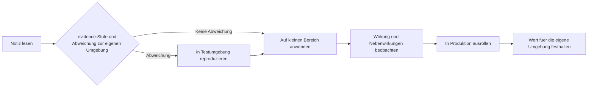
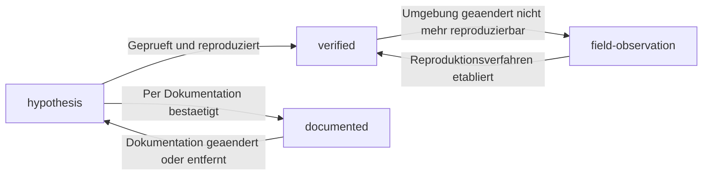

# Richtlinie zur Klassifizierung von Erkenntnissen

<!-- lang-switcher:start -->
🌐 [日本語](../ja/evidence-policy.md) | [English](../en/evidence-policy.md) | [한국어](../ko/evidence-policy.md) | [简体中文](../zh-CN/evidence-policy.md) | [繁體中文](../zh-TW/evidence-policy.md) | [Français](../fr/evidence-policy.md) | [Deutsch](evidence-policy.md) | [Español](../es/evidence-policy.md) | [🏠 Repository-Startseite](README.md)
<!-- lang-switcher:end -->

---

## Fazit

Jede Erkenntnis in diesem Repository trägt eine `evidence`-Stufe mit vier Abstufungen. Beurteilen Sie anhand dieser Stufe, **wie weit einer Aussage vertraut und sie auf Ihre Umgebung übertragen werden kann**. Die Stufe steht maschinenlesbar im Frontmatter, und `make lint` prüft die je Stufe erforderlichen Metadaten.

Eine Stufe höherzustufen, also in Richtung höherer Verlässlichkeit zu verschieben, setzt voraus, dass die entsprechende Evidenz ergänzt wird. Herabstufen ist jederzeit erlaubt.

---

## Die vier Stufen

| Stufe | Bedeutung | Erforderliche Metadaten | Umgang aus Lesersicht |
|---|---|---|---|
| `verified` | Von der Autorenseite in der angegebenen Umgebung tatsächlich reproduziert | `verified_on` (Prüfdatum) + Testumgebung im Text | Unter diesen Umgebungsbedingungen verlässlich. Andere Bedingungen erfordern eine erneute Prüfung |
| `documented` | In der Dokumentation des Herstellers oder von AWS belegt | `source` (URL oder Dokumentname) | Als Primärquelle verwendbar, bei Beachtung von Versions- und Regionsunterschieden |
| `field-observation` | Einmal im Feld beobachtet, Reproduzierbarkeit nicht bestätigt | Ausdrücklicher Hinweis „nicht reproduziert" im Text | Ansatzpunkt für eine Hypothese. Nicht verallgemeinern |
| `hypothesis` | Logisch abgeleitete Vermutung, ungeprüft | Ausdrücklicher Hinweis „ungeprüft" im Text | Ausgangspunkt einer Prüfung. Keine Entscheidungsgrundlage |

---

## Was die Stufen nicht beantworten

Eine Stufe klassifiziert **die Herkunft einer Aussage.** Sie ist **kein Grad der Nachverfolgung und keine Vertrauensskala.** An dieser Grenze verschiebt sich die Bedeutung, wenn auf ein Repository mit anderem Vokabular verlinkt wird.

### `documented` bedeutet nicht, dass gemessen wurde

`documented` besagt nur, dass ein Hersteller- oder AWS-Dokument es angibt. **Es enthält keine Aussage, dass der Autor das Verhalten bestätigt hat.** Die einzige Stufe, die eine Messung behauptet, ist `verified`.

Somit gehört „die Primärquelle sagt es, aber es wurde nicht an echter Hardware nachverfolgt" zu `documented`. **Bei dieser Zuordnung geht nichts verloren** — gerade weil `documented` eine Messung nie implizierte. Nennt ein anderes Repository denselben Zustand etwa `unverified`, lässt er sich unverändert auf `documented` abbilden.

### Das Fehlen von Dokumentation ist keine Stufe

„Wir haben gesucht und in öffentlichen Quellen keine Angabe gefunden" ist **eine Aussage über den Zustand der Dokumentation, nicht über das Verhalten des Produkts.** Alle vier Stufen klassifizieren, was eine Aussage stützt; keine drückt das Fehlen einer Stützung aus.

Greifen Sie hier nicht zu `hypothesis`. `hypothesis` bedeutet, **dass eine begründete Erwartung vorliegt.** Ohne eine solche verwendet, erscheint die Notiz so, als besäße sie eine Begründung, die sie nicht hat.

Schreiben Sie es stattdessen in den Text. **Nennen Sie Datum und Umfang der Suche** — etwa „Stand 2026-08 keine Angabe in der AWS-Dokumentation gefunden" — damit erkennbar ist, wann und wo gesucht wurde. Bei Grenzwerten und Kontingenten ist der Ort der Abschnitt „Could not be measured" (die Überschrift dort ist japanisch und englisch) in [Grenzwerte und Kontingente](../ja/reference/limits/) (日本語).

---

## Warum diese Einteilung nötig ist

Informationen aus dem technischen Support sind ihrer Natur nach sehr unterschiedlich.

- Was in der offiziellen Dokumentation steht
- In einer Testumgebung reproduzierte Messwerte
- Ein Verhalten, das einmal beobachtet wurde, dessen Ursache aber nicht geklärt ist
- Eine Vermutung im Sinne von „das wird wohl so sein"

Im selben Ton nebeneinandergestellt, sind diese Kategorien für Leserinnen und Leser nicht unterscheidbar. Besonders wenn **ein einmal beobachtetes Verhalten** wie eine allgemeine Spezifikation geschrieben wird, entsteht ein Design auf falscher Prämisse. Die Stufe explizit zu machen, bringt die Stärke der Aussage mit der Stärke der Evidenz in Übereinstimmung.

---

## Pflichtangaben beim Nennen einer Zahl

Zu einer `verified`-Zahl gehören immer die Messbedingungen. Eine Zahl ohne Bedingungen ist nicht reproduzierbar, und eine nicht reproduzierbare Zahl taugt nicht zur Entscheidung.

| Anzugeben | Beispiel |
|---|---|
| ONTAP-Version | `9.17.1P7D1` |
| Region | `ap-northeast-1` |
| Konfiguration | Durchsatzeinstellung, Volume-Typ, Client-Typ |
| Messmethode | Werkzeug, Parallelität, Dateigröße, Anzahl der Durchläufe |
| Messdatum | `2026-08-06` |

Zusätzlich sind die folgenden Unterscheidungen ausdrücklich zu treffen.

| Zu unterscheiden | Was bei Verwechslung passiert |
|---|---|
| Einzelner Durchlauf vs Produktionsschätzung | Ein Einzelmesswert wird zur Grundlage der Kapazitätsplanung |
| Diese Testumgebung vs allgemeine Servicegrenze | Ein umgebungsspezifischer Wert wird als Servicespezifikation zitiert |
| Designüberlegung vs rechtliche oder Compliance-Beurteilung | Eine Orientierung wird als rechtliche Grundlage behandelt |
| Unterstützender KI-Hinweis vs endgültige Entscheidung | Das Ergebnis einer automatischen Bewertung wird ohne menschliche Prüfung festgeschrieben |

---

## Vor der Übernahme in die Produktion

Eine Stufe sagt nur, „wie weit man sich verlassen kann"; sie **garantiert nicht, dass es in Ihrer Umgebung zutrifft.** Prüfen Sie vor der Produktion je Stufe das Folgende.

| Stufe | Vor der Produktion unbedingt zu tun |
|---|---|
| `verified` | Die Unterschiede zwischen der angegebenen Testumgebung und der eigenen herausarbeiten. Weicht Version, Region oder Konfiguration ab, erneut messen |
| `documented` | Die Quelle tatsächlich öffnen und prüfen, ob die aktuelle Fassung dasselbe aussagt. Dokumentation wird überarbeitet |
| `field-observation` | Prüfen, ob es sich in der eigenen Umgebung reproduzieren lässt. Andernfalls taugt die Aussage nicht als Prämisse |
| `hypothesis` | Erst prüfen, dann verwenden. Kein Design auf einer ungeprüften Vermutung aufbauen |

### Ablauf der Übernahme



| # | Schritt | Zweck |
|---|---|---|
| 1 | Die `evidence`-Stufe und die angegebenen Umgebungsbedingungen prüfen | Feststellen, was tatsächlich geprüft ist |
| 2 | Die Abweichungen zur eigenen Umgebung notieren: Version, Region, Konfiguration, Last | Den Umfang der erneuten Prüfung festlegen |
| 3 | In einer Testumgebung mit derselben Konfiguration wie die Produktion reproduzieren | Vermeiden, das Verhalten erst in der Produktion kennenzulernen |
| 4 | Auf begrenztem Umfang anwenden und beobachten | Unerwartete Nebenwirkungen in kleiner Einheit erfassen |
| 5 | Das Ergebnis der eigenen Umgebung festhalten | Grundlage der nächsten Entscheidung. Abweichungen sind als [Issue](https://github.com/Yoshiki0705/FSx-for-ONTAP-Adoption-Playbook/issues) willkommen |

**Bei nicht umkehrbaren Vorgängen ist Schritt 3 nicht verzichtbar.** Einstellungen ohne Rückweg, etwa das Aktivieren von SnapLock, dürfen die Produktion nicht ohne vorherige Bestätigung in einer Testumgebung erreichen.

---

## Höherstufung und Herabstufung



| Übergang | Erforderliche Arbeit |
|---|---|
| → `verified` | Testumgebung angeben und `verified_on` ergänzen. Reproduktionsverfahren im Text beschreiben |
| → `documented` | URL in `source` ergänzen. Wörtliches Zitat höchstens 30 Wörter, im Regelfall zusammenfassen |
| `verified` → `field-observation` | Im Text ergänzen, warum es nicht mehr reproduzierbar ist. Den Wert als Historie erhalten |
| → `hypothesis` | Angeben, warum die Grundlage entfallen ist |

**Eine Herabstufung ist kein Qualitätsverlust.** Offen zu zeigen, dass die Evidenz entfallen ist, ist für Leserinnen und Leser sicherer, als ein veraltetes `verified` stehen zu lassen.

---

## Häufige Missverständnisse

| Missverständnis | Tatsächlich |
|---|---|
| `documented` ist am verlässlichsten | Dokumentation und Implementierung können auseinandergehen. `verified` ist ein Befund aus einer konkreten Umgebung |
| Bei `verified` ergibt die Produktion dasselbe Ergebnis | Es ist eine Messung in einer Testumgebung. Andere Konfiguration oder Last ändert das Ergebnis |
| `field-observation` sollte nicht veröffentlicht werden | Es hat Wert, sofern nicht verallgemeinert und die fehlende Reproduktionsbestätigung genannt wird |
| Ohne Höherstufung hat eine Notiz keinen Wert | Auch einen Ausgangspunkt für eine Prüfung als `hypothesis` zu teilen hat Wert |

---

## Das Frontmatter schreiben

```yaml
---
title: SnapMirror の初期同期でスループットが出ない場合の切り分け
lifecycle: [migrate]
domains: [performance]
evidence: verified
verified_on: 2026-08-06
ontap_version: 9.17.1P7D1
region: ap-northeast-1
lang: ja
---
```

Was `make lint` prüft:

- bei `evidence: verified`, dass `verified_on` vorhanden und kein Datum in der Zukunft ist
- bei `evidence: documented`, dass `source` vorhanden ist
- bei `evidence: field-observation`, dass im Text eine Angabe im Sinne von „nicht reproduziert" steht
- bei `evidence: hypothesis`, dass im Text eine Angabe im Sinne von „ungeprüft" steht
- dass die Werte von `lifecycle` und `domains` im definierten Vokabular enthalten sind
- `region` ist vorhanden, wenn `evidence: verified` (**lässt sich die Umgebung nicht benennen, ist die Stufe falsch**)
- jeder Frontmatter-Schlüssel gehört zur bekannten Menge (**ein Tippfehler wirkt wie ein fehlender Wert und bleibt für Lesende sichtbar**)

---

## Verwandte Dokumente

- [Navigationsleitfaden](navigation.md)
- [CONTRIBUTING.md](../../CONTRIBUTING.md)
- [AGENTS.md](../../AGENTS.md) — Konventionen für KI-Agenten
- [Repository-Startseite](README.md)

---

<!-- lang-switcher:start -->
🌐 [日本語](../ja/evidence-policy.md) | [English](../en/evidence-policy.md) | [한국어](../ko/evidence-policy.md) | [简体中文](../zh-CN/evidence-policy.md) | [繁體中文](../zh-TW/evidence-policy.md) | [Français](../fr/evidence-policy.md) | [Deutsch](evidence-policy.md) | [Español](../es/evidence-policy.md) | [🏠 Repository-Startseite](README.md)
<!-- lang-switcher:end -->
