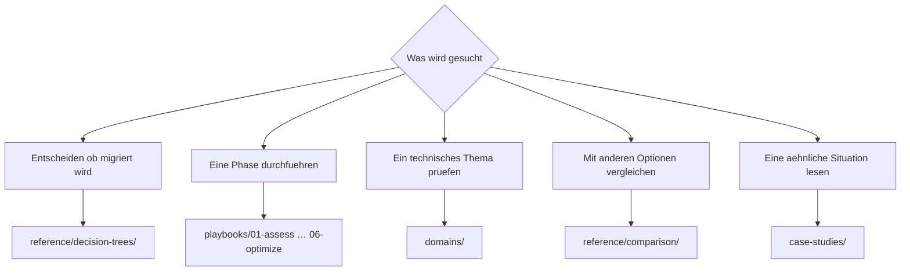

# Navigationsleitfaden

<!-- lang-switcher:start -->
🌐 [日本語](../ja/navigation.md) | [English](../en/navigation.md) | [한국어](../ko/navigation.md) | [简体中文](../zh-CN/navigation.md) | [繁體中文](../zh-TW/navigation.md) | [Français](../fr/navigation.md) | [Deutsch](navigation.md) | [Español](../es/navigation.md) | [🏠 Repository-Startseite](README.md)
<!-- lang-switcher:end -->

---

## Fazit

Es gibt drei Einstiegspunkte. **Wenn Sie zum ersten Mal hier sind, beginnen Sie mit [Von Ihrer Umgebung ausgehen](#von-ihrer-umgebung-ausgehen)** — wählen Sie die Zeile, die zu Ihrer Konfiguration passt, und sie gibt Ihnen eine Lesereihenfolge.

Andernfalls steigen Sie über `playbooks/` ein, wenn Ihre Frage lautet „in welcher Phase bin ich", und über `domains/`, wenn sie lautet „ich muss mich in dieses Thema einarbeiten". Beide Wege führen zu denselben Notizen. Wenn mehrere Optionen im Raum stehen und Sie sich nicht entscheiden können, beginnen Sie mit `reference/decision-trees/`.

---

## Wo anfangen

---

## Von Ihrer Umgebung ausgehen

Die Verzweigungen oben gehen von „was möchten Sie wissen" aus. Nutzen Sie stattdessen diese Tabelle, um von **„was sollte ich angesichts meiner Konfiguration lesen"** auszugehen. Die linke Spalte beschreibt Ihre Umgebung, der Rest gibt eine Lesereihenfolge.

| Ihre Umgebung | Zuerst lesen | Danach lesen |
|---|---|---|
| Quelle ist ONTAP (on premises oder andere Cloud) | [Entscheidungsbaum Migrationsverfahren](../ja/reference/decision-trees/migration-method.md) (日本語) | [Bewertung](../en/playbooks/01-assess/) → [Design](../en/playbooks/02-design/) (English) |
| Quelle ist ein Windows-Dateiserver (SMB, NTFS-ACLs müssen erhalten bleiben) | [Entscheidungsbaum Migrationsverfahren](../ja/reference/decision-trees/migration-method.md) (日本語) | [Multiprotokoll und Identität](../en/domains/multiprotocol-identity/) (English) |
| Quelle ist ein NAS ohne ONTAP | [Entscheidungsbaum Migrationsverfahren](../ja/reference/decision-trees/migration-method.md) (日本語) | [Bewertung](../en/playbooks/01-assess/) (English) |
| NFS und SMB auf denselben Daten | [Der Security Style bestimmt das Berechtigungsmodell](../ja/domains/multiprotocol-identity/notes/security-style-and-permission-evaluation.md) (日本語) | [Sicherheit und Governance](../en/domains/security-governance/) (English) |
| Active-Directory-Integration ist gesetzt | [Multiprotokoll und Identität](../en/domains/multiprotocol-identity/) (English) | [Design](../en/playbooks/02-design/) (English) |
| Neuaufbau, nichts zu migrieren | [Design](../en/playbooks/02-design/) (English) | [Aufbau](../en/playbooks/04-build/) → [Betrieb](../en/playbooks/05-operate/) (English) |
| Läuft bereits, Performance soll optimiert werden | [Performance](../en/domains/performance/) (English) | [Optimierung](../en/playbooks/06-optimize/) (English) |
| Läuft bereits, Kosten sollen überprüft werden | [Kosten](../en/domains/cost/) (English) | [Optimierung](../en/playbooks/06-optimize/) (English) |
| Prüfen, ob ein Design an einen Grenzwert stößt | [Grenzwerte und Kontingente](../ja/reference/limits/) | [Design](../en/playbooks/02-design/) (English) |

Zwei Hinweise zu den Links oben.

| Kennzeichnung | Was zu erwarten ist |
|---|---|
| **(日本語)** / **(English)** | Keine deutsche Fassung. Tiefergehendes Material existiert nur auf Japanisch und Englisch. URLs, Befehle und Produktbegriffe bleiben sprachunabhängig |
| `reference/`-Links, ohne Kennzeichnung | Als zweisprachige Einzeldateien geschrieben: Japanisch und Englisch teilen sich dieselben Tabellen und sind so lesbar |

Übersetzungswünsche sind als [Issue](https://github.com/Yoshiki0705/FSx-for-ONTAP-Adoption-Playbook/issues) willkommen.

**Übernehmen Sie unabhängig von der Zeile nichts direkt in die Produktion.** Prüfen Sie die `evidence`-Stufe jeder Notiz und arbeiten Sie [Vor der Übernahme in die Produktion](evidence-policy.md#vor-der-übernahme-in-die-produktion) durch.

---

## Lebenszyklus-Achse — `playbooks/`

Der Einstieg, der dem Projektverlauf folgt. Das Ergebnis jeder Phase ist die Eingabe der nächsten. Die Links führen zur englischen Fassung.

| # | Modul | Wichtigstes Ergebnis | Danach lesen |
|---|---|---|---|
| 01 | [Bewertung](../en/playbooks/01-assess/) | Bestandsaufnahme, Liste der Einschränkungen | 02 Design |
| 02 | [Design](../en/playbooks/02-design/) | Konfigurationsentscheidungen, nicht umkehrbare Punkte festgelegt | 03 Migration |
| 03 | [Migration](../en/playbooks/03-migrate/) | Migrationsplan, Umschaltverfahren, Rückfallverfahren | 04 Aufbau |
| 04 | [Aufbau](../en/playbooks/04-build/) | Infrastructure as Code, Automatisierung, Prüfung nach dem Aufbau | 05 Betrieb |
| 05 | [Betrieb](../en/playbooks/05-operate/) | Monitoring-Design, Runbooks | 06 Optimierung |
| 06 | [Optimierung](../en/playbooks/06-optimize/) | Ergebnisse der Performance- und Kostenverbesserung | — |

---

## Themen-Achse — `domains/`

Der Einstieg, der von einem Thema ausgeht. Wird über alle Lebenszyklusphasen hinweg referenziert. Die Links führen zur englischen Fassung.

| Modul | Typische Frage |
|---|---|
| [Datenschutz und Datensicherung](../en/domains/data-protection/) | Wie wird die Snapshot-Strategie ausgelegt / lässt sich tatsächlich wiederherstellen |
| [Datennutzung](../en/domains/data-utilization/) | Können Analytik und KI damit arbeiten, ohne Kopien zu vervielfachen |
| [Sicherheit und Governance](../en/domains/security-governance/) | Wie werden Verschlüsselung, Audit und Berechtigungen ausgelegt |
| [Performance](../en/domains/performance/) | Wo der Durchsatz bestimmt und wo er geteilt wird |
| [Kosten](../en/domains/cost/) | Warum Schätzung und Messung auseinandergehen |
| [Multiprotokoll und Identität](../en/domains/multiprotocol-identity/) | Warum Berechtigungen zwischen NFS und SMB abweichen |

---

## Übergreifende Referenz — `reference/`

Als zweisprachige Einzeldateien auf Japanisch und Englisch geschrieben.

| Verzeichnis | Wann zu verwenden |
|---|---|
| [Entscheidungsbäume](../ja/reference/decision-trees/) | Es gibt mehrere Optionen und eine muss gewählt werden |
| [Vergleichsmatrizen](../ja/reference/comparison/) | Die Abwägungen gegenüber anderen Optionen sollen dargelegt werden |
| [Grenzwerte und Kontingente](../ja/reference/limits/) | Es soll bestätigt werden, dass ein Design keinen Grenzwert erreicht |
| [Glossar](../ja/reference/glossary/) | Die Definition eines ONTAP- oder AWS-Begriffs wird benötigt |

---

## Fallstudien — `case-studies/`

[Case Studies](../en/case-studies/) führt Erkenntnisse aus dem technischen Support als **verallgemeinerte Lehren**. Es sind keine Firmen- oder Organisationsnamen, keine echten Bezeichner und keine Konfiguration enthalten, die eine Organisation identifizieren könnte.

Jede Fallstudie folgt dieser Form.

| Abschnitt | Inhalt |
|---|---|
| Situation | Nur Branche und Größenordnung (z. B. Fertigung / mehrere hundert TB) |
| Problem | Was nicht funktionierte |
| Geprüfte Optionen | Die verworfenen Alternativen und warum |
| Entscheidung | Was gewählt wurde und mit welcher Begründung |
| Ergebnis | Was tatsächlich geschah, einschließlich der Abweichungen von den Erwartungen |
| Verallgemeinerbare Lehre | Der Teil, der auf andere Umgebungen übertragbar ist |

---

## Wie die Vertrauensstufe zu lesen ist

Das Frontmatter jeder Notiz trägt eine `evidence`-Stufe. **Zitieren Sie keine Notiz, ohne sie geprüft zu haben.**

| Stufe | In einer Zeile |
|---|---|
| `verified` | Von der Autorenseite in der angegebenen Umgebung reproduziert |
| `documented` | In der offiziellen Dokumentation belegt |
| `field-observation` | Einmal beobachtet, nicht reproduziert. Nicht verallgemeinerbar |
| `hypothesis` | Begründete Erwartung, ungeprüft |

Details in der [Richtlinie zur Klassifizierung von Erkenntnissen](evidence-policy.md).

---

## Häufige Missverständnisse

| Missverständnis | Tatsächlich |
|---|---|
| `playbooks/` und `domains/` enthalten unterschiedliche Informationen | Sie referenzieren dieselben Notizen über zwei Achsen. Keine Dopplung, sondern mehrere Zugangswege |
| Zahlen lassen sich direkt auf die eigene Umgebung übertragen | Eine Zahl gehört zu ihrer Messumgebung. Andere Bedingungen erfordern eine erneute Prüfung |
| Fallstudien enthalten konkrete Konfigurationen | Sie sind bewusst abstrahiert. Nichts, was eine Organisation identifizieren könnte, ist enthalten |
| Grenzwerte sind immer aktuell | Einträge in `reference/limits/` tragen ein Prüfdatum. Prüfen Sie alles mit altem Datum erneut |

---

## Verwandte Dokumente

- [Richtlinie zur Klassifizierung von Erkenntnissen](evidence-policy.md)
- [CONTRIBUTING.md](../../CONTRIBUTING.md) — Redaktionskonventionen
- [AGENTS.md](../../AGENTS.md) — Konventionen für KI-Agenten
- [llms.txt](../../llms.txt) — Repository-Karte für LLMs

---

<!-- lang-switcher:start -->
🌐 [日本語](../ja/navigation.md) | [English](../en/navigation.md) | [한국어](../ko/navigation.md) | [简体中文](../zh-CN/navigation.md) | [繁體中文](../zh-TW/navigation.md) | [Français](../fr/navigation.md) | [Deutsch](navigation.md) | [Español](../es/navigation.md) | [🏠 Repository-Startseite](README.md)
<!-- lang-switcher:end -->
