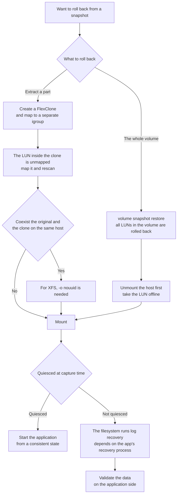

# What does a LUN snapshot guarantee by default?

Crash-consistent. Being able to roll back and the application starting from a consistent state are different things.

<!-- lang-switcher:start -->
🌐 [日本語](../../../../ja/domains/block-storage/notes/a-snapshot-of-a-lun-is-crash-consistent.md) | [English](a-snapshot-of-a-lun-is-crash-consistent.md) | [🏠 Repository home](../../../README.md)
<!-- lang-switcher:end -->

## What you will learn

- That a snapshot of a volume containing a LUN is crash-consistent by default, and that the `application_consistent` flag is only for recording
- That quiescing happens outside storage (SnapCenter or the application side), and that multiple LUNs are unified with a consistency group's write fence

## What this note does not answer

- Whether a database starts from a crash-consistent state (unverified in this note)
- Whether application-consistent is needed (depends on audit / recovery requirements)

## Prerequisite level

intermediate

## Body

<a id="a-snapshot-of-a-lun-is-crash-consistent-by-default"></a>

[🏠 Repository home](../../../README.md) | [Domain — Block storage](../README.md)

---

### Conclusion

**A snapshot of a volume containing a LUN is crash-consistent by default.** The same state as the disk at the moment the power was pulled is saved.

**This is not "cannot roll back."** A journaling filesystem or a database can start from there after going through a recovery process. **In the verification environment, a LUN cloned from a snapshot was mounted and a file written before the snapshot was read.** XFS ran log recovery and mounted.

**The issue is the scope of the guarantee.** What crash-consistent guarantees goes as far as "the blocks at that moment are all present," and **it does not guarantee that the application can start from that state as consistent data.** What the database holds in memory and has not yet written is not included.

And crucially, **ONTAP's application-consistent flag is for recording.** NetApp's documentation states explicitly that "from ONTAP's perspective there is no difference." **The flag is a record to distinguish whether it was taken after quiescing the application or without doing so, and it does not perform the quiescing itself.**

**The quiescing is performed by a separate mechanism.** AWS names SnapCenter and states that on FSx for ONTAP it can be used **at no additional license cost.**

> **Tier**: `documented` — the definition of consistency, the position of the flag, and SnapCenter's role are based on NetApp / AWS official documentation (confirmed 2026-09-05).
> **Part is `verified`** (verified 2026-09-05, `ap-northeast-1`, ONTAP 9.18.1P5) — that a snapshot is taken by the default snapshot policy, that the pre-snapshot contents can be read via a clone, and that freed blocks move to the snapshot.
> **No verification with a database on it was done.** The actual behavior of application consistency is unverified.
> The steps to confirm in your own environment are in [Verify it in your environment](#verify-it-in-your-environment).

---

### Distinguishing the three kinds of consistency

| Kind | What is guaranteed | What is not guaranteed |
|---|---|---|
| **crash-consistent** | The blocks at that moment are all present | That the application starts from a consistent state |
| **application-consistent** | The state at the point the application was quiesced | — |
| **ONTAP's `application-consistent` flag** | **A record only.** A marker that it was taken after quiescing | **Nothing.** From ONTAP's perspective there is no difference from crash-consistent |

**The one easily confused is the third row.** Because the API has an `application_consistent` field, it looks as if specifying it yields consistency. **NetApp's documentation states explicitly that this is for recording and does not coordinate with the host's application.**

**A scheduled snapshot is crash-consistent.** The snapshots driven by a volume's snapshot policy involve no quiescing.

---

### Deciding whether crash-consistent is enough

**There are cases where it is enough and cases where it is not.** It is not "always make it application-consistent."

| Workload | Is crash-consistent enough |
|---|---|
| A file store on a journaling filesystem | **Enough in many cases.** Log recovery runs at mount time |
| A database with write-ahead logging where recovery time can be spent | **Can roll back.** But the recovery time at startup and the judgment of whether a commit went through are the application's business |
| A database spanning multiple LUNs (data and log on separate volumes) | **Enough if the consistency-group write fence is used.** Taking snapshots per volume individually mixes the timestamps and they are not mutually consistent |
| A need to show backup consistency for an audit | **Not enough.** A quiesced record is required |

**The third row was originally written as "not enough," but a measurement overturned it.** It is true that snapshotting volumes individually mixes the timestamps, but **`vserver consistency-group snapshot create -write-fence true` fixes multiple volumes as one point in time.** In the verification environment, a fenced snapshot was taken **without stopping writes** against a PostgreSQL with data and WAL on separate LUNs, and starting from that clone **recovered without losing committed rows**. **The measured values are not placed in this note** — what was measured is in [A database on LUNs recovered without quiescing](a-database-on-luns-recovers-without-quiescing.md) (`verified`), and the fence and redo seconds are there. This note's tier stays `documented`.

**So "put them on the same volume if mutual consistency is needed" is not the only option.** The layout decision is in [The LUN layout decides the recovery granularity (日本語)](../../../../ja/domains/block-storage/notes/lun-layout-decides-recovery-granularity.md).

---

### What could be confirmed in the verification environment

**A LUN cloned from a snapshot retained the pre-snapshot contents.**

| # | Operation | Result |
|---|---|---|
| 1 | Wrote a marker file to a LUN formatted with XFS and `sync`ed | — |
| 2 | Took a snapshot of the volume (default settings, no quiescing) | Created successfully |
| 3 | Created a FlexClone from that snapshot | 0.092 GiB, no copy of actual data |
| 4 | Mapped the LUN inside the clone to a separate igroup and mounted with `-o nouuid` | **The marker could be read** |
| 5 | `dmesg` | XFS recorded **Starting recovery / Ending recovery** |

**Step 5 is the real face of crash-consistent.** The filesystem was not cleanly unmounted; it **was mounted after going through log recovery.** Because `sync` had been done the data was present, but had it not been, the data might not have been present.

**No verification with a database on it was done.** Whether the application starts from this state depends on that application's recovery process.

---

### That a snapshot holds capacity

**A snapshot retains deleted data.** This is a separate issue from consistency, but it happens on the same volume at the same time.

In the verification environment, deleting files inside the LUN and running `fstrim` **returned the volume's usage, but `snapshot.used` grew from 0 to 3.983 GiB.** The default snapshot policy had taken a snapshot in between, and that snapshot retained the freed blocks.

**The 5% snapshot reserve absorbed this.** If it does not fit in the reserve, the free space on the active file system side shrinks next. The details are in [Capacity is counted in three places](capacity-is-counted-in-three-places.md).

**The reason AWS names setting the snapshot policy to `none` for a SQL Server configuration is, in addition to the reason that a non-quiesced snapshot has no value, this capacity aspect too.**

---

### The position of the mechanism that quiesces

**SnapCenter places an application-specific plugin on the host side and quiesces I/O before the snapshot.**

| Item | Detail |
|---|---|
| Configuration | A central server + application-specific host-side plugins (SQL Server, Oracle, SAP HANA, PostgreSQL, etc.) |
| Cost on FSx for ONTAP | AWS states **no additional license cost** |
| Recommendation for SQL Server | **Set the volume's snapshot policy to `none`.** Because scheduled snapshots are not application-consistent |
| Log backup | **Place it on a dedicated volume** |
| Headroom for cloning | Keep **at least 0.5%** of the volume capacity free |
| Clone time | Usually within 5 minutes for a 1 TB database's iSCSI LUN |
| VMware plugin | Supports crash-consistent and VM-consistent; a virtualized database is application-consistent |

**There is also the choice of not using SnapCenter.** Write a quiescing script on the application side and take the snapshot around it. **AWS's million-IOPS article also writes that a snapshot spanning multiple filesystems needs a coordinating script for consistency, and that application consistency needs host-side involvement.**

**Whichever you choose, the quiescing happens outside the storage.** This is the difference between block storage and a file share.

---

### The steps needed at the replication destination

**Replicating a volume with SnapMirror does not make the LUN immediately usable at the destination.**

After making the destination volume writable, **map the LUN to an igroup, open an iSCSI session from the host, and rescan storage.** **The igroup mapping does not move with the replication.**

**It was the same for the FlexClone in the verification environment.** The LUN inside the clone was `state=online` but `mapped=unmapped`. **If this step is not written in the recovery procedure, it stalls at cutover.**

---

### The recovery flow



---

### Common misconceptions

| Misconception | Reality |
|---|---|
| With a snapshot, a database can be started from that point | **The default is crash-consistent.** Whether it can start depends on the application's recovery process |
| Specifying the API's `application_consistent` yields consistency | **It is a flag for recording.** From ONTAP's perspective there is no difference, and no quiescing is performed |
| A scheduled snapshot can also achieve application consistency | **It cannot.** It involves no quiescing |
| Crash-consistent cannot be rolled back | **It can.** In the verification environment the pre-snapshot contents could be read. Only the scope of the guarantee differs |
| Even with multiple LUNs on separate volumes, a snapshot is at the same time | **Taken individually, the timestamps differ.** Using the consistency-group write fence makes them the same time |
| A DB spanning separate volumes cannot recover with crash-consistent | **It recovered from a write-fenced consistency-group snapshot.** Committed rows remained |
| Mounting a clone always needs `-o nouuid` | **Only when the parent is mounted on the same host.** On a separate host it mounted as-is |
| A snapshot consumes no capacity | **It retains deleted data.** In the verification environment it held 3.983 GiB |
| SnapCenter incurs a separate license cost | AWS states **no additional license cost** on FSx for ONTAP |
| Replicating with SnapMirror makes the LUN usable at the destination as-is | **A LUN map, iSCSI session, and rescan are needed** |
| A clone can be mounted on the same host as the original as-is | **XFS needed `-o nouuid`** (because the UUID matches the parent) |

---

### Verification environment

| Item | Value |
|---|---|
| ONTAP version | 9.18.1P5 |
| Region | `ap-northeast-1` |
| Deployment type | `SINGLE_AZ_2` (second generation, 1 HA pair) |
| Volume | 100 GiB, snapshot reserve 5%, snapshot policy `default` |
| LUN | 20 GiB, `os_type linux`, XFS |
| Client | Amazon Linux 2023, kernel 6.18.44-99.149.amzn2023.x86_64 |
| Verification date | 2026-09-05 |

> **Note**: the above is a measurement in this environment and does not guarantee a general service limit or reproduction in a production environment. **No verification with a database on it was done.** Whether an application starts from a crash-consistent state is not confirmed in this note.

---

### Primary sources referenced

| Point | Source |
|---|---|
| That the application-consistent and crash-consistent flags are for recording and there is no difference from ONTAP's perspective; that the default is crash-consistent and scheduled snapshots are crash-consistent; that the API does not coordinate with the host's application | [NetApp: Application snapshots (REST API)](https://docs.netapp.com/us-en/ontap-restapi/application_applications_application.uuid_snapshots_endpoint_overview.html) |
| That a snapshot is always crash-consistent, that application consistency needs I/O quiescing, that SnapCenter can be used at no additional license cost, setting the snapshot policy to `none`, placing log backups on a dedicated volume, the 0.5% free, a 1 TB clone within 5 minutes | [AWS: Using SnapCenter to protect SQL Server workloads](https://aws.amazon.com/blogs/storage/using-netapp-snapcenter-with-amazon-fsx-for-netapp-ontap-to-protect-your-sql-server-workloads) |
| SnapCenter's configuration (a central server and application-specific plugins), the VMware plugin's consistency kinds | [NetApp: SnapCenter overview](https://docs.netapp.com/us-en/snapcenter/get-started/concept_snapcenter_overview.html) |
| That the SnapMirror destination needs a LUN map, iSCSI session, and rescan | [NetApp: Destination volume data access](https://docs.netapp.com/us-en/ontap/data-protection/configure-destination-volume-data-access-concept.html) |
| That a snapshot spanning multiple filesystems needs a coordinating script, and application consistency needs host-side involvement | [AWS Storage Blog: SAN: A million IOPs in AWS from Amazon FSx NetApp ONTAP](https://aws.amazon.com/blogs/storage/san-a-million-iops-in-aws-from-amazon-fsx-netapp-ontap/) <!-- allow:naming - original article title -->|
| A configuration example of snapshot reserve 0%, snapshot autodelete | [AWS: Best practice configuration for Microsoft SQL Server workloads](https://aws.amazon.com/blogs/storage/best-practice-configuration-of-amazon-fsx-for-netapp-ontap-for-microsoft-sql-server-workloads) <!-- allow:sales-vocabulary - exact external title --> |
| Making the volume at least 5% larger than the LUN | [AWS: Creating an iSCSI LUN](https://docs.aws.amazon.com/fsx/latest/ONTAPGuide/create-iscsi-lun.html) |

---

### Related documents

- [Domain — Block storage](../README.md) — this module's hub
- [The LUN layout decides the recovery granularity (日本語)](../../../../ja/domains/block-storage/notes/lun-layout-decides-recovery-granularity.md) — the relation between mutual consistency and layout
- [Comparison of routes to carry block to file (日本語)](../../../../ja/reference/comparison/block-to-file-routes.md) — **that data carried from a clone inherits this tier**, and the option of ensuring it on the application side
- [Capacity is counted in three places](capacity-is-counted-in-three-places.md) — the capacity a snapshot holds
- [A snapshot is not a recovery plan](../../data-protection/notes/snapshots-are-not-a-recovery-plan.md) — the same point on the file side
- [When shared block changes the design (日本語)](../../../../ja/domains/block-storage/notes/when-shared-block-changes-the-design.md) — that a snapshot is not a separate charge
- [Block storage cross resource map (日本語)](../../../../ja/reference/block-storage-resource-map.md) — the index of primary sources
- [Evidence policy](../../../evidence-policy.md)

## Verify it in your environment

| # | Step | What it tells you |
|---|---|---|
| 1 | Check the target volume's policy with `volume show -fields snapshot-policy` | Whether scheduled snapshots are running |
| 2 | Check existing snapshots and usage with `volume snapshot show` | Whether a snapshot is holding capacity |
| 3 | In a test environment, write a marker to a LUN and `sync`, take a snapshot, then mount via FlexClone and check the marker | **Confirmation that it can be rolled back** |
| 4 | At the mount in step 3, check with `dmesg` whether log recovery ran | **The real face of crash-consistent** |
| 5 | Do the same without `sync` and compare the results | What changes with and without quiescing |
| 6 | Put an actual application (a database, etc.) on it, do step 3, and check **whether it starts** | **The part unverified in this note. This is the decision material for production** |
| 7 | If using a quiescing mechanism, check the application's log around the snapshot | Whether quiescing actually occurred |
| 8 | Check whether the recovery runbook documents the LUN map and rescan at the destination | That the mapping is not replicated |

Do steps 3, 4, 5, and 6 **in a test environment.** Step 6 is worth doing with production-equivalent data, but do not do it against a production volume.

The snapshot policy in step 1 can be confirmed with this read-only command.

```bash
ssh <svm-management-endpoint> volume show -vserver <svm> -fields snapshot-policy
```

### Expected output

```text
The snapshot-policy is returned (if default, scheduled snapshots run, but that is crash-consistent).
If application-consistent is needed, the design must quiesce via SnapCenter or on the application
side.
```

This command only reads the volume's configuration; it changes nothing on the snapshot or the volume. Whether a database starts from a crash-consistent state should be checked in a test environment with production-equivalent data.

## Read next

[What limit does a Kubernetes block PV hit? (日本語)](../../../../ja/domains/block-storage/notes/kubernetes-block-volumes-and-the-volume-limit.md)
