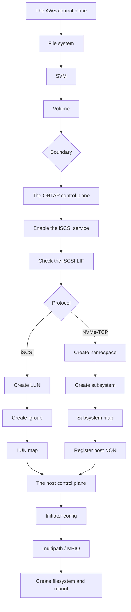

# Can LUNs and igroups be operated through the AWS API?

No. The boundary is between the volume and the LUN, and a block build procedure always crosses the control plane.

<!-- lang-switcher:start -->
🌐 [日本語](../../../../ja/domains/block-storage/notes/block-objects-are-outside-the-aws-api.md) | [English](block-objects-are-outside-the-aws-api.md) | [🏠 Repository home](../../../README.md)
<!-- lang-switcher:end -->

## What you will learn

- That CloudFormation has only six Amazon FSx resource types, and that a LUN, igroup, NVMe subsystem, or namespace does not exist as one
- That a build procedure moves from the AWS side to the ONTAP side, and that delete order, credentials, and drift detection split by control plane

## What this note does not answer

- A recommendation for a specific automation tool configuration (only the difference in reach is shown)
- Whether NVMe/TCP can be completed with Terraform alone (check the provider's current version; not possible as of v2.7.1)

## Prerequisite level

intermediate

## Body

<a id="luns-and-igroups-are-outside-the-aws-api"></a>

[🏠 Repository home](../../../README.md) | [Domain — Block storage](../README.md)

---

### Conclusion

**A block storage build procedure always moves partway from the AWS control plane to the ONTAP control plane. The boundary is between the volume and the LUN.**

CloudFormation's Amazon FSx resource types are **only six**: `DataRepositoryAssociation` / `FileSystem` / `S3AccessPointAttachment` / `Snapshot` / `StorageVirtualMachine` / `Volume`. **Neither a LUN, an igroup, an NVMe subsystem, nor a namespace has a resource type.** Nor is there a single one in the Amazon FSx API's action list.

**So a configuration where "applying the template puts block into a usable state" cannot be built.** What the template can reach is the volume; from there on the ONTAP CLI, the ONTAP REST API, or a tool that calls them is needed.

**This boundary is not a matter of preference, so what can be designed is not the boundary's position but the method of reproducing what is on the far side of it.** The general discussion of the IaC boundary itself is in [The IaC boundary is decided by the API surface, not by preference (日本語)](../../../playbooks/04-build/notes/what-iac-cannot-reach.md). **This note covers the block-specific scope.**

> **Tier**: `documented` — the range of resource types and actions, and the resource names each tool provides, are based on official documentation and repositories (confirmed 2026-09-05).
> **No specific tool configuration is recommended.** The differences in reach are shown.
> The steps to confirm in your own environment are in [Verify it in your environment](#verify-it-in-your-environment).

---

### The position of the boundary

| Object | AWS API / CloudFormation | ONTAP CLI / REST |
|---|---|---|
| File system | **Reaches** | Only some settings |
| SVM | **Reaches** | Only some settings |
| Volume | **Reaches** | Reaches |
| **Enabling the iSCSI service** | Does not reach | **From here it is the ONTAP side** |
| **iSCSI LIF** | Does not reach | Reaches |
| **LUN** | Does not reach | Reaches |
| **igroup** | Does not reach | Reaches |
| **LUN map** | Does not reach | Reaches |
| **NVMe subsystem** | Does not reach | Reaches |
| **NVMe namespace** | Does not reach | Reaches |
| **Map to subsystem / host NQN registration** | Does not reach | Reaches |

**This is why AWS's block procedures all start with `ssh fsxadmin@<management endpoint>`.**

#### That a volume can be created from both, but how it appears changes with which side created it

**The volume row says "reaches from both" in the sense that there is a choice. And which side you create it from changes monitoring and backup.**

This is the result of creating 2 volumes with the AWS API and 2 with the ONTAP CLI in the verification environment.

| Way of counting | Result |
|---|---|
| `aws fsx describe-volumes` | **3** (root + the 2 created with AWS) |
| ONTAP's `volume show` | **5** |
| The `VolumeId` values from `aws cloudwatch list-metrics` | **3** |

**A volume created on the ONTAP side does not get an `fsvol-` ID.** So it falls out of all of the following.

| Falls out of | Reason |
|---|---|
| The CloudWatch `VolumeId` dimension | No ID |
| Tagging by the AWS API | Same |
| AWS Backup's selection target | Same |
| Tag-based cost allocation | No tag |

**A LUN can be created only on the ONTAP side, but its container, the volume, can be created on the AWS side.** If you run monitoring and backup on the AWS side, the split **volume on the AWS API, LUN on ONTAP** fits. **Making it "all ONTAP side because it is block" quietly falls out of monitoring.**

> **Tier**: `verified` (verified 2026-09-05, `ap-northeast-1`, `MULTI_AZ_2` second generation, 1 HA pair, ONTAP 9.18.1P5) — the count mismatch and the absence of the `VolumeId` dimension.

The same point from the monitoring side is in [What block monitoring shows and does not (日本語)](../../../../ja/domains/block-storage/notes/what-block-monitoring-shows.md).

---

### The tools that reach the far side of the boundary

**There are four options, and their reach is not the same.**

| Tool | What it reaches | What it does not reach |
|---|---|---|
| **ONTAP CLI** (SSH) | Everything | — |
| **ONTAP REST API** | Everything. `/api/storage/luns`, `/api/protocols/san/igroups`, `/api/protocols/san/lun-maps`, `/api/protocols/nvme/subsystems`, `/api/storage/namespaces`, `/api/protocols/nvme/subsystem-maps` | — |
| **NetApp Terraform provider** | `netapp-ontap_lun` / `_san_igroup` / `_san_lun-map` / `_iscsi_service` / `_nvme_namespace` | **There is no resource for `nvme_subsystem` and subsystem maps** (v2.7.1, `docs/resources/` confirmed 2026-09-05). A namespace can be created but not mapped |
| **Ansible `netapp.ontap`** | `na_ontap_lun` / `_lun_map` / `_lun_map_reporting_nodes` / `_igroup` / `_igroup_initiator` / `_iscsi` / `_nvme` / `_nvme_namespace` / `_nvme_subsystem` | Within the range checked, they are complete including NVMe |

**Completing NVMe/TCP with Terraform alone is not possible as of provider v2.7.1.** **Resources are added, so check the current version's `docs/resources/` before using it.** Creating a namespace can be written with `netapp-ontap_nvme_namespace`, but **creating the subsystem and mapping the namespace need a separate means.** For iSCSI, the Terraform provider reaches from the LUN to the map.

**If you use Terraform, you place two providers, AWS and NetApp, in the same configuration.** The AWS provider's `aws_fsx_ontap_volume` is one side, and `netapp-ontap_lun` onward is the other. **These two have a dependency, so the apply order shows up in the configuration.**

---

### The consequences of a procedure crossing the control plane

**The split "IaC up to the volume, a runbook from the LUN on" holds, but there is a price.**

| Consequence | Detail |
|---|---|
| **Two places to reconcile state** | The template's state and ONTAP's state must be checked separately |
| **The delete order is reversed** | The LUN map must be removed before deleting the volume. Deleting the template alone does not guarantee the order |
| **Two credential systems** | The AWS credentials and the `fsxadmin` credentials are needed separately |
| **Drift detection is one-sided** | CloudFormation's drift detection does not see LUN changes |
| **The recovery procedure is split** | The operations to make a LUN usable at a SnapMirror destination are all on the ONTAP side |

**The delete order in particular is prone to accidents.** The reason for trying to delete a volume with a LUN still mapped is not returned from the AWS API. That the reason can only be obtained on the ONTAP side is covered in [The IaC boundary is decided by the API surface, not by preference (日本語)](../../../playbooks/04-build/notes/what-iac-cannot-reach.md).

---

### Published implementation examples

**Automation for block is gathered more in NetApp-side repositories than in AWS-side samples.**

| Repository | Contents |
|---|---|
| [NetApp/FSx-ONTAP-samples-scripts](https://github.com/NetApp/FSx-ONTAP-samples-scripts) | `Management-Utilities/iscsi-vol-create-and-mount/`, `ec2-user-data-iscsi-create-and-mount/` (CloudFormation + user-data), `Monitoring/LUN-monitoring/`, `Infrastructure_as_Code/Terraform/deploy-fsx-ontap-sqlserver/` <!-- allow:naming - repository name is an identifier --> |
| [NetApp/ontap-rest-python](https://github.com/NetApp/ontap-rest-python) | `examples/rest_api/lun_operations.py` |
| [NetApp/fsxn-iscsisetup-ps](https://github.com/NetApp/fsxn-iscsisetup-ps) | PowerShell automation of iSCSI connection to a Windows host. **Last updated 2023**, and operation on current ONTAP is unconfirmed |
| [NetApp/terraform-provider-netapp-ontap](https://github.com/NetApp/terraform-provider-netapp-ontap) | The resource set above |
| [ansible-collections/netapp.ontap](https://github.com/ansible-collections/netapp.ontap) | The module set above |

**No block-specific repository was found under `aws-samples`.** FSx for ONTAP-related repositories center on audit events, SnapMirror DR, EKS / ROSA integration, and the like. The index is in [Block storage cross resource map (日本語)](../../../../ja/reference/block-storage-resource-map.md).

---

### The boundary that appears in the security group

**The port requirements table is also split by control plane.**

| Port | Use | On AWS's requirements table |
|---|---|---|
| 3260 | iSCSI | **Listed** |
| 4420 | NVMe/TCP data | **Not listed** (only in the procedure's output and the re:Post prerequisites) |
| 8009 | NVMe/TCP discovery | **Not listed** (only in the procedure's output) |
| 22 | ONTAP CLI | Listed |
| 443 | ONTAP REST API | Listed |

**A security group written for iSCSI does not let NVMe/TCP through.** And because the failure appears as a timeout rather than a connection refusal, it looks like a host-side problem. The details are in [The block protocol choice is narrowed first by generation and HA pair count](protocol-choice-is-bounded-before-you-choose.md).

---

### The build flow



**There are not two control planes but three.** The host side comes last. The host-side scope is in [Paths are the failover mechanism itself (日本語)](../../../../ja/domains/block-storage/notes/paths-are-the-failover-mechanism.md).

---

### Common misconceptions

| Misconception | Reality |
|---|---|
| Applying the template puts block into a usable state | **Up to the volume.** From the LUN on there is no resource type |
| The Amazon FSx API has a LUN operation somewhere | **There is not one.** The action list ends with volume, SVM, Snapshot, backup, and S3 Access Point |
| Terraform can write all of NVMe/TCP | **v2.7.1 has no `nvme_subsystem` resource** (confirmed 2026-09-05). A namespace can be created but not mapped |
| The ONTAP CLI and REST reach different ranges | Within the range checked, both reach the entire block object set |
| CloudFormation's drift detection reveals LUN changes too | **It does not see them.** The ONTAP side must be checked separately |
| Following the security-group requirements table lets block through | **NVMe/TCP's 4420 and 8009 are not on the requirements table** |
| There is a block automation sample under `aws-samples` | None was found. **They are gathered in NetApp-side repositories** |

---

### Primary sources referenced

| Point | Source |
|---|---|
| That CloudFormation's Amazon FSx resource types are six | [AWS: Amazon FSx resource type reference](https://docs.aws.amazon.com/AWSCloudFormation/latest/TemplateReference/AWS_FSx.html) |
| That the Amazon FSx API's action list has no block object operations | [AWS: Amazon FSx API operations](https://docs.aws.amazon.com/fsx/latest/APIReference/API_Operations.html) |
| That LUN creation is an ONTAP CLI procedure | [AWS: Creating an iSCSI LUN](https://docs.aws.amazon.com/fsx/latest/ONTAPGuide/create-iscsi-lun.html) |
| That NVMe/TCP is created from the ONTAP CLI in the order namespace → subsystem → map → host NQN | [AWS: Provisioning NVMe/TCP for Linux](https://docs.aws.amazon.com/fsx/latest/ONTAPGuide/provision-nvme-linux.html) |
| That the security-group requirements table has 3260 and not 4420 | [AWS: Security groups](https://docs.aws.amazon.com/fsx/latest/ONTAPGuide/limit-access-security-groups.html) |
| That NVMe/TCP port 4420 is needed | [AWS re:Post: Use NVMe/TCP to mount FSx for ONTAP on Linux](https://repost.aws/knowledge-center/ec2-mount-fsx-ontap-nvme-tcp) |
| The ONTAP REST API block object paths | [LUNs](https://docs.netapp.com/us-en/ontap-restapi/ontap/storage_luns_endpoint_overview.html) · [igroups](https://docs.netapp.com/us-en/ontap-restapi/ontap/protocols_san_igroups_endpoint_overview.html) · [LUN maps](https://docs.netapp.com/us-en/ontap-restapi/ontap/protocols_san_lun-maps_endpoint_overview.html) · [NVMe subsystems](https://docs.netapp.com/us-en/ontap-restapi/ontap/protocols_nvme_subsystems_endpoint_overview.html) · [namespaces](https://docs.netapp.com/us-en/ontap-restapi/ontap/storage_namespaces_endpoint_overview.html) |
| The NetApp Terraform provider's resource names, and the absence of `nvme_subsystem` in v2.7.1 | [NetApp/terraform-provider-netapp-ontap](https://github.com/NetApp/terraform-provider-netapp-ontap) (`docs/resources/`, confirmed 2026-09-05) |
| The Ansible `netapp.ontap` block-related modules | [ansible-collections/netapp.ontap](https://github.com/ansible-collections/netapp.ontap) |

---

### Related documents

- [Domain — Block storage](../README.md) — this module's hub
- [The IaC boundary is decided by the API surface, not by preference (日本語)](../../../playbooks/04-build/notes/what-iac-cannot-reach.md) — the general boundary and the reason volume deletion fails
- [The block protocol choice is narrowed first by generation and HA pair count](protocol-choice-is-bounded-before-you-choose.md) — the port pitfall
- [Paths are the failover mechanism itself (日本語)](../../../../ja/domains/block-storage/notes/paths-are-the-failover-mechanism.md) — the third control plane
- [Kubernetes block volumes meet the volume limit (日本語)](../../../../ja/domains/block-storage/notes/kubernetes-block-volumes-and-the-volume-limit.md) — the control plane Trident uses
- [Block storage cross resource map (日本語)](../../../../ja/reference/block-storage-resource-map.md) — the index of published IaC
- [Evidence policy](../../../evidence-policy.md)

## Verify it in your environment

| # | Step | What it tells you |
|---|---|---|
| 1 | Confirm the output of `aws fsx help` has no LUN or igroup operations | The position of the boundary |
| 2 | Open the CloudFormation Amazon FSx resource type list and confirm there are six | The range the template can reach |
| 3 | Connect with `ssh fsxadmin@<management endpoint>` and confirm `lun show` works | The ONTAP-side reach path |
| 4 | Send `GET /api/storage/luns` to the ONTAP REST API | The path usable for automation |
| 5 | If using Terraform, confirm whether the **current** NetApp provider's resource list has `nvme_subsystem` | **That NVMe/TCP cannot be completed with Terraform alone in v2.7.1. If it has been added, the premise changes** |
| 6 | In a test environment, try to delete a volume with a LUN still mapped, and record the error returned | The delete-order dependency, and that the reason is not returned from the AWS side |
| 7 | Re-read the build runbook and confirm the handoff of the AWS credentials and the `fsxadmin` credentials is written | Whether the runbook can cross the control plane |

Do step 6 **in a test environment.** It is not an operation to try deleting a production volume.

The ONTAP REST path in step 4 can be confirmed with this read-only command.

```bash
curl -sk -u fsxadmin "https://<management-endpoint>/api/storage/luns?return_records=false"
```

### Expected output

```text
num_records returns the LUN count (the block objects live in the ONTAP-side control plane).
aws fsx / CloudFormation has no corresponding resource, so the build procedure crosses the
control plane.
```

This command only reads the LUN count; it changes nothing on the LUN or the volume. State the order "remove the LUN map, then the volume" explicitly in the runbook for deletion.

## Read next

[Where is capacity counted?](capacity-is-counted-in-three-places.md)
