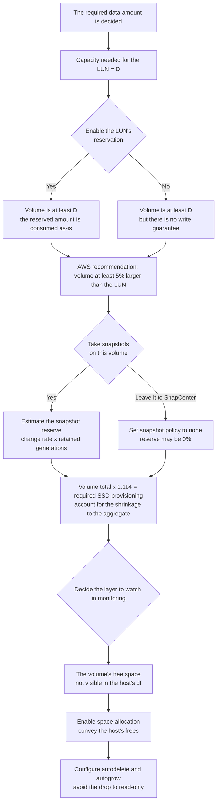

# Capacity is counted in three places

<!-- lang-switcher:start -->
🌐 [日本語](../../../../ja/domains/block-storage/notes/capacity-is-counted-in-three-places.md) | [English](capacity-is-counted-in-three-places.md) | [🏠 Repository home](../../../README.md)
<!-- lang-switcher:end -->

[🏠 Repository home](../../../README.md) | [Domain — Block storage](../README.md)

---

## Conclusion

**From the provisioned SSD capacity to the capacity a LUN can actually use, there are three deductions.**

This is the breakdown measured in the verification environment (SSD 1,024 GiB, one 100 GiB volume, one 20 GiB reserved LUN).

| Stage | Provisioned value | Value actually usable at the next stage | Difference |
|---|---|---|---|
| SSD → aggregate | **1,024 GiB** | **907.03 GiB** | 116.97 GiB (11.4%) |
| Volume → active file system | **100 GiB** | **95 GiB** | 5 GiB (5% snapshot reserve) |
| Active file system → free usable by the LUN | **95 GiB** | **74.83 GiB** | 20.08 GiB (the LUN's reservation) |

**The third stage is especially overlooked. A 20 GiB LUN with `space-reserve` enabled consumed 20.078 GiB of the volume's 95 GiB with not a single byte written.**

And **this accounting is not immediate.** Reading right after a config change **returns the pre-change value.** Observing at 30-second intervals, at t+0 it had not changed, at t+30 it changed, and it was stable through t+240.

**What happens when it runs short is not a write error but the LUN dropping to read-only.**

> **Tier**: `verified` (verified 2026-09-05, `ap-northeast-1`, `SINGLE_AZ_2` second generation, 1 HA pair, throughput capacity 384 MBps, ONTAP 9.18.1P5).
> **Performance figures are not included.** What was measured is only the way capacity is counted and the delay in accounting. The drop to read-only is `documented` based on AWS re:Post (not induced in our environment).
> The steps to confirm in your own environment are in [How to confirm in your own environment](#how-to-confirm-in-your-own-environment).

---

## The breakdown of the three places

### From SSD to aggregate

**The aggregate of a file system provisioned with 1,024 GiB was 907.03 GiB.** The difference of about 117 GiB is not assignable to volumes.

**This difference is proportional to the provisioned capacity.** Adding SSD increases the aggregate too, but the shrinkage as a ratio remains. **The estimate "I provisioned 1 TiB, so I can place 1 TiB" is already off at this stage.**

**And the amount of shrinkage differed by deployment type.**

| Deployment type | SSD | aggregate | Measured value (bytes) |
|---|---|---|---|
| `SINGLE_AZ_2` | 1,024 GiB | **907.03 GiB** | — |
| `MULTI_AZ_2` | 1,024 GiB | **861.7 GiB** | 925,224,214,528 |

**The difference between the two environments is the deployment type, but no verification was done to isolate other factors.** It is an observation of two environments: "the amount usable from the same 1,024 GiB was smaller on Multi-AZ." **For capacity design, count it yourself with the deployment type you choose.**

### From volume to active file system

**The `afs_total` of a 100 GiB volume was 95 GiB.** The snapshot reserve is 5% by default, and that portion is not usable by the LUN.

**Before creating even one LUN, 5 GiB is already invisible from the LUN's side.**

The snapshot reserve can be changed. AWS names **setting the snapshot reserve to 0%** in its SQL Server configuration example. But if you set it to 0%, the capacity snapshots use is taken from the active file system side. **Either way capacity is needed. The reserve is the difference between "take it up front or take it later."**

### From the LUN's reservation to the actual free space

**A 20 GiB LUN with `space-reserve enabled` increased the volume's usage by 20.078 GiB with zero writes.** Disabling the setting returned it to 0.093 GiB, and enabling it made it 20.171 GiB again. **It is reversible in both directions.**

**The default is disabled.** A LUN created via the REST API was `space_reserve=disabled`. Enabling it is an explicit choice.

**There is a pitfall here.** AWS's SQL Server best practice names **"LUN reservation enabled."** Meanwhile, a volume created with the FSx for ONTAP API was **`space-guarantee none`, `fractional-reserve 0`.** In NetApp's documentation, `fractional-reserve` defaults to 0 when the volume's guarantee is `none`, and **the write guarantee becomes only best-effort.** That is, **enabling the reservation does not guarantee space for overwrites.** What the reservation guarantees goes as far as "the LUN-sized capacity is not used by anything else."

---

## The accounting delay

**A read right after changing a setting returns the pre-change value.**

| Elapsed | `used` after enabling `space-reserve` | `used` after disabling |
|---|---|---|
| t+0s | 0.093 GiB (**the pre-change value**) | 20.171 GiB (**the pre-change value**) |
| t+30s | **20.171 GiB** | **0.093 GiB** |
| t+60s – t+240s | 20.171 GiB | 0.093 GiB |

**This note's first measurement read at 5 seconds and drew the wrong conclusion that "the reservation is not taking effect."** Only after waiting 30 seconds did the correct value appear.

**The consequence bears on operations.** If a script that changes capacity verifies immediately after, it sees a value where the change is not reflected and judges it a success. **A success response is not evidence of success.**

---

## The paths to becoming unwritable

### That deleting a file inside the LUN does not return capacity

**Writing 4 GiB to a 20 GiB thin LUN and deleting that file did not change the volume's usage.**

| Operation | Volume `used` |
|---|---|
| Right after format | 20.08 GiB |
| Write 4 GiB | **24.14 GiB** |
| Delete the file | **24.14 GiB (unchanged)** |
| `fstrim` | **20.17 GiB** |

**The storage side does not know which blocks the host's filesystem has freed.** Only when `fstrim` (SCSI UNMAP) tells it does it return. **This is the reason to enable `space-allocation`.**

**Note that `space-allocation` was enabled by default on ONTAP 9.18.1P5.** AWS recommends enabling it, but a LUN created via the REST API was `enabled` from the start.

### That the returned capacity moves to a snapshot

**The capacity supposedly returned by `fstrim` did not become free space.**

`snapshot.used` had grown from 0 to **3.983 GiB.** The default snapshot policy had taken an `hourly` snapshot in between, and **the freed blocks are retained by the snapshot.**

**The 5% snapshot reserve (5 GiB) absorbed this, and `snapshot.reserve_available` became 1.017 GiB.** Because it fit in the reserve, the active file system's free space did not shrink. **If it does not fit, it is taken from the active file system side next.**

**So "deleted but does not shrink" has two stages of cause.** Either the host has not sent UNMAP, or a snapshot is holding it.

### The drop to read-only

**When a thin-provisioned filesystem fills up, the LUN drops to read-only.** AWS re:Post names `Space allocation failed write protect` and `critical space allocation error` as symptoms, and gives the recovery procedure as **volume expansion → `lun resize` → fsck on the OS side.**

**This path was not induced in our environment (`documented`).** The verification to induce it involves production-equivalent data corruption, so it was not done.

**The point that it is read-only rather than a write error matters.** From the application's view it appears not as "the disk broke" but as "it became unwritable."

---

## An example where capacity appears doubled

**Viewing the same volume from both the LUN and NFS, the capacity display does not match.**

In the verification environment, `df` displayed the same volume as **20 G via the LUN and 95 G via NFS.** **The LUN reports its LUN's size, and NFS reports the whole active file system.** Neither is wrong.

**When watching capacity in monitoring, decide which layer's number you are watching.** The host's `df` sees only the LUN's contents, so **the host cannot detect that the volume is approaching full.**

---

## The design flow

**`x 1.114` is a measured value in the verification environment (1024 / 907.03).** It is not guaranteed as a general ratio. Confirm it in your own environment.

---

## How to confirm in your own environment

| # | Step | What it tells you |
|---|---|---|
| 1 | Check the aggregate size with `storage aggregate show -fields size,usedsize` and compare with the provisioned SSD capacity | **The first-stage shrinkage** |
| 2 | Check `volume show -fields size,available,percent-snapshot-space` | **The second-stage snapshot reserve** |
| 3 | Check the reservation with `lun show -fields space-reserve,size,size-used` | The third-stage reservation |
| 4 | Toggle the reservation and read the volume's usage **after waiting at least 30 seconds** | **The accounting delay. Reading right after returns the pre-change value** |
| 5 | Create and delete a file on the LUN and watch the volume's usage. Then run `fstrim` and watch again | That it does not return until UNMAP is conveyed |
| 6 | Check with `volume snapshot show` whether the freed blocks have moved to a snapshot | The second reason for "does not return" |
| 7 | Check `volume show -fields space-guarantee,fractional-reserve` | **If `none` / `0`, even with a reservation the overwrite guarantee is best-effort** |
| 8 | Record the host's `df` and the volume's free space side by side | Which to watch in monitoring |

Do steps 4 and 5 **in a test environment.** Toggling the reservation on a production LUN changes the calculation of the volume's free capacity.

---

## Common misconceptions

| Misconception | Reality |
|---|---|
| The provisioned SSD capacity is usable by volumes as-is | **With 1,024 GiB provisioned the aggregate was 907.03 GiB** (measured in the verification environment) |
| A 100 GiB volume can place 100 GiB | **There is a default 5% snapshot reserve, and the active file system was 95 GiB** |
| Merely creating a LUN consumes no capacity | **With the reservation enabled, it consumes its size even with zero writes** |
| Enabling the reservation guarantees space for overwrites | Because the volume's guarantee is `none` and `fractional-reserve` is 0, it is **best-effort** |
| The effect of a config change can be confirmed right after | **There is a delay of about 30 seconds.** A read right after is the pre-change value |
| Deleting a file on the LUN returns capacity | **It does not return until UNMAP is sent, e.g. by `fstrim`** |
| `fstrim` makes it free space | **If a snapshot is holding it, it just moves there** |
| Watching the host's `df` reveals running out of capacity | **It sees only the LUN's contents.** It cannot detect the volume filling up |
| Running out of capacity causes a write error | **The LUN drops to read-only** (`documented`) |
| `space-allocation` must be enabled yourself | On ONTAP 9.18.1P5 it was **enabled by default** |

---

## Verification environment

| Item | Value |
|---|---|
| ONTAP version | 9.18.1P5 |
| Region | `ap-northeast-1` |
| Deployment type | The three-place counting is `SINGLE_AZ_2`. **Only the aggregate comparison adds `MULTI_AZ_2`** (both second generation, 1 HA pair) |
| Throughput capacity | 384 MBps (the 1 HA pair lower bound) |
| SSD capacity | 1,024 GiB, IOPS `AUTOMATIC` (3 per GiB) |
| Volume | 100 GiB, `space-guarantee none`, snapshot reserve 5%, snapshot policy `default` |
| LUN | 20 GiB × 2 (with / without reservation), `os_type linux` |
| Client | Amazon Linux 2023, kernel 6.18.44-99.149.amzn2023.x86_64 |
| Verification date | 2026-09-05 |

> **Note**: the above is a measurement in this environment and does not guarantee a general service limit or reproduction in a production environment. **In particular, the `1024 → 907.03` ratio depends on the configuration.**

---

## Primary sources referenced

| Point | Source |
|---|---|
| That a volume is a container for LUNs, that volumes are thin provisioned, that deleting data inside a LUN returns capacity | [AWS: Managing FSx for ONTAP volumes](https://docs.aws.amazon.com/fsx/latest/ONTAPGuide/managing-volumes.html) · [AWS: How FSx for ONTAP works](https://docs.aws.amazon.com/fsx/latest/ONTAPGuide/how-it-works-fsx-ontap.html) |
| Making the volume at least 5% larger than the LUN, the reason to enable `space-allocation`, LUN max 128 TB | [AWS: Creating an iSCSI LUN](https://docs.aws.amazon.com/fsx/latest/ONTAPGuide/create-iscsi-lun.html) |
| That the LUN drops to read-only when full, and that recovery is expansion → `lun resize` → fsck | [AWS re:Post: LUN in read-only mode](https://repost.aws/knowledge-center/fsx-ontap-lun-in-read-only-mode) |
| The difference between `space-guarantee none` / `space-slo thick` / `semi-thick`, that a space-reserved LUN provisions capacity at creation | [NetApp: SAN volumes](https://docs.netapp.com/us-en/ontap/volumes/san-volumes-concept.html) |
| That `fractional-reserve` takes only 0 or 100, defaults to 0 when the guarantee is `none`, and that at 0 the write guarantee is best-effort | [NetApp: Set fractional reserve](https://docs.netapp.com/us-en/ontap/san-admin/set-fractional-reserve-concept.html) |
| A configuration example of snapshot reserve 0%, LUN reservation enabled, autodelete oldest_first, autosize autogrow | [AWS: Best practice configuration for Microsoft SQL Server workloads](https://aws.amazon.com/blogs/storage/best-practice-configuration-of-amazon-fsx-for-netapp-ontap-for-microsoft-sql-server-workloads) |
| The minimum SSD capacity and the IOPS default (3 per GiB) | [AWS: Quotas](https://docs.aws.amazon.com/fsx/latest/ONTAPGuide/limits.html) |

---

## Related documents

- [Domain — Block storage](../README.md) — this module's hub
- [The LUN layout decides the recovery granularity (日本語)](../../../../ja/domains/block-storage/notes/lun-layout-decides-recovery-granularity.md) — the relation between snapshot reserve and layout
- [A snapshot of a LUN is crash-consistent by default](a-snapshot-of-a-lun-is-crash-consistent.md) — the side where a snapshot holds capacity
- [When shared block changes the design (日本語)](../../../../ja/domains/block-storage/notes/when-shared-block-changes-the-design.md) — the flip side of a snapshot not being a separate charge
- [Running out of writes with capacity to spare](../../../playbooks/01-assess/notes/counting-bytes-is-not-counting-files.md) — the same structure on the file side
- [Comparison of block storage options (日本語)](../../../../ja/reference/comparison/block-storage-options.md) — the cost of the minimum configuration
- [Limits and quotas (日本語)](../../../../ja/reference/limits/) — limits with sources and verification dates
- [Evidence policy](../../../evidence-policy.md)

<!-- lang-switcher:start -->
🌐 [日本語](../../../../ja/domains/block-storage/notes/capacity-is-counted-in-three-places.md) | [English](capacity-is-counted-in-three-places.md) | [🏠 Repository home](../../../README.md)
<!-- lang-switcher:end -->
