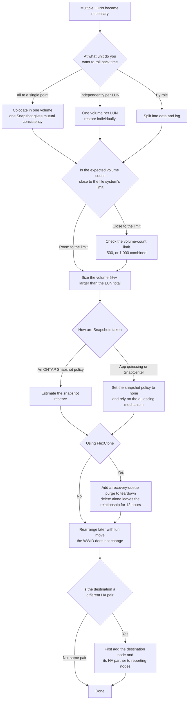

# What does LUN layout decide?

Recovery granularity. One LUN per volume is not a blanket recommendation, and layout can be rearranged later.

<!-- lang-switcher:start -->
🌐 [日本語](../../../../ja/domains/block-storage/notes/lun-layout-decides-recovery-granularity.md) | [English](lun-layout-decides-recovery-granularity.md) | [🏠 Repository home](../../../README.md)
<!-- lang-switcher:end -->

## What you will learn

- That because Snapshot / SnapMirror operate per volume, LUN layout decides recovery granularity (mutual consistency vs. independent recovery)
- That `lun move` rearranges LUNs non-disruptively while keeping the WWID, and that a recovery queue blocks parent deletion after a clone is removed

## What this note does not answer

- The LUN-count limit (not documented by AWS; the volume-count limit is hit first)
- Preparing `lun move` and reporting-nodes across multiple HA pairs (not verified; the environment had 1 HA pair)

## Prerequisite level

advanced

## Body

<a id="what-does-lun-layout-decide"></a>

[🏠 Repository home](../../../README.md) | [Domain — Block storage](../README.md)

---

### Conclusion

**Whether to place one LUN per volume, or group several together, is not a performance decision. It is a recovery-granularity decision.**

**Snapshot and SnapMirror operate per volume.** So

- **LUNs placed in the same volume get a mutually consistent copy from a single Snapshot.** And **they cannot be restored individually**
- **LUNs placed in separate volumes can be restored individually.** And **mutual consistency between them is not guaranteed**

**This binary choice is the substance of LUN layout.** And the published guidance does not agree.

| Source | Guidance |
|---|---|
| AWS: SQL Server configuration example | **1 volume, 1 LUN** (one for .MDF, one for .LDF) |
| AWS: SQL Server high availability | **3 LUNs in 1 volume** (quorum / data / logs) |
| NetApp: LUN placement | **Does not treat 1:1 as a blanket rule.** Related LUNs are typically colocated |
| AWS Transform | Places multiple LUNs from one source server **into a single volume**, with the expectation of separating them later with `lun move` |

**None of these is wrong; they assume different recovery units.** Decide your own recovery unit before reading further.

**And rearranging can be done later.** `lun move` moved a mounted, actively written LUN to a different volume without disruption, and **the WWID did not change.**

> **Tier**: `verified` (verified 2026-09-05, `ap-northeast-1`, `SINGLE_AZ_2` second generation, 1 HA pair, ONTAP 9.18.1P5) — the non-disruptive nature and WWID retention of `lun move`, Selective LUN Map's reporting nodes, that a FlexClone brings the LUN but not the mapping, and the risk of an orphaned clone relationship.
> Layout guidance is `documented`, based on each source.
> **No performance figures are included.** The steps to confirm in your own environment are in [Verify it in your environment](#verify-it-in-your-environment).

---

### Deciding from recovery granularity

**The question is not "how many volumes should the LUNs be split into," but "at what unit do you want to be able to roll back time."**

| Unit you want to recover | Layout | What you gain | What you lose |
|---|---|---|---|
| The whole database to a single point in time | **Colocate in one volume** | A single Snapshot gives data and log mutual consistency. One SnapMirror schedule too | **You cannot restore a single LUN.** Restoring one restores all |
| Each LUN independently | **One volume per LUN** | Can restore individually | **Mutual consistency is not guaranteed.** Schedules multiply by volume count, hitting the volume-count limit sooner |
| Data and log separate, together within each | **Split by role** | The common middle ground in practice | Partially inherits both of the above |

**The reason NetApp does not treat 1:1 as a blanket rule is this consistency aspect.** A database with 10 LUNs is typically placed in a single volume, it states. **The reason given is that Snapshot and SnapMirror policies apply at the volume level, so grouping them yields an atomic, mutually consistent copy.**

**Conversely, containerization is cited as a case where 1:1 makes sense.** Because Kubernetes PVs are created and destroyed independently, Trident's `ontap-san` shape of 1 PV = 1 volume + 1 LUN is the natural fit. **But that hits the volume-count limit.** Details are in [Kubernetes block persistent volumes hit the volume-count limit](kubernetes-block-volumes-and-the-volume-limit.md).

---

### The practical ceiling of the volume-count limit

**A design that splits into one volume per LUN hits the volume-count limit.**

| Configuration | Volume-count limit |
|---|---|
| First generation | 500 |
| Second generation, 1 HA pair | 500 |
| Second generation, 2 or more pairs | **1,000 (across all HA pairs)** |

**AWS's documentation does not state a LUN-count limit.** The quotas page has no entry for LUN, igroup, initiator, namespace, or subsystem. **So the volume count is the one that bites first.**

**Do not use an undocumented LUN-count limit as a design value.** This repository does not hold a number for it either.

---

### That layout can be rearranged later

**`lun move` moved a mounted, actively written LUN to a different volume.**

In the verification environment, a 20 GiB LUN (about 175 MiB used) was moved to a different volume while it remained mounted, with writes continuing every 0.5 seconds.

| Observation | Result |
|---|---|
| Duration | **Under 5 seconds** (at this usage level) |
| Write continuation | **Continued.** The I/O loop did not die |
| Mount retention | **Retained.** `/mnt/lun` stayed mounted on the same device |
| WWID | **Unchanged.** `3600a0980` + the serial hex matched |
| `dmesg` | Only the attach of a new SCSI disk. No errors |
| Post-move writes | Succeeded |
| The source volume | On a calm re-read, the LUN had disappeared |

**The WWID staying unchanged is the practical point.** There is no need to rewrite `/etc/fstab` or a multipath `alias`.

**Duration is proportional to usage.** Under 5 seconds at 175 MiB is this environment's value; a production LUN will take longer.

**Caution is needed when the destination is a different HA pair.** NetApp states that before moving a LUN or volume to a different HA pair, you must **add the destination node and its HA partner to reporting-nodes, then rescan on the host.** **The verification environment had 1 HA pair, so this condition was not exercised, and `lun move` across multiple HA pairs is not verified.**

---

### The scope Selective LUN Map narrows

**Selective LUN Map was enabled by default on the new LUN map.**

The verification environment's LUN map listed **the owning node and its HA partner — 2 nodes** as reporting nodes. This did not change before or after `lun move`.

**In a 1-HA-pair configuration this is all the nodes, so the effect is invisible.** In a configuration with multiple HA pairs, this works as a mechanism restricting the number of paths visible from the host. **Path-count design is in [Paths are the failover mechanism itself](paths-are-the-failover-mechanism.md).**

**Trident assumes this default.** The `ontap-san` driver does not specify `dataLIF`; it derives the LIF needed for multipath from Selective LUN Map.

---

### What a clone or replica does not bring

**Cloning a volume brings the LUN along, but not the mapping.**

In the verification environment, a volume containing a LUN was FlexCloned from a Snapshot.

| Item | Result |
|---|---|
| Clone creation cost | **0.092 GiB** (no copy of actual data) |
| The LUN in the clone | **Present, `state=online`** |
| The clone LUN's mapping | **`mapped=unmapped`. The igroup does not come along** |
| Map to a different igroup and rescan | Succeeded. **A marker written before the Snapshot was readable** |
| Mounting | **Requires `-o nouuid`.** The clone carries the same XFS UUID as the original, so mounting both on the same host needs the flag |

**SnapMirror has the same structure.** NetApp states that after making the destination volume writable, you need to **map the LUN into an igroup, establish an iSCSI session from the host, and rescan.** **Include the destination-side mapping procedure in the design of your replication.** The SnapMirror side was not verified in our own environment (`documented`).

---

### The window where a deleted clone still blocks parent deletion

**`volume delete` does not delete immediately. The volume enters a recovery queue and stays there for 12 hours or more by default.** While it is there, the FlexClone relationship stays alive, so **the parent volume cannot be deleted.**

This was hit during teardown of the verification environment. The sequence:

| # | What happened |
|---|---|
| 1 | Created a FlexClone of a volume containing a LUN, via the ONTAP REST API |
| 2 | Took it offline and deleted it with `DELETE /api/storage/volumes/{uuid}`. **The call succeeded** |
| 3 | **ONTAP renamed the volume to `<name>_<dataset-id>` and hid it from `volume show`** (`blockverify_clone_1029` in the verification environment) |
| 4 | **`volume clone show` kept the relationship.** `FlexClone Parent Snapshot` showed `(unavailable)`, state `offline` |
| 5 | **Every attempt to delete the parent volume failed.** CloudFormation, `aws fsx delete-volume --ontap-configuration SkipFinalBackup=true`, and the ONTAP CLI's `volume delete -force true` (both advanced and diagnostic) |

**Dependencies chain.** The file system cannot be deleted while the SVM exists, the SVM cannot be deleted while the volume exists, and the volume cannot be deleted while a clone relationship exists. **Billing continues while it cannot be deleted.**

#### The misleading error message

**The instruction ONTAP returns does not work in this situation.**

```text
Failed to delete volume "..." because it has one or more clones.
Use "volume delete -vserver <svm name> -volume <clone name>" to delete clones.
```

**That `volume delete` returns `entry doesn't exist`.** A volume in the recovery queue is not an ordinary volume, so it is not a target of `volume delete`. **The message instructs a command that does not exist for it.**

#### Resolution

**Use `volume recovery-queue`. It requires advanced privilege.**

| # | Step |
|---|---|
| 1 | `set -privilege advanced` |
| 2 | `volume recovery-queue show` to confirm the deletion-request time and the retention window |
| 3 | `volume recovery-queue purge -vserver <svm> -volume <name>_<dataset-id>` |
| 4 | Confirm `volume clone show` is now empty |
| 5 | Delete in order: parent volume → SVM → file system |

**In the verification environment step 3 completed instantly, and `volume clone show` became empty.** It is metadata-only, so it does not depend on volume size.

**Waiting is also an option.** Once the retention window (12 hours in the verification environment) has passed, it disappears automatically. The retention window can be changed with `vserver modify -volume-delete-retention-hours`.

**And the recovery queue also holds volumes that were successfully deleted.** In the verification environment, `blockverify_move_vol`, which CloudFormation deleted successfully, remained as `blockverify_move_vol_1028`. **"Deletion succeeded" and "capacity was returned" are different things.**

#### What is not visible from the Amazon FSx API

**The FlexClone never appeared in `describe-volumes`.** The recovery queue's contents do not appear either. **An object absent from the AWS-side listing is what blocks deletion on the AWS side.**

Because CloudFormation just wraps ONTAP's message, **identifying the cause requires looking at the ONTAP side.**

#### Design lessons

| Lesson | Content |
|---|---|
| A successful delete-API response is not evidence of completed deletion | The volume merely moved into the recovery queue. **Confirm with `volume recovery-queue show` and `volume clone show`** |
| Write the deletion order into the runbook | **After purging the clone and confirming `volume clone show` is empty**, proceed to delete the parent volume |
| Do not take the error message's instruction at face value | ONTAP tells you to run `volume delete`, but it does not work on a volume in the recovery queue |
| In a short-lived test environment, include the purge in your teardown steps | The default 12 hours is too long for an environment torn down within a few hours |

---

### The layout AWS Transform brings in on migration

**Migrating block storage with AWS Transform produces a layout that differs from ONTAP's recommendation.**

The multiple LUNs from one source server are **placed into a single volume.** This differs from ONTAP's 1:1 assumption, so **rearranging with `lun move` after migration is the expectation.** The boot volume stays on EBS; the data volume connects over iSCSI.

**Do not treat the layout right after migration as final.** Details are in [Recent updates and their design impact (日本語)](../../../../ja/reference/recent-updates.md).

---

### Design flow



---

### Common misconceptions

| Misconception | Reality |
|---|---|
| One LUN per volume is always recommended | **NetApp does not treat 1:1 as a blanket rule.** AWS's own two articles do not agree either |
| Colocating LUNs hurts performance | **What it decides is recovery granularity.** It is not a performance decision |
| Splitting them avoids trouble later | **It hits the volume-count limit.** The LUN-count limit is not documented |
| Layout cannot be changed later | **`lun move` changes it non-disruptively, and the WWID did not change** |
| `lun move` needs reporting-nodes preparation even within the same HA pair | It was not needed within the same pair. **It is needed when moving to a different pair** |
| A clone or replica lets a LUN be used as-is | **The mapping does not come along.** You map it into an igroup separately and rescan |
| A clone can be mounted on the same host as-is | **XFS required `-o nouuid`.** The UUID is identical to the original |
| A clone disappears cleanly once deleted | **`volume delete` only moves it to the recovery queue,** leaving the clone relationship for 12 hours or more by default and blocking parent-volume deletion |
| An undeletable parent is an orphaned, broken record | **This is documented recovery-queue behaviour.** `volume recovery-queue purge` resolves it instantly |
| Running the `volume delete` ONTAP's error message names is the fix | **It has no effect on a volume in the recovery queue and returns `entry doesn't exist`.** Use `volume recovery-queue purge` instead |
| Capacity returns as soon as volume deletion succeeds | **It does not return while it is in the recovery queue.** Successfully deleted volumes remain in the queue too |
| The layout AWS Transform produces is the recommended one | Multiple LUNs from one server land in one volume. **Rearranging with `lun move` is the expectation** |

---

### Verification environment

| Item | Value |
|---|---|
| ONTAP version | 9.18.1P5 |
| Region | `ap-northeast-1` |
| Deployment type | `SINGLE_AZ_2` (second generation, **1 HA pair**) |
| Volumes | 2 × 100 GiB, `space-guarantee none`, snapshot reserve 5% |
| LUN | 20 GiB, `os_type linux`, formatted with XFS and mounted |
| Client | Amazon Linux 2023, kernel 6.18.44-99.149.amzn2023.x86_64 |
| Verification date | 2026-09-05 |

> **Note**: the above is a measurement in this environment and does not guarantee a general service limit or reproduction in a production environment. **With only 1 HA pair, `lun move` across multiple pairs and reporting-nodes preparation were not verified.** The time `lun move` takes is proportional to the LUN's usage.

---

### Primary sources referenced

| Point | Source |
|---|---|
| That 1:1 is not a blanket rule, that colocating related LUNs is for Snapshot/SnapMirror atomicity, and that containerization is a case where 1:1 makes sense | [NetApp: LUN placement](https://docs.netapp.com/us-en/ontap-apps-dbs/oracle/oracle-storage-san-config-lun-placement.html) |
| The 1 volume, 1 LUN (one for .MDF, one for .LDF) configuration example | [AWS: Best practice configuration of Amazon FSx for NetApp ONTAP for Microsoft SQL Server workloads](https://aws.amazon.com/blogs/storage/best-practice-configuration-of-amazon-fsx-for-netapp-ontap-for-microsoft-sql-server-workloads) <!-- allow:sales-vocabulary - exact external title --> |
| The 3-LUN-in-1-volume (quorum / data / logs) configuration example, and placing both nodes' IQNs in a single igroup | [AWS: SQL Server high availability with FSx for ONTAP](https://aws.amazon.com/jp/blogs/modernizing-with-aws/sql-server-high-availability-amazon-fsx-for-netapp-ontap/) |
| Selective LUN Map being enabled by default on a new LUN map, and adding the destination node and its HA partner to reporting-nodes before moving to a different HA pair | [NetApp: Selective LUN Map](https://docs.netapp.com/us-en/ontap/san-admin/selective-lun-map-concept.html) |
| SnapMirror destinations needing a LUN map, an iSCSI session, and a rescan | [NetApp: Destination volume data access](https://docs.netapp.com/us-en/ontap/data-protection/configure-destination-volume-data-access-concept.html) |
| The volume-count limit (second generation 1 HA pair 500, 2 or more pairs 1,000 combined, first generation 500), and LUN / igroup quotas not being documented | [AWS: Quotas](https://docs.aws.amazon.com/fsx/latest/ONTAPGuide/limits.html) |
| Sizing the volume 5%+ larger than the LUN, and the 128 TB LUN maximum | [AWS: Creating an iSCSI LUN](https://docs.aws.amazon.com/fsx/latest/ONTAPGuide/create-iscsi-lun.html) |
| Trident's `ontap-san` deriving the LIF from Selective LUN Map instead of specifying `dataLIF` | [NetApp: FSx for ONTAP configuration options and examples](https://docs.netapp.com/us-en/trident/trident-use/trident-fsx-examples.html) |
| `volume delete` leaving an RW / DP volume partially deleted and held in the recovery queue for 12 hours or more by default | [NetApp: Protection against accidental ONTAP volume deletion](https://docs.netapp.com/us-en/ontap/volumes/protection-accidental-volume-deletion-concept.html) |
| `volume recovery-queue purge` being the command that removes a volume from the queue | [NetApp: volume recovery-queue purge](https://docs.netapp.com/us-en/ontap-cli/volume-recovery-queue-purge.html) |
| Using a recovery-queue purge when a clone cannot be deleted | [NetApp KB: Cannot delete clones on fully joined cluster](https://kb.netapp.com/on-prem/ontap/Ontap_OS/OS-KBs/Cannot_delete_clones_on_fully_joined_cluster_Reason__Operation_is_not_permitted) |
| The Snapshot taken at clone creation staying busy, held until the clone is fully deleted, requiring a recovery-queue purge | [NetApp KB: Behavior of snapshots created when doing volume clones](https://kb.netapp.com/on-prem/ontap/Ontap_OS/OS-KBs/What_is_the_behavior_of_snapshots_that_are_created_when_doing_volume_clones) |
| Both `volume delete` and `volume recovery-queue purge` being metadata-only updates, not dependent on volume size | [NetApp KB: Does the execution time depend on volume size](https://kb.netapp.com/on-prem/ontap/Ontap_OS/OS-KBs/Does_the_execution_time_of_volume_delete_and_volume_recovery-queue_purge_depend_on_volume_size_in_ONTAP) |

---

### Related documents

- [Domain — Block storage](../README.md) — this module's hub
- [A snapshot of a LUN is crash-consistent by default](a-snapshot-of-a-lun-is-crash-consistent.md) — what a Snapshot taken together guarantees
- [Capacity is counted in three places](capacity-is-counted-in-three-places.md) — snapshot reserve and volume sizing
- [Paths are the failover mechanism itself](paths-are-the-failover-mechanism.md) — Selective LUN Map and path count
- [Kubernetes block persistent volumes hit the volume-count limit](kubernetes-block-volumes-and-the-volume-limit.md) — the case where 1:1 makes sense
- [LUNs and igroups are outside the AWS API](block-objects-are-outside-the-aws-api.md) — how the deletion order crosses control planes
- [Recent updates and their design impact (日本語)](../../../../ja/reference/recent-updates.md) — the layout AWS Transform produces
- [Block storage cross resource map (日本語)](../../../../ja/reference/block-storage-resource-map.md) — where the sources disagree
- [Evidence policy](../../../evidence-policy.md)

---

[🏠 Repository home](../../../README.md) | [Domain — Block storage](../README.md)

## Verify it in your environment

| # | Step | What it tells you |
|---|---|---|
| 1 | Agree the recovery unit with stakeholders and document it | **The basis for the layout. Without this, the discussion reopens later** |
| 2 | Count volumes with `volume show -vserver <svm>` and compare against the limit | Whether a split design would hit the limit |
| 3 | Record `lun mapping show -fields reporting-nodes` | The scope Selective LUN Map narrows |
| 4 | In a test environment, mount a LUN, keep writing, run `lun move start`, and record the duration, WWID, and whether the mount continued | **Confirm non-disruption and WWID retention in your own environment** |
| 5 | In a multi-HA-pair environment, add the destination node and its HA partner to reporting-nodes before moving | **A condition not verified in this note** |
| 6 | In a test environment, create a FlexClone and confirm the LUN inside it is `mapped=unmapped` | That the mapping does not come along with a replica |
| 7 | Confirm whether `-o nouuid` is needed when mounting the clone | The premise for using both the original and the clone on the same host |
| 8 | Delete the clone, confirm it is not left in `volume recovery-queue show`, confirm `volume clone show` is empty, then proceed to delete the parent volume | **The deletion order. A successful `volume delete` response is not evidence of completed deletion** |
| 9 | In a test environment, run `volume recovery-queue show` immediately after deleting a clone | **Confirm the deleted volume remains for 12 hours** |
| 10 | Add a recovery-queue purge to teardown, and confirm `volume clone show` becomes empty | An operation that belongs in teardown |

Do steps 4, 6, 7, and 8 **in a test environment.** Not following the order in step 8 in particular can leave you unable to delete the parent volume.

The reporting node in step 3 can be confirmed with this read-only command.

```bash
ssh <svm-management-endpoint> lun mapping show -vserver <svm> -fields reporting-nodes
```

### Expected output

```text
The owning node and its HA partner (2 nodes) are listed as reporting-nodes (Selective LUN Map
enabled by default). Before a lun move to a different HA pair, the destination node and its HA
partner need to be added here first.
```

This command only reads the LUN mapping; it changes nothing on the LUN or the volume. Proceed with deleting the parent volume after a clone deletion only once the recovery queue is confirmed empty via `volume clone show`.

## Read next

[Can LUNs and igroups be operated through the AWS API?](block-objects-are-outside-the-aws-api.md)
