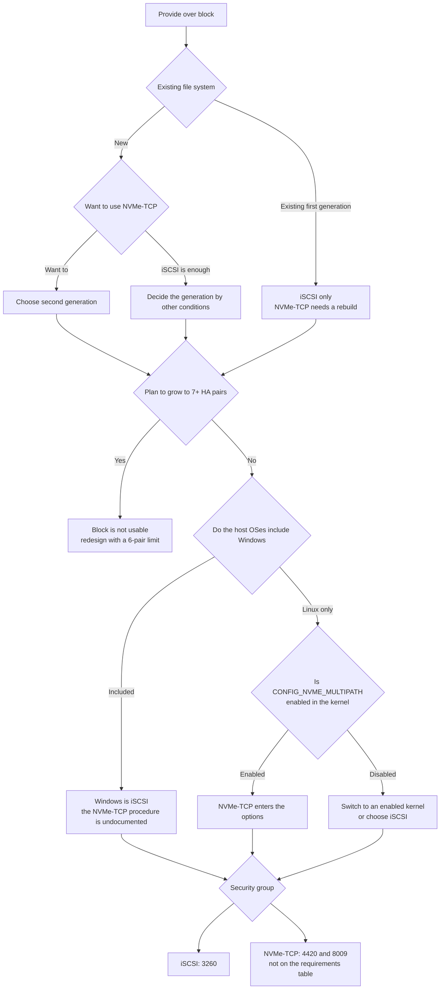

# The block protocol choice is narrowed first by generation and HA pair count

<!-- lang-switcher:start -->
🌐 [日本語](../../../../ja/domains/block-storage/notes/protocol-choice-is-bounded-before-you-choose.md) | [English](protocol-choice-is-bounded-before-you-choose.md) | [🏠 Repository home](../../../README.md)
<!-- lang-switcher:end -->

[🏠 Repository home](../../../README.md) | [Domain — Block storage](../README.md)

---

## Conclusion

**Whether to use iSCSI or NVMe/TCP is narrowed by three conditions before you choose.**

| Condition | How it bears |
|---|---|
| **Generation** | **NVMe/TCP is second generation only.** On the first generation there is no path but to rebuild |
| **HA pair count** | **Both are 6 pairs or fewer.** Adding a 7th makes both unusable, and **an added HA pair cannot be deleted** |
| **Host OS** | **NVMe/TCP on Windows Server is unsupported on the ONTAP side.** That AWS has no procedure is a reflection of that, not an AWS-specific constraint ([NetApp KB](https://kb.netapp.com/on-prem/ontap/da/SAN/SAN-KBs/Does_NetApp_ONTAP_SAN_support_NVMe_TCP_with_Windows_Server)) |

**Generation and HA pair count cannot be changed after creation.** Confirm this before starting the protocol comparison.

And **even after choosing a protocol, the LIF used is the same.** The verification environment's `iscsi_1` and `iscsi_2` both had `data_iscsi` and `data_nvme_tcp` as services. **Only the port differs (3260 and 4420).**

**That port is the pitfall.** **4420 is not listed** in AWS's security-group requirements table. A rule written for iSCSI does not let NVMe/TCP through, and the failure appears as a timeout rather than a connection refusal.

> **Tier**: `verified` (verified 2026-09-05, `ap-northeast-1`, `SINGLE_AZ_2` second generation, 1 HA pair, ONTAP 9.18.1P5) — the LIF sharing, the default state of the services, the accepted range of `os_type`, and the namespace attributes.
> The generation and HA pair constraints, the contents of the port requirements table, and the absence of the Windows procedure are `documented` based on AWS documentation.
> **A performance comparison is not included.** The steps to confirm in your own environment are in [How to confirm in your own environment](#how-to-confirm-in-your-own-environment).

---

## The protocol that does not appear in the enumeration

**The block protocols AWS's documentation enumerates are two: iSCSI and NVMe/TCP.**
Both [Accessing your FSx for ONTAP data](https://docs.aws.amazon.com/fsx/latest/ONTAPGuide/supported-fsx-clients.html) and
[How Amazon FSx for NetApp ONTAP works](https://docs.aws.amazon.com/fsx/latest/ONTAPGuide/how-it-works-fsx-ontap.html)
name these two (confirmed 2026-09-08).

**Fibre Channel appears in neither enumeration.** But **no statement explicitly saying "unsupported" was found.**
Being absent from multiple enumerations and being explicitly denied are different, and **citing the former as the latter makes a claim not in the source.**

**The consequence for the reader is the same.** Because a means to connect over FC is not documented, a configuration extending an existing FC SAN as-is cannot be taken. If migrating, it becomes iSCSI or NVMe/TCP.

---

## Generation and HA pair count

| Condition | iSCSI | NVMe/TCP |
|---|---|---|
| First generation (`SINGLE_AZ_1` / `MULTI_AZ_1`) | **Usable** | **Not usable** |
| Second generation (`SINGLE_AZ_2` / `MULTI_AZ_2`) | Usable | **Usable** |
| HA pairs 1–6 | Usable | Usable if second generation |
| HA pairs 7 or more | **Not usable** | **Not usable** |

**Only second-generation Single-AZ can have 7 or more HA pairs.** So "extend to the scale-out limit while using block" cannot be done. **The HA pair limit for a block-using configuration is 6.**

**An added HA pair cannot be deleted.** If block becomes necessary after adding a 7th, you end up rebuilding the file system. The irreversibility of deployment type and generation is in [The deployment type is decided only once (日本語)](../../../playbooks/02-design/notes/deployment-type-is-decided-once.md).

**What happens to existing LUNs when a 7th pair is added is not stated in AWS's documentation.** It only says "not supported on file systems exceeding 6 pairs." **Do not read the absence of a statement as either "they disappear" or "they remain."**

---

## LIF sharing and the port difference

The LIFs in the verification environment were as follows.

| LIF | Node | Services it has |
|---|---|---|
| `iscsi_1` | -01 | **`data_iscsi` and `data_nvme_tcp`** |
| `iscsi_2` | -02 | **`data_iscsi` and `data_nvme_tcp`** |
| `nfs_smb_management_1` | -01 | `data_nfs`, `data_cifs` |

**There are 2 block LIFs per SVM, one per node.** And **these two are per-SVM.** Creating a second SVM produced `iscsi_1` / `iscsi_2` of the same name there too. **Counting LIFs without specifying the SVM miscounts the number.**

**The ports are split.**

| Port | Use | AWS's security-group requirements table |
|---|---|---|
| 3260 | iSCSI | **Listed** |
| 4420 | NVMe/TCP data | **Not listed** |
| 8009 | NVMe/TCP discovery | **Not listed** |

**4420 appears only in the procedure page's example output and the re:Post prerequisites.** Writing a security group looking only at the requirements table does not let NVMe/TCP through. **And because the symptom when it does not pass is a timeout, it looks like a host problem, not the rule.**

> **Pick the ports you need from the procedure page of the protocol you use, not from the requirements table.** The [requirements table](https://docs.aws.amazon.com/fsx/latest/ONTAPGuide/limit-access-security-groups.html) goes up to TCP 3260, and 4420 and 8009 are on the procedure page and the re:Post side (confirmed 2026-09-05). **Using the requirements table as an exhaustive list makes NVMe/TCP time out.**

---

## The services are enabled by default

**On a newly created SVM, both the iSCSI service and the NVMe service were already enabled.**

| Service | State in the verification environment |
|---|---|
| iSCSI | `enabled=true`. A target IQN was also issued |
| NVMe | `enabled=true`. Trying to create it returned "already exists" |

**What AWS's procedure instructs is creating a namespace and subsystem, not enabling the service.** Calling the create API thinking the service does not exist causes an error.

---

## The correspondence of iSCSI and NVMe/TCP objects

**The structure is the same, the names differ.**

| iSCSI | NVMe/TCP |
|---|---|
| LUN | namespace |
| igroup | subsystem |
| initiator IQN | host NQN |
| LUN map | subsystem map |
| port 3260 | port 4420 (discovery 8009) |
| ALUA | ANA |

**The attributes of the namespace created in the verification environment.**

| Item | Value |
|---|---|
| Size | 20 GiB |
| Block size | **4 KiB** |
| `used` | 0 (right after creation) |
| State | `online` |

**AWS's documentation does not write a space-reservation recommendation for a namespace.** For a LUN it recommends enabling `space-allocation`, but there is no corresponding statement for a namespace.

---

## The absence of a newer Windows `os_type`

**AWS instructs "use `windows_2008` for all Windows versions."** This was not a convention.

Trying to create a LUN specifying `windows_2022` for `os_type` gave the following error.

```text
"windows_2022" is an invalid value for field "os_type"
```

**A newer Windows value does not exist in ONTAP 9.18.1P5.** For a Windows Server 2022 host too, `windows_2008` is used. **This value is for block offset and performance, not a label indicating the OS version.**

The Linux side is `linux`. The igroup's `os_type` is specified separately from the LUN's `os_type`, and for a Windows host `windows` was used (not `windows_2008`). **The LUN and the igroup accept different values.**

---

## NVMe/TCP on Windows

**The conclusion first: ONTAP does not support NVMe/TCP with Windows Server.** A NetApp KB states it explicitly, and the Windows support scope is said to be limited to native NVMe disks (JBOD). NVMe/FC is named as a workaround, but **FSx for ONTAP does not offer FC, so this workaround is unusable.** There is a preview on Windows Server Insider Builds, but with the constraints of command-line only and no multipath ([NetApp KB](https://kb.netapp.com/on-prem/ontap/da/SAN/SAN-KBs/Does_NetApp_ONTAP_SAN_support_NVMe_TCP_with_Windows_Server), confirmed 2026-09-05).

**This KB is placed in NetApp's `on-prem/` namespace.** Host-OS support can be read as a platform-independent property, but **it does not explicitly target FSx for ONTAP.** Keep the strength of the assertion to here.

**And the causation "AWS has no procedure because it reflects the upstream lack of support" is our inference, not the KB's statement.** The KB only states the support status. **The practical consequence is the same: you cannot plan to use NVMe/TCP on Windows.** In fact, AWS enumerates three block procedures.

- Provisioning iSCSI for Linux
- Provisioning iSCSI for Windows
- Provisioning NVMe/TCP for Linux

**`provision-nvme-windows.html` redirects to the service overview page.** It seems to be a URL that once existed, but the body cannot currently be obtained.

**This is not a statement that "NVMe/TCP cannot be used on Windows."** It is a state where the documentation is silent. **Do not rewrite the absence of a statement as unsupported.** But **you cannot make something with no procedure a premise for production.** If Windows hosts are included, choosing iSCSI is realistic.

---

## The Linux-side kernel configuration as a premise

**On Amazon Linux 2023, native NVMe/TCP multipath was not enabled.** Kernel `6.18.44-99.149.amzn2023.x86_64` is `CONFIG_NVME_MULTIPATH is not set`, and **the same namespace appeared as two block devices.**

**AWS's procedure assumes RHEL 9.3.** The details and observations are in [Paths are the failover mechanism itself (日本語)](../../../../ja/domains/block-storage/notes/paths-are-the-failover-mechanism.md#nvmetcp-のパスがカーネル構成に依存すること).

**From the protocol-choice viewpoint, read it this way.** If you choose NVMe/TCP, **whether multipath is enabled in the host's kernel becomes a premise of the same weight as generation and HA pair count.**

---

## The decision flow



---

## How to confirm in your own environment

| # | Step | What it tells you |
|---|---|---|
| 1 | `aws fsx describe-file-systems --query 'FileSystems[].OntapConfiguration.[DeploymentType,HAPairs]'` | The generation and HA pair count. **Whether NVMe/TCP can be chosen** |
| 2 | Confirm with stakeholders whether there is a plan to grow to 7+ HA pairs | **If there is, block is not usable** |
| 3 | Make a list of host OSes and confirm whether Windows is included | The range where NVMe/TCP can be chosen |
| 4 | On a Linux host, `grep CONFIG_NVME_MULTIPATH /boot/config-$(uname -r)` | **Whether multipath holds for NVMe/TCP** |
| 5 | Check the LIFs and services with `network interface show -vserver <svm> -fields service-policy,address` | **That iSCSI and NVMe/TCP use the same LIF** |
| 6 | Confirm the security group's inbound rules have 3260 and, if using NVMe/TCP, 4420 | **Because 4420 is not on the requirements table, an iSCSI rule does not let it through** |
| 7 | Check the service state with `vserver iscsi show` and `vserver nvme show` | **They are already enabled, so there is no need to create them** |
| 8 | In a test environment, try creating a LUN specifying a newer Windows value for `os_type` | **Confirmation that it is rejected. The basis for using `windows_2008`** |

Do step 8 **in a test environment.** It is an operation to try a failing API call in production.

---

## Common misconceptions

| Misconception | Reality |
|---|---|
| The protocol can be changed later | **NVMe/TCP needs second generation**, and on first generation it is a rebuild |
| NVMe/TCP is a superset of iSCSI so it can be chosen anytime | There are four premises: generation, HA pair count, the host's kernel, and the absence of the Windows procedure |
| iSCSI and NVMe/TCP use different LIFs | **The same LIF has both services** |
| Having an iSCSI security group lets NVMe/TCP through too | **The ports differ, and 4420 is not on AWS's requirements table** |
| A procedure to enable the iSCSI service is needed | **It was already enabled on a new SVM.** The NVMe service too |
| Windows Server 2022 has a newer `os_type` value | **`windows_2022` was rejected.** Use `windows_2008` |
| The LUN and the igroup have the same `os_type` value | The LUN was `windows_2008`, the igroup `windows` |
| NVMe/TCP cannot be used on Windows | **The documentation is merely silent.** But something with no procedure cannot be a production premise |
| Adding HA pairs can extend block bandwidth | **It becomes unusable from the 7th pair.** The limit is 6 |
| Existing LUNs remain even after adding a 7th pair | **There is no statement.** Do not read the absence of a statement as "they remain" |

---

## Verification environment

| Item | Value |
|---|---|
| ONTAP version | 9.18.1P5 |
| Region | `ap-northeast-1` |
| Deployment type | `SINGLE_AZ_2` (second generation, 1 HA pair) |
| Throughput capacity | 384 MBps |
| Linux client | Amazon Linux 2023, kernel 6.18.44-99.149.amzn2023.x86_64 |
| Windows client | Windows Server 2022 Datacenter |
| Verification date | 2026-09-05 |

> **Note**: the above is a measurement in this environment and does not guarantee a general service limit or reproduction in a production environment. **The accepted range of `os_type` depends on the ONTAP version.**

---

## Primary sources referenced

| Point | Source |
|---|---|
| That iSCSI is 6 HA pairs or fewer, that NVMe/TCP is second generation and 6 pairs or fewer, and that an SVM's endpoints are the five `Nfs` / `Smb` / `Iscsi` / `Nvme` / `Management` | [AWS: Accessing your FSx for ONTAP data](https://docs.aws.amazon.com/fsx/latest/ONTAPGuide/accessing-data-from-on-premises.html) · [AWS: Supported clients](https://docs.aws.amazon.com/fsx/latest/ONTAPGuide/supported-fsx-clients.html) |
| That block protocols become unsupported at the 7th pair, and that an added HA pair cannot be deleted | [AWS: Adding HA pairs](https://docs.aws.amazon.com/fsx/latest/ONTAPGuide/adding-HA-pairs.html) |
| That deployment type and generation cannot be changed after creation, and the throughput options per generation | [AWS: Availability, durability, and deployment options](https://docs.aws.amazon.com/fsx/latest/ONTAPGuide/high-availability-AZ.html) |
| Using `windows_2008` for `os_type`, the `space-allocation` recommendation, LUN max 128 TB | [AWS: Creating an iSCSI LUN](https://docs.aws.amazon.com/fsx/latest/ONTAPGuide/create-iscsi-lun.html) |
| The NVMe/TCP order namespace → subsystem → map → host NQN, ports 4420 and discovery 8009, the assumed client RHEL 9.3, and that `iscsi_1` is used for both iSCSI and NVMe/TCP | [AWS: Provisioning NVMe/TCP for Linux](https://docs.aws.amazon.com/fsx/latest/ONTAPGuide/provision-nvme-linux.html) |
| That the security-group inbound rule list contains 3260 and not 4420 or 8009 | [AWS: Security groups](https://docs.aws.amazon.com/fsx/latest/ONTAPGuide/limit-access-security-groups.html) |
| That NVMe/TCP needs bidirectional opening of TCP 4420 and second generation with 6 HA pairs or fewer | [AWS re:Post: Use NVMe/TCP to mount FSx for ONTAP on Linux](https://repost.aws/knowledge-center/ec2-mount-fsx-ontap-nvme-tcp) |
| That NVMe/TCP simplifies MPIO configuration compared with iSCSI, added 2024-07 | [AWS: FSx for ONTAP supports NVMe-over-TCP](https://aws.amazon.com/about-aws/whats-new/2024/07/amazon-fsx-netapp-ontap-nvme-over-tcp) |
| That ONTAP uses ALUA for iSCSI and ANA for NVMe | [NetApp: Multipathing](https://docs.netapp.com/us-en/ontap/san-config/host-support-multipathing-concept.html) |

---

## Related documents

- [Domain — Block storage](../README.md) — this module's hub
- [Choosing a block protocol and layout (日本語)](../../../../ja/reference/decision-trees/block-protocol-and-layout.md) — this judgment on a single page
- [Paths are the failover mechanism itself (日本語)](../../../../ja/domains/block-storage/notes/paths-are-the-failover-mechanism.md) — the LIF count and path count, and NVMe multipath on AL2023
- [LUNs and igroups are outside the AWS API](block-objects-are-outside-the-aws-api.md) — the boundary of ports and control planes
- [The deployment type is decided only once (日本語)](../../../playbooks/02-design/notes/deployment-type-is-decided-once.md) — the irreversibility of generation and HA pairs
- [When shared block changes the design (日本語)](../../../../ja/domains/block-storage/notes/when-shared-block-changes-the-design.md) — whether to make it block in the first place
- [Block storage cross resource map (日本語)](../../../../ja/reference/block-storage-resource-map.md) — the index of primary sources
- [Evidence policy](../../../evidence-policy.md)

<!-- lang-switcher:start -->
🌐 [日本語](../../../../ja/domains/block-storage/notes/protocol-choice-is-bounded-before-you-choose.md) | [English](protocol-choice-is-bounded-before-you-choose.md) | [🏠 Repository home](../../../README.md)
<!-- lang-switcher:end -->
