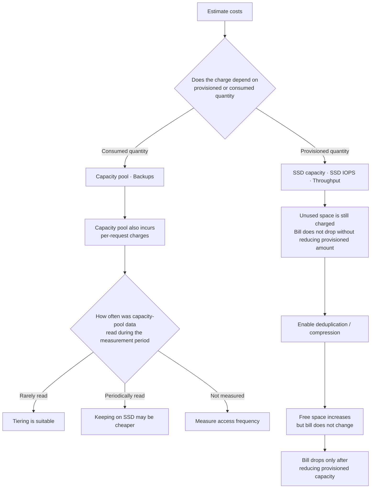

# Billing splits into "provisioned" and "consumed"

[🏠 Repository Top](../../../README.md) | [Domain — Cost](../README.md)

This is the English translation. Japanese is authoritative for technical accuracy.

---

## Conclusion

**Billing items fall into two categories: those charged by provisioned capacity and those charged by actual consumption.** Most estimation errors trace back to this distinction.

- **SSD capacity and throughput capacity are billed by provisioned amount.** You pay even when they are idle.
- **Capacity pool and backups are billed by consumed amount.**

And one more thing. **Capacity pool storage incurs per-request charges for reads and writes, separate from the storage fee.** They apply when data in the capacity pool is read or written.

This means "moving cold data to the capacity pool saves money" **can reverse depending on access frequency.** The per-GB rate is lower, but if the data keeps being read, request charges pile up.

> **Evidence**: `documented` — The billing category breakdown is based on the official AWS documentation and pricing page.
> **Specific prices and unit rates are intentionally omitted.** Pricing is subject to change — refer to the [FSx for ONTAP Pricing page](https://aws.amazon.com/fsx/netapp-ontap/pricing/) and
> AWS Pricing Calculator. For steps to verify in your own environment, see "[Verify in your own environment](#verify-in-your-own-environment)".

---

## What is billed

| Billing item | Unit | Provisioned / Consumed |
|---|---|---|
| SSD capacity | GB-month | **Provisioned** |
| SSD IOPS (amount provisioned beyond 3 IOPS/GB) | IOPS-month | **Provisioned** |
| Throughput capacity | MBps-month | **Provisioned** |
| Capacity pool storage | GB-month | Consumed |
| **Capacity pool read and write requests** | Operations | Consumed |
| Backup storage | GB-month | Consumed (incremental) |
| SnapLock usage | GB-month | Storage capacity used by SnapLock volumes |
| S3 requests and data transfer | Requests / transfer volume | When data is accessed through FSx for ONTAP S3 Access Points |

**SSD IOPS includes 3 IOPS per GB by default.** Additional charges apply only to IOPS provisioned beyond this baseline. "Increasing IOPS always increases the bill" is not accurate — anything within 3 IOPS/GB is included.

Backups are **incremental**. Blocks changed since the previous backup are stored in the next recovery point. Backup storage consumption grows with the changed blocks and the recovery points retained.

---

## Tiering does not always save money

Capacity pool is cost-optimized storage for infrequently accessed data. **However, reading or writing data stored there incurs capacity pool request charges.**

The decision cannot be made on per-GB cost alone.

| Data characteristics | Tiering suitability |
|---|---|
| Rarely read after being written (archives, audit log retention) | Well suited |
| Periodically scanned in full (backup targets, index rebuilds) | **Request charges accumulate** |
| Access frequency unknown | Measure first, then decide |

Tiering also has a capacity prerequisite. **All writes land on SSD first regardless of tiering policy, and metadata always remains on SSD.** The rule of thumb is SSD : capacity pool = 1 : 10.

This means **SSD consumption never reaches zero even with `All` tiering policy.** Details are in [SSD is still used even with `All` tiering policy](../../../playbooks/05-operate/notes/monitoring-fails-on-averages.md#ssd-used-even-with-tiering-policy-all).

---

## Deduplication and compression do not reduce the SSD bill

**Deduplication and compression shrink data size, but SSD is billed by provisioned capacity.**

Therefore, even if storage efficiency frees up space, **the bill does not change unless you actually reduce the provisioned capacity.** The benefit is "fitting more data into the same provisioned capacity", not "a lower bill".

To lower the bill, you need to **reduce provisioned capacity** by the amount freed through efficiency gains. For measurement steps, see [Verify in your own environment](#verify-in-your-own-environment).

---

## Items commonly mistaken as not billed

| Item | Reality |
|---|---|
| Inter-AZ replication transfer performed internally by the Multi-AZ service | **Included in throughput capacity pricing.** This statement does not include client traffic, backup copies, or SnapMirror transfer |
| SSD IOPS up to 3 IOPS/GB | Included by default |
| Data retained by backups | Blocks changed since the previous backup are stored in the next recovery point. Consumption depends on changed data and retained recovery points |
| Service minimum fee or setup fee | None. A created file system still has provisioned SSD and throughput configuration floors, and those provisioned amounts are billed |

**Adding a separate inter-AZ transfer charge for Multi-AZ service replication counts the same transfer twice.** There is no basis for extending that inclusion to client traffic, backup copies, or SnapMirror. Also consider the throughput ceiling and HA pair constraints in [Deployment type can only be chosen once](../../../playbooks/02-design/notes/deployment-type-is-decided-once.md#choosing-between-multi-az-and-single-az).

---

## Snapshots consume capacity

Snapshots consume **volume capacity**, not capacity pool. And when a Snapshot holds deleted data, **deleting that data does not free space.**

Note that Snapshots are not always the cause. **Immediately after deleting large amounts of data or directories, free space takes time to update.** Blocks are not returned to free space until the block ownership calculation process completes. This is expected behavior and does not affect volume performance. **Before attributing "deleted but not freed" to Snapshots, wait and re-check.**

Retention policies directly affect capacity estimates. The relationship with limits is described in [Having Snapshots and being able to recover are different things](../../data-protection/notes/snapshots-are-not-a-recovery-plan.md#limits-and-retention-periods), and inode consumption is in [Running out of space despite available capacity](../../../playbooks/01-assess/notes/counting-bytes-is-not-counting-files.md#snapshots-that-consume-inodes).

---

## Typical estimation assumptions that break

| Assumption | What actually happens |
|---|---|
| SSD is billed only for what is used | **Billed by provisioned capacity.** Unused space is still charged |
| Moving data to capacity pool always saves money | Data that is read incurs request charges |
| `All` tiering means SSD is barely needed | Metadata always stays on SSD. Rule of thumb is 1 : 10 |
| Deduplication lowers the bill | No change until provisioned capacity is reduced |
| Multi-AZ service replication incurs a separate inter-AZ transfer charge | That replication transfer is included in throughput capacity pricing. Check other transfer paths separately |
| Adding HA pairs is a performance decision | SSD capacity increases proportionally. **The minimum throughput also rises** |
| Snapshots have no impact on billing | They consume both capacity and inodes |
| Increasing IOPS always increases the bill | Up to 3 IOPS/GB is included |

The point about HA pair addition raising minimum throughput is in [Throughput is not determined by a single setting](../../performance/notes/where-throughput-is-determined-and-shared.md). **An operation that raises the ceiling also raises the floor, narrowing the room for cost reduction.**

---

## How to weigh trade-offs

A cost decision becomes possible when **the amount saved and what is given up in exchange are set side by side symmetrically.** Looking at only one side leaves the decision undecidable.

| Choice | What decreases | What you accept |
|---|---|---|
| Use Single-AZ | Storage and throughput unit price | Need to design AZ-failure continuity through other mechanisms |
| Use tiering aggressively | SSD provisioned capacity | Capacity pool request charges and increased read latency |
| Reduce throughput capacity | MBps-month charges | Less headroom at peak. Background tasks get deprioritized more |
| Shorten Snapshot retention | Capacity consumption | Fewer recovery point options |
| Keep provisioned IOPS at 3 IOPS/GB | IOPS-month charges | Less headroom for random I/O-heavy workloads |

**Each option pairs "cost reduction" with "something given up."** The mechanism by which background tasks get deprioritized is in [Monitoring fails on averages](../../../playbooks/05-operate/notes/monitoring-fails-on-averages.md).

---

## Decision flow

---

## Verify in your own environment

**The measurement targets are "the gap between provisioned and consumed capacity" and "access frequency to the capacity pool."** These two factors explain most estimation errors.

| # | Step | What it confirms |
|---|---|---|
| 1 | Record SSD provisioned capacity alongside actual usage | **Amount provisioned but unused.** The magnitude of reduction opportunity |
| 2 | Aggregate read/write request counts to the capacity pool over a period | Scale of request charges. Whether tiering is justified |
| 3 | Record "actual usage" and "provisioned capacity" separately before and after deduplication/compression | **Confirming that efficiency gains are not reflected in the bill.** Provides the basis for reducing provisioned capacity |
| 4 | Measure SSD consumption of a volume with `All` tiering | Whether the metadata portion matches the 1 : 10 rule of thumb |
| 5 | Delete Snapshots and observe the change in free space | Capacity held by Snapshots. **Immediately after bulk deletion, reflection takes time** |
| 6 | Check whether provisioned IOPS exceeds 3 IOPS/GB | Whether additional charges are being incurred |
| 7 | Record region, generation, and deployment type at the time of measurement | Unit prices and limits vary — numbers without conditions cannot be compared |

Step 3 is most commonly overlooked. **Reporting efficiency gains as "free space" masks the fact that the bill has not changed.**

---

## Common misconceptions

| Misconception | Reality |
|---|---|
| You pay only for what you use | SSD, IOPS, and throughput are billed by **provisioned capacity** |
| Capacity pool is storage-only pricing | **Per-request charges for reads and writes** apply |
| Moving all cold data to the pool always saves money | Periodically scanned data accumulates request charges |
| Deduplication lowers the bill | No change until provisioned capacity is reduced |
| Every backup stores a full copy | Blocks changed since the previous backup are stored in the next recovery point |
| Multi-AZ service replication has separate inter-AZ transfer charges | That replication transfer is included in throughput capacity pricing. Client traffic, backup copies, and SnapMirror are separate paths |
| Increasing IOPS always costs more | Up to 3 IOPS/GB is included |
| Snapshots are irrelevant to storage billing | They consume both capacity and inodes |
| `All` tiering means near-zero SSD charges | Metadata always remains on SSD |

---

## Primary sources referenced

| Topic | Source |
|---|---|
| SSD IOPS being charged only beyond 3 IOPS/GB and capacity pool having per-request charges for reads and writes | [AWS: What is Amazon FSx for NetApp ONTAP?](https://docs.aws.amazon.com/fsx/latest/ONTAPGuide/what-is-fsx-ontap.html) |
| SnapLock usage recording storage used by SnapLock volumes in GB-months and capacity pool reads and writes recording operation counts | [AWS: AWS billing and usage reports for FSx for ONTAP](https://docs.aws.amazon.com/fsx/latest/ONTAPGuide/FSxONTAP-Billing.html) |
| Provisioned vs. consumed distinction, Multi-AZ service replication transfer included in throughput pricing, changed blocks stored by backups, no service minimum or setup fee, and requests and data transfer through FSx for ONTAP S3 Access Points | [AWS: FSx for ONTAP Pricing](https://aws.amazon.com/fsx/netapp-ontap/pricing/) |
| Billing based on provisioned capacity, capacity pool and backups billed on consumption | [AWS: FSx for ONTAP Features](https://aws.amazon.com/fsx/netapp-ontap/features/) |
| Deduplication/compression shrinks data but billing is against provisioned storage, tiering as cost reduction | [AWS Prescriptive Guidance: Choose the right SMB file storage](https://docs.aws.amazon.com/prescriptive-guidance/latest/optimize-costs-microsoft-workloads/storage-fsx-smb.html) |
| All writes going through SSD first, metadata always on SSD, 1 : 10 rule of thumb | [AWS: Migrating to FSx for ONTAP using NetApp SnapMirror](https://docs.aws.amazon.com/fsx/latest/ONTAPGuide/migrating-fsx-ontap-snapmirror.html) |
| Free space taking time to update after large deletions (block ownership calculation), no performance impact | [AWS re:Post: Why didn't the available space update after I deleted a large amount of data?](https://repost.aws/knowledge-center/fsx-ontap-space-available-from-deletions) |

---

## Related documents

- [Domain — Cost](../README.md) — This module's hub
- [Deployment type can only be chosen once](../../../playbooks/02-design/notes/deployment-type-is-decided-once.md) — Single-AZ / Multi-AZ and scale-out constraints
- [Throughput is not determined by a single setting](../../performance/notes/where-throughput-is-determined-and-shared.md) — HA pair addition raises minimum throughput
- [Monitoring fails on averages](../../../playbooks/05-operate/notes/monitoring-fails-on-averages.md) — Tiering and background task behavior
- [Having Snapshots and being able to recover are different things](../../data-protection/notes/snapshots-are-not-a-recovery-plan.md) — Retention design and capacity
- [Running out of space despite available capacity](../../../playbooks/01-assess/notes/counting-bytes-is-not-counting-files.md) — Inodes and Snapshots
- [Limits and quotas](../../../../ja/reference/limits/) — Limits with sources and verification dates
- [Evidence classification policy](../../../evidence-policy.md)

---

[🏠 Repository Top](../../../README.md) | [Domain — Cost](../README.md)

<!-- lang-switcher:start -->
🌐 [日本語](../../../../ja/domains/cost/notes/provisioned-versus-consumed.md) | [English](provisioned-versus-consumed.md) | [🏠 Repository home](../../../README.md)
<!-- lang-switcher:end -->
