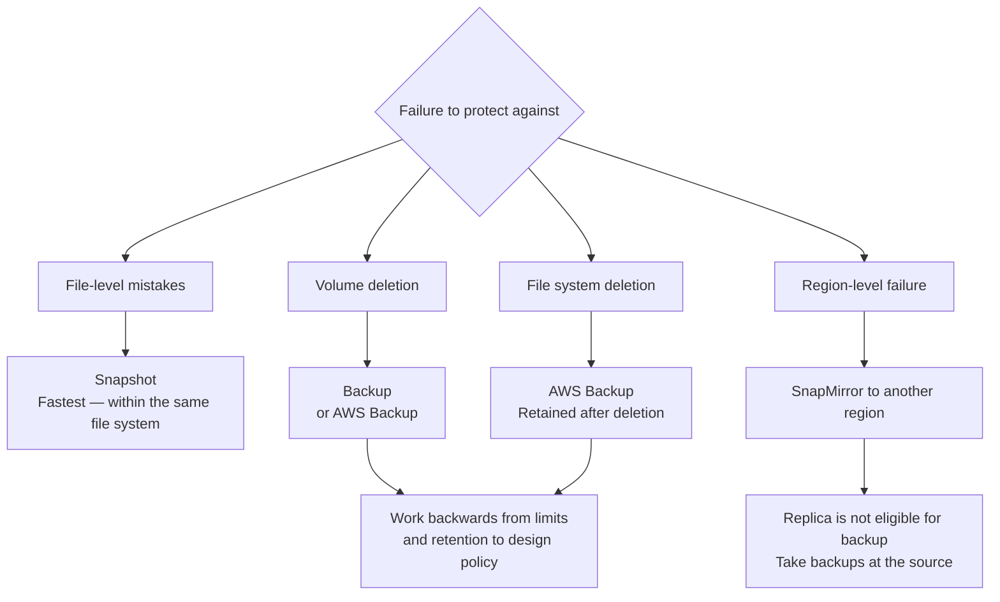

# Having Snapshots and Being Able to Recover Are Different Things

<!-- lang-switcher:start -->
🌐 [日本語](../../../../ja/domains/data-protection/notes/snapshots-are-not-a-recovery-plan.md) | [English](snapshots-are-not-a-recovery-plan.md) | [🏠 Repository home](../../../README.md)
<!-- lang-switcher:end -->

[🏠 Repository Top](../../../README.md) | [Domain — Data Protection](../README.md)

> This is the English translation. Japanese is authoritative for technical accuracy.

---

## Conclusion

Snapshots, backups, and SnapMirror **protect against different scopes of failure.** No single mechanism is sufficient on its own.

**The most important difference is this: Snapshots exist within the same file system.** That is why restores are fast and involve no data movement. For the same reason, **if the volume or file system itself is lost, the Snapshots are lost with it.**

"We take hourly Snapshots so we can recover" — this holds true for accidental deletions and ransomware, but not for volume deletion.

> **Evidence**: `documented` — the scope and constraints of each mechanism are based on AWS official documentation.
> **No measured recovery times are included.** Claiming an RTO requires a restore drill in your own environment. See "[Verify in your own environment](#verify-in-your-own-environment)" for the procedure.

---

## What Each Mechanism Protects Against

| Failure | Snapshot | Backup | AWS Backup | SnapMirror |
|---|:---:|:---:|:---:|:---:|
| Accidental file deletion or modification | ○ | ○ | ○ | △ (retrieve from replica) |
| Ransomware encryption | ○ | ○ | ○ | △ (may propagate if already replicated) |
| **Volume deletion** | **✕** | ○ | ○ | ○ |
| **File system deletion** | **✕** | △ | **○** | ○ |
| Region-level failure | ✕ | ✕ | Depends on configuration | ○ (when replicating to another region) |

**User-initiated backups created through AWS Backup are retained even after the source volume or file system is deleted.** This is the decisive difference from Snapshots.

And **a backup can only be restored to a file system in the same region where the backup is stored.** Backups alone cannot protect against region-level failures. If you need cross-region protection, a SnapMirror configuration is required.

---

## Some Volumes Cannot Be Backed Up

**Volumes other than read-write (RW) are not eligible for backup.**

| Ineligible volume type | Practical implication |
|---|---|
| Data protection (DP) volumes | **SnapMirror destinations cannot be backed up** |
| Load-sharing mirror (LSM) volumes | Also ineligible |
| FlexCache / SnapMirror destination volumes | Also ineligible |

**This directly affects DR design.** The pattern "replicate production to another region via SnapMirror, then back up the replica" does not work. Since the replica cannot be backed up, **backups must be taken at the source side.**

> **Confirmed through controlled testing.** `CreateBackup` against a `DP` volume is rejected with
> `BadRequest ... Volume with type DP is not backupable.`, **while the same operation against an `RW` volume
> succeeds** (`USER_INITIATED`). Both the rejection and the success were confirmed, ruling out
> permission or environment issues.
> Classification: `verified` (verification date 2026-08-06, `ap-northeast-1`, `SINGLE_AZ_1`).
> Records are in [Limits and Quotas](../../../../ja/reference/limits/).

---

## Conditions That Block Restore

Restore does not always succeed simply by executing it. **There are conditions that must be cleared first.**

| Condition | What happens |
|---|---|
| A Snapshot newer than the target restore point is associated with an existing backup | **Restore to that Snapshot is rejected.** The newer one must be deleted first |
| Attempting to delete the most recent `AVAILABLE` backup | Cannot be deleted until all other backups are removed first |
| Source volume is offline | Backups for that volume cannot be deleted |
| Deleting a volume during an in-progress restore | **The in-progress restore is cancelled** |

The first row is the most troublesome. **When backups are used alongside Snapshots, Snapshot restore can be blocked.** This is the kind of constraint you first discover during an incident, so it should be exercised during drills.

---

## Limits and Retention Periods

| Item | Value |
|---|---|
| Snapshots | 1,023 per volume. Once the limit is reached, existing ones must be deleted before new ones can be created |
| Backups | 4,091 per volume. Same behavior at the limit |
| Automatic backup retention | Up to 90 days |
| User-initiated backup retention | No upper limit |

**Design your retention policy by working backwards from the limits.** "Hourly Snapshots with no expiry" stops at 1,023.

---

## Restore Speed Depends on Generation

With second-generation file systems, **read access to the volume becomes available within minutes of starting a restore.** You do not need to wait for the entire dataset to be restored. Compared to first-generation, backup data can reportedly be read up to 17 times faster.

This expands operational options. **If you only need a single file or directory, you can start the restore, copy the needed data, and cancel the restore** (possible even before completion).

With first-generation systems you must wait for the full restore to complete, so **the same RTO cannot be claimed.** Generation is a precondition for RTO.

---

## Design Flow

---

## Verify in Your Own Environment

**Having a backup and being able to restore are separate verification items.** A configuration that only monitors backup success is not confirming recoverability.

| # | Step | What it confirms |
|---|---|---|
| 1 | Actually restore a file from a Snapshot | Whether the most frequent recovery path works |
| 2 | Restore from a backup **to a different volume** | Target specification and elapsed time |
| 3 | Measure the time taken for restore | **The basis for claiming an RTO.** Estimates are not sufficient |
| 4 | Compare ACLs and ownership against the source after restore | Whether permissions are preserved. Data alone is not operational |
| 5 | Attempt restore to an older Snapshot while backups exist | Exercise the "conditions that block restore" above |
| 6 | Record the generation (1st / 2nd) | Behavior from restore start to readable state differs |

Whether you exercise step 5 during normal operations significantly changes the time required during an actual incident.

Step 4 is frequently overlooked. **The same ACL comparison procedure described in [ACL preservation is a permissions problem, not a tooling problem](../../../../ja/playbooks/03-migrate/notes/preserving-acls-during-migration.md) can be used.**

---

## Common Misconceptions

| Misconception | Reality |
|---|---|
| Taking Snapshots means we can recover | Snapshots exist within the same file system. **If the volume or file system is lost, they are lost too** |
| Having backups means we are protected against region failures | Restore targets are limited to file systems in the same region. Cross-region requires a SnapMirror configuration |
| We can just back up the SnapMirror destination | **Destination (DP) volumes are not eligible for backup.** Take backups at the source |
| Restore can be executed at any time | If a newer Snapshot is associated with a backup, restore is rejected. Cleanup is needed first |
| Snapshots can grow indefinitely | The limit is 1,023 per volume. Once reached, deletions are required |
| Automatic backups alone handle long-term retention | Automatic backup retention is capped at 90 days. Long-term retention belongs to user-initiated backups |
| Monitoring backup success means we can recover | Taking and restoring are different things. **If you have not tested a restore, your RTO is a guess** |
| Restore is fast so generation does not matter | Second-generation becomes readable within minutes of starting. First-generation requires waiting for full completion |

---

## Primary Sources Referenced

| Topic | Source |
|---|---|
| Eligible volume types for backup, restore target limited to same region, DP / LSM / FlexCache / SnapMirror destinations ineligible | [AWS: Protecting your data with volume backups](https://docs.aws.amazon.com/fsx/latest/ONTAPGuide/using-backups.html) |
| Conditions for deleting the most recent backup, offline volumes, cancellation on deletion during restore | [AWS: Deleting backups](https://docs.aws.amazon.com/fsx/latest/ONTAPGuide/how-to-delete-backups.html) |
| AWS Backup backups are retained after volume / file system deletion | [AWS re:Post: How can I recover a deleted FSx for ONTAP volume?](https://repost.aws/knowledge-center/fsx-ontap-recover-deleted-volume) |
| Snapshots exist within the same file system and involve no data movement | [AWS Storage Blog: Protecting data against ransomware](https://aws.amazon.com/blogs/storage/protecting-data-against-ransomware-with-amazon-fsx-for-netapp-ontap/) |
| Restore rejected when a newer Snapshot is associated with a backup | [AWS: Restore SQL Server databases using T-SQL and Snapshots](https://aws.amazon.com/blogs/modernizing-with-aws/restore-sql-server-databases-using-t-sql-and-amazon-fsx-for-netapp-ontap-snapshots/) |
| Restore-to-readable improvement in second-generation file systems | [AWS Storage Blog: Second-generation file systems](https://aws.amazon.com/blogs/storage/accelerate-file-workload-performance-with-second-generation-amazon-fsx-for-netapp-ontap-file-systems/) |
| Snapshot / backup limits, automatic backup retention | [AWS: Quotas](https://docs.aws.amazon.com/fsx/latest/ONTAPGuide/limits.html) |

---

## Related Documents

- [Domain — Data Protection](../README.md) — Hub for this module
- [ACL preservation is a permissions problem, not a tooling problem](../../../../ja/playbooks/03-migrate/notes/preserving-acls-during-migration.md) — The same procedure can be used for ACL comparison after restore
- [Playbook 05 — Operate](../../../playbooks/05-operate/) — Restore drills are an operational item
- [Pre-production review](../../../../ja/playbooks/04-build/checklists/pre-production-review.md) — Includes items for actually testing restores
- [Limits and Quotas](../../../../ja/reference/limits/) — Limits with sources and verification dates
- [Evidence classification policy](../../../evidence-policy.md)

---

[🏠 Repository Top](../../../README.md) | [Domain — Data Protection](../README.md)

<!-- lang-switcher:start -->
🌐 [日本語](../../../../ja/domains/data-protection/notes/snapshots-are-not-a-recovery-plan.md) | [English](snapshots-are-not-a-recovery-plan.md) | [🏠 Repository home](../../../README.md)
<!-- lang-switcher:end -->
