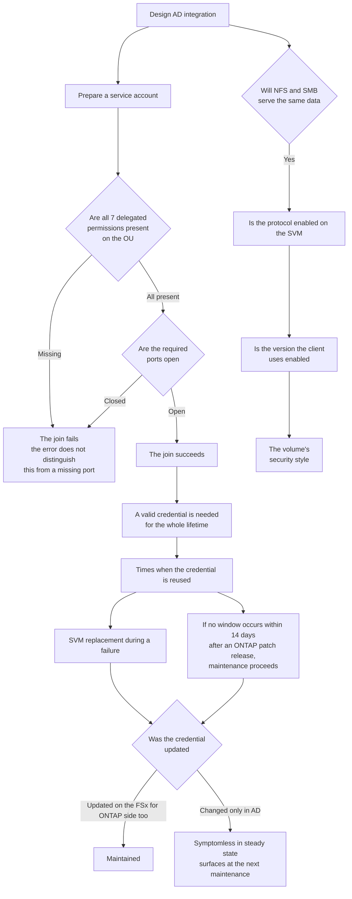

# Does the AD dependency end once the join is done?

No. The service account is needed for the file system's lifetime; expiry surfaces at maintenance.

<!-- lang-switcher:start -->
🌐 [日本語](../../../../ja/domains/multiprotocol-identity/notes/ad-dependency-lasts-the-lifetime.md) | [English](ad-dependency-lasts-the-lifetime.md) | [🏠 Repository home](../../../README.md)
<!-- lang-switcher:end -->

## What you will learn

- That the service account is needed for the file system's whole lifetime, and credential expiry surfaces at the next maintenance or a failure
- That serving the same data over NFS and SMB has three layers of condition (SVM, version, security style)

## What this note does not answer

- Every behaviour when AD is unreachable
- The per-protocol scope of in-transit encryption when using LDAP

## Prerequisite level

intermediate

## Body

<a id="the-ad-dependency-lasts-a-lifetime-not-just-the-join"></a>

[🏠 Repository home](../../../README.md) | [Domain — Multiprotocol identity](../README.md)

> This is the English translation. Japanese is authoritative for technical accuracy. Please report any discrepancy.

---

### Conclusion

**Amazon FSx requires a valid service account for the lifetime of the file system.** It does not stop being needed once the join completes.

The reason is that **some operations require FSx for ONTAP to unjoin from AD and rejoin.** The documentation names these:

- **Replacing a failed file system or SVM**
- **Applying NetApp ONTAP software patches**

Which means **an expired service account credential causes nothing at all in steady state.** It surfaces at the next maintenance window, or during a failure. **If no maintenance window occurs within 14 days after an ONTAP patch is released, the service proceeds with maintenance.** That connection is in [Maintenance proceeds if no window occurs within 14 days after a patch release](../../../../ja/playbooks/05-operate/notes/maintenance-cannot-be-deferred.md) (日本語).

**"AD integration is working, so we are fine" is a judgment that only holds in steady state.**

> **Evidence**: `documented` — the required delegated permissions, the lifetime requirement, and the failure errors and their causes come from AWS documentation.
> **It is not an exhaustive account of behaviour when AD is unreachable.** Steps for confirming this in your own environment are under
> [Verify it in your environment](#verify-it-in-your-environment).

---

### Delegated permissions the service account needs

**These permissions must be delegated, at minimum, over the OU being joined.**

| Permission |
|---|
| Reset password |
| Restrict the account from reading and writing data |
| Write the `msDS-SupportedEncryptionTypes` property on computer objects |
| Write to DNS host name (validated) |
| Write to service principal name (validated) |
| **Create and delete computer objects** |
| Read and write account restrictions (validated) |

**Being able to join a domain is not enough.** The list above includes what post-join management requires.

**Storing the credential in AWS Secrets Manager and passing the secret ARN is the recommended approach.** Passing it in plaintext is possible but not recommended. How templates handle it is in [Handling secrets](../../../playbooks/04-build/notes/what-iac-cannot-reach.md#handling-secrets).

---

### Two operations to avoid

**Both leave the SVM `misconfigured`.**

| Operation | Result |
|---|---|
| Moving the computer object Amazon FSx created inside the OU after the SVM exists | **The SVM becomes misconfigured** |
| Deleting the Active Directory while an SVM is joined to it | **The SVM becomes misconfigured** |

The first happens easily during AD housekeeping. **If a change to the OU structure is planned, exclude the objects FSx for ONTAP created.**

---

### Two reasons a join fails

A failed join returns the error stated in the documentation. Two causes are named.

| Cause | What to check |
|---|---|
| **Port requirements are not met** | Review the network configuration requirements and open the necessary ports |
| **Insufficient service account permissions** | Confirm the delegated permissions above over the specified OU |

**The error message does not distinguish between the two.** Both produce the same text, so **checking both in turn** is the correct procedure.

After fixing it, update the SVM's Active Directory configuration to retry the join.

---

### Conditions for serving the same data over NFS and SMB

**Having both protocols enabled is not enough.** There are three layers.

| Layer | Condition | How to check |
|---|---|---|
| SVM | The protocol is enabled | `vserver show-protocols` |
| Protocol version | The version the client uses is enabled | `vserver nfs show` (v3 / v4.0 / 4.1 are enabled individually) |
| Volume | The security style determines the permission evaluation model | [Security style determines the permission evaluation model](security-style-and-permission-evaluation.md) |

**The version layer is the one that gets missed.** For example, **with NFS v3 disabled, a v3 mount fails with `requested NFS version or transport protocol is not supported`.** It fails while NFS itself is enabled on the SVM, which makes the cause hard to see.

Enabled versions are visible in `vserver nfs show`. Enabling a specific version uses `vserver nfs modify`. **These are ONTAP CLI operations.**

#### Ports differ by version

| Version | Ports required |
|---|---|
| NFS v3 | 2049, 111, 635, 4045, 4046, 4049 (TCP / UDP) |
| NFS v4 | **TCP 2049 only** |

**v3 needs more ports.** Bringing a v3 client into an environment whose security groups were tightened around v4 leaves it unable to mount.

---

### Behaviour when AD is unreachable

**Steady-state data access and administrative operations are affected differently.**

| What is affected | Detail |
|---|---|
| Replacing an SVM (during a failure) | **Requires unjoin and rejoin, so it cannot run without a valid service account** |
| Applying ONTAP patches | Likewise involves unjoin and rejoin |
| NFS Kerberos encryption in transit | The detailed page describes child volumes of an SVM joined to Microsoft Active Directory. The data-protection page also names an AD or LDAP domain, leaving the protocol-specific LDAP scope inconsistent. [In-transit encryption has prerequisites](../../../../ja/domains/security-governance/notes/what-the-platform-gives-and-what-stays-yours.md#転送時の暗号化の前提条件) (日本語) |
| SVM state | Deleting the AD leaves it `misconfigured` |

**Keeping the configuration current is stated as a requirement.** When the service account credential changes, update the configuration on the Amazon FSx side too.

---

### Decision flow



---

### Common misconceptions

| Misconception | Reality |
|---|---|
| The service account is only needed at join time | **It is needed for the lifetime of the file system** |
| If AD integration is working there is no problem | It is symptomless in steady state. **It surfaces during patching or a failure replacement** |
| Domain join permission is enough | Seven permissions have to be delegated |
| Changing the credential in AD is sufficient | **The Amazon FSx configuration has to be updated too** |
| The computer object FSx for ONTAP created can be moved | Moving it **leaves the SVM misconfigured** |
| Delete the SVM first, then the AD | Deleting the AD while joined leaves it misconfigured |
| The join failure error identifies the cause | **A missing port and a missing permission produce the same text.** Check both |
| If NFS is enabled on the SVM, any version can mount | Versions are enabled individually. v3 is sometimes disabled |
| NFS ports are the same regardless of version | **v3 needs six ports; v4 needs only TCP 2049** |
| Enabling both protocols is enough to share the same data | The security style determines the permission evaluation model |

---

### Primary sources

| Concern | Source |
|---|---|
| The seven delegated permissions, that a valid credential is needed for the lifetime, the operations involving unjoin and rejoin (failure replacement and patching), the Secrets Manager recommendation, and that moving the computer object or deleting the AD causes misconfigured | [AWS: Prerequisites for joining an SVM to a self-managed Microsoft AD](https://docs.aws.amazon.com/fsx/latest/ONTAPGuide/self-manage-prereqs.html) |
| The join failure error text, that the cause is either port requirements or permissions, and the procedure of updating the configuration and retrying | [AWS: You can't join a storage virtual machine (SVM) to Active Directory](https://docs.aws.amazon.com/fsx/latest/ONTAPGuide/cannot-join-svm-to-ad.html) |
| The requirement to keep the AD configuration current | [AWS: Keeping your Active Directory configuration updated](https://docs.aws.amazon.com/fsx/latest/ONTAPGuide/keep-ad-updated.html) |
| Checking protocols and versions with `vserver show-protocols` and `vserver nfs show`, the error when v3 is disabled, and enabling with `vserver nfs modify` | [AWS re:Post: Why can't I mount my FSx for ONTAP file system on my EC2 Linux instance?](https://repost.aws/knowledge-center/fsx-ontap-mount-errors-on-linux) |
| That NFS v3 and v4 require different ports | [AWS re:Post: How do I use NFS to mount an FSx for ONTAP volume?](https://repost.aws/knowledge-center/ec2-mount-fsx-ontap-nfs) |

---

### Related documents

- [Domain — Multiprotocol identity](../README.md) — this module's hub
- [Security style determines the permission evaluation model](security-style-and-permission-evaluation.md) — the volume layer's condition
- [At-rest encryption is automatic; in-transit conditions differ by method](../../../../ja/domains/security-governance/notes/what-the-platform-gives-and-what-stays-yours.md) (日本語) — the prerequisite for Kerberos in-transit encryption
- [Maintenance proceeds if no window occurs within 14 days after a patch release](../../../../ja/playbooks/05-operate/notes/maintenance-cannot-be-deferred.md) (日本語) — when it surfaces
- [What IaC cannot reach is decided by the API surface](../../../playbooks/04-build/notes/what-iac-cannot-reach.md) — secrets and AD automation
- [Evidence Policy](../../../evidence-policy.md)

---

<a id="verify-in-your-own-environment"></a>

## Verify it in your environment

**What to establish is not whether it works now, but whether it will work during maintenance.**

| # | Step | What it establishes |
|---|---|---|
| 1 | Verify all seven delegated permissions on the service account | Whether anything post-join management needs is missing |
| 2 | Check the credential's expiry and the rotation procedure | **Finds a symptomless expiry ahead of time** |
| 3 | Write a procedure that updates the Amazon FSx configuration whenever the credential changes | Prevents updating only one side |
| 4 | Disable the service account in a test environment and observe the SVM's state | **Measures what happens when AD is unreachable.** Do this in a test environment |
| 5 | Check `vserver show-protocols` and `vserver nfs show` | Which protocols and versions are enabled |
| 6 | Try mounting with the NFS version the clients use | Finds a version mismatch ahead of time |
| 7 | Check whether the security groups assume v3 or v4 | The difference in port requirements |
| 8 | Add a check of AD configuration validity before each maintenance window | Moves the moment it surfaces into normal hours |

Steps 2 and 8 are worth the most. **An expiry produces no symptoms in steady state, so periodic checking is the only way to find it.**

The enabled protocols can be read with this read-only command.

```bash
ssh <svm-management-endpoint> vserver show-protocols -vserver <svm>
```

### Expected output

```text
The protocols enabled and disabled on that SVM
```

This shows only the enabled protocols. The service account's delegated permissions, credential expiry, and maintenance-time behaviour are checked separately. It changes nothing.

## Read next

[Do SMB local users have a last-logon attribute?](local-user-inventory-without-last-logon.md)
