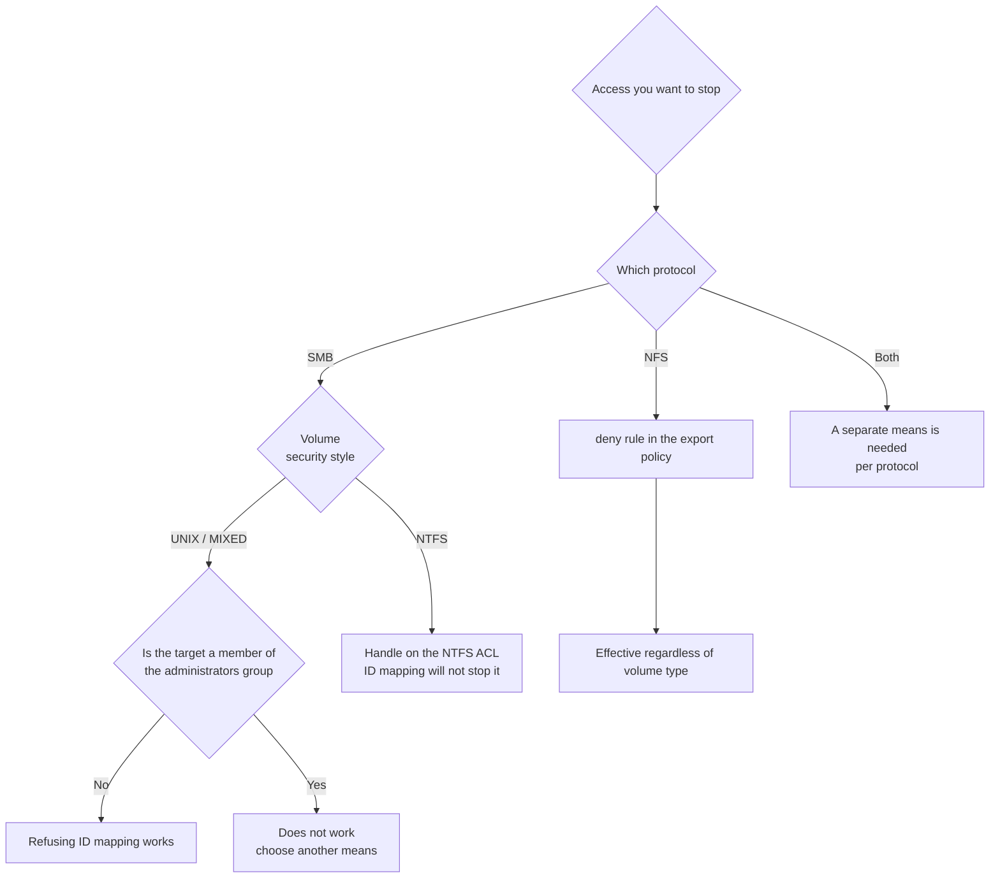

# A volume's security style determines the permission model

<!-- lang-switcher:start -->
🌐 [日本語](../../../../ja/domains/multiprotocol-identity/notes/security-style-and-permission-evaluation.md) | [English](security-style-and-permission-evaluation.md) | [🏠 Repository home](../../../README.md)
<!-- lang-switcher:end -->

[🏠 Repository Top](../../../README.md) | [Domain — Multiprotocol & Identity](../README.md)

This is the English translation. Japanese is authoritative for technical accuracy.

---

## Conclusion

**A volume's security style decides which permission model is used for evaluation.** It does not restrict which protocols can store files.

That distinction matters in one situation in particular. **On a volume with NTFS security style, making UNIX-side ID mapping fail does not stop SMB access.** NTFS style evaluates permissions from the Windows ACL directly, so it never consults the result of win→unix mapping.

On UNIX or MIXED style, win→unix mapping does take part in evaluating SMB access, so refusing the mapping works. **The same operation therefore works or does not work depending on the volume's security style.**

> **Evidence**: `documented` — the behaviour rests on vendor documentation. No measured figures or
> durations are included. Steps for confirming it in your own environment are in the
> "Confirming this in your own environment" section. **Confirm before applying any of it.**

---

## Where the problem sits

Amazon FSx for NetApp ONTAP can serve NFS and SMB from the same volume. Which user can reach which file is then decided by the combination of two things:

1. The volume's security style (UNIX / MIXED / NTFS)
2. ID mapping (win→unix / unix→win)

Reading security style as "which protocols may store data here" leads to a wrong permission design. What it actually decides is **which kind of permission is used for evaluation**.

The dangerous case is choosing mapping refusal as a means of cutting off access. Verify it on a UNIX-style volume, apply the same procedure to an NTFS-style volume, and **you will conclude that access is blocked when it is not.**

---

## Security style and permission evaluation

| Security style | Used for evaluation | Can refusing ID mapping stop SMB? |
|---|:---|:---:|
| UNIX | Mapped UID / GID | Yes |
| MIXED | The model of whichever protocol set permissions last | Yes |
| NTFS | The Windows NTFS ACL | **No** |

MIXED does not mean "both apply". It means **evaluation follows the model of whichever side set permissions most recently**. The evaluation model can therefore change during operation, which makes an intended state hard to hold.

### One further exception

Members of the group named in `FileSystemAdministratorsGroup` (usually `Domain Admins`) are unaffected by this class of blocking. They are evaluated with storage-administrator-equivalent privileges.

**When verifying that access is blocked, always test with an ordinary user who is not in the administrators group.** Testing with an administrator account produces a false "it does not work" conclusion.

---

## Decision flow



---

## Confirming this in your own environment

**This note is `documented`, based on vendor documentation. Confirm the behaviour in your own environment with the steps below.**

### 1. Check the target volume's security style

ONTAP REST API:

```http
GET /api/storage/volumes?fields=name,nas.security_style
```

ONTAP CLI:

```text
volume show -vserver <svm> -fields volume,security-style
```

For any volume that returns `ntfs`, blocking SMB through ID mapping does not hold.

### 2. Try it as an ordinary user

Prepare one domain user who is not a member of the administrators group, and check whether access succeeds before and after blocking. **A result obtained with a member of `Domain Admins` cannot be used to verify blocking.**

### 3. Record the result and promote the tier

Once you reproduce it in your own environment, this repository's convention allows promoting the tier to `verified`. Three things are required for that:

| What to record | Why |
|---|---|
| ONTAP version | The behaviour may depend on the version |
| The volume's security style and configuration | The conclusion is tied to that condition |
| The group membership of the account used | Rules out a false result caused by administrator-group membership |

See [Evidence classification policy](../../../evidence-policy.md) for details.

---

## What can and cannot be stopped

A table for choosing a means of blocking. Constraints on the recommended options are stated alongside.

| Means | Where it is effective | Constraints / considerations |
|---|---|---|
| deny rule in an NFS export policy | NFS. Independent of the volume's security style | NFS only. No effect on SMB |
| Refusing ID mapping | SMB. UNIX / MIXED style only | No effect on NTFS style. No effect on members of the administrators group |
| Changing the NTFS ACL | SMB, including NTFS style | ACL ownership moves to the Windows side. Change history is tracked in a separate system |
| Disabling the account in Active Directory | Stops at authentication, so it is broadly effective | The blast radius is not confined to this system. Knock-on effects elsewhere must be checked |

---

## Common misconceptions

| Misconception | Reality |
|---|---|
| Security style decides which protocols can store data | It decides the model used for permission evaluation, not protocol availability |
| Breaking ID mapping blocks SMB on any volume | Not on NTFS style, because evaluation uses the NTFS ACL |
| MIXED evaluates against both UNIX and NTFS permissions | It evaluates against whichever side set permissions last, and that can change during operation |
| Verifying the block with an administrator account is enough | Members of `FileSystemAdministratorsGroup` are unaffected. Verify with an ordinary user |
| Whether the block worked can be judged from the client display | Client-side caching and reconnection behaviour affect it. Check against the server-side configuration as well |

---

## Primary sources

| Point | Source |
|---|---|
| Security style decides the kind of permission | [NetApp Docs: Security styles and their effects](https://docs.netapp.com/us-en/ontap/smb-admin/security-styles-their-effects-concept.html) |
| NTFS style evaluates with Windows credentials | [NetApp KB: CIFS clients accessing NTFS security style resources](https://kb.netapp.com/on-prem/ontap/da/NAS/NAS-KBs/How_does_name-mapping_work_when_CIFS_clients_access_NTFS_security_style_resources) |
| UNIX style evaluates with the mapped UID / GID | [NetApp KB: name-mapping in a multiprotocol environment](https://kb.netapp.com/on-prem/ontap/da/NAS/NAS-KBs/Understanding_name-mapping_in_a_multiprotocol_environment) |
| Explicitly refusing a mapping | [NetApp Docs: Create name mappings](https://docs.netapp.com/us-en/ontap/nfs-admin/create-name-mapping-task.html) |

---

## Related documents

- [Domain — Multiprotocol & Identity](../README.md) — this module's hub
- [Domain — Security & Governance](../../security-governance/) — the whole picture of permission design
- [Playbook 02 — Design](../../../playbooks/02-design/) — security style is decided at design time
- [Choosing a migration method](../../../../ja/reference/decision-trees/migration-method.md) — ACL preservation requirements affect the choice
- [Glossary](../../../../ja/reference/glossary/) — definitions of SVM / LIF / name-mapping
- [Evidence classification policy](../../../evidence-policy.md) — how `documented` is treated

---

[🏠 Repository Top](../../../README.md) | [Domain — Multiprotocol & Identity](../README.md)

<!-- lang-switcher:start -->
🌐 [日本語](../../../../ja/domains/multiprotocol-identity/notes/security-style-and-permission-evaluation.md) | [English](security-style-and-permission-evaluation.md) | [🏠 Repository home](../../../README.md)
<!-- lang-switcher:end -->
