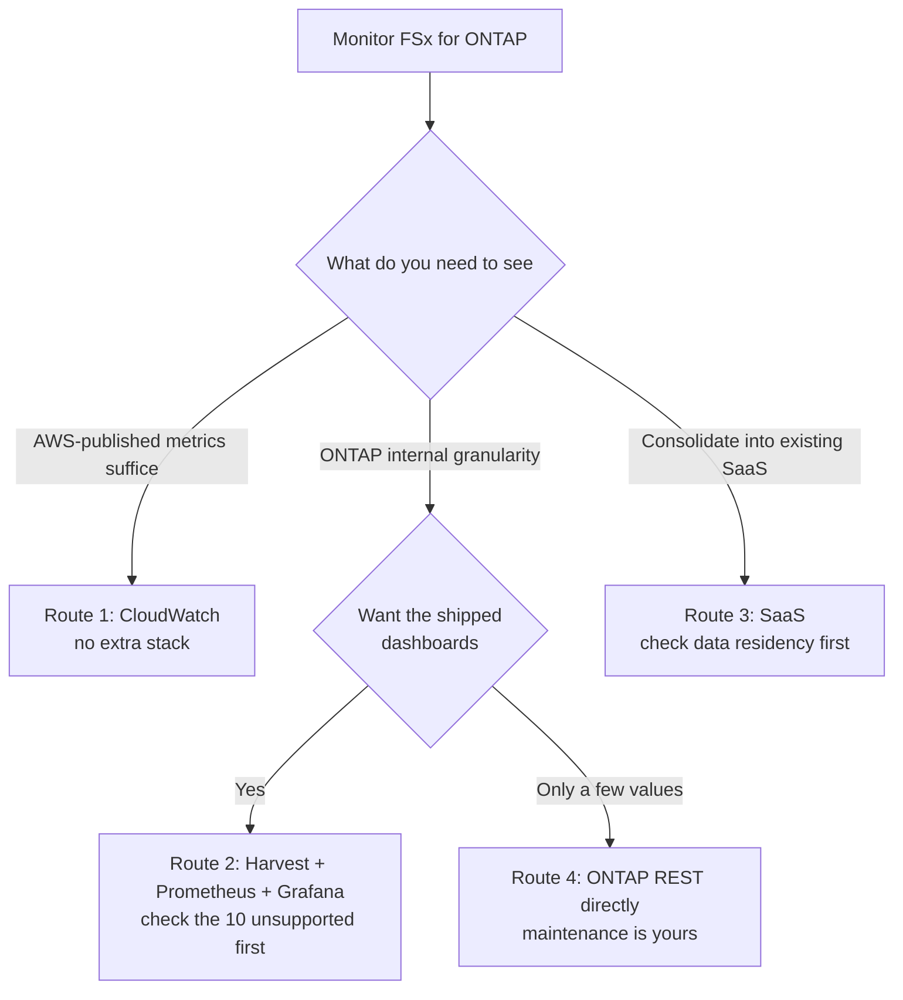

# Domain — Observability

<!-- lang-switcher:start -->
🌐 [日本語](../../../ja/domains/observability/README.md) | [English](README.md) | [🏠 Repository home](../../README.md)
<!-- lang-switcher:end -->

---

Covers **how to choose a collection route** when monitoring Amazon FSx for NetApp ONTAP. What to monitor and where to set thresholds belongs to [Operate](../../playbooks/05-operate/); how throughput and latency are determined belongs to [Performance](../performance/). This module only covers which route the values come through.

Implementation of each route (templates, per-vendor integrations, building the collection stack) lives in [fsxn-observability-integrations](https://github.com/Yoshiki0705/fsxn-observability-integrations). **This module answers "which one to choose", not "how to build it".**

---

## Questions this module answers

| # | Question | Notes |
|---|---|---|
| 1 | Which collection route to choose | [Monitoring route decision tree](../../../ja/reference/decision-trees/observability-route.md) (日本語) |
| 2 | What each route trades away | [Monitoring route comparison](../../../ja/reference/comparison/observability-routes.md) (日本語) |
| 3 | Whether the on-premises Grafana dashboards carry over | [On-premises dashboards do not carry over](../../../ja/domains/observability/notes/on-prem-dashboards-do-not-transfer.md) (日本語) |
| 4 | What operational load Harvest adds once chosen | [Harvest has no remote_write](../../../ja/domains/observability/notes/harvest-has-no-remote-write.md) (日本語) |
| 5 | What changes when spanning accounts or sites | [Cross-account is a network problem, not an IAM one](../../../ja/domains/observability/notes/cross-account-is-a-network-problem.md) (日本語) |
| 6 | Which conditions narrow the choice before you make it | [Route choice is bounded by access and authentication](../../../ja/domains/observability/notes/route-choice-is-bounded-by-access-and-auth.md) (日本語) |
| 7 | What operational risk monitoring itself introduces | [The number of monitored targets sets the blast radius of a lockout](../../../ja/domains/observability/notes/harvest-has-no-remote-write.md#ロック時の影響範囲を決める収集対象数) (日本語) |

---

## Choosing a route

**There is no single recommended route.** The first split is what you need to see.

**The same content is also given as a table below**, so the decision is available where the diagram does not render.

| What you need to see | Additional split | Route |
|---|---|---|
| AWS-published metrics suffice | — | Route 1 (CloudWatch) |
| ONTAP internal granularity | Want the shipped dashboards | Route 2 (Harvest + Prometheus + Grafana) |
| ONTAP internal granularity | Only a few values | Route 4 (ONTAP REST directly) |
| Consolidate into existing SaaS | Check data residency first | Route 3 (SaaS) |

### The four routes at a glance

| Route | Suits | Trade-off |
|---|---|---|
| Amazon CloudWatch metrics + dashboards | AWS-native. No extra stack. Ends at IAM | ONTAP internal granularity is not exposed. Latency is available as an average only |
| NetApp Harvest + Prometheus + Grafana | ONTAP internal granularity. Shipped dashboards | Adds a collection stack to operate. **Some dashboards are unavailable.** Amazon Managed Service for Prometheus needs one extra hop |
| SaaS observability (Datadog / Splunk / Elastic and others) | Reuses existing investment. Logs and metrics in one place | Ingestion billing. **Data leaves the VPC.** Residency needs checking |
| ONTAP REST directly (self-built) | Exactly the values you want. No intermediate layer | Building and maintaining it is yours. Dashboards too |

**Which condition leads to which route is in the [decision tree](../../../ja/reference/decision-trees/observability-route.md) (日本語); the full trade-offs and the "how to choose" section are in the [comparison](../../../ja/reference/comparison/observability-routes.md) (日本語).**

---

## Structure

| Directory | Contents |
|---|---|
| [`notes/`](../../../ja/domains/observability/notes/) | Smallest unit of knowledge. One file = one concern. Frontmatter carries the `evidence` tier (日本語) |
| [`checklists/`](../../../ja/domains/observability/checklists/) | Checklists for field use. [Route selection checklist](../../../ja/domains/observability/checklists/route-selection.md) (日本語) |

---

## How to read this

Always check the `evidence` field in each note's frontmatter.

| Tier | Meaning |
|---|---|
| `verified` | Reproduced by the author in the stated environment. `verified_on` gives the date |
| `documented` | Stated in vendor / AWS documentation. `source` gives the reference |
| `field-observation` | Observed once in the field, not reproduced. Do not generalize |
| `hypothesis` | Reasoned expectation, untested |

**Every note in this module is `documented`.** The claims are confirmed against primary sources, but **they include no measurement by the author.** The "verify in your own environment" section of each note is written as steps for the reader to run.

See the [Evidence Policy](../../evidence-policy.md) for the full criteria.

---

## Common misconceptions

| Misconception | Actually |
|---|---|
| The on-premises Grafana dashboards work as they are | **10 are unsupported and 8 are disabled by default.** The absence of Health and Headroom affects operational design |
| Harvest can send straight to Amazon Managed Service for Prometheus | **It has no remote_write.** A scraper plus SigV4 adds one hop |
| Cross-account monitoring is an IAM configuration | **The target is the ONTAP management LIF, so it is a network reachability problem.** It is not an AWS API |
| Cross-platform is an extension of cross-account | **The design changes in kind.** It becomes a distributed layout with a collector at each site |
| Amazon Managed Grafana can be embedded in a company portal | **It does not support anonymous access.** IdP-initiated login is unsupported too |
| ZAPI is deprecated, so migrating to REST is mandatory | **End of availability was postponed indefinitely.** The reason to prefer REST is feature coverage, not deprecation |
| There is one official sizing guideline | **The sources disagree.** You have to settle it against your own target count and metric count |
| Adding monitoring is read-only, so it is safe | **It authenticates as the admin account.** More targets widen the blast radius of a lockout |

---

## Related

- [Browse by lifecycle](../../navigation.md#lifecycle-axis--playbooks)
- [Operate](../../playbooks/05-operate/) — what to monitor and where thresholds go
- [Performance](../performance/) — how throughput and latency are determined
- [Comparison Matrices](../../../ja/reference/comparison/) (日本語)
- [Navigation Guide](../../navigation.md)
- [Glossary](../../../ja/reference/glossary/) (日本語)

---

<!-- lang-switcher:start -->
🌐 [日本語](../../../ja/domains/observability/README.md) | [English](README.md) | [🏠 Repository home](../../README.md)
<!-- lang-switcher:end -->
