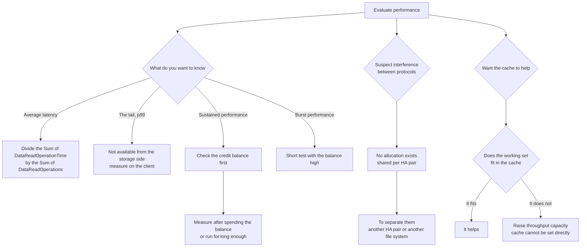

# p99 cannot be read from the CloudWatch metrics

[🏠 Repository home](../../../README.md) | [Domain — Performance](../README.md)

---

## Conclusion

**Volume latency is available from the CloudWatch metrics only as an average.**

`DataReadOperationTime` is the **total time** spent on read operations, and its valid statistic is `Sum`. `DataReadOperations` is the **total count** of operations, and its valid statistic is `Sum` as well.

So latency is derived as **total time divided by total count**, which **is structurally the average over that period.** The tail (p99) is not in it.

**If p99 is needed, it has to be measured on the client.** No amount of detail in the storage-side metrics produces it.

And one more thing. **A benchmark is affected by the burst credit balance.** A file system accumulates credits while it runs below its baseline and spends them to exceed the baseline. **Re-run the same test with a depleted balance and a different figure comes out.**

> **Evidence**: `documented` — the metrics' valid statistics, how the performance characteristics are determined, and the credit mechanism are based on AWS documentation.
> **No measured figures are included.** The procedure for measuring is in [Verify in your own environment](#verify-in-your-own-environment).

---

## The three things that determine performance

A client reaches the file server through an ENI. **Each file server has a fast in-memory cache and an NVMe cache.** Behind them are the SSD disks.

| Performance characteristic | What determines it |
|---|---|
| Network I/O performance (client to file server, in total) | **Throughput capacity only** |
| **The size of the in-memory and NVMe caches** | **Throughput capacity only** |
| Disk I/O performance (file server to disk) | **The combination of throughput capacity and SSD IOPS** |

**There is no setting that specifies cache size directly.** Cache size is determined by throughput capacity, so "we want more cache" is the same statement as "raise throughput capacity".

That the ceiling itself varies by generation, configuration and Region is in [Throughput is not set by one value](where-throughput-is-determined-and-shared.md).

---

## When the cache helps

**What lands in the cache is the active working set.** So the condition reduces to one thing.

**Whether the working set fits in the cache size that throughput capacity determines.**

| Workload | Does the cache help |
|---|---|
| Repeated access to the same data, small in total | Yes |
| A wide access range, reading different data each time | No. The working set does not fit |
| A working set larger than the cache | **Either raise throughput capacity or design the range down** |

Accelerating reads against another file system or a remote site is FlexCache's territory, with different conditions. It is in [When FlexCache helps](../../../../ja/domains/data-utilization/notes/reaching-data-without-copies.md#flexcache-が効く条件) (日本語).

Note also that **adding an HA pair enables the NVMe cache by default on the new nodes, and disabling it is recommended for throughput-oriented workloads.** The constraint is in [What happens when you add an HA pair](../../../playbooks/02-design/notes/deployment-type-is-decided-once.md#what-happens-when-you-add-an-ha-pair).

---

## How bandwidth is shared between protocols

**There is no per-protocol allocation.**

Network I/O performance is defined as the **total** between clients and the file server. And `NetworkThroughputUtilization` covers **all traffic, including background tasks** (SnapMirror, tiering, backup).

| Unit of sharing | Detail |
|---|---|
| Network bandwidth | **One HA pair's worth.** NFS, SMB, iSCSI and S3 Access Points draw on the same budget |
| Background tasks | They draw on the same budget |
| Explicit priority | **Client traffic takes precedence over background tasks** — that one point only |

**So "NFS is slow because of SMB" can happen.** And no setting separates them. Where separation is required, the design decision is **splitting volumes onto another HA pair or onto another file system.** The unit of sharing is in [The unit of sharing is the HA pair](where-throughput-is-determined-and-shared.md#the-unit-of-sharing-is-the-ha-pair).

---

## The burst and credit mechanism that breaks a benchmark

**File-based workloads are spiky.** Short periods of high I/O with idle time between them.

To match that, FSx for ONTAP provides **a baseline speed sustainable around the clock plus the ability to burst above it for a limited time.** Both network I/O and disk I/O are covered.

**Bursting is managed by a network I/O credit mechanism.** Credits are allocated on average utilisation, and **a file system accumulates them while its throughput and IOPS run below the baseline.**

### The effect on a benchmark

| Situation | What is measured |
|---|---|
| Running a short test with credits well accumulated | **Burst performance.** Not sustained performance |
| Running the same test after credits are spent | Baseline performance |
| Not recording the balance | **It does not reproduce.** The same procedure yields a different figure |

**The balance is visible in `FileServerDiskThroughputBalance` and `FileServerDiskIopsBalance`.** Unlike the other metrics, these two are emitted at **five-minute intervals**. The granularity list is in [Monitoring granularity and retention](../../../playbooks/05-operate/notes/monitoring-fails-on-averages.md#monitoring-granularity-and-retention).

### How large the step is, and how long until it falls

**The table above is the mechanism; it never carried the size.** The measurement is in the
[cited record](https://github.com/Yoshiki0705/S3-Burst-on-ONTAP-Files/blob/main/docs/ja/verification/throughput-capacity-burst-and-baseline.md)
(日本語) — second generation `SINGLE_AZ_2`, provisioned 1,536 MBps, 1 MiB sequential read over a
1,800 GiB file.

| Observation | Value |
|---|---|
| The step | **2.0x** (2,882 MB/s → 1,439 MB/s) |
| Time until it falls | **about 27 minutes from a full balance** |
| Recovery to full | about 30 minutes idle |
| Reproducibility of a short (~2 minute) window | 0.16% across two runs. **What reproduces is the burst figure** |

**The provisioned value is neither figure.** At 1,536 both 2,882 and 1,439 were observed, so
**the provisioned value cannot be used as the read ceiling.**

**The fall is a step, not a decay.** It completed within one 10-second interval. **Extending a test
slightly moves nothing, and then the figure is simply different past the boundary.** The procedure
above — lengthen the test until the number drops — assumes that shape.

**Sizing from a five-minute measurement errs in one direction: overestimation.** It starts from
burst, so the figure to take is the one after the balance is spent. Which one applies is decided by
the shape of the workload.

| Workload shape | Figure to use |
|---|---|
| Work under 30 minutes, with gaps over 30 minutes between runs | the burst side |
| Continuous, or gaps under 30 minutes | the baseline side |
| Cannot be determined | **the baseline side** — the one that does not overestimate |

> **The 27 minutes is a single observation.** The consumption and recovery slopes are each linear
> over four or more points, but **the duration itself was not measured twice.** Reproducibility is
> a statement about the slopes, not about the duration.

### The absent balance metric on a configuration with no burst

**Raising the provisioned value removes the burst allowance itself.** The published disk-burst
column reads "—" from 3,072 upward, and the cited record measures **no decay over 30 minutes** at
6,144 — the step seen at 1,536 is absent.

**And that turns into a question of how to read CloudWatch.**

| Configuration | `FileServerDiskThroughputBalance` |
|---|---|
| 1,536 (allowance present) | 99% → 0% over 27 minutes |
| **6,144 (no allowance)** | **not a single data point is published** |

**"Returns 0" and "returns no records" have to be read differently.** A spent balance and an absent
allowance are different states, and **reading absence as zero produces a dashboard that reports
permanent exhaustion.** The NVMe cache records take the same shape.

**Write it down as a trade.** A higher provisioned value buys a stable figure and **gives up the
room to absorb a short peak.** The cited record notes that the burst at 1,536 (3,125) is close to
the baseline at 3,072 (3,072). **The boundary itself, 3,072, is not measured.**

---

## What a reproducible benchmark requires

**"The same procedure" is not enough. It has to start from the same state.**

| What to record | Why |
|---|---|
| **The credit balance before the test** | **It decides whether burst or sustained performance was measured** |
| The test duration | A short test measures burst |
| Region, generation, deployment type | The ceiling itself changes |
| The throughput capacity and SSD IOPS settings | They bear on all three performance characteristics |
| HA pair count and volume style (FlexVol / FlexGroup) | A FlexVol cannot exceed one pair |
| Tiering policy and cooling period | Whether reads come from SSD or the capacity pool changes |
| Background tasks running at the same time | They use the same bandwidth |
| The client-side measurement (**including the tail**) | The storage side yields only an average |
| The statistic used (Average / Maximum) | An average hides saturation |

**The last two rows are a point that recurs throughout this repository.** The reasoning is in [Monitoring fails on averages](../../../playbooks/05-operate/notes/monitoring-fails-on-averages.md).

---

## Measurement flow

---

## Verify in your own environment

**The first thing to establish is whether the figure in front of you is an average or a tail.**

| # | Step | What it establishes |
|---|---|---|
| 1 | Derive average latency as `DataReadOperationTime` ÷ `DataReadOperations` | **That this is an average.** The tail is not in it |
| 2 | Measure the latency distribution on the client and derive p99 | **The gap against the storage-side average.** The tail, measured |
| 3 | Record `FileServerDiskThroughputBalance` and `FileServerDiskIopsBalance` before the test | Whether you are measuring burst or sustained |
| 4 | Re-run the same test with the balance depleted and compare | **How much the credits contribute.** The basis for reproducibility |
| 5 | Lengthen the test in stages and find where the figure drops | How long until it falls to the baseline |
| 6 | Estimate the working set size and compare across throughput capacities | Whether it fits in the cache |
| 7 | Load one protocol and observe the other's latency | **Interference between protocols, measured.** Whether separation is needed |
| 8 | Compare periods with background tasks running against periods without | How much the background tasks contribute |

A benchmark that skips steps 3 and 4 **does not reproduce even when the procedure is repeated exactly.** This is the most overlooked point.

Step 2 also separates "the storage is slow" from "the path or the client is slow".

---

## Common misconceptions

| Misconception | Actually |
|---|---|
| p99 is visible in CloudWatch | **Only the form that derives an average from totals is provided.** The tail is measured on the client |
| There is a latency metric | There is a **total** of time and a **total** of counts; you divide them for an average |
| A benchmark reproduces if the procedure is the same | **A different credit balance yields a different figure** |
| A short test shows sustained performance | A short test measures burst. **Measured at 2.0x, and the error is always an overestimate** |
| The provisioned throughput capacity is the read ceiling | **It is not.** At 1,536 both 2,882 and 1,439 were observed. **Neither is the provisioned value** |
| A balance metric reading 0 means exhaustion | **A configuration with no allowance emits no records at all.** Read 0 and absence differently |
| Cache size can be configured | **It is determined by throughput capacity.** It cannot be set directly |
| The cache helps every workload | It helps when the working set fits |
| Bandwidth can be allocated per protocol | **No allocation exists.** It is shared per HA pair |
| SMB and NFS do not affect each other | They draw on the same budget. Interference can happen |
| Background tasks use separate bandwidth | The same bandwidth, though client traffic takes precedence |
| Disk performance is determined by SSD IOPS alone | It is **the combination of throughput capacity and SSD IOPS** |

---

## Primary sources referenced

| Point | Source |
|---|---|
| That `DataReadOperationTime` is a total of time with `Sum` as its valid statistic, and that `DataReadOperations` / `DataWriteOperations` / `MetadataOperations` are totals of counts with `Sum` as their valid statistic | [AWS: Volume metrics](https://docs.aws.amazon.com/fsx/latest/ONTAPGuide/volume-metrics.html) |
| That each file server has an in-memory cache and an NVMe cache; the three performance characteristics; that network I/O and cache size are determined by throughput capacity alone while disk I/O is determined by the combination of throughput capacity and SSD IOPS; that file-based workloads are spiky; bursting and the network I/O credit mechanism; that credits accumulate while running below the baseline | [AWS: Amazon FSx for NetApp ONTAP performance](https://docs.aws.amazon.com/fsx/latest/ONTAPGuide/performance.html) |
| That `NetworkThroughputUtilization` is a ratio against one HA pair's worth and covers all traffic including background tasks | [AWS: Second-generation file system metrics](https://docs.aws.amazon.com/fsx/latest/ONTAPGuide/so-file-system-metrics.html) |
| **The size of the step (2.0x), the ~27 minutes until it falls, the recovery slope, the step shape, and the balance metric being absent at 6,144** (**measured / outside the documentation**; conditions and unmeasured ranges are in the cited record) | [S3-Burst-on-ONTAP-Files: throughput capacity, burst and baseline](https://github.com/Yoshiki0705/S3-Burst-on-ONTAP-Files/blob/main/docs/ja/verification/throughput-capacity-burst-and-baseline.md) (日本語) |
| That `FileServerDiskThroughputBalance` and `FileServerDiskIopsBalance` are emitted at five-minute intervals | [AWS: Monitoring with Amazon CloudWatch](https://docs.aws.amazon.com/fsx/latest/ONTAPGuide/monitoring-cloudwatch.html) |
| That client traffic takes precedence over background tasks | [AWS: Migrating to FSx for ONTAP using NetApp SnapMirror](https://docs.aws.amazon.com/fsx/latest/ONTAPGuide/migrating-fsx-ontap-snapmirror.html) |
| That adding an HA pair enables the NVMe cache by default, and that disabling it is recommended for throughput-oriented workloads | [AWS: Adding high-availability (HA) pairs](https://docs.aws.amazon.com/fsx/latest/ONTAPGuide/adding-HA-pairs.html) |

---

## Related documents

- [Domain — Performance](../README.md) — this module's hub
- [Throughput is not set by one value](where-throughput-is-determined-and-shared.md) — how the ceiling is decided, and sharing per HA pair
- [Monitoring fails on averages](../../../playbooks/05-operate/notes/monitoring-fails-on-averages.md) — choosing the statistic, and granularity
- [When FlexCache helps](../../../../ja/domains/data-utilization/notes/reaching-data-without-copies.md#flexcache-が効く条件) (日本語) — accelerating reads against another file system or a remote site
- [The deployment type is decided once](../../../playbooks/02-design/notes/deployment-type-is-decided-once.md) — HA pairs and the NVMe cache default
- [Tiering defaults differ by how the volume was created](../../../../ja/playbooks/06-optimize/notes/tiering-defaults-differ-by-creation-method.md) (日本語) — the condition that changes where reads come from
- [Evidence Policy](../../../evidence-policy.md)

---

[🏠 Repository home](../../../README.md) | [Domain — Performance](../README.md)

<!-- lang-switcher:start -->
🌐 [日本語](../../../../ja/domains/performance/notes/what-you-cannot-read-from-cloudwatch.md) | [English](what-you-cannot-read-from-cloudwatch.md) | [🏠 Repository home](../../../README.md)
<!-- lang-switcher:end -->
