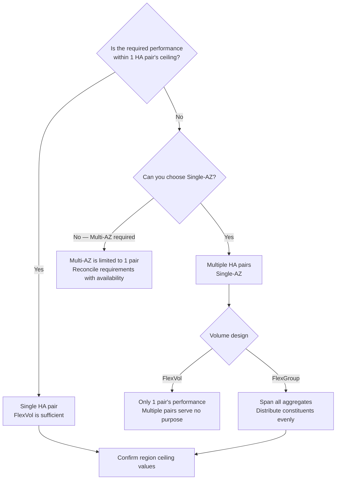

# Throughput is not determined by a single setting

<!-- lang-switcher:start -->
🌐 [日本語](../../../../ja/domains/performance/notes/where-throughput-is-determined-and-shared.md) | [English](where-throughput-is-determined-and-shared.md) | [🏠 Repository home](../../../README.md)
<!-- lang-switcher:end -->

[🏠 Repository Top](../../../README.md) | [Domain — Performance](../README.md)

---

> This is the English translation. Japanese is authoritative for technical accuracy.

---

## Conclusion

"Raising the throughput setting makes things faster" is an insufficient mental model for design. **There are 3 places where throughput is determined and 1 unit where it is shared.**

| What | Where it is determined / shared |
|---|---|
| The ceiling itself | Generation (1st / 2nd), Single-AZ or Multi-AZ, **region** |
| What the setting controls | The throughput setting simultaneously determines network, disk read IOPS, and cache capacity |
| Conditions to reach the ceiling | The throughput setting alone is not enough. **A corresponding SSD capacity and IOPS configuration is required** |
| The unit of sharing | **Per HA pair.** The standby node does not add capacity |

And the most overlooked point: **A FlexVol can only reside on a single aggregate (= 1 HA pair).** Even if you create a file system with 12 HA pairs, placing data in a FlexVol means **you get only 1 pair's worth of performance.** To use multiple pairs under a single namespace, you need FlexGroup.

> **Evidence**: `documented` — based entirely on AWS official documentation.
> **No measured values are included.** Ceiling values represent "the maximum achievable with that configuration" — what your environment actually delivers under your workload is a separate matter. See "[Verify in your own environment](#verify-in-your-own-environment)" for measurement guidance.

---

## The ceiling varies by generation, configuration, and region

| Configuration | HA pairs | Throughput ceiling | SSD IOPS ceiling |
|---|---|---|---|
| 2nd generation Single-AZ | Up to 12 | Up to 72 GBps (6 GBps / pair) | 2,400,000 (200,000 / pair) |
| 2nd generation Multi-AZ | 1 | 6 GBps | 200,000 |
| 1st generation | 1 | 4 GBps | 160,000 |

**1st generation ceilings vary by region.** SSD IOPS of 160,000 and throughput of 4,096 MBps are achievable only in US East (Ohio / N. Virginia), US West (Oregon), and Europe (Ireland). **All other regions are limited to 80,000 IOPS / 2,048 MBps.**

**If you design based on "the documentation says 4 GBps," it halves depending on the region.** Always confirm the value for your region.

Minimum values also require attention. With 2nd generation and 2 or more HA pairs, **the minimum throughput becomes 1,536 MBps per pair**. Adding pairs raises the floor as well.

---

## What the throughput setting actually determines

The throughput setting is not just a bandwidth knob. **It simultaneously determines network, disk read IOPS, and file server cache capacity.**

And **raising the setting alone does not reach the ceiling.** A corresponding configuration is required. The documentation example states that achieving 4 GBps on 1st generation requires **at least 5,120 GiB of SSD capacity and 160,000 SSD IOPS** in the configuration.

| Common bottleneck pattern | What is actually insufficient |
|---|---|
| Raised throughput but nothing changed | SSD capacity or IOPS does not meet the configuration prerequisite |
| Random reads are slow | Workload does not fit in cache. Raising the throughput setting also increases cache capacity |
| Only writes are slow | Writes are mirrored between HA pair nodes. The path differs from reads |

### Changing the setting triggers a non-disruptive failover

Changing the throughput setting causes the **file server to switch over.** Both Single-AZ and Multi-AZ experience automatic failover and failback, typically completing within minutes. For NFS / SMB / iSCSI clients this is transparent, requiring no workload interruption or manual intervention.

However, **changes may be delayed or queued during a maintenance window.** Do not plan operations around the assumption that "raising it immediately will be in time."

---

## The unit of sharing is the HA pair

Each file system consists of one or more HA pairs in an **active-standby configuration**. The preferred file server handles traffic; the other takes over only when the active side becomes unavailable.

**The standby does not add performance.** "2 nodes = 2× performance" is incorrect.

Each HA pair holds **one aggregate**. This directly affects volume design.

| Volume type | Placement | Available performance |
|---|---|---|
| **FlexVol** | Single aggregate (always one) | **Capped at 1 HA pair** |
| **FlexGroup** | Spans multiple aggregates | Sum of configured aggregates |

FlexGroup places "constituents" on each aggregate. **To achieve full performance, the FlexGroup must span all aggregates with an even number of constituents per aggregate** (recommended: 8). Imbalance produces proportionally uneven performance.

After adding HA pairs, **you must expand the FlexGroup to the new aggregates — otherwise the additional capacity is unused.** Simply adding pairs does not speed up existing volumes.

> **Design note**: When creating FlexVol on a file system with multiple HA pairs, the Amazon FSx console cannot be used — AWS CLI / API / NetApp management tools are required. **Working exclusively through the console effectively forces FlexGroup** — which is often the right direction, but confirm it is an intentional choice. <!-- allow:naming - "Amazon FSx console" is the official name covering all file system types -->

---

## Decision flow

---

## Verify in your own environment

**Ceiling values represent "the achievable maximum" — not what your environment delivers.**

| # | Step | What it verifies |
|---|---|---|
| 1 | Confirm the ceiling values for your region | The design ceiling. 1st generation halves by region |
| 2 | Check the target volume's type and aggregate placement | If FlexVol, 1 pair is the ceiling |
| 3 | Measure throughput, IOPS, and latency with Amazon CloudWatch | If pinned to provisioned values, you are being throttled |
| 4 | Measure with a read/write ratio and file sizes close to your workload | Results change significantly depending on whether data fits in cache |
| 5 | Record measurement conditions (generation / region / throughput setting / SSD capacity / volume type) | Provides a comparison baseline for next time |

Volume aggregate placement can be confirmed via ONTAP CLI, REST API, or the Amazon FSx API `AggregateConfiguration`. <!-- allow:naming - "Amazon FSx API" is the official name covering all file system types -->

**When performance is not meeting expectations, start by comparing against provisioned values.** If measured values are close to provisioned values, the configuration is not the bottleneck — the setting is the ceiling.

---

## Common misconceptions

| Misconception | Reality |
|---|---|
| Raising the throughput setting reaches the ceiling | A corresponding SSD capacity and IOPS configuration is required. The setting alone does not get you there |
| Documentation ceiling values are the same across all regions | 1st generation IOPS and throughput ceilings halve depending on region |
| An HA pair has 2 nodes so performance doubles | Active-standby configuration. **The standby does not add performance** |
| Adding HA pairs speeds up existing volumes | FlexVol is fixed to 1 aggregate. Unless you expand FlexGroup to new aggregates, they remain unused |
| Using FlexGroup automatically delivers full performance | It must span all aggregates with evenly distributed constituents |
| Adding HA pairs only increases cost by the capacity portion | **The minimum throughput also rises** (1,536 MBps per pair with 2nd generation, 2+ pairs) |
| Throughput changes are non-disruptive so can be done casually | The file server switches over, triggering failover. Changes may be delayed during maintenance windows |

---

## Primary sources referenced

| Topic | Source |
|---|---|
| Active-standby configuration, HA pair counts and ceilings per generation, each pair has 1 aggregate | [AWS: Managing high-availability (HA) pairs](https://docs.aws.amazon.com/fsx/latest/ONTAPGuide/HA-pairs.html) |
| IOPS / throughput ceilings by region, minimum throughput, recommended SSD utilization | [AWS: Quotas](https://docs.aws.amazon.com/fsx/latest/ONTAPGuide/limits.html) |
| What the throughput setting determines, configuration required to reach ceiling, failover on change | [AWS: Managing throughput capacity](https://docs.aws.amazon.com/fsx/latest/ONTAPGuide/managing-throughput-capacity.html) |
| FlexVol is always on a single aggregate, FlexGroup constituents | [AWS: AggregateConfiguration](https://docs.aws.amazon.com/fsx/latest/APIReference/API_AggregateConfiguration.html) |
| FlexGroup should span all aggregates evenly, expansion after adding HA pairs | [AWS: Moving volumes between aggregates](https://docs.aws.amazon.com/fsx/latest/ONTAPGuide/moving-fg-volumes.html) |
| Differences in FlexVol / FlexGroup creation methods with multiple HA pairs | [AWS: Creating volumes](https://docs.aws.amazon.com/fsx/latest/ONTAPGuide/creating-volumes.html) |

---

## Related documents

- [Domain — Performance](../README.md) — This module's hub
- [Domain — Cost](../../cost/) — Adding HA pairs also raises minimum throughput
- [Playbook 02 — Design](../../../playbooks/02-design/) — Generation, AZ configuration, and volume type are design-time decisions
- [Pre-production review](../../../../ja/playbooks/04-build/checklists/pre-production-review.md) — Throughput and SSD utilization verification items
- [Limits and quotas](../../../../ja/reference/limits/) — Ceiling values with sources and verification dates
- [Evidence classification policy](../../../evidence-policy.md)

---

[🏠 Repository Top](../../../README.md) | [Domain — Performance](../README.md)

<!-- lang-switcher:start -->
🌐 [日本語](../../../../ja/domains/performance/notes/where-throughput-is-determined-and-shared.md) | [English](where-throughput-is-determined-and-shared.md) | [🏠 Repository home](../../../README.md)
<!-- lang-switcher:end -->
