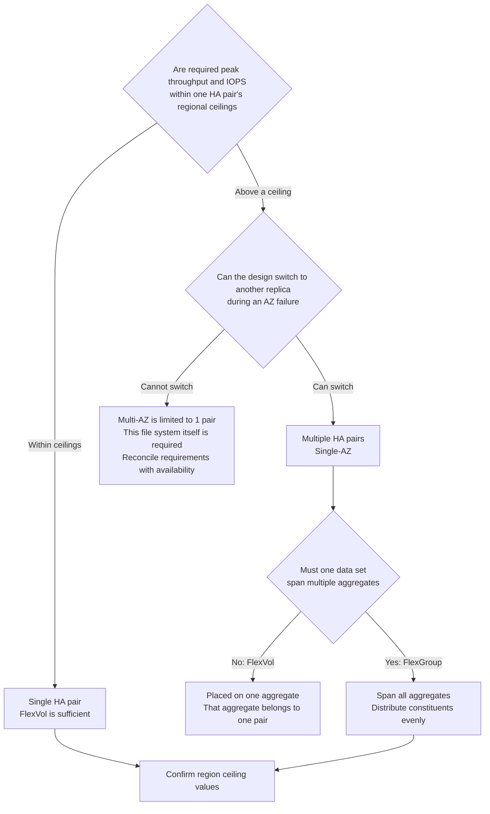

# Throughput is not determined by a single setting

[🏠 Repository Top](../../../README.md) | [Domain — Performance](../README.md)

---

> This is the English translation. Japanese is authoritative for technical accuracy.

---

## Conclusion

"Raising the throughput setting makes things faster" is an insufficient mental model for design. **There are 3 places where throughput is determined and 1 unit where it is shared.**

| What | Where it is determined / shared |
|---|---|
| The ceiling itself | Generation (1st / 2nd), Single-AZ or Multi-AZ, **region** |
| What the setting controls | The throughput setting simultaneously determines network, disk read IOPS, and cache capacity |
| Conditions to reach the ceiling | The throughput setting alone is not enough. **A corresponding SSD capacity and IOPS configuration is required** |
| The unit of sharing | **Per HA pair.** The standby node does not add capacity |

And the most overlooked point: **The Amazon FSx API specifies that each HA pair has one aggregate and a FlexVol's `AggregateConfiguration` always contains one aggregate.** The file system as a whole can scale to 12 HA pairs on second-generation Single-AZ, but a FlexVol's placement and performance path belong to one HA pair. FlexGroup is required to use multiple pairs under one namespace. File systems using block protocols have a separate supported ceiling of 6 HA pairs.

> **Evidence**: `documented` — based entirely on AWS official documentation.
> **No measured values are included.** Ceiling values represent "the maximum achievable with that configuration" — what your environment actually delivers under your workload is a separate matter. See "[Verify in your own environment](#verify-in-your-own-environment)" for measurement guidance.

---

## The ceiling varies by generation, configuration, and region

| Configuration | HA pairs | Throughput ceiling | SSD IOPS ceiling |
|---|---|---|---|
| 2nd generation Single-AZ | Up to 12 | Up to 72 GBps (6 GBps / pair) | 2,400,000 (200,000 / pair) |
| 2nd generation Multi-AZ | 1 | 6 GBps | 200,000 |
| 1st generation | 1 | 4 GBps | 160,000 |

**1st generation ceilings vary by region.** SSD IOPS of 160,000 and throughput of 4,096 MBps are achievable only in US East (Ohio / N. Virginia), US West (Oregon), and Europe (Ireland). **All other regions are limited to 80,000 IOPS / 2,048 MBps.**

**If you design based on "the documentation says 4 GBps," it halves depending on the region.** Always confirm the value for your region.

Minimum values also require attention. With 2nd generation and 2 or more HA pairs, **the minimum throughput becomes 1,536 MBps per pair**. Adding pairs raises the floor as well.

---

## What the throughput setting actually determines

The throughput setting is not just a bandwidth knob. **It simultaneously determines network, disk read IOPS, and file server cache capacity.**

And **raising the setting alone does not reach the ceiling.** A corresponding configuration is required. The documentation example states that achieving 4 GBps on 1st generation requires **at least 5,120 GiB of SSD capacity and 160,000 SSD IOPS** in the configuration.

| Common bottleneck pattern | What is actually insufficient |
|---|---|
| Raised throughput but nothing changed | SSD capacity or IOPS does not meet the configuration prerequisite |
| Random reads are slow | Workload does not fit in cache. Raising the throughput setting also increases cache capacity |
| Only writes are slow | Writes are mirrored between HA pair nodes. The path differs from reads |

### Two published statements for second-generation writes, and where they disagree (cited)

**A write estimate changes depending on which published statement you apply.** The performance page
gives a general rule for second generation — reads get the full throughput setting, writes one third
of it — and separately lists **6,144 MBps as an exception**, with Single-AZ write given as
**1,024 MBps**.

**In a sibling repository's measurements, which statement matches inverts with the configured
value.** This is a citation, not a measurement of ours.

| Configured | Measured (sustained, median) | General rule (÷3) | Exception table (1,024) |
|---|---|---|---|
| 1,536 MBps | 1,333 MB/s | 512 → **off by 2.60×** | 1.30× |
| 6,144 MBps | 2,097 MB/s | 2,048 → **within 2.4%** | 2.05× |

**The general rule matches at the value the page calls an exception, and misses by 2.60× where the
general rule should apply.** Source:
[the cited measurement record](https://github.com/Yoshiki0705/S3-Burst-on-ONTAP-Files/blob/main/docs/ja/verification/throughput-capacity-burst-and-baseline.md).

**One design consequence: do not build a write estimate from either statement alone.** At 1,536 MBps
four independent measurements fall within 1,270–1,350 MB/s, so this is not run-to-run variation.

> **Stage**: `documented` (cited measurement from a sibling repository — `ap-northeast-1`, Single-AZ,
> 1 HA pair, ONTAP 9.18.1P3D1, non-compressible data, efficiency disabled). **Neither the cited
> record nor this repository decides which statement is correct.**
> **Do not cite this as "twice the published figure"** — the multiple depends on which statement you
> put in the denominator. **Multi-AZ and two or more HA pairs are unmeasured.**

### Changing the setting triggers a non-disruptive failover

Changing the throughput setting causes the **file server to switch over.** Both Single-AZ and Multi-AZ experience automatic failover and failback, typically completing within minutes. For NFS / SMB / iSCSI clients this is transparent, requiring no workload interruption or manual intervention.

However, **changes may be delayed or queued during a maintenance window.** Do not plan operations around the assumption that "raising it immediately will be in time."

---

## The unit of sharing is the HA pair

Each file system consists of one or more HA pairs in an **active-standby configuration**. The preferred file server handles traffic; the other takes over only when the active side becomes unavailable.

**The standby does not add performance.** "2 nodes = 2× performance" is incorrect.

Each HA pair holds **one aggregate**. This directly affects volume design.

| Volume type | Placement | Available performance |
|---|---|---|
| **FlexVol** | Single aggregate (the API response always has one entry) | **Path through the 1 HA pair that owns that aggregate** |
| **FlexGroup** | Spans multiple aggregates | Sum of configured aggregates |

FlexGroup places "constituents" on each aggregate. **To achieve full performance, the FlexGroup must span all aggregates with an even number of constituents per aggregate** (recommended: 8). Imbalance produces proportionally uneven performance.

After adding HA pairs, **you must expand the FlexGroup to the new aggregates — otherwise the additional capacity is unused.** Simply adding pairs does not speed up existing volumes.

> **Design note**: When creating FlexVol on a file system with multiple HA pairs, the Amazon FSx console cannot be used — AWS CLI / API / NetApp management tools are required. **Working exclusively through the console effectively forces FlexGroup** — which is often the right direction, but confirm it is an intentional choice.

---

## How it scales when you add readers

**A purchased ceiling and an elastic one behave in opposite directions as clients are added.** A sibling repository ran the same configuration from one host, then from two simultaneously.

| Target | 1 host | 2 hosts combined | Per host |
|---|---|---|---|
| FSx for ONTAP S3 Access Point read | 585.3 MB/s | **592.5 MB/s** | **Halved** |
| Amazon S3 read | 649.3 MB/s | **1,308.9 MB/s (2.02×)** | Essentially unchanged |

**The FSx for ONTAP side divides the capacity that was purchased, so adding readers does not raise the total.** On the Amazon S3 side the total doubles and the per-host figure holds. **The 649 MB/s visible from a single host was that client's ceiling, not S3's.**

**The unit of capacity planning differs.** For FSx for ONTAP you plan per file system; for an elastic service you plan against the clients' own bandwidth. **This is not about which is faster — it is that they grow in opposite directions.** It is the previous section's "the unit of sharing is the HA pair" seen from the number of readers.

**And the write setting cannot be used to estimate reads.** On the same 128 MBps configuration, an 8 MiB write at a concurrency of 16 reached 129.5 MB/s — the setting — while the read reached **579.3 MB/s**, **4.5× what was purchased.** Reads hit the cache and network ceilings instead, so the setting is not their limit ([A single connection measures the client](a-single-connection-measures-the-client.md#the-two-stage-ceiling)).

**Measurement conditions**: `ap-northeast-1`, `SINGLE_AZ_1` / 128 MBps, 8 MiB objects, concurrency 16, zero 503 responses at every point. Source: [S3 Files compared with this architecture](https://github.com/Yoshiki0705/S3-Burst-on-ONTAP-Files/blob/main/docs/ja/verification/s3files-vs-flexcache.md) (日本語). **Not re-measured here.**

**The cited record covers one host and two, and nothing beyond.** Three or more hosts, directions other than read, and configurations other than 128 MBps are not in it. **Do not read it as a general rule that throughput halves per added client** — what was observed is a single point at two.

---

## Decision flow

---

## Verify in your own environment

**Ceiling values represent "the achievable maximum" — not what your environment delivers.**

| # | Step | What it verifies |
|---|---|---|
| 1 | Confirm the ceiling values for your region | The design ceiling. 1st generation halves by region |
| 2 | Check the target volume's type and aggregate placement | Whether a FlexVol is placed on one HA pair's aggregate |
| 3 | Measure throughput, IOPS, and latency with Amazon CloudWatch | If pinned to provisioned values, you are being throttled |
| 4 | Measure with a read/write ratio and file sizes close to your workload | Results change significantly depending on whether data fits in cache |
| 5 | Record measurement conditions (generation / region / throughput setting / SSD capacity / volume type) | Provides a comparison baseline for next time |

Volume aggregate placement can be confirmed via ONTAP CLI, REST API, or the Amazon FSx API `AggregateConfiguration`.

**When performance is not meeting expectations, start by comparing against provisioned values.** If measured values are close to provisioned values, the configuration is not the bottleneck — the setting is the ceiling.

---

## Common misconceptions

| Misconception | Reality |
|---|---|
| Raising the throughput setting reaches the ceiling | A corresponding SSD capacity and IOPS configuration is required. The setting alone does not get you there |
| Documentation ceiling values are the same across all regions | 1st generation IOPS and throughput ceilings halve depending on region |
| An HA pair has 2 nodes so performance doubles | Active-standby configuration. **The standby does not add performance** |
| Adding HA pairs speeds up existing volumes | A FlexVol is placed on one aggregate. Unless you expand FlexGroup to new aggregates, the added pairs remain unused by that volume |
| Using FlexGroup automatically delivers full performance | It must span all aggregates with evenly distributed constituents |
| Adding HA pairs only increases cost by the capacity portion | **The minimum throughput also rises** (1,536 MBps per pair with 2nd generation, 2+ pairs) |
| Throughput changes are non-disruptive so can be done casually | The file server switches over, triggering failover. Changes may be delayed during maintenance windows |
| Adding readers raises the combined throughput | **They divide the capacity that was purchased.** Measured across two hosts, the total barely moved and the per-host figure halved — the opposite of an elastic service |
| The MBps you set is the read ceiling | **A 128 MBps configuration measured 579.3 MB/s on read, 4.5× the setting.** The setting is the ceiling on the write side |
| Second-generation writes can be estimated as one third of the setting | **The published spec carries a general rule and an exception table, and which one matches measurement inverts with the configured value** (cited). Do not estimate from one of them alone |

---

## Primary sources referenced

| Topic | Source |
|---|---|
| Active-standby configuration, HA pair counts and ceilings per generation, each pair has 1 aggregate | [AWS: Managing high-availability (HA) pairs](https://docs.aws.amazon.com/fsx/latest/ONTAPGuide/HA-pairs.html) |
| IOPS / throughput ceilings by region, minimum throughput, recommended SSD utilization | [AWS: Quotas](https://docs.aws.amazon.com/fsx/latest/ONTAPGuide/limits.html) |
| What the throughput setting determines, configuration required to reach ceiling, failover on change | [AWS: Managing throughput capacity](https://docs.aws.amazon.com/fsx/latest/ONTAPGuide/managing-throughput-capacity.html) |
| A FlexVol's `AggregateConfiguration` always contains 1 aggregate, and each aggregate belongs to 1 HA pair; FlexGroup constituents | [AWS: AggregateConfiguration](https://docs.aws.amazon.com/fsx/latest/APIReference/API_AggregateConfiguration.html) |
| FlexGroup should span all aggregates evenly, expansion after adding HA pairs | [AWS: Moving volumes between aggregates](https://docs.aws.amazon.com/fsx/latest/ONTAPGuide/moving-fg-volumes.html) |
| Differences in FlexVol / FlexGroup creation methods with multiple HA pairs | [AWS: Creating volumes](https://docs.aws.amazon.com/fsx/latest/ONTAPGuide/creating-volumes.html) |

---

## Related documents

- [Domain — Performance](../README.md) — This module's hub
- [Domain — Cost](../../cost/) — Adding HA pairs also raises minimum throughput
- [Playbook 02 — Design](../../../playbooks/02-design/) — Generation, AZ configuration, and volume type are design-time decisions
- [Pre-production review](../../../../ja/playbooks/04-build/checklists/pre-production-review.md) (日本語) — Throughput and SSD utilization verification items
- [Limits and quotas](../../../../ja/reference/limits/) — Ceiling values with sources and verification dates
- [Evidence classification policy](../../../evidence-policy.md)

---

[🏠 Repository Top](../../../README.md) | [Domain — Performance](../README.md)

<!-- lang-switcher:start -->
🌐 [日本語](../../../../ja/domains/performance/notes/where-throughput-is-determined-and-shared.md) | [English](where-throughput-is-determined-and-shared.md) | [🏠 Repository home](../../../README.md)
<!-- lang-switcher:end -->
