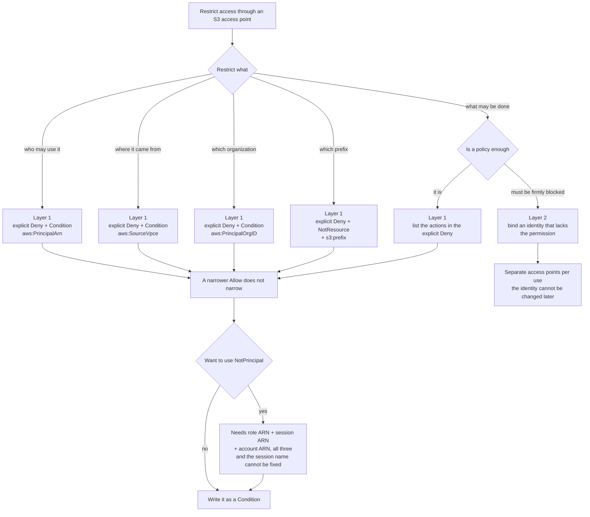

# S3 Access Point Authorization Design — Evaluation Order and the Two Layers That Narrow Access
<!-- lang-switcher:start -->
🌐 [日本語](../../../../ja/domains/security-governance/notes/access-point-authorization-layers.md) | [English](access-point-authorization-layers.md) | [🏠 Repository home](../../../README.md)
<!-- lang-switcher:end -->

[🏠 Repository Top](../../../README.md) | [Domain — Security & Governance](../README.md)

> This is the English translation. Japanese is authoritative for technical accuracy. Please report any discrepancy.

---

## Conclusion

**There is no "bucket policy" for an Amazon FSx for NetApp ONTAP S3 Access Point.** No S3 bucket sits behind it, so there is nothing for `put-bucket-policy` to target. What you configure is an **access point policy** (an IAM resource policy).

A request passes through **two layers in order.** Each layer evaluates something different, and **each layer narrows access by a different mechanism.**

| Layer | What it evaluates | What narrows access here |
|---|---|---|
| **Layer 1 — AWS-side IAM authorization** | The calling principal and the `s3:` action | **An explicit `Deny`** |
| **Layer 2 — file-system permissions** | What the identity bound to the access point (a UNIX or Windows user) may do to the files on that volume | **Mode bits / ACLs** |

**A request has to clear both to reach data.** And **neither layer subtracts from the other.** An operation Layer 1 permits can be refused by Layer 2, and the reverse.

Within Layer 1 there is one point that misleads designs. **Within the same account, writing a narrower `Allow` in an access point policy does not narrow anything.**

**This is not FSx-for-ONTAP-specific behaviour.** In AWS policy evaluation, a same-account request is decided on the **union** of the identity-based and the resource-based policy: if either allows it, it goes through. An access point policy is a resource-based policy, so **the caller's own permissions are enough on their own.**

| Evaluation order | Why it matters here |
|---|---|
| 0. **Network origin check** | On a VPC-origin access point, a request that does not arrive through a VPC endpoint in the bound VPC is refused **before any policy is evaluated** |
| 1. Default is an **implicit deny** | Nothing gets through if nothing is written |
| 2. **One explicit `Deny` anywhere settles it as a deny** | **This is how you narrow within Layer 1** |
| 3. Organizations RCPs / SCPs | Access can be stopped from outside the account |
| 4. Identity-based and resource-based (**union within an account, both required across accounts**) | **Writing a narrow `Allow` is not narrowing** |
| 4'. **VPC endpoint policy** | If the request traverses a VPC endpoint, **that policy must allow it too**. The default allows everything, so it only bites once you scope it |

> **The VPC endpoint policy is the easiest layer to miss.** Its default allows all S3 actions on all
> resources, so it is invisible in an environment that has not scoped it. **Scope the endpoint policy
> first and add an access point later, and the new access point ARN is not in the allowed set —
> `AccessDenied`.** This layer is documented by AWS; it was not measured here.

The whole order, and a table that works back from a symptom to the layer that refused, is in [How a request through an S3 access point is decided](../../../../ja/reference/decision-trees/access-point-authorization.md) (日本語). **This note covers the confirmation of each of those steps in a live environment, and how to write the policy.**

So **to narrow within Layer 1 you write an explicit `Deny`. And the way you write it matters.** Building an exception with `NotPrincipal` **denied the very principal it was meant to exempt.** The form to use is a `Condition` with `StringNotEquals` on `aws:PrincipalArn`.

> **Evidence**: `verified` (2026-08-17 and 2026-08-18, `ap-northeast-1`, ONTAP `9.18.1P3D1`).
> Layer 1 was measured on a UNIX-security-style volume, across three access points spanning Internet
> and VPC origins, with four principals: an IAM user, an assumed role, an EC2 instance role, and
> **a principal in an account belonging to a different AWS organization**. Layer 2 and the audit
> behaviour were measured on a dedicated verification SVM carrying one UNIX and one NTFS volume,
> a local UNIX user and a local Windows user.
> **One item below was not measured.** The `aws:SecureTransport` deny branch is
> structurally unreachable ([why](#awssecuretransport-never-reaches-its-deny-branch)). The JSON below
> is what was actually applied during verification, with only the account ID and the network
> identifiers replaced by placeholders.

---

## What You Are Actually Configuring

| Item | Detail |
|---|---|
| The thing you set | An access point policy (IAM resource policy). **Not a bucket policy** |
| Path at creation | The Amazon FSx console, or `S3AccessPoint.Policy` on `CreateAndAttachS3AccessPoint` <!-- allow:naming - AWS service name --> |
| Path for an existing access point | **The S3 side** (`aws s3control put-access-point-policy` / `delete-access-point-policy`). Amazon FSx exposes no update API <!-- allow:naming - AWS service name --> |
| Permission required | `s3:PutAccessPointPolicy` |
| Block Public Access | **Always on, and cannot be changed** |
| Policy size limit | 20 KB (read it together with the [measurement below](#the-policy-size-limit-is-checked-after-normalization)) |

**The split in change paths matters operationally.** <!-- allow:naming - AWS service name --> The access point is created through the Amazon FSx API; the policy is turned through the S3 API. If you create the access point from a template and later rewrite its policy on the S3 side, the template and the live resource diverge.

---

## Layer 1 — What the Union Implies

**Designing on the assumption that "only what the access point policy lists gets through" leaves more open than intended.** All five rows below are predictable from step 4, the same-account union. **Read them as a record of the model holding, not as surprises.**

| Policy | Caller | Operation | Result | Explained by |
|---|---|---|---|---|
| none | IAM user | `GetObject` | succeeds | step 4 (the identity-based policy alone supplies the allow) |
| none | IAM user | `ListObjectsV2` | succeeds | same |
| `Allow` role only (`GetObject`, `ListBucket`) | IAM user (**not listed**) | `GetObject` | **succeeds** | step 4 (absent from the access point policy, present in the identity-based one) |
| same | role | `GetObject` | succeeds | step 4 |
| same | role | `PutObject` (**action not listed**) | **succeeds** | step 4 (the action set is decided by the union too) |

If the caller's identity-based policy permits the action, the request goes through. **An access point policy is a place to grant additional access, not a place to narrow it down.**

**The place to narrow is step 2.** An explicit `Deny` is evaluated first and stops the evaluation when it matches. So the narrowing operation is "write an explicit `Deny`", not "write a tighter `Allow`".

> **Security note**: "I created the access point and allowed reads only, so nothing can write
> through it" does not hold. A principal with administrative permissions writes anyway.
> **To make writes impossible, either write an explicit `Deny` or bind the access point to an
> identity that holds no write permission in Layer 2.** The second option is covered in
> [S3 Access Point authorizes every request as one identity](../../../../ja/domains/data-utilization/notes/reaching-data-without-copies.md) (日本語).

---

## Two Ways to Write an Explicit Deny in Layer 1 — Avoid `NotPrincipal`

**`Deny` + `NotPrincipal` denied the principals named as exceptions.** The table shows what has to be listed before an exception actually holds.

| Listed in `NotPrincipal` | IAM user | assumed role |
|---|---|---|
| the IAM user ARN alone | **denied** | denied |
| the IAM user ARN + **the account ARN** | succeeds | denied |
| role ARN + account ARN | denied | **denied** |
| assumed-role session ARN + account ARN | denied | **denied** |
| role ARN + session ARN (no account ARN) | denied | **denied** |
| role ARN + session ARN + **account ARN** | denied | succeeds |

Two things follow.

1. **The account ARN (`arn:aws:iam::<account>:root`) has to be listed as well.** Naming the principal alone does not create an exception. The first row is the control that shows it.
2. **For a role, both the role ARN and the assumed-role session ARN are needed.** The session name is chosen at `AssumeRole` time, and **`NotPrincipal` does not accept wildcards** — so "this role, any session" cannot be expressed.

**That rules `NotPrincipal` out for any design that targets a role.** Use this instead.

| Form | Depends on the session name | Verdict |
|---|---|---|
| `Deny` + `NotPrincipal` | Only holds if the session name is fixed | do not use |
| `Deny` + `Condition` `StringNotEquals` `aws:PrincipalArn` | **No** | **use this** |

`aws:PrincipalArn` resolves to the **role's** ARN for an assumed-role session. Three different session names (`s3ap-verify`, `other-session`, `ci-run-12345`) produced the same verdict.

> **Security note**: putting `s3:*` in a `Deny` whose `Resource` is the access point ARN also
> covers `s3:PutAccessPointPolicy` and `s3:DeleteAccessPointPolicy`, because those operations act
> on the same ARN — **which risks locking you out of policy administration.** Every example in this
> note scopes its `Deny` to data operations (`GetObject` / `PutObject` / `DeleteObject` /
> `ListBucket`). **That lockout was not measured**; recovery might require re-creating the access
> point, so it was deliberately not attempted.

---

## Configuration Examples — Six Patterns

**The account ID is `123456789012`; VPC, endpoint, and organization identifiers are placeholders.** The Region is left as `ap-northeast-1`, matching the verification environment.

### 1. Allow reads for one role only

```json
{
  "Version": "2012-10-17",
  "Statement": [
    {
      "Sid": "AllowPipelineRoleReadOnly",
      "Effect": "Allow",
      "Principal": {"AWS": "arn:aws:iam::123456789012:role/AnalyticsPipelineRole"},
      "Action": ["s3:GetObject", "s3:ListBucket"],
      "Resource": [
        "arn:aws:s3:ap-northeast-1:123456789012:accesspoint/my-fsxn-ap",
        "arn:aws:s3:ap-northeast-1:123456789012:accesspoint/my-fsxn-ap/object/*"
      ]
    },
    {
      "Sid": "DenyAnyPrincipalOutsideTheAllowList",
      "Effect": "Deny",
      "Principal": "*",
      "Action": ["s3:GetObject", "s3:PutObject", "s3:DeleteObject", "s3:ListBucket"],
      "Resource": [
        "arn:aws:s3:ap-northeast-1:123456789012:accesspoint/my-fsxn-ap",
        "arn:aws:s3:ap-northeast-1:123456789012:accesspoint/my-fsxn-ap/object/*"
      ],
      "Condition": {
        "StringNotEquals": {
          "aws:PrincipalArn": "arn:aws:iam::123456789012:role/AnalyticsPipelineRole"
        }
      }
    }
  ]
}
```

**The `Deny` half is the substance.** Keep only the top half and, per the table above, other principals still get through.

Measured: the named role succeeds; an IAM user with administrative permissions that is not named gets `AccessDenied`.

### 2. Allow writes

Add `s3:PutObject` to the `Allow` action list in example 1 and leave the `Deny` alone. **Do not remove `s3:PutObject` from the `Deny` action list.** Removing it lets principals other than the allowed one write.

| Use | `Allow` actions |
|---|---|
| Read-only pipeline | `s3:GetObject`, `s3:ListBucket` |
| Used as an output destination | `s3:GetObject`, `s3:ListBucket`, `s3:PutObject` |
| Generations get removed as part of operations | the above + `s3:DeleteObject` |

**The firmer way to stop writes is to bind the access point to a read-only file system identity.** Choose that when you do not want a state where one policy edit re-enables writing.

### 3. Restrict to one VPC endpoint

```json
{
  "Version": "2012-10-17",
  "Statement": [
    {
      "Sid": "AllowInstanceRoleRead",
      "Effect": "Allow",
      "Principal": {"AWS": "arn:aws:iam::123456789012:role/AppInstanceRole"},
      "Action": ["s3:GetObject", "s3:ListBucket"],
      "Resource": [
        "arn:aws:s3:ap-northeast-1:123456789012:accesspoint/my-fsxn-ap",
        "arn:aws:s3:ap-northeast-1:123456789012:accesspoint/my-fsxn-ap/object/*"
      ]
    },
    {
      "Sid": "DenyUnlessThroughTheExpectedVpcEndpoint",
      "Effect": "Deny",
      "Principal": "*",
      "Action": ["s3:GetObject", "s3:ListBucket"],
      "Resource": [
        "arn:aws:s3:ap-northeast-1:123456789012:accesspoint/my-fsxn-ap",
        "arn:aws:s3:ap-northeast-1:123456789012:accesspoint/my-fsxn-ap/object/*"
      ],
      "Condition": {
        "StringNotEquals": {"aws:SourceVpce": "vpce-0123456789abcdef0"}
      }
    }
  ]
}
```

**The access point measured here has `NetworkOrigin: Internet`** (`VpcConfiguration` null), reached from an EC2 instance inside the VPC **through an S3 Gateway endpoint**. Both sides were measured from the same client, changing only the condition value.

| Condition value | From EC2 in the VPC (via the gateway endpoint) | From outside the VPC |
|---|---|---|
| The real gateway endpoint ID | `ListBucket` and `GetObject` both succeed | denied |
| A non-existent endpoint ID | **denied** | — |

**The second row is the control.** Without it, the first row's success would not distinguish "the value matched" from "the condition is not evaluated on an Internet-origin access point". **Changing only the value to a non-existent ID denied the same EC2 instance**, so `aws:SourceVpce` really is populated with the gateway endpoint ID.

The caller subnet's route table carries **both an IGW default route and an S3 prefix-list route**; for S3 destinations the prefix-list route is the more specific match.

> **An `Internet` origin access point is not unreachable from a gateway endpoint.** The rows above are
> measured on one (measured 2026-08-17, reproduced 2026-08-18 with the control added). **What decides
> reachability is the caller subnet's routing, not the origin type.** AWS also states that using
> `aws:SourceVpc` with an internet-origin access point requires a VPC endpoint, because otherwise the
> key is not populated ([source](#primary-sources)).
>
> **Gateway endpoints do not route traffic that enters the VPC from outside.** Callers arriving over
> VPN, Direct Connect, Transit Gateway or VPC peering need an **Interface** endpoint. If only
> on-premises callers get `AccessDenied`, this is the likely cause. That is documented by AWS.

The denial text contains `with an explicit deny in a resource-based policy`, which **separates this cause from a missing IAM grant.** Worth remembering as a triage signal.

**This is a different mechanism from `NetworkOrigin`.** `NetworkOrigin` cannot be changed after creation; this condition lives in the policy and can. **A VPC origin behaves as an explicit deny for requests whose `aws:SourceVpc` does not match the bound VPC** (documented by AWS). The same result can be written as a policy, but then maintaining the deny statement is the author's responsibility.

### 4. Restrict to your organization

```json
{
  "Version": "2012-10-17",
  "Statement": [
    {
      "Sid": "AllowReadFromInsideTheOrganization",
      "Effect": "Allow",
      "Principal": "*",
      "Action": ["s3:GetObject", "s3:ListBucket"],
      "Resource": [
        "arn:aws:s3:ap-northeast-1:123456789012:accesspoint/my-fsxn-ap",
        "arn:aws:s3:ap-northeast-1:123456789012:accesspoint/my-fsxn-ap/object/*"
      ],
      "Condition": {"StringEquals": {"aws:PrincipalOrgID": "o-exampleorgid"}}
    },
    {
      "Sid": "DenyAnyPrincipalOutsideTheOrganization",
      "Effect": "Deny",
      "Principal": "*",
      "Action": ["s3:GetObject", "s3:PutObject", "s3:DeleteObject", "s3:ListBucket"],
      "Resource": [
        "arn:aws:s3:ap-northeast-1:123456789012:accesspoint/my-fsxn-ap",
        "arn:aws:s3:ap-northeast-1:123456789012:accesspoint/my-fsxn-ap/object/*"
      ],
      "Condition": {"StringNotEquals": {"aws:PrincipalOrgID": "o-exampleorgid"}}
    }
  ]
}
```

**`Principal: "*"` combined with a condition key.** Because no principal is enumerated, adding accounts requires no edit.

Measured: a principal in another organization's account was denied. **On an access point carrying the same explicit cross-account allow but without the `Deny` statement, that same principal succeeds** — so the refusal comes from this condition. See [Cross-account data access does work](#cross-account-data-access-does-work).

### 5. Refuse unencrypted transport

```json
{
  "Sid": "DenyUnencryptedTransport",
  "Effect": "Deny",
  "Principal": "*",
  "Action": "s3:*",
  "Resource": [
    "arn:aws:s3:ap-northeast-1:123456789012:accesspoint/my-fsxn-ap",
    "arn:aws:s3:ap-northeast-1:123456789012:accesspoint/my-fsxn-ap/object/*"
  ],
  "Condition": {"Bool": {"aws:SecureTransport": "false"}}
}
```

**This is the one statement whose effect could not be measured.** The reason is in the next section. Including it as defence in depth is harmless, but **it cannot be cited as the reason plaintext is blocked.**

### 6. Restrict to a prefix

```json
{
  "Version": "2012-10-17",
  "Statement": [
    {
      "Sid": "AllowRoleReadWriteWithinOnePrefix",
      "Effect": "Allow",
      "Principal": {"AWS": "arn:aws:iam::123456789012:role/AnalyticsPipelineRole"},
      "Action": ["s3:GetObject", "s3:PutObject"],
      "Resource": "arn:aws:s3:ap-northeast-1:123456789012:accesspoint/my-fsxn-ap/object/incoming/*"
    },
    {
      "Sid": "AllowRoleListOnlyThatPrefix",
      "Effect": "Allow",
      "Principal": {"AWS": "arn:aws:iam::123456789012:role/AnalyticsPipelineRole"},
      "Action": "s3:ListBucket",
      "Resource": "arn:aws:s3:ap-northeast-1:123456789012:accesspoint/my-fsxn-ap",
      "Condition": {"StringLike": {"s3:prefix": "incoming/*"}}
    },
    {
      "Sid": "DenyAnyObjectOutsideThatPrefix",
      "Effect": "Deny",
      "Principal": "*",
      "Action": ["s3:GetObject", "s3:PutObject", "s3:DeleteObject"],
      "NotResource": "arn:aws:s3:ap-northeast-1:123456789012:accesspoint/my-fsxn-ap/object/incoming/*"
    },
    {
      "Sid": "DenyListWithoutThatPrefix",
      "Effect": "Deny",
      "Principal": "*",
      "Action": "s3:ListBucket",
      "Resource": "arn:aws:s3:ap-northeast-1:123456789012:accesspoint/my-fsxn-ap",
      "Condition": {"StringNotLike": {"s3:prefix": "incoming/*"}}
    }
  ]
}
```

**Object access is restricted with `NotResource`; listing is restricted with `s3:prefix`. They are written separately.** `s3:prefix` applies to `ListBucket` only.

Measured (`incoming/` stands in for the verification prefix):

| Caller | Operation | Target | Result |
|---|---|---|---|
| role | `GetObject` | inside the prefix | succeeds |
| role | `GetObject` | outside the prefix | denied |
| role | `PutObject` | inside the prefix | succeeds |
| role | `PutObject` | outside the prefix | denied |
| role | `ListBucket` | with the prefix | succeeds |
| role | `ListBucket` | without a prefix | denied |
| **IAM user (administrative)** | `GetObject` | outside the prefix | **denied** |

The last row is the point. **An explicit `Deny` written with `Principal: "*"` applies to administrative principals too.** Examples 1–4 control *who* gets in; example 6 narrows *what* can be touched.

---

## Condition Keys as Measured

| Condition key | What it narrows | Measured |
|---|---|---|
| `aws:PrincipalArn` | The caller's ARN; independent of the session name | **both sides confirmed** |
| `aws:SourceVpce` | The VPC endpoint traversed | **both sides confirmed** |
| `aws:PrincipalOrgID` | Organization membership | **both sides confirmed** (measured with a principal in another organization's account) |
| `s3:prefix` | The scope of `ListBucket` | **both sides confirmed** |
| `aws:SecureTransport` | Transport encryption | **the Deny branch was never reached** (below) |

### A condition key can only be compared when it is present on the request

**On a path where the key is absent, an `Allow` guarded by `StringEquals` does not hold, and a `Deny` guarded by `StringNotEquals` does.** The result flips with which side you write it on, so check availability first. **The table below is documented by AWS, not measured here** — only that `aws:SourceVpce` is populated via a VPC endpoint was measured.

| Condition key | Present on the request |
|---|---|
| `aws:SourceVpc` | **Only when the request goes through a VPC endpoint** |
| `aws:SourceVpce` | **Only when the request goes through a VPC endpoint** (the endpoint's ID) |
| `aws:VpcSourceIp` | **Only when the request goes through a VPC endpoint.** **The key name is case-sensitive** |
| `aws:SourceIp` | **Only when the request does not go through a VPC endpoint** |

> **`aws:SourceIp` and `aws:VpcSourceIp` are mutually exclusive.** Writing `aws:SourceIp` to
> restrict by source address on a request that traverses a VPC endpoint means **the key is absent and
> the intended comparison never happens.** Use `aws:VpcSourceIp` through an endpoint and
> `aws:SourceIp` from the internet. This applies to access point policies, VPC endpoint policies and
> identity-based policies alike.

### `aws:SecureTransport` never reaches its Deny branch

| Path attempted | Result |
|---|---|
| HTTPS (control) | succeeds |
| Unsigned HTTP request | **HTTP 307 redirect to HTTPS** |
| Signed HTTP request (TLS disabled in the SDK) | **`TemporaryRedirect` (307)** |
| CLI with `--endpoint-url` set to `http://` | `NoSuchBucket`; the override breaks ARN-based addressing, so this path verifies nothing |

**The redirect happens before authorization is evaluated.** AWS documents the behaviour: access points accept requests over HTTPS only, and S3 answers an HTTP request with a redirect that upgrades it. In other words, **no path exists on this access point where `aws:SecureTransport` is `false`.**

### `aws:PrincipalOrgID` inside and outside the organization

| Organization ID in the condition | Caller | Result |
|---|---|---|
| Our own organization | A member of it | succeeds |
| A different organization ID | A member of ours (so "outside" per the condition) | denied |
| **No condition** (explicit cross-account allow only) | **A principal in another organization's account** | **succeeds** |
| Our own organization | **A principal in another organization's account** | **denied** |

**The last two rows are a pair.** Two access points on the same volume were given the **same explicit cross-account allow** (the other account's ARN as `Principal`), and only one of them also carried the `aws:PrincipalOrgID` `Deny`. Same client, same moment; the presence of the condition statement is the only difference.

Row 3 exists as the control, and that matters. **Without it, the refusal in row 4 cannot be attributed to the organization condition rather than to cross-account access simply not working.**

---

## Cross-Account Data Access Does Work

**This too follows from step 4.** Across accounts the rule is not a union but **both**: here the resource side (the access point policy) allowed it and the caller's own identity-based policy allowed it as an administrator, so both halves were present and the request went through.

**"Same-account ownership is required" constrains who can *create* the access point, not who can *use* it.**

| Question | Reality |
|---|---|
| Create an access point on another account's volume | Not possible (the file system and the access point must be owned by the same account) |
| **A principal in another account — another organization — reads data through the access point** | **Possible.** It goes through if the access point policy allows it (measured, row 3 above) |

**Conflating the two costs you a design option.** Handing data to another account tends to slide into "make a copy" or "accounts cannot be crossed, so use something else" — but **allowing the other account in the access point policy removes the need for a copy.** The prerequisites side is covered in [FSx for ONTAP S3 AP is not simply "S3"](../../../../ja/domains/data-utilization/notes/s3-access-point-constraints.md) (日本語).

**Inverted, this also means unintended sharing is one policy away.** Naming another account as `Principal` sends data outside your organization. If it must not leave, the `aws:PrincipalOrgID` `Deny` is the stopping mechanism that measurement confirms.

---

## Access Point Parameters — Everything Except the Policy Is Fixed at Creation

Amazon FSx exposes exactly **three** operations for these attachments: `CreateAndAttachS3AccessPoint`, `DescribeS3AccessPointAttachments`, and `DetachAndDeleteS3AccessPoint`. **There is no update operation.** <!-- allow:naming - AWS service name -->

| Parameter | Required | Constraint | Changeable later |
|---|---|---|---|
| `Name` | yes | 3–50 chars, lowercase alphanumerics and `-`, alphanumeric at both ends | **no** (re-create) |
| `Type` | yes | `ONTAP` / `OPENZFS` | **no** |
| `OntapConfiguration.VolumeId` | yes | `fsvol-` form | **no** (cannot be pointed at another volume) |
| `FileSystemIdentity.Type` | yes | `UNIX` / `WINDOWS` | **no** |
| `UnixUser.Name` / `WindowsUser.Name` | one of them | 1–256 chars | **no** |
| `S3AccessPoint.VpcConfiguration.VpcId` | no | `vpc-` form. **Omit it and the origin is Internet** | **no** |
| `S3AccessPoint.Policy` | no | 1–200,000 chars at the field level | **yes** (through the S3 API) |
| `ClientRequestToken` | no | 1–63 chars | — |

**Re-creation is scoped to the one access point.** The volume and its data are untouched. Detach with `DetachAndDeleteS3AccessPoint` and create again under the same name. **The alias changes, though** (`<name>-<random>-ext-s3alias`). If a consumer has the alias baked into its configuration, that has to be updated too.

**`FileSystemIdentity` being immutable shapes permission design.** You cannot "swap in a read-only identity later", so **separate access points per use** is what this turns into operationally. How that identity becomes the ceiling is covered in [S3 Access Point authorizes every request as one identity](../../../../ja/domains/data-utilization/notes/reaching-data-without-copies.md) (日本語).

### CloudFormation

```yaml
Resources:
  FsxnAnalyticsAccessPoint:
    Type: AWS::FSx::S3AccessPointAttachment
    Properties:
      Name: my-fsxn-ap
      Type: ONTAP
      OntapConfiguration:
        VolumeId: fsvol-0123456789abcdef0
        FileSystemIdentity:
          Type: UNIX
          UnixUser:
            Name: analytics-reader
      S3AccessPoint:
        VpcConfiguration:
          VpcId: vpc-0123456789abcdef0
        Policy:
          Version: "2012-10-17"
          Statement:
            - Sid: AllowPipelineRoleReadOnly
              Effect: Allow
              Principal:
                AWS: !Sub arn:${AWS::Partition}:iam::${AWS::AccountId}:role/AnalyticsPipelineRole
              Action:
                - s3:GetObject
                - s3:ListBucket
              Resource:
                - !Sub arn:${AWS::Partition}:s3:${AWS::Region}:${AWS::AccountId}:accesspoint/my-fsxn-ap
                - !Sub arn:${AWS::Partition}:s3:${AWS::Region}:${AWS::AccountId}:accesspoint/my-fsxn-ap/object/*
            - Sid: DenyAnyPrincipalOutsideTheAllowList
              Effect: Deny
              Principal: "*"
              Action:
                - s3:GetObject
                - s3:PutObject
                - s3:DeleteObject
                - s3:ListBucket
              Resource:
                - !Sub arn:${AWS::Partition}:s3:${AWS::Region}:${AWS::AccountId}:accesspoint/my-fsxn-ap
                - !Sub arn:${AWS::Partition}:s3:${AWS::Region}:${AWS::AccountId}:accesspoint/my-fsxn-ap/object/*
              Condition:
                StringNotEquals:
                  aws:PrincipalArn: !Sub arn:${AWS::Partition}:iam::${AWS::AccountId}:role/AnalyticsPipelineRole
```

**Because `Policy` can live in the template, the access point and its policy sit in one stack.** The two change paths noted earlier still apply: rewriting the policy through the S3 API produces drift.

### AWS CLI

```bash
# Create, attaching a policy at the same time
aws fsx create-and-attach-s3-access-point \
  --name my-fsxn-ap \
  --type ONTAP \
  --ontap-configuration '{
    "VolumeId": "fsvol-0123456789abcdef0",
    "FileSystemIdentity": {"Type": "UNIX", "UnixUser": {"Name": "analytics-reader"}}
  }' \
  --s3-access-point '{
    "VpcConfiguration": {"VpcId": "vpc-0123456789abcdef0"},
    "Policy": "<the JSON, passed as a string>"
  }'

# Replace only the policy on an existing access point (S3 API)
aws s3control put-access-point-policy \
  --account-id 123456789012 \
  --name my-fsxn-ap \
  --policy file://access-point-policy.json

# Read the current policy
aws s3control get-access-point-policy \
  --account-id 123456789012 \
  --name my-fsxn-ap \
  --query Policy --output text | python3 -m json.tool

# Remove the policy (the access point stays)
aws s3control delete-access-point-policy \
  --account-id 123456789012 \
  --name my-fsxn-ap
```

**`put-access-point-policy` replaces the whole document.** Nothing is merged. Before touching an access point that already has a policy, save it with `get-access-point-policy`.

### The policy size limit is checked after normalization

| Policy applied (compact JSON) | Result |
|---|---|
| 24,620 bytes | accepted |
| 24,861 bytes | `MalformedPolicy: Normalized policy document exceeds the maximum allowed size` |
| 33,778 bytes | same error |

**The documented limit is 20 KB.** The check runs against the **normalized** document, so **the byte count of the JSON in your editor is not a usable budget.** The boundary moves with how the policy is written, and it does not line up with the 200,000 characters the Amazon FSx API accepts at the field level. <!-- allow:naming - AWS service name --> **Avoid designs that approach the limit; split into more access points instead.**

The values are also recorded in [Limits and quotas](../../../../ja/reference/limits/README.md#fsx-for-ontap-s3-ap--アクセスポイントポリシーのサイズ--access-point-policy-size) (日本語).

---

## Layer 2 Prerequisite — the Identity Bound to the Access Point Must Exist on the File System

**The `FileSystemIdentity` given at creation has to be a user the ONTAP SVM can resolve.** It is not something you create on the AWS side.

| Identity type | What is required | As measured |
|---|---|---|
| `UNIX` | A UNIX user the SVM can resolve | **Neither LDAP nor NIS is required.** A user created in the SVM's local (`files`) source brought the access point to `AVAILABLE` and served reads and writes |
| `WINDOWS` | A Windows user the SVM can resolve | **Joining Active Directory is not required.** A local Windows user on a workgroup-mode CIFS server served reads and writes |

**This is broader than the AWS documentation states.** [Troubleshooting access points](https://docs.aws.amazon.com/fsx/latest/ONTAPGuide/troubleshooting-access-points-for-fsxn.html) describes the Windows identity case only for a "joined Active Directory domain". **A local Windows user in workgroup mode also worked.**

Name resolution on the SVM was in this state during the measurement. **No external directory service was consulted.**

| Setting | Value |
|---|---|
| `nsswitch.passwd` / `nsswitch.group` | `["files"]` only |
| `ldap.enabled` | `false` |
| `nis.enabled` | `false` |

> **Design note**: it is not the case that S3 access points require LDAP or AD. **Local users are,
> however, scoped to a single SVM.** Reusing one identity across several SVMs or file systems, and
> any requirement to inventory or attest identities, is a separate reason to move to a directory
> service. **That comparison is out of scope for this note.**

---

## Layer 2 — File-System Permissions Are What Narrow Access

**Allow and deny flip on Layer 2 alone, with the access point policy untouched.** Measured as a pair: same caller, same access point, no policy attached, changing only the owner and mode bits of the volume root.

| Volume root `uid` / `gid` / mode bits | UNIX user bound to the access point | `PutObject` |
|---|---|---|
| `0` / `0` / `755` | `authzreader` (uid 7101) | **`AccessDenied`** |
| `7101` / `7100` / `755` | the same `authzreader` | **succeeds** (ETag returned; `GetObject` read back 12 bytes) |

**There is no access point policy in either row.** So that `AccessDenied` comes from Layer 2, not Layer 1.

**This pair is the evidence that the two layers are independent.** Looking only at Layer 1, you would keep searching the policy for the cause of that `AccessDenied`.

> **Operational note**: `FileSystemIdentity` **cannot be changed after creation**
> ([above](#access-point-parameters--everything-except-the-policy-is-fixed-at-creation)).
> **A design that narrows in Layer 2 has to be settled before the access point is created**, which
> in practice means one access point per use case.

### Binding a non-root identity stops writes with no policy at all

**An access point becomes read-only through its identity alone, with no policy attached.** On a root-owned `755` volume (others get `r-x`), an access point was created with the non-root UNIX user `nobody` (uid 65535) and no policy, then measured from the same caller.

| Identity bound to the access point | Access point policy | `GetObject` | `PutObject` |
|---|---|---|---|
| `nobody` (uid 65535) | **none** | **succeeds** (598 bytes) | **`AccessDenied`** |
| `root` (uid 0, control) | **none** | succeeds | **succeeds** |

**Same volume, same caller, no policy on either — the only difference is the identity.** Read-only therefore holds in Layer 2 on its own.

### `AccessDenied` tells you which layer refused

**Three different denials are distinguishable from the message.** All three were measured in the same environment.

| Message | Layer that refused | Meaning |
|---|---|---|
| `Access Denied` (**and nothing more**) | **Layer 2** | File permissions are insufficient. Searching the policy will not find the cause |
| `... with an explicit deny in a resource-based policy` | Layer 1 | An explicit deny in the access point policy matched |
| `... because no identity-based policy allows the s3:GetObject action` | Layer 1 | Nothing allowed it (still an implicit deny) |

**The first is the misleading one.** An unqualified `Access Denied` means **look at file permissions, not at the policy.**

> **Design note**: a "read-only access point" can mean **read-only in Layer 1** (an explicit deny on
> writes in the policy) or **read-only in Layer 2** (the identity holds no write permission), and
> **the name does not say which.** The "read-only" access point in this verification environment did
> carry a non-root identity, yet what stopped writes was the explicit deny in its policy. **Binding a
> non-root identity is not by itself read-only** — if that identity holds write permission on the
> volume, it writes. **Decide the two separately and verify them separately.**

---

## Who Appears in the Audit Log

**Access through an S3 access point is recorded by ONTAP file access auditing.** The subject recorded is **the identity bound to the access point**, not the calling IAM principal. **The separation of subjects between Layer 1 and Layer 2 is exactly what limits the audit trail.**

These are the fields from `PutObject` and `GetObject` through a `WINDOWS`-type access point backed by a local Windows user on a workgroup-mode CIFS server. **Two independent measurements produced the same values.**

| Field | Recorded value | How to read it |
|---|---|---|
| `Source` | `HTTP` | S3 access appears as `HTTP`, not `CIFS` or `NFS` |
| `EventID` | `4656` (Create Object) / `4663` (Read Object) | Corresponding to `PutObject` / `GetObject` |
| `SubjectUserSid` | `S-1-5-21-…-1000` | **The SID of the local Windows user bound to the access point** |
| `SubjectUserName` | **`Not Present`** | **Not resolved. Only the SID remains** |
| `SubjectDomainName` | **`Not Present`** | Same |
| `SubjectUserIsLocal` | `false` | **The user is in fact local. This field does not match reality** |
| `SubjectUnix Uid` / `Gid` | `65535` / `65535` | The UNIX side is not resolved on the Windows identity path |
| `SubjectIP` | An AWS service-side address | **Not the caller's address.** Two consecutive requests from one client produced **different values** |
| `ObjectName` | `(<volume>);/<path>` | Volume name and path are available |

**Two consequences for operations.**

1. **The audit log alone does not identify who acted.** What remains is the SID of the identity bound to the access point. **Recovering the calling IAM principal requires correlating with AWS CloudTrail.** Splitting access points by use case reduces that correlation work.
2. **Source-address tracing is not possible.** `SubjectIP` is an AWS service-side address and changed within a single session. **An audit requirement expressed in terms of caller IP cannot be met on this path.**

> **Governance note**: a design that shares one access point across use cases rather than splitting
> it can still separate callers in the access point policy, but **file access auditing records them
> all as the same subject.** Where per-subject tracing of file operations is a requirement,
> **the granularity of the audit trail is decided by how access points are split.**

### On a UNIX-security-style volume, enabling auditing records nothing

**Enabling auditing on the SVM is not sufficient.** UNIX mode bits carry no audit information, so **with no ACE designating what to record, not a single event is emitted.**

Measured on the same SVM with the same audit configuration (`file_operations` enabled, `xml` format), changing only the volume.

| Volume | Effective security style | Audit ACE | Put / Get through the access point | Audit records |
|---|---|---|---|---|
| `authz_unix_data` | `unix` (mode bits `755` only) | **none** | succeeded | **0** (log was a 77-byte header) |
| `authz_ntfs_data` (control) | `ntfs` | `audit_success` present | succeeded | **2** (`4656` / `4663`) |

**The second row is the control.** Without it, zero records could not be attributed to the volume rather than to a misconfigured audit or a flush delay. **NTFS did record in the same session, so the difference lies with the volume.**

**The workaround had a side effect.** SLAG (storage-level access guard) can attach an audit ACE to a UNIX volume, but **the UNIX identity path returned `AccessDenied` immediately afterwards.**

| Operation | Put / Get | Audit records |
|---|---|---|
| No SLAG | succeeded | 0 |
| Audit-only SLAG added | **`AccessDenied`** | 0 |
| Plus an `Everyone` / `full_control` allow SLAG | **`AccessDenied`** (unchanged) | 0 |
| SLAG removed | **succeeded again** | 0 |

**Confirmed in both directions.** Adding an allow SLAG did not resolve it, so "the DACL was empty" does not explain the denial. **The cause is unconfirmed.** SLAG being evaluated with NTFS semantics, leaving a UNIX identity with no Windows credential to evaluate, is the plausible reading — **but it was not tested.**

> **Design note**: **if per-file auditing is a requirement, decide the volume security style during
> design.** Adding auditing later to a volume left in UNIX style broke the data path in this
> measurement. The audit configuration itself — event classes, log format, delivery — is covered in
> [fsxn-observability-integrations](https://github.com/Yoshiki0705/fsxn-observability-integrations).
> **This note covers only how the subject is recorded for access through an S3 access point.**

---

## Decision Flow



The diagram carries the same content as the tables above: **pick a condition key per thing you are restricting, and in every case do not stop at a narrower `Allow`.** When "what may be done" has to be firmly blocked, the guarantee moves out of the Layer 1 policy and into the Layer 2 identity.

**This diagram is for choosing what to write.** The order in which what you wrote gets *decided* is in [How a request through an S3 access point is decided](../../../../ja/reference/decision-trees/access-point-authorization.md) (日本語). **Start there when working back from a symptom to a cause.**

---

## Verify It in Your Own Environment

| # | Step | What it establishes |
|---|---|---|
| 1 | Save the current policy with `get-access-point-policy` | What a full replacement would lose. **If there is no policy you get `NoSuchAccessPointPolicy`, so the way back is `delete-access-point-policy`** |
| 2 | With no policy attached, call `GetObject` | That an access point policy is not required |
| 3 | Allow only a role, then call `GetObject` as a different principal | That a narrower `Allow` does not narrow access |
| 4 | Add `Deny` + `Condition aws:PrincipalArn` and repeat | That it now narrows |
| 5 | Always try once with a principal that should get through | **That the `Deny` is not wider than intended** |
| 6 | Restore the saved policy and compare with `get-access-point-policy` | That the environment is back |

**Do not skip step 5.** The `NotPrincipal` behaviour looks correct as long as you only watch principals that ought to be refused. **Only by trying the principal you meant to exempt does the missing exception show up.**

**Policy changes take seconds to take effect.** About 6 seconds after applying, the previous policy's verdict still came back; results were stable after 10–12 seconds. **Reading a single call made immediately after applying a policy produces the wrong conclusion.** This verification hit exactly that, and the re-run is what caught it.

---

## Common Misconceptions

| Misconception | Reality |
|---|---|
| You attach a bucket policy to an FSx for ONTAP S3 AP | There is no bucket, so you cannot. It is an access point policy |
| Same-account ownership is required, so another account cannot read the data | **It can.** Same-account ownership constrains creating the access point. With the policy allowing it, a principal in another organization's account gets through (measured) |
| Without an access point policy, nobody has access | If the identity-based policy allows it, they do |
| Only what the `Allow` lists gets through | Same-account evaluation is a union. Narrowing needs an explicit `Deny` |
| An action missing from `Allow` cannot be performed | It can. Writing a narrower action set does not narrow either |
| `NotPrincipal` lets you carve out an exception | It needs the account ARN too, and a role needs its session ARN as well. **Unusable where the session name is not fixed** |
| `aws:SecureTransport` is what blocks plaintext | That branch is never reached; HTTP is redirected before authorization |
| Policies can be 20 KB, so JSON under 20 KB will be accepted | The check is post-normalization. **24,861 bytes was refused in measurement** |
| The file system identity can be swapped later | There is no update API. It means re-creating the access point |
| Re-creating the access point restores everything | The name can be reused, but **the alias changes** |
| Changing the policy can also change the `NetworkOrigin` restriction | Different mechanisms. `NetworkOrigin` cannot be changed after creation |
| An `Internet` origin access point cannot be reached from an S3 gateway endpoint | **It can** (measured). What decides it is the **caller subnet's routing**, not the origin type |
| With a gateway endpoint in place, on-premises callers also take the private path | They do not. **Traffic entering the VPC over VPN, Direct Connect, Transit Gateway or peering is not affected by gateway endpoint routes.** An Interface endpoint is required |
| `aws:SourceIp` can restrict a request that goes through a VPC endpoint | It cannot. **`aws:SourceIp` is absent on that path.** Use `aws:VpcSourceIp` (the two are mutually exclusive) |
| Fixing the access point policy and the identity policy is enough | If the request traverses a VPC endpoint, **the endpoint policy must allow it too.** The default allows everything, so this only bites once scoped |
| Permissions an AWS service created for itself can be used as-is | They may reference the access point **alias as a bucket-form ARN**, which returns `AccessDenied`. Change it to the **access point ARN form** |
| A "read-only access point" means writes are stopped | **The name does not say which layer stops them.** An explicit deny in the policy, or the identity's file permissions — verify separately |
| Binding a non-root identity makes it read-only | It does not. **If that identity holds write permission on the volume, it writes.** Confirm that writes actually fail |
| `AccessDenied` can be diagnosed from the policy | An unqualified `Access Denied` is **Layer 2** (file permissions). Searching the policy will not find the cause |
| With no `s3:` action in the access point policy, the files cannot be touched | They can. **The two layers are independent.** If the identity-based policy allows it and the bound identity holds the file permission, it goes through |
| A UNIX identity needs LDAP, and a Windows identity needs an AD join | Neither is required. **Measured with an SVM-local UNIX user and a workgroup-mode local Windows user** |
| The audit log tells you the calling IAM principal | It does not. Only the **SID of the identity bound to the access point** remains, and the name is not resolved. **Identifying the caller requires correlating with CloudTrail** |
| `SubjectIP` in the audit log traces the caller | It does not. It is an AWS service-side address, and **it changed between consecutive requests in one session** |
| Enabling auditing on the SVM records every volume | A UNIX-style volume with only mode bits produced **zero records**. An audit ACE is required |

---

## Limits of This Note

- **The cross-account measurement covers one pair of accounts, once.** The other account belongs to a different AWS Organizations organization, and the caller was an administrative role via IAM Identity Center. **Other combinations of organization relationship and principal type were not tried.**
- **Layer 1 behaviour does not depend on the ONTAP version**; access point policy evaluation happens on the S3 and IAM side. **Layer 2 and the audit behaviour do belong to ONTAP**, and reproducibility outside the recorded version (`9.18.1P3D1`) was not checked.
- **The lockout from putting `s3:*` in a `Deny` was not measured.** Recovery might require re-creating the access point, so it was deliberately not attempted.
- **Layer 1 policy behaviour was measured only on a UNIX-security-style volume.** Layer 2 and auditing were measured on both UNIX and NTFS, but **policy evaluation was not re-measured on the NTFS volume.** It is not expected to differ; that was not confirmed.
- **The reason SLAG caused the UNIX identity path to be denied is unconfirmed.** The effect was confirmed in both directions (denied on add, restored on remove), but **the cause was not tested.**
- **The Windows identity path was measured with a workgroup-mode local user.** How the audit record looks on an AD-joined SVM — whether `SubjectUserName` resolves — is **not part of this measurement.**
- Auditing was measured in one configuration: **`file_operations` events, `xml` format.** Other event classes and log formats record different fields.
- **The VPC endpoint policy layer and the condition-key availability table are documented by AWS, not measured here.** What was measured is that `aws:SourceVpce` is populated through an S3 gateway endpoint.
- **Interface endpoints were not measured**, only a gateway endpoint. Neither was an on-premises path.
- Measurements come from **one Region (`ap-northeast-1`) and one file system**.

---

## Primary Sources

| Topic | Source |
|---|---|
| Dual-layer authorization, Block Public Access being unchangeable, `s3:PutAccessPointPolicy`, the configuration paths at creation and afterwards | [AWS: Managing access point access](https://docs.aws.amazon.com/fsx/latest/ONTAPGuide/s3-ap-manage-access-fsxn.html) |
| **The full list of authorizing layers (origin check → VPC endpoint policy → access point policy → identity policy → SCP), that same-account access needs only one of the two to allow, that an Allow-only policy does not restrict, condition-key availability and mutual exclusivity, that gateway endpoints do not route traffic entering the VPC from outside, and that VPC origin behaves as an explicit deny on `aws:SourceVpc`** | [AWS: Configuring network access for Amazon S3 access points](https://docs.aws.amazon.com/fsx/latest/ONTAPGuide/configuring-network-access-for-s3-access-points.html) |
| Access point ARN form (`arn:aws:s3:<region>:<account-id>:accesspoint/<name>`, objects as `/object/<key>`), and the alias form being immutable | [AWS: Referencing access points with ARNs, aliases, or virtual-hosted-style URIs](https://docs.aws.amazon.com/fsx/latest/ONTAPGuide/referencing-access-points-for-fsxn.html) |
| **That automatically created service roles cause `AccessDenied` by using a bucket-form ARN (`arn:aws:s3:::<alias>`), and must be changed to the access point ARN form** | [AWS: Troubleshooting S3 access point issues](https://docs.aws.amazon.com/fsx/latest/ONTAPGuide/troubleshooting-access-points-for-fsxn.html) |
| 20 KB policy limit, VPC configuration immutable after creation, HTTPS-only with an HTTP redirect, 10,000 access points per account per Region | [AWS: Access points restrictions and limitations](https://docs.aws.amazon.com/AmazonS3/latest/userguide/access-points-restrictions-limitations-naming-rules.html) |
| Properties specified when creating an access point, the volume needing a junction path | [AWS: Creating access points](https://docs.aws.amazon.com/fsx/latest/ONTAPGuide/create-access-points.html) |
| `CreateAndAttachS3AccessPoint` parameters and constraints | [AWS: CreateAndAttachS3AccessPointOntapConfiguration](https://docs.aws.amazon.com/fsx/latest/APIReference/API_CreateAndAttachS3AccessPointOntapConfiguration.html) |
| CloudFormation properties | [AWS: AWS::FSx::S3AccessPointAttachment](https://docs.aws.amazon.com/AWSCloudFormation/latest/TemplateReference/aws-resource-fsx-s3accesspointattachment.html) |
| ARN form, the authorization model, triage signals | [Authorization model in FSx-for-ONTAP-S3AccessPoints-Serverless-Patterns](https://github.com/Yoshiki0705/FSx-for-ONTAP-S3AccessPoints-Serverless-Patterns/blob/main/docs/s3ap-authorization-model.en.md) |
| Documents the Windows identity for a "joined Active Directory domain" (**the measurement here is broader**) | [AWS: Troubleshooting access points](https://docs.aws.amazon.com/fsx/latest/ONTAPGuide/troubleshooting-access-points-for-fsxn.html) |
| File access audit configuration (event classes, log format, delivery) | [fsxn-observability-integrations](https://github.com/Yoshiki0705/fsxn-observability-integrations) |

---

## Related Documents

- [How a request through an S3 access point is decided](../../../../ja/reference/decision-trees/access-point-authorization.md) (日本語) — **the evaluation order, and working back from a symptom to the layer that refused. Start here to read mechanism-first**
- [Domain — Security & Governance](../README.md) — the hub for this module
- [S3 Access Point authorizes every request as one identity](../../../../ja/domains/data-utilization/notes/reaching-data-without-copies.md) (日本語) — a deeper look at the Layer 2 mechanism
- [FSx for ONTAP S3 AP is not simply "S3"](../../../../ja/domains/data-utilization/notes/s3-access-point-constraints.md) (日本語) — prerequisites before creating an access point
- [Four paths end users take to the data](../../../../ja/playbooks/02-design/notes/how-end-users-reach-the-data.md#ブラウザ経路--認可が-3-層になる) (日本語) — the authorization layers as a whole
- [Pre-production review](../../../../ja/playbooks/04-build/checklists/pre-production-review.md) (日本語) — the irreversible items, `NetworkOrigin` among them
- [Limits and quotas](../../../../ja/reference/limits/) (日本語) — the measured policy-size and object-size values
- [Evidence policy](../../../evidence-policy.md)

---

[🏠 Repository Top](../../../README.md) | [Domain — Security & Governance](../README.md)

<!-- lang-switcher:start -->
🌐 [日本語](../../../../ja/domains/security-governance/notes/access-point-authorization-layers.md) | [English](access-point-authorization-layers.md) | [🏠 Repository home](../../../README.md)
<!-- lang-switcher:end -->
