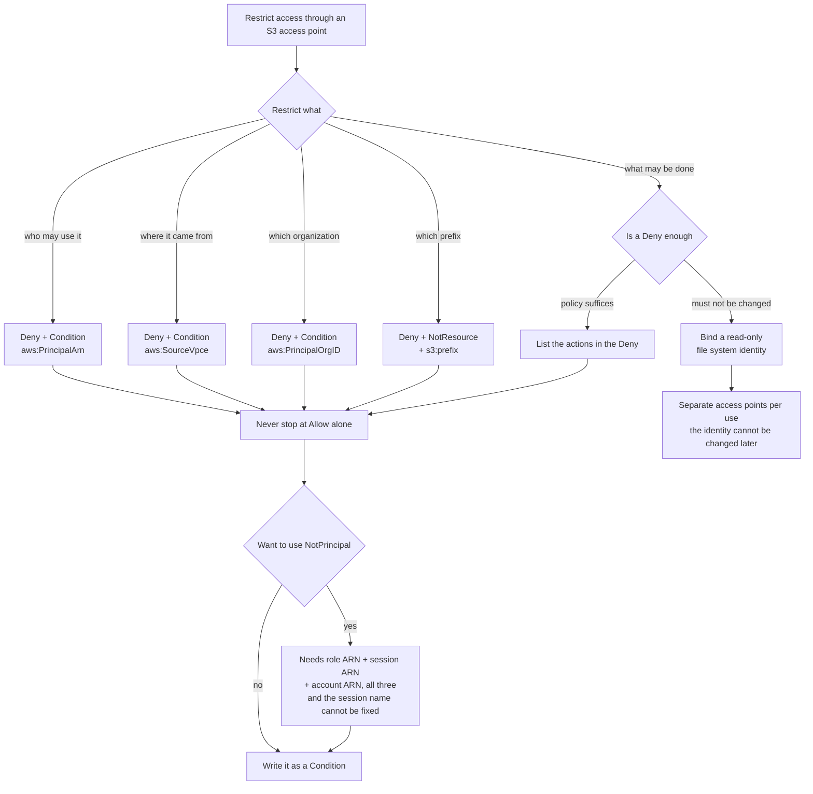

# An Allow in an Access Point Policy Is Not an Upper Bound
<!-- lang-switcher:start -->
🌐 [日本語](../../../../ja/domains/security-governance/notes/access-point-policy-allow-is-not-a-cap.md) | [English](access-point-policy-allow-is-not-a-cap.md) | [🏠 Repository home](../../../README.md)
<!-- lang-switcher:end -->

[🏠 Repository Top](../../../README.md) | [Domain — Security & Governance](../README.md)

> This is the English translation. Japanese is authoritative for technical accuracy. Please report any discrepancy.

---

## Conclusion

**There is no "bucket policy" for an Amazon FSx for NetApp ONTAP S3 Access Point.** No S3 bucket sits behind it, so there is nothing for `put-bucket-policy` to target. What you configure is an **access point policy** (an IAM resource policy).

With that settled, one consequence will mislead a design. **Within the same account, an `Allow` in an access point policy is not an upper bound on permissions.**

**This is not FSx-for-ONTAP-specific behaviour.** In AWS policy evaluation, a same-account request is decided on the **union** of the identity-based and the resource-based policy: if either allows it, it goes through. An access point policy is a resource-based policy, so **the caller's own permissions are enough on their own.**

| Evaluation order | Why it matters here |
|---|---|
| 1. Default is an implicit deny | Nothing gets through if nothing is written |
| 2. **One explicit `Deny` anywhere settles it as Deny** | **This is the only way to narrow** |
| 3. Organizations RCPs / SCPs | Access can be stopped from outside the account |
| 4. Identity-based and resource-based (**union within an account, both required across accounts**) | **Writing a narrow `Allow` is not narrowing** |

The whole order, and a table that works back from a symptom to the layer that refused, is in [How a request through an S3 access point is decided](../../../../ja/reference/decision-trees/access-point-authorization.md) (日本語). **This note covers the confirmation of each of those steps in a live environment, and how to write the policy.**

So **if you want to narrow access, you write an explicit `Deny`. And the way you write that `Deny` matters.** Building an exception with `NotPrincipal` **denied the very principal it was meant to exempt.** The form to use is a `Condition` with `StringNotEquals` on `aws:PrincipalArn`.

> **Evidence**: `verified` (2026-08-17, `ap-northeast-1`, ONTAP `9.18.1P3D1`, a UNIX-security-style
> volume, three access points across Internet and VPC origins, four principals: an IAM user, an
> assumed role, an EC2 instance role, and **a principal in an account belonging to a different AWS
> organization**). **One item below was not measured.** The `aws:SecureTransport` `Deny` branch is
> structurally unreachable ([why](#awssecuretransport-never-reaches-its-deny-branch)). The JSON below
> is what was actually applied during verification, with only the account ID and the network
> identifiers replaced by placeholders.

---

## What You Are Actually Configuring

| Item | Detail |
|---|---|
| The thing you set | An access point policy (IAM resource policy). **Not a bucket policy** |
| Path at creation | The Amazon FSx console, or `S3AccessPoint.Policy` on `CreateAndAttachS3AccessPoint` <!-- allow:naming - AWS service name --> |
| Path for an existing access point | **The S3 side** (`aws s3control put-access-point-policy` / `delete-access-point-policy`). Amazon FSx exposes no update API <!-- allow:naming - AWS service name --> |
| Permission required | `s3:PutAccessPointPolicy` |
| Block Public Access | **Always on, and cannot be changed** |
| Policy size limit | 20 KB (read it together with the [measurement below](#the-policy-size-limit-is-checked-after-normalization)) |

**The split in change paths matters operationally.** <!-- allow:naming - AWS service name --> The access point is created through the Amazon FSx API; the policy is turned through the S3 API. If you create the access point from a template and later rewrite its policy on the S3 side, the template and the live resource diverge.

---

## An Allow Does Not Cap Anything — What the Union Implies

**Designing on the assumption that "only what the access point policy lists gets through" leaves more open than intended.** All five rows below are predictable from step 4, the same-account union. **Read them as a record of the model holding, not as surprises.**

| Policy | Caller | Operation | Result | Explained by |
|---|---|---|---|---|
| none | IAM user | `GetObject` | succeeds | step 4 (the identity-based policy alone supplies the `Allow`) |
| none | IAM user | `ListObjectsV2` | succeeds | same |
| `Allow` role only (`GetObject`, `ListBucket`) | IAM user (**not listed**) | `GetObject` | **succeeds** | step 4 (absent from the access point policy, present in the identity-based one) |
| same | role | `GetObject` | succeeds | step 4 |
| same | role | `PutObject` (**action not listed**) | **succeeds** | step 4 (the action set is decided by the union too) |

If the caller's identity-based policy permits the action, the request goes through. **An access point policy is a place to grant additional access, not a place to narrow it down.**

**The place to narrow is step 2.** An explicit `Deny` is evaluated first and stops the evaluation when it matches. So the narrowing operation is "write a `Deny`", not "write a tighter `Allow`".

> **Security note**: "I created the access point and allowed reads only, so nothing can write
> through it" does not hold. A principal with administrative permissions writes anyway.
> **To make writes impossible, either write a `Deny` or bind the access point to a read-only file
> system identity.** The second option is covered in
> [S3 Access Point authorizes every request as one identity](../../../../ja/domains/data-utilization/notes/reaching-data-without-copies.md) (日本語).

---

## Two Ways to Write a Deny — Avoid `NotPrincipal`

**`Deny` + `NotPrincipal` denied the principals named as exceptions.** The table shows what has to be listed before an exception actually holds.

| Listed in `NotPrincipal` | IAM user | assumed role |
|---|---|---|
| the IAM user ARN alone | **denied** | denied |
| the IAM user ARN + **the account ARN** | succeeds | denied |
| role ARN + account ARN | denied | **denied** |
| assumed-role session ARN + account ARN | denied | **denied** |
| role ARN + session ARN (no account ARN) | denied | **denied** |
| role ARN + session ARN + **account ARN** | denied | succeeds |

Two things follow.

1. **The account ARN (`arn:aws:iam::<account>:root`) has to be listed as well.** Naming the principal alone does not create an exception. The first row is the control that shows it.
2. **For a role, both the role ARN and the assumed-role session ARN are needed.** The session name is chosen at `AssumeRole` time, and **`NotPrincipal` does not accept wildcards** — so "this role, any session" cannot be expressed.

**That rules `NotPrincipal` out for any design that targets a role.** Use this instead.

| Form | Depends on the session name | Verdict |
|---|---|---|
| `Deny` + `NotPrincipal` | Only holds if the session name is fixed | do not use |
| `Deny` + `Condition` `StringNotEquals` `aws:PrincipalArn` | **No** | **use this** |

`aws:PrincipalArn` resolves to the **role's** ARN for an assumed-role session. Three different session names (`s3ap-verify`, `other-session`, `ci-run-12345`) produced the same verdict.

> **Security note**: putting `s3:*` in a `Deny` whose `Resource` is the access point ARN also
> covers `s3:PutAccessPointPolicy` and `s3:DeleteAccessPointPolicy`, because those operations act
> on the same ARN — **which risks locking you out of policy administration.** Every example in this
> note scopes its `Deny` to data operations (`GetObject` / `PutObject` / `DeleteObject` /
> `ListBucket`). **That lockout was not measured**; recovery might require re-creating the access
> point, so it was deliberately not attempted.

---

## Configuration Examples — Six Patterns

**The account ID is `123456789012`; VPC, endpoint, and organization identifiers are placeholders.** The Region is left as `ap-northeast-1`, matching the verification environment.

### 1. Allow reads for one role only

```json
{
  "Version": "2012-10-17",
  "Statement": [
    {
      "Sid": "AllowPipelineRoleReadOnly",
      "Effect": "Allow",
      "Principal": {"AWS": "arn:aws:iam::123456789012:role/AnalyticsPipelineRole"},
      "Action": ["s3:GetObject", "s3:ListBucket"],
      "Resource": [
        "arn:aws:s3:ap-northeast-1:123456789012:accesspoint/my-fsxn-ap",
        "arn:aws:s3:ap-northeast-1:123456789012:accesspoint/my-fsxn-ap/object/*"
      ]
    },
    {
      "Sid": "DenyAnyPrincipalOutsideTheAllowList",
      "Effect": "Deny",
      "Principal": "*",
      "Action": ["s3:GetObject", "s3:PutObject", "s3:DeleteObject", "s3:ListBucket"],
      "Resource": [
        "arn:aws:s3:ap-northeast-1:123456789012:accesspoint/my-fsxn-ap",
        "arn:aws:s3:ap-northeast-1:123456789012:accesspoint/my-fsxn-ap/object/*"
      ],
      "Condition": {
        "StringNotEquals": {
          "aws:PrincipalArn": "arn:aws:iam::123456789012:role/AnalyticsPipelineRole"
        }
      }
    }
  ]
}
```

**The `Deny` half is the substance.** Keep only the top half and, per the table above, other principals still get through.

Measured: the named role succeeds; an IAM user with administrative permissions that is not named gets `AccessDenied`.

### 2. Allow writes

Add `s3:PutObject` to the `Allow` action list in example 1 and leave the `Deny` alone. **Do not remove `s3:PutObject` from the `Deny` action list.** Removing it lets principals other than the allowed one write.

| Use | `Allow` actions |
|---|---|
| Read-only pipeline | `s3:GetObject`, `s3:ListBucket` |
| Used as an output destination | `s3:GetObject`, `s3:ListBucket`, `s3:PutObject` |
| Generations get removed as part of operations | the above + `s3:DeleteObject` |

**The firmer way to stop writes is to bind the access point to a read-only file system identity.** Choose that when you do not want a state where one policy edit re-enables writing.

### 3. Restrict to one VPC endpoint

```json
{
  "Version": "2012-10-17",
  "Statement": [
    {
      "Sid": "AllowInstanceRoleRead",
      "Effect": "Allow",
      "Principal": {"AWS": "arn:aws:iam::123456789012:role/AppInstanceRole"},
      "Action": ["s3:GetObject", "s3:ListBucket"],
      "Resource": [
        "arn:aws:s3:ap-northeast-1:123456789012:accesspoint/my-fsxn-ap",
        "arn:aws:s3:ap-northeast-1:123456789012:accesspoint/my-fsxn-ap/object/*"
      ]
    },
    {
      "Sid": "DenyUnlessThroughTheExpectedVpcEndpoint",
      "Effect": "Deny",
      "Principal": "*",
      "Action": ["s3:GetObject", "s3:ListBucket"],
      "Resource": [
        "arn:aws:s3:ap-northeast-1:123456789012:accesspoint/my-fsxn-ap",
        "arn:aws:s3:ap-northeast-1:123456789012:accesspoint/my-fsxn-ap/object/*"
      ],
      "Condition": {
        "StringNotEquals": {"aws:SourceVpce": "vpce-0123456789abcdef0"}
      }
    }
  ]
}
```

Both sides were measured from the same client (an EC2 instance inside the VPC), changing only the condition value.

| Condition value | From EC2 in the VPC | From outside the VPC |
|---|---|---|
| The real gateway endpoint ID | `ListBucket` and `GetObject` both succeed | denied |
| A non-existent endpoint ID | **denied** | — |

The denial text contains `with an explicit deny in a resource-based policy`, which **separates this cause from a missing IAM grant.** Worth remembering as a triage signal.

**This is a different mechanism from `NetworkOrigin`.** `NetworkOrigin` cannot be changed after creation; this condition lives in the policy and can.

### 4. Restrict to your organization

```json
{
  "Version": "2012-10-17",
  "Statement": [
    {
      "Sid": "AllowReadFromInsideTheOrganization",
      "Effect": "Allow",
      "Principal": "*",
      "Action": ["s3:GetObject", "s3:ListBucket"],
      "Resource": [
        "arn:aws:s3:ap-northeast-1:123456789012:accesspoint/my-fsxn-ap",
        "arn:aws:s3:ap-northeast-1:123456789012:accesspoint/my-fsxn-ap/object/*"
      ],
      "Condition": {"StringEquals": {"aws:PrincipalOrgID": "o-exampleorgid"}}
    },
    {
      "Sid": "DenyAnyPrincipalOutsideTheOrganization",
      "Effect": "Deny",
      "Principal": "*",
      "Action": ["s3:GetObject", "s3:PutObject", "s3:DeleteObject", "s3:ListBucket"],
      "Resource": [
        "arn:aws:s3:ap-northeast-1:123456789012:accesspoint/my-fsxn-ap",
        "arn:aws:s3:ap-northeast-1:123456789012:accesspoint/my-fsxn-ap/object/*"
      ],
      "Condition": {"StringNotEquals": {"aws:PrincipalOrgID": "o-exampleorgid"}}
    }
  ]
}
```

**`Principal: "*"` combined with a condition key.** Because no principal is enumerated, adding accounts requires no edit.

Measured: a principal in another organization's account was denied. **On an access point carrying the same explicit cross-account allow but without the `Deny` statement, that same principal succeeds** — so the refusal comes from this condition. See [Cross-account data access does work](#cross-account-data-access-does-work).

### 5. Refuse unencrypted transport

```json
{
  "Sid": "DenyUnencryptedTransport",
  "Effect": "Deny",
  "Principal": "*",
  "Action": "s3:*",
  "Resource": [
    "arn:aws:s3:ap-northeast-1:123456789012:accesspoint/my-fsxn-ap",
    "arn:aws:s3:ap-northeast-1:123456789012:accesspoint/my-fsxn-ap/object/*"
  ],
  "Condition": {"Bool": {"aws:SecureTransport": "false"}}
}
```

**This is the one statement whose effect could not be measured.** The reason is in the next section. Including it as defence in depth is harmless, but **it cannot be cited as the reason plaintext is blocked.**

### 6. Restrict to a prefix

```json
{
  "Version": "2012-10-17",
  "Statement": [
    {
      "Sid": "AllowRoleReadWriteWithinOnePrefix",
      "Effect": "Allow",
      "Principal": {"AWS": "arn:aws:iam::123456789012:role/AnalyticsPipelineRole"},
      "Action": ["s3:GetObject", "s3:PutObject"],
      "Resource": "arn:aws:s3:ap-northeast-1:123456789012:accesspoint/my-fsxn-ap/object/incoming/*"
    },
    {
      "Sid": "AllowRoleListOnlyThatPrefix",
      "Effect": "Allow",
      "Principal": {"AWS": "arn:aws:iam::123456789012:role/AnalyticsPipelineRole"},
      "Action": "s3:ListBucket",
      "Resource": "arn:aws:s3:ap-northeast-1:123456789012:accesspoint/my-fsxn-ap",
      "Condition": {"StringLike": {"s3:prefix": "incoming/*"}}
    },
    {
      "Sid": "DenyAnyObjectOutsideThatPrefix",
      "Effect": "Deny",
      "Principal": "*",
      "Action": ["s3:GetObject", "s3:PutObject", "s3:DeleteObject"],
      "NotResource": "arn:aws:s3:ap-northeast-1:123456789012:accesspoint/my-fsxn-ap/object/incoming/*"
    },
    {
      "Sid": "DenyListWithoutThatPrefix",
      "Effect": "Deny",
      "Principal": "*",
      "Action": "s3:ListBucket",
      "Resource": "arn:aws:s3:ap-northeast-1:123456789012:accesspoint/my-fsxn-ap",
      "Condition": {"StringNotLike": {"s3:prefix": "incoming/*"}}
    }
  ]
}
```

**Object access is restricted with `NotResource`; listing is restricted with `s3:prefix`. They are written separately.** `s3:prefix` applies to `ListBucket` only.

Measured (`incoming/` stands in for the verification prefix):

| Caller | Operation | Target | Result |
|---|---|---|---|
| role | `GetObject` | inside the prefix | succeeds |
| role | `GetObject` | outside the prefix | denied |
| role | `PutObject` | inside the prefix | succeeds |
| role | `PutObject` | outside the prefix | denied |
| role | `ListBucket` | with the prefix | succeeds |
| role | `ListBucket` | without a prefix | denied |
| **IAM user (administrative)** | `GetObject` | outside the prefix | **denied** |

The last row is the point. **A `Deny` written with `Principal: "*"` becomes an upper bound that includes administrative principals.** Examples 1–4 control *who* gets in; example 6 caps *what* can be touched.

---

## Condition Keys as Measured

| Condition key | What it narrows | Measured |
|---|---|---|
| `aws:PrincipalArn` | The caller's ARN; independent of the session name | **both sides confirmed** |
| `aws:SourceVpce` | The VPC endpoint traversed | **both sides confirmed** |
| `aws:PrincipalOrgID` | Organization membership | **both sides confirmed** (measured with a principal in another organization's account) |
| `s3:prefix` | The scope of `ListBucket` | **both sides confirmed** |
| `aws:SecureTransport` | Transport encryption | **the Deny branch was never reached** (below) |

### `aws:SecureTransport` never reaches its Deny branch

| Path attempted | Result |
|---|---|
| HTTPS (control) | succeeds |
| Unsigned HTTP request | **HTTP 307 redirect to HTTPS** |
| Signed HTTP request (TLS disabled in the SDK) | **`TemporaryRedirect` (307)** |
| CLI with `--endpoint-url` set to `http://` | `NoSuchBucket`; the override breaks ARN-based addressing, so this path verifies nothing |

**The redirect happens before authorization is evaluated.** AWS documents the behaviour: access points accept requests over HTTPS only, and S3 answers an HTTP request with a redirect that upgrades it. In other words, **no path exists on this access point where `aws:SecureTransport` is `false`.**

### `aws:PrincipalOrgID` inside and outside the organization

| Organization ID in the condition | Caller | Result |
|---|---|---|
| Our own organization | A member of it | succeeds |
| A different organization ID | A member of ours (so "outside" per the condition) | denied |
| **No condition** (explicit cross-account allow only) | **A principal in another organization's account** | **succeeds** |
| Our own organization | **A principal in another organization's account** | **denied** |

**The last two rows are a pair.** Two access points on the same volume were given the **same explicit cross-account allow** (the other account's ARN as `Principal`), and only one of them also carried the `aws:PrincipalOrgID` `Deny`. Same client, same moment; the presence of the condition statement is the only difference.

Row 3 exists as the control, and that matters. **Without it, the refusal in row 4 cannot be attributed to the organization condition rather than to cross-account access simply not working.**

---

## Cross-Account Data Access Does Work

**This too follows from step 4.** Across accounts the rule is not a union but **both**: here the resource side (the access point policy) allowed it and the caller's own identity-based policy allowed it as an administrator, so both halves were present and the request went through.

**"Same-account ownership is required" constrains who can *create* the access point, not who can *use* it.**

| Question | Reality |
|---|---|
| Create an access point on another account's volume | Not possible (the file system and the access point must be owned by the same account) |
| **A principal in another account — another organization — reads data through the access point** | **Possible.** It goes through if the access point policy allows it (measured, row 3 above) |

**Conflating the two costs you a design option.** Handing data to another account tends to slide into "make a copy" or "accounts cannot be crossed, so use something else" — but **allowing the other account in the access point policy removes the need for a copy.** The prerequisites side is covered in [FSx for ONTAP S3 AP is not simply "S3"](../../../../ja/domains/data-utilization/notes/s3-access-point-constraints.md) (日本語).

**Inverted, this also means unintended sharing is one policy away.** Naming another account as `Principal` sends data outside your organization. If it must not leave, the `aws:PrincipalOrgID` `Deny` is the stopping mechanism that measurement confirms.

---

## Access Point Parameters — Everything Except the Policy Is Fixed at Creation

Amazon FSx exposes exactly **three** operations for these attachments: `CreateAndAttachS3AccessPoint`, `DescribeS3AccessPointAttachments`, and `DetachAndDeleteS3AccessPoint`. **There is no update operation.** <!-- allow:naming - AWS service name -->

| Parameter | Required | Constraint | Changeable later |
|---|---|---|---|
| `Name` | yes | 3–50 chars, lowercase alphanumerics and `-`, alphanumeric at both ends | **no** (re-create) |
| `Type` | yes | `ONTAP` / `OPENZFS` | **no** |
| `OntapConfiguration.VolumeId` | yes | `fsvol-` form | **no** (cannot be pointed at another volume) |
| `FileSystemIdentity.Type` | yes | `UNIX` / `WINDOWS` | **no** |
| `UnixUser.Name` / `WindowsUser.Name` | one of them | 1–256 chars | **no** |
| `S3AccessPoint.VpcConfiguration.VpcId` | no | `vpc-` form. **Omit it and the origin is Internet** | **no** |
| `S3AccessPoint.Policy` | no | 1–200,000 chars at the field level | **yes** (through the S3 API) |
| `ClientRequestToken` | no | 1–63 chars | — |

**Re-creation is scoped to the one access point.** The volume and its data are untouched. Detach with `DetachAndDeleteS3AccessPoint` and create again under the same name. **The alias changes, though** (`<name>-<random>-ext-s3alias`). If a consumer has the alias baked into its configuration, that has to be updated too.

**`FileSystemIdentity` being immutable shapes permission design.** You cannot "swap in a read-only identity later", so **separate access points per use** is what this turns into operationally. How that identity becomes the ceiling is covered in [S3 Access Point authorizes every request as one identity](../../../../ja/domains/data-utilization/notes/reaching-data-without-copies.md) (日本語).

### CloudFormation

```yaml
Resources:
  FsxnAnalyticsAccessPoint:
    Type: AWS::FSx::S3AccessPointAttachment
    Properties:
      Name: my-fsxn-ap
      Type: ONTAP
      OntapConfiguration:
        VolumeId: fsvol-0123456789abcdef0
        FileSystemIdentity:
          Type: UNIX
          UnixUser:
            Name: analytics-reader
      S3AccessPoint:
        VpcConfiguration:
          VpcId: vpc-0123456789abcdef0
        Policy:
          Version: "2012-10-17"
          Statement:
            - Sid: AllowPipelineRoleReadOnly
              Effect: Allow
              Principal:
                AWS: !Sub arn:${AWS::Partition}:iam::${AWS::AccountId}:role/AnalyticsPipelineRole
              Action:
                - s3:GetObject
                - s3:ListBucket
              Resource:
                - !Sub arn:${AWS::Partition}:s3:${AWS::Region}:${AWS::AccountId}:accesspoint/my-fsxn-ap
                - !Sub arn:${AWS::Partition}:s3:${AWS::Region}:${AWS::AccountId}:accesspoint/my-fsxn-ap/object/*
            - Sid: DenyAnyPrincipalOutsideTheAllowList
              Effect: Deny
              Principal: "*"
              Action:
                - s3:GetObject
                - s3:PutObject
                - s3:DeleteObject
                - s3:ListBucket
              Resource:
                - !Sub arn:${AWS::Partition}:s3:${AWS::Region}:${AWS::AccountId}:accesspoint/my-fsxn-ap
                - !Sub arn:${AWS::Partition}:s3:${AWS::Region}:${AWS::AccountId}:accesspoint/my-fsxn-ap/object/*
              Condition:
                StringNotEquals:
                  aws:PrincipalArn: !Sub arn:${AWS::Partition}:iam::${AWS::AccountId}:role/AnalyticsPipelineRole
```

**Because `Policy` can live in the template, the access point and its policy sit in one stack.** The two change paths noted earlier still apply: rewriting the policy through the S3 API produces drift.

### AWS CLI

```bash
# Create, attaching a policy at the same time
aws fsx create-and-attach-s3-access-point \
  --name my-fsxn-ap \
  --type ONTAP \
  --ontap-configuration '{
    "VolumeId": "fsvol-0123456789abcdef0",
    "FileSystemIdentity": {"Type": "UNIX", "UnixUser": {"Name": "analytics-reader"}}
  }' \
  --s3-access-point '{
    "VpcConfiguration": {"VpcId": "vpc-0123456789abcdef0"},
    "Policy": "<the JSON, passed as a string>"
  }'

# Replace only the policy on an existing access point (S3 API)
aws s3control put-access-point-policy \
  --account-id 123456789012 \
  --name my-fsxn-ap \
  --policy file://access-point-policy.json

# Read the current policy
aws s3control get-access-point-policy \
  --account-id 123456789012 \
  --name my-fsxn-ap \
  --query Policy --output text | python3 -m json.tool

# Remove the policy (the access point stays)
aws s3control delete-access-point-policy \
  --account-id 123456789012 \
  --name my-fsxn-ap
```

**`put-access-point-policy` replaces the whole document.** Nothing is merged. Before touching an access point that already has a policy, save it with `get-access-point-policy`.

### The policy size limit is checked after normalization

| Policy applied (compact JSON) | Result |
|---|---|
| 24,620 bytes | accepted |
| 24,861 bytes | `MalformedPolicy: Normalized policy document exceeds the maximum allowed size` |
| 33,778 bytes | same error |

**The documented limit is 20 KB.** The check runs against the **normalized** document, so **the byte count of the JSON in your editor is not a usable budget.** The boundary moves with how the policy is written, and it does not line up with the 200,000 characters the Amazon FSx API accepts at the field level. <!-- allow:naming - AWS service name --> **Avoid designs that approach the limit; split into more access points instead.**

The values are also recorded in [Limits and quotas](../../../../ja/reference/limits/README.md#fsx-for-ontap-s3-ap--アクセスポイントポリシーのサイズ--access-point-policy-size) (日本語).

---

## Decision Flow



The diagram carries the same content as the tables above: **pick a condition key per thing you are restricting, and in every case do not stop at `Allow`.** Only when "what may be done" has to be firmly blocked do you move the guarantee out of the policy and into the file system identity.

**This diagram is for choosing what to write.** The order in which what you wrote gets *decided* is in [How a request through an S3 access point is decided](../../../../ja/reference/decision-trees/access-point-authorization.md) (日本語). **Start there when working back from a symptom to a cause.**

---

## Verify It in Your Own Environment

| # | Step | What it establishes |
|---|---|---|
| 1 | Save the current policy with `get-access-point-policy` | What a full replacement would lose. **If there is no policy you get `NoSuchAccessPointPolicy`, so the way back is `delete-access-point-policy`** |
| 2 | With no policy attached, call `GetObject` | That an access point policy is not required |
| 3 | Allow only a role, then call `GetObject` as a different principal | That an `Allow` is not an upper bound |
| 4 | Add `Deny` + `Condition aws:PrincipalArn` and repeat | That it now narrows |
| 5 | Always try once with a principal that should get through | **That the `Deny` is not wider than intended** |
| 6 | Restore the saved policy and compare with `get-access-point-policy` | That the environment is back |

**Do not skip step 5.** The `NotPrincipal` behaviour looks correct as long as you only watch principals that ought to be refused. **Only by trying the principal you meant to exempt does the missing exception show up.**

**Policy changes take seconds to take effect.** About 6 seconds after applying, the previous policy's verdict still came back; results were stable after 10–12 seconds. **Reading a single call made immediately after applying a policy produces the wrong conclusion.** This verification hit exactly that, and the re-run is what caught it.

---

## Common Misconceptions

| Misconception | Reality |
|---|---|
| You attach a bucket policy to an FSx for ONTAP S3 AP | There is no bucket, so you cannot. It is an access point policy |
| Same-account ownership is required, so another account cannot read the data | **It can.** Same-account ownership constrains creating the access point. With the policy allowing it, a principal in another organization's account gets through (measured) |
| Without an access point policy, nobody has access | If the identity-based policy allows it, they do |
| Only what the `Allow` lists gets through | Same-account evaluation is a union. Narrowing needs a `Deny` |
| An action missing from `Allow` cannot be performed | It can. The action set is not capped either |
| `NotPrincipal` lets you carve out an exception | It needs the account ARN too, and a role needs its session ARN as well. **Unusable where the session name is not fixed** |
| `aws:SecureTransport` is what blocks plaintext | That branch is never reached; HTTP is redirected before authorization |
| Policies can be 20 KB, so JSON under 20 KB will be accepted | The check is post-normalization. **24,861 bytes was refused in measurement** |
| The file system identity can be swapped later | There is no update API. It means re-creating the access point |
| Re-creating the access point restores everything | The name can be reused, but **the alias changes** |
| Changing the policy can also change the `NetworkOrigin` restriction | Different mechanisms. `NetworkOrigin` cannot be changed after creation |

---

## Limits of This Note

- **The cross-account measurement covers one pair of accounts, once.** The other account belongs to a different AWS Organizations organization, and the caller was an administrative role via IAM Identity Center. **Other combinations of organization relationship and principal type were not tried.**
- **This note covers AWS-side authorization.** The ONTAP version is recorded (`9.18.1P3D1`), but everything described here concerns access point policy evaluation on the S3 and IAM side and contains no ONTAP-version-dependent item. When combining it with file-system-side authorization, check that side's version dependencies separately.
- **The lockout from putting `s3:*` in a `Deny` was not measured.** Recovery might require re-creating the access point, so it was deliberately not attempted.
- Only a **UNIX security style** volume was tested. With NTFS-style volumes and a `WINDOWS` identity type, file-system-side authorization behaves differently. Policy-side behaviour is not expected to change, but that was not confirmed.
- Measurements come from **one Region (`ap-northeast-1`) and one file system**.

---

## Primary Sources

| Topic | Source |
|---|---|
| Dual-layer authorization, Block Public Access being unchangeable, `s3:PutAccessPointPolicy`, the configuration paths at creation and afterwards | [AWS: Managing access point access](https://docs.aws.amazon.com/fsx/latest/ONTAPGuide/s3-ap-manage-access-fsxn.html) |
| 20 KB policy limit, VPC configuration immutable after creation, HTTPS-only with an HTTP redirect, 10,000 access points per account per Region | [AWS: Access points restrictions and limitations](https://docs.aws.amazon.com/AmazonS3/latest/userguide/access-points-restrictions-limitations-naming-rules.html) |
| Properties specified when creating an access point, the volume needing a junction path | [AWS: Creating access points](https://docs.aws.amazon.com/fsx/latest/ONTAPGuide/create-access-points.html) |
| `CreateAndAttachS3AccessPoint` parameters and constraints | [AWS: CreateAndAttachS3AccessPointOntapConfiguration](https://docs.aws.amazon.com/fsx/latest/APIReference/API_CreateAndAttachS3AccessPointOntapConfiguration.html) |
| CloudFormation properties | [AWS: AWS::FSx::S3AccessPointAttachment](https://docs.aws.amazon.com/AWSCloudFormation/latest/TemplateReference/aws-resource-fsx-s3accesspointattachment.html) |
| ARN form, the authorization model, triage signals | [Authorization model in FSx-for-ONTAP-S3AccessPoints-Serverless-Patterns](https://github.com/Yoshiki0705/FSx-for-ONTAP-S3AccessPoints-Serverless-Patterns/blob/main/docs/s3ap-authorization-model.en.md) |

---

## Related Documents

- [How a request through an S3 access point is decided](../../../../ja/reference/decision-trees/access-point-authorization.md) (日本語) — **the evaluation order, and working back from a symptom to the layer that refused. Start here to read mechanism-first**
- [Domain — Security & Governance](../README.md) — the hub for this module
- [S3 Access Point authorizes every request as one identity](../../../../ja/domains/data-utilization/notes/reaching-data-without-copies.md) (日本語) — file-system-side authorization. **This note covers the AWS side only**
- [FSx for ONTAP S3 AP is not simply "S3"](../../../../ja/domains/data-utilization/notes/s3-access-point-constraints.md) (日本語) — prerequisites before creating an access point
- [Four paths end users take to the data](../../../../ja/playbooks/02-design/notes/how-end-users-reach-the-data.md#ブラウザ経路--認可が-3-層になる) (日本語) — the authorization layers as a whole
- [Pre-production review](../../../../ja/playbooks/04-build/checklists/pre-production-review.md) (日本語) — the irreversible items, `NetworkOrigin` among them
- [Limits and quotas](../../../../ja/reference/limits/) (日本語) — the measured policy-size and object-size values
- [Evidence policy](../../../evidence-policy.md)

---

[🏠 Repository Top](../../../README.md) | [Domain — Security & Governance](../README.md)

<!-- lang-switcher:start -->
🌐 [日本語](../../../../ja/domains/security-governance/notes/access-point-policy-allow-is-not-a-cap.md) | [English](access-point-policy-allow-is-not-a-cap.md) | [🏠 Repository home](../../../README.md)
<!-- lang-switcher:end -->
