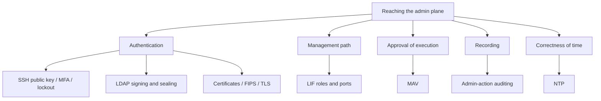

# Which controls protect the admin plane?

Protecting the admin plane cannot be stated as one setting. Approval, authentication, certificates, directory, auditing, management path, and time are separate controls, and what is configurable on FSx for ONTAP differs per item.

<!-- lang-switcher:start -->
🌐 [日本語](../../../../ja/domains/security-governance/notes/admin-plane-protection-depends-on-several-controls.md) | [English](admin-plane-protection-depends-on-several-controls.md) | [🏠 Repository home](../../../README.md)
<!-- lang-switcher:end -->

## What you will learn

- That several controls protect the admin plane, each closing a different attack surface
- That each control is ONTAP-general `documented`, while whether it is configurable on FSx for ONTAP splits per item

## What this note does not answer

- At-rest and in-transit data encryption (covered in [At-rest encryption is automatic; in-transit conditions differ by method](../../../../ja/domains/security-governance/notes/what-the-platform-gives-and-what-stays-yours.md) (日本語))
- The legal / regulatory compliance judgment for each control

## Prerequisite level

intermediate

## Body

[🏠 Repository Top](../../../README.md) | [Domain — Security & Governance](../README.md)

> This is the English translation. Japanese is authoritative for technical accuracy. Please report any discrepancy.

---

### Conclusion

**"We hardened the admin plane" does not hold as one setting.** Who can run an admin operation, by which path, and what records it, are decided by a set of independent controls. The controls that NetApp's TR-4569 (Security hardening guide for ONTAP, published on docs.netapp.com, as of 2025-04-17) organizes as ONTAP-general configuration guidance split, when sorted by whether they are configurable on FSx for ONTAP, by item as follows.

| Control | Attack surface it closes | ONTAP-general (TR-4569) | Configurable on FSx for ONTAP |
|---|---|---|---|
| Multi-admin verification (MAV) | Destructive operations by a single admin | `documented` | **unverified** (see "MAV" below) |
| SSH public key / MFA / login banner / account lockout | Credential theft, brute force | `documented` | partly `documented`, partly **unverified** |
| Certificates (CA-signed, OCSP) and FIPS / TLS | Eavesdropping, impersonation of traffic | `documented` | **unverified** |
| LDAP signing and sealing | Tampering, eavesdropping of directory traffic | `documented` | **unverified** |
| Admin-action auditing | A gap in "who did what" | `documented` | partly `documented` |
| LIF roles and the ports they open | Over-exposure of the management path | `documented` | partly `documented` |
| NTP (time synchronization) | Breakdown of certificate validation and log correlation | `documented` | **unverified** |

> **Evidence**: `documented`. The existence and recommended settings of each control draw on TR-4569 (Security hardening guide for ONTAP, docs.netapp.com, as of 2025-04-17). **The TR values are ONTAP-general.** Whether the same is configurable on FSx for ONTAP is split out as **unverified** unless an AWS page states it or it was measured. The commands the `fsxadmin` role can run are a subset of all of ONTAP, so a control that assumes the ONTAP CLI is not necessarily configurable with the FSx for ONTAP delegated-admin permission.

**Data-path encryption is out of scope for this note.** NFS over TLS and SMB signing are covered in [At-rest encryption is automatic; in-transit conditions differ by method](../../../../ja/domains/security-governance/notes/what-the-platform-gives-and-what-stays-yours.md) (日本語), so they are not repeated here.

---

### Decomposing the controls that protect the admin plane

The admin plane is the path from which storage is configured and operated. It must be protected separately from the data path (the path on which clients read and write files), and TR-4569 assigns several controls to this plane. The attack surfaces they close do not overlap.

The diagram above is a summary of the table below (the same content is placed in a table, for environments where mermaid does not render).

| Plane | Control | What happens without it |
|---|---|---|
| Authentication | SSH public key / MFA / lockout | Credentials alone make you an admin |
| Authentication | LDAP signing and sealing | Tampered directory responses skew authorization |
| Authentication | Certificates / FIPS / TLS | Eavesdropping and impersonation of management traffic |
| Management path | LIF roles and ports | Unneeded services reachable from outside |
| Approval of execution | MAV | A single admin can complete a destructive operation |
| Recording | Admin-action auditing | "Who did what" cannot be answered |
| Time | NTP | Certificate validation and log correlation do not hold |

---

### MAV (multi-admin verification)

**MAV is a control that keeps a destructive operation from being completed by a single admin.** Per TR-4569, it is available from ONTAP 9.11.1 onward, and specified operations such as deleting volumes or snapshots can be executed only after approval by designated administrators (`documented`, TR-4569 Multi-admin verification, as of 2025-04-11). Once enabled, each operation goes through three steps: request → approval → completion.

**Whether MAV can be enabled and operated with the FSx for ONTAP delegated admin (`fsxadmin`) is unverified.** MAV is a control configured through the ONTAP CLI / REST, and its configurability is not confirmable from an AWS page. A sibling repository carries an FSx for ONTAP MAV configuration procedure (`documented`), but there is no measured record that it was enabled with `fsxadmin`, so configurability is treated as **unverified**.

- [MAV configuration on FSx for ONTAP](https://github.com/Yoshiki0705/FSx-for-ONTAP-Cyber-Resilience-Patterns/blob/main/docs/ontap-native/mav-configuration.md) — `documented` sibling material. **Not `verified`**
- [Constraints of the `fsxadmin` role](https://github.com/Yoshiki0705/FSx-for-ONTAP-Cyber-Resilience-Patterns/blob/main/docs/ontap-native/fsxadmin-limitations.md) — the commands a delegated admin can run are a subset of all of ONTAP

> **Teardown note**: **If MAV approval covers `volume delete` or `snapshot delete`, a verification environment cannot be deleted unless the approvers convene.** MAV is a control that stops destructive operations, so it also stops teardown, which is itself a destructive operation. When the admins in the approval group are away or gone, or the required number of approvers is not met, the verification volumes or file systems cannot be deleted and billing continues. In a design that recommends MAV, **state the teardown path (who can approve, and what to do when the approvers do not convene) in the same section.** TR-4569 states that MAV is not suited to workloads with heavy automation, and recommends applying rules only to volumes under a particular naming scheme when combining automation with MAV (`documented`, as of 2025-04-11). The treatment of the irreversibility of delete-blocking settings is in [Approval for an irreversible operation is taken separately](../../../../ja/domains/security-governance/notes/irreversible-operations-need-separate-approval.md) (日本語).

---

### SSH public key / MFA / login banner / account lockout

TR-4569 recommends SSH as the most secure method for management access (`documented`, System administration methods, docs.netapp.com as of 2026). The controls on this surface are the following four.

| Control | ONTAP-general (TR-4569) | Configurable on FSx for ONTAP |
|---|---|---|
| SSH public-key authentication | Recommended over passwords; register the public key on the admin account | **unverified** (key registration for the delegated admin not confirmed from an AWS page) |
| MFA (multi-factor authentication) | Combinations such as public key + password, or certificate + password | **unverified** |
| Login banner | Display a legal / operational notice on connection | **unverified** |
| Account lockout | Temporarily disable an account after repeated failures | **unverified** |

**On FSx for ONTAP the admin account is delegated to `fsxadmin`, and whether these controls can be configured with the delegated-admin permission is unverified per item.** The commands `fsxadmin` can run are a subset of all of ONTAP, so a configuration procedure that assumes the ONTAP CLI is not necessarily usable as-is.

> **Security note**: there is a pitfall in the `fsxadmin` password itself. A sibling repository's verification records a case where a template-generated `fsxadmin` password did not become the effective password (the exclusion-character specification at password generation was insufficient, so a generated password containing symbols did not match the secret value). The measurement details are in [Verification status](https://github.com/Yoshiki0705/S3-Burst-on-ONTAP-Files/blob/main/docs/ja/verification-status.md) (here it is cited by link rather than restated).

---

### Certificates (CA-signed, OCSP) and FIPS / TLS

TR-4569 covers using CA-signed certificates for management traffic and external integration, combining OCSP for revocation checking, and setting FIPS mode and the TLS version according to the cryptographic strength requirement (`documented`, TR-4569).

| Control | ONTAP-general (TR-4569) | Configurable on FSx for ONTAP |
|---|---|---|
| CA-signed certificate | CA-signed recommended over self-signed | **unverified** |
| Revocation checking via OCSP | Check certificate revocation online | **unverified** |
| FIPS mode | Limit to approved algorithms | **unverified** |
| TLS version | Disable weak versions | **unverified** |

**These assume configuration through the ONTAP CLI, and whether they can be changed with the FSx for ONTAP delegated-admin permission is not confirmable from an AWS page.** All are treated as **unverified** and are not placed as a design premise.

---

### LDAP signing and sealing

TR-4569 covers enabling signing (tamper detection) and sealing (encryption) on communication with Active Directory / LDAP (`documented`, TR-4569 LDAP Signing and Sealing). Unsigned LDAP communication leaves room for an authorization decision to be skewed by a tampered response.

**Whether LDAP signing and sealing can be configured on an FSx for ONTAP SVM is unverified.** The AD-join and LDAP configuration paths are usable on FSx for ONTAP too, but whether the individual signing / sealing settings are possible with the delegated-admin permission is not confirmable from an AWS page, so it is **unverified**.

---

### Admin-action auditing

TR-4569 covers recording admin operations (configuration changes, logins, and so on) in the audit log (`documented`, TR-4569). This is a different plane from data-path auditing (who read which file), and it exists to answer "who ran which admin operation".

| Plane | What it records | Handling on FSx for ONTAP |
|---|---|---|
| Admin-action auditing | Configuration changes, admin logins | partly `documented` (uses the ONTAP audit mechanism) |
| Data-path auditing | Reads and writes of files | Already covered in an existing note. Has a gap (link below) |

Data-path auditing has a documented gap (reads that leave no record), covered in [Two faces of auditing, and the hole in one of them](../../../../ja/domains/security-governance/notes/what-the-platform-gives-and-what-stays-yours.md#監査の-2-つの面と片方の穴の存在) (日本語). This note is limited to the admin-operation plane. The coverage of SMB logon audit events is in [4624 is recorded, but what it counts is sessions](smb-logon-audit-event-coverage.md).

---

### LIF roles and the ports they open

TR-4569 covers assigning roles to LIFs (logical interfaces), separating management, data, and intercluster use, and keeping the ports each service opens to the minimum needed (`documented`, TR-4569). Not placing data protocols on a management LIF reduces the exposure of the management path.

**On FSx for ONTAP the LIF configuration is managed, and part of the management path is managed by AWS.** Which service policies a delegated admin can change splits per item: part is `documented`, part is **unverified**. The reachability of the admin plane (from where the management LIF can be reached) is, on FSx for ONTAP, decided in combination with the network-side design (security groups, subnets).

---

### NTP (time synchronization)

TR-4569 covers synchronizing time with a trusted NTP server (`documented`, TR-4569). When time drifts, certificate expiry validation goes wrong and the time correlation of audit logs stops holding. Because many of the admin-plane controls depend on the correctness of time, NTP is not a standalone control but a precondition.

**Whether a delegated admin can specify the NTP server on FSx for ONTAP is unverified.** Whether the time-synchronization path is managed on the AWS side or configured on the ONTAP side is not confirmable from an official page, so it is **unverified**.

---

### How to choose — which control to start with

**You do not have to configure everything at once.** The controls close different attack surfaces, so the order can be set by the environment's risk. The trade-offs of each are listed symmetrically.

| Priority to start | Control | Effect | Trade-off (including this control's own constraints) |
|---|---|---|---|
| First | Admin-action auditing | "Who did what" can be traced afterward | Needs capacity management of the audit destination ([An exhausted audit destination stops access](audit-log-space-and-client-access.md)) |
| First | NTP | Precondition for certificate validation and log correlation | Configurability unverified. If the premise breaks, other controls do not function |
| Next | SSH public key / MFA / lockout | Stronger against credential theft | Operational cost of keys and MFA. Configurability with the delegated admin is unverified per item |
| Next | Certificates / FIPS / TLS, LDAP signing and sealing | Stronger against eavesdropping and tampering of traffic | Certificate renewal operations. Configurability unverified |
| In an environment with many destructive operations | MAV | Stops a single admin's destructive operations | **Also stops teardown.** Poor fit with automation (see "MAV" above) |

**The order is decided by risk.** Auditing and time are preconditions for other controls, so they come first; approval (MAV) has a teardown impact, so it comes after the environment's risk is weighed. The constraints of the recommended control (MAV) are listed in the same table.

---

### Phased adoption

| Phase | What to do | What it confirms |
|---|---|---|
| 1. Design | Fix which controls are configurable on FSx for ONTAP, per item (re-derive this note's `documented` / unverified split in your own environment) | Which controls can be configured with the delegated-admin permission |
| 2. Build | Configure auditing and NTP first, then follow with authentication (SSH keys, MFA) | Whether the precondition controls hold |
| 3. Operate | If adopting MAV, decide the teardown approval path first | Whether a state is created in which the verification environment cannot be deleted |

---

### Common misconceptions

| Misconception | Reality |
|---|---|
| The admin plane can be hardened with one setting | **It is a combination of several independent controls.** Each closes a different attack surface |
| If it is in TR-4569, it is also configurable on FSx for ONTAP | **The TR values are ONTAP-general.** Whether it is configurable on FSx for ONTAP splits per item, and much is unverified |
| A delegated admin (`fsxadmin`) can configure everything in ONTAP | **The runnable commands are a subset.** A control assuming the ONTAP CLI is not necessarily configurable |
| MAV makes it safe once added | **It also stops teardown.** If approval covers delete, the verification environment cannot be deleted unless the approvers convene |
| NTP can wait | **It is a precondition for other controls.** When time drifts, certificate validation and log correlation break down |
| The sibling repository's MAV procedure is verified | **It is `documented`, not `verified`.** There is no measured record that it was enabled with `fsxadmin` |

## Verify it in your environment

**This procedure is read-only and enables no control.** Enabling MAV, auditing, certificates, and so on must follow the approval gate in [Approval for an irreversible operation is taken separately](../../../../ja/domains/security-governance/notes/irreversible-operations-need-separate-approval.md) (日本語) first.

| # | Step | What it confirms |
|---|---|---|
| 1 | List the commands the delegated admin can run with `security login role show -role fsxadmin -access !none` | Whether each control in this note is configurable with `fsxadmin` |
| 2 | Match the configuration command of the target control (e.g. NTP, SSH key) against the list in step 1 | The `documented` / unverified split can be re-derived in your own environment |
| 3 | If considering MAV, decide first whether to include `volume delete` / `snapshot delete` in the approval scope | Whether a delete-blocking setting is created |

The overall picture of the adoption procedure is in [Evidence policy](../../../evidence-policy.md#before-adopting-into-production).

---

### Primary sources consulted

| Point | Source |
|---|---|
| The organization of controls that protect the admin plane (ONTAP-general) | [TR-4569: Security hardening guide for ONTAP](https://docs.netapp.com/us-en/ontap-technical-reports/ontap-security-hardening/security-hardening-overview.html) |
| That MAV is available from ONTAP 9.11.1 onward, that deletes and such can be executed only after approval, and that it is not suited to heavy automation | [TR-4569: Multi-admin verification](https://docs.netapp.com/us-en/ontap-technical-reports/ontap-security-hardening/multi-admin-verify.html) |
| That SSH is the recommended method for management access | [TR-4569: System administration methods](https://docs.netapp.com/us-en/ontap-technical-reports/ontap-security-hardening/sysadmin-methods.html) |

---

### Related documents

- [Domain — Security & Governance](../README.md) — the hub for this module
- [At-rest encryption is automatic; in-transit conditions differ by method](../../../../ja/domains/security-governance/notes/what-the-platform-gives-and-what-stays-yours.md) (日本語) — data-path encryption (including NFS over TLS and SMB signing). This note does not cover the data path
- [Approval for an irreversible operation is taken separately](../../../../ja/domains/security-governance/notes/irreversible-operations-need-separate-approval.md) (日本語) — the approval gate for delete-blocking settings such as MAV and SnapLock
- [4624 is recorded, but what it counts is sessions](smb-logon-audit-event-coverage.md) — the coverage of SMB logon audit events
- [An exhausted audit destination stops access](audit-log-space-and-client-access.md) — the availability impact of enabling auditing
- [Evidence policy](../../../evidence-policy.md)

## Read next

[Domain — Security & Governance](../README.md)
