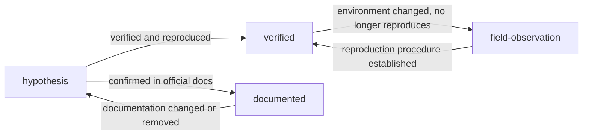

# Evidence Policy

<!-- lang-switcher:start -->
🌐 [日本語](../ja/evidence-policy.md) | [English](evidence-policy.md) | [🏠 Repository home](README.md)
<!-- lang-switcher:end -->

---

## Conclusion

Every piece of knowledge in this repository carries an `evidence` field with one of four values. Read it to judge **how far a given statement can be relied on in your own environment**. The field is machine-readable frontmatter, and `make lint` enforces the metadata each tier requires.

Promoting a tier (moving it toward higher confidence) requires adding the corresponding evidence. Demoting is always allowed.

---

## The four tiers

| Tier | Meaning | Required metadata | How readers should treat it |
|---|---|---|---|
| `verified` | The author actually reproduced it in the stated environment | `verified_on` (date) + environment stated in the body | Trustworthy under those conditions. Different conditions require re-verification |
| `documented` | Stated in vendor or AWS official documentation | `source` (URL or document name) | Usable as primary information, with attention to version and region differences |
| `field-observation` | Observed once in the field, reproduction not confirmed | Body must state "not reproduced" | A lead for a hypothesis. Must not be generalized |
| `hypothesis` | A logically derived expectation, untested | Body must state "untested" | A starting point for verification. Cannot ground a decision |

---

## Why this distinction is necessary

Information gathered in field technical-support work differs sharply in character:

- Statements written in official documentation
- Measurements reproduced in a verification environment
- Behavior observed once, with no root cause identified
- "It is probably like this" reasoning

Written in the same voice, a reader cannot tell them apart. In particular, presenting **behavior observed once** as if it were a general specification leads readers to design against a false premise. Making the tier explicit keeps the strength of a statement aligned with the strength of its evidence.

---

## Mandatory conditions when publishing a number

Every `verified` number must be accompanied by its measurement conditions. A number without conditions cannot be reproduced, and a number that cannot be reproduced cannot support a decision.

| Item to state | Example |
|---|---|
| ONTAP version | `9.17.1P7D1` |
| Region | `ap-northeast-1` |
| Configuration | Throughput setting, volume type, client type |
| Measurement method | Tool, concurrency, file size, number of runs |
| Measurement date | `2026-08-06` |

And always make these distinctions explicit:

| Distinction | What happens when they blur |
|---|---|
| Sample run vs production estimate | A single measurement becomes the basis for capacity planning |
| This test environment vs general service limit | An environment-specific value gets cited as a service specification |
| Design consideration vs legal / compliance judgment | Guidance gets treated as legal grounding |
| AI assistive signal vs final decision | An automated verdict is finalized without human confirmation |

---

## Promotion and demotion



| Transition | Work required |
|---|---|
| → `verified` | State the environment, add `verified_on`, document the reproduction steps in the body |
| → `documented` | Add the `source` URL. Verbatim quotes ≤ 30 words; paraphrase by default |
| `verified` → `field-observation` | Record in the body why it stopped reproducing. Keep the value as history rather than deleting it |
| → `hypothesis` | State why the supporting evidence was lost |

**Demotion is not a quality regression.** Honestly showing that evidence was lost is safer for readers than leaving a stale `verified` in place.

---

## Common misconceptions

| Misconception | Reality |
|---|---|
| `documented` is the most trustworthy tier | Documentation and implementation can diverge. `verified` is a fact about your own environment |
| `verified` means production will behave the same | It is a measurement in a test environment. Different production configuration or load changes the result |
| `field-observation` should not be published | It is worth publishing, as long as it is not generalized and the lack of reproduction is explicit |
| A note has no value unless its tier is raised | Sharing a `hypothesis` as a starting point for verification also has value |

---

## Writing the frontmatter

```yaml
---
title: Triaging low throughput during SnapMirror initial sync
lifecycle: [migrate]
domains: [performance]
evidence: verified
verified_on: 2026-08-06
ontap_version: 9.17.1P7D1
region: ap-northeast-1
lang: en
---
```

What `make lint` checks:

- When `evidence: verified`, that `verified_on` exists and is not a future date
- When `evidence: documented`, that `source` exists
- When `evidence: field-observation`, that the body states the observation was not reproduced
- When `evidence: hypothesis`, that the body states it is untested
- That `lifecycle` and `domains` values come from the defined vocabulary

---

## Related documents

- [Navigation Guide](navigation.md)
- [CONTRIBUTING.md](../../CONTRIBUTING.md)
- [AGENTS.md](../../AGENTS.md) — conventions for AI agents
- [Repository home](README.md)

---

<!-- lang-switcher:start -->
🌐 [日本語](../ja/evidence-policy.md) | [English](evidence-policy.md) | [🏠 Repository home](README.md)
<!-- lang-switcher:end -->
