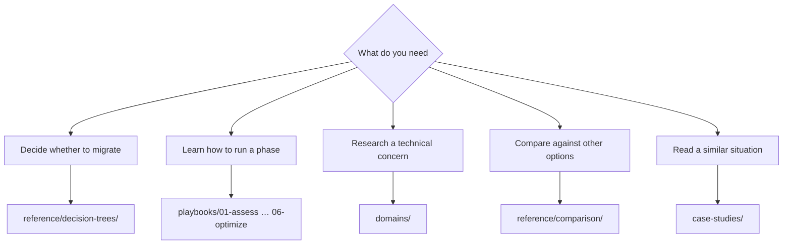

# Navigation Guide

[日本語](../ja/navigation.md) | [🏠 Repository home](../../README.en.md)

---

## Conclusion

There are two entry points. **Enter through `playbooks/` when your question is "which phase am I in", and through `domains/` when it is "I need to research this concern."** Either path reaches the same notes. If you are still deciding on the decision itself, start from `reference/decision-trees/`.

---

## Where to start

---

## Lifecycle axis — `playbooks/`

The entry point that follows project progression. Each phase's output is the next phase's input.

| # | Module | Primary output | Read next |
|---|---|---|---|
| 01 | [Assess](../../playbooks/01-assess/) | Current inventory, constraint list | 02 Design |
| 02 | [Design](../../playbooks/02-design/) | Configuration decisions, irreversible items settled | 03 Migrate |
| 03 | [Migrate](../../playbooks/03-migrate/) | Migration plan, cutover procedure, rollback procedure | 04 Build |
| 04 | [Build](../../playbooks/04-build/) | Infrastructure as code, automation, post-build verification | 05 Operate |
| 05 | [Operate](../../playbooks/05-operate/) | Monitoring design, runbooks | 06 Optimize |
| 06 | [Optimize](../../playbooks/06-optimize/) | Performance and cost improvement results | — |

---

## Topic axis — `domains/`

The entry point that starts from a concern. Referenced across all lifecycle phases.

| Module | Typical question |
|---|---|
| [Data protection](../../domains/data-protection/) | How to design Snapshot policy / can we actually recover |
| [Data utilization](../../domains/data-utilization/) | Can analytics and AI use this without multiplying copies |
| [Security & governance](../../domains/security-governance/) | How to design encryption, audit, and permissions |
| [Performance](../../domains/performance/) | Where throughput is determined and where it is shared |
| [Cost](../../domains/cost/) | Why estimates and measurements diverge |
| [Multiprotocol & identity](../../domains/multiprotocol-identity/) | Why permissions disagree between NFS and SMB |

---

## Cross-cutting reference — `reference/`

| Directory | When to use it |
|---|---|
| [Decision trees](../../reference/decision-trees/) | Several options exist and you need to pick one |
| [Comparison matrices](../../reference/comparison/) | You need the trade-offs against other options laid out |
| [Limits and quotas](../../reference/limits/) | You need to confirm a design will not hit a limit |
| [Glossary](../../reference/glossary/) | You need the definition of an ONTAP or AWS term |

---

## Case studies — `case-studies/`

[Case Studies](../../case-studies/) carries findings from field technical-support work as **generalized lessons**. They contain no company or organization names, no real identifiers, and no configuration that could identify an organization.

Each case study follows this shape:

| Section | Contents |
|---|---|
| Situation | Industry and scale band only (e.g. manufacturing / several hundred TB) |
| Problem | What was going wrong |
| Options considered | Alternatives that were not chosen, and why |
| Decision | What was chosen and on what reasoning |
| Outcome | What actually happened, including where it did not match expectations |
| Generalizable lesson | The part that transfers to other environments |

---

## How to read the confidence level

Each note's frontmatter carries an `evidence` tier. **Do not cite a note without checking it.**

| Tier | In one line |
|---|---|
| `verified` | Reproduced by the author in the stated environment |
| `documented` | Stated in official documentation |
| `field-observation` | Observed once, not reproduced. Not generalizable |
| `hypothesis` | Reasoned expectation, untested |

See the [Evidence Policy](evidence-policy.md) for details.

---

## Common misconceptions

| Misconception | Reality |
|---|---|
| `playbooks/` and `domains/` hold different information | They reference the same notes from two axes. Not duplication, but multiple paths in |
| Numbers can be applied directly to your environment | A number comes with its measurement environment. Different conditions require re-verification |
| Case studies include concrete configurations | They are deliberately abstracted. Nothing that could identify an organization is included |
| Limit values are always current | `reference/limits/` entries carry verification dates. Re-check anything with an old date |

---

## Related documents

- [Evidence Policy](evidence-policy.md)
- [CONTRIBUTING.md](../../CONTRIBUTING.md) — authoring conventions
- [AGENTS.md](../../AGENTS.md) — conventions for AI agents
- [llms.txt](../../llms.txt) — repository map for LLMs

---

[日本語](../ja/navigation.md) | [🏠 Repository home](../../README.en.md)
