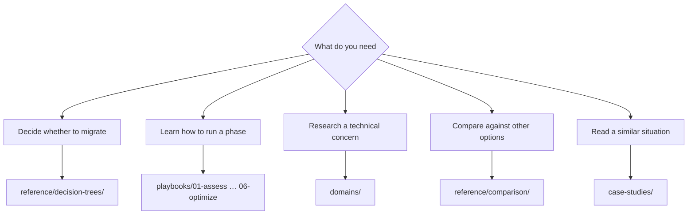

# Navigation Guide

<!-- lang-switcher:start -->
🌐 [日本語](../ja/navigation.md) | [English](navigation.md) | [한국어](../ko/navigation.md) | [简体中文](../zh-CN/navigation.md) | [繁體中文](../zh-TW/navigation.md) | [Français](../fr/navigation.md) | [Deutsch](../de/navigation.md) | [Español](../es/navigation.md) | [🏠 Repository home](README.md)
<!-- lang-switcher:end -->

---

## Conclusion

There are three entry points. **If this is your first visit, start from [Start from your environment](#start-from-your-environment)** — pick the row that matches your configuration and it gives you a reading order.

Otherwise, enter through `playbooks/` when your question is "which phase am I in", and through `domains/` when it is "I need to research this concern." Either path reaches the same notes. If several options are on the table and you cannot pick, start from `reference/decision-trees/`.

---

## Where to start

---

## Start from your environment

The branches above start from "what do you want to know". Use this table instead to start from
**"given my configuration, what should I read"**. The left column describes your environment; the
rest gives a reading order.

| Your environment | Read first | Read next |
|---|---|---|
| Source is ONTAP (on premises or another cloud) | [Migration method decision tree](../ja/reference/decision-trees/migration-method.md) (日本語) | [Assess](playbooks/01-assess/) → [Design](playbooks/02-design/) |
| Source is a Windows file server (SMB, NTFS ACLs must be preserved) | [Migration method decision tree](../ja/reference/decision-trees/migration-method.md) (日本語) | [Multiprotocol identity](domains/multiprotocol-identity/) |
| Source is a non-ONTAP NAS | [Migration method decision tree](../ja/reference/decision-trees/migration-method.md) (日本語) | [Assess](playbooks/01-assess/) |
| NFS and SMB against the same data | [Security style determines the permission model](../ja/domains/multiprotocol-identity/notes/security-style-and-permission-evaluation.md) (日本語) | [Security and governance](domains/security-governance/) |
| Active Directory integration is a given | [Multiprotocol identity](domains/multiprotocol-identity/) | [Design](playbooks/02-design/) |
| Greenfield, nothing to migrate | [Design](playbooks/02-design/) | [Build](playbooks/04-build/) → [Operate](playbooks/05-operate/) |
| Already running, tuning performance | [Performance](domains/performance/) | [Optimize](playbooks/06-optimize/) |
| Already running, reviewing cost | [Cost](domains/cost/) | [Optimize](playbooks/06-optimize/) |
| Checking whether a design hits a limit | [Limits and quotas](../ja/reference/limits/) | [Design](playbooks/02-design/) |
| Reaching the data over the S3 API or from an analytics platform | [Prerequisites for FSx for ONTAP S3 AP](../ja/domains/data-utilization/notes/s3-access-point-constraints.md) (日本語) | [Writing the access point policy](domains/security-governance/notes/access-point-authorization-layers.md) |

Two things to know about the links above.

| Marking | What to expect |
|---|---|
| **(日本語)** | Not translated. Prose *and* diagram labels are Japanese, so treat these as a pointer to the topic, not as the explanation. URLs, commands, and product terms are still language-neutral |
| `reference/` links, unmarked | Written as bilingual single files — Japanese and English share the same tables, so these are readable as they are |

Translation requests are welcome as an
[Issue](https://github.com/Yoshiki0705/FSx-for-ONTAP-Adoption-Playbook/issues).

**Do not apply anything you read here directly to production.** Check each note's `evidence` tier
and work through [Before adopting into production](evidence-policy.md#before-adopting-into-production).

---

## Lifecycle axis — `playbooks/`

The entry point that follows project progression. Each phase's output is the next phase's input.

| # | Module | Primary output | Read next |
|---|---|---|---|
| 01 | [Assess](playbooks/01-assess/) | Current inventory, constraint list | 02 Design |
| 02 | [Design](playbooks/02-design/) | Configuration decisions, irreversible items settled | 03 Migrate |
| 03 | [Migrate](playbooks/03-migrate/) | Migration plan, cutover procedure, rollback procedure | 04 Build |
| 04 | [Build](playbooks/04-build/) | Infrastructure as code, automation, post-build verification | 05 Operate |
| 05 | [Operate](playbooks/05-operate/) | Monitoring design, runbooks | 06 Optimize |
| 06 | [Optimize](playbooks/06-optimize/) | Performance and cost improvement results | — |

---

## Topic axis — `domains/`

The entry point that starts from a concern. Referenced across all lifecycle phases.

| Module | Typical question |
|---|---|
| [Data protection](domains/data-protection/) | How to design Snapshot policy / can we actually recover |
| [Data utilization](domains/data-utilization/) | Can analytics and AI use this without multiplying copies |
| [Security & governance](domains/security-governance/) | How to design encryption, audit, and permissions |
| [Performance](domains/performance/) | Where throughput is determined and where it is shared |
| [Cost](domains/cost/) | Why estimates and measurements diverge |
| [Multiprotocol & identity](domains/multiprotocol-identity/) | Why permissions disagree between NFS and SMB |

---

## Cross-cutting reference — `reference/`

| Directory | When to use it |
|---|---|
| [Decision trees](../ja/reference/decision-trees/) | Several options exist and you need to pick one |
| [Comparison matrices](../ja/reference/comparison/) | You need the trade-offs against other options laid out |
| [Limits and quotas](../ja/reference/limits/) | You need to confirm a design will not hit a limit |
| [Glossary](../ja/reference/glossary/) | You need the definition of an ONTAP or AWS term |

---

## Hands-on workshops — `workshop-studio/`

| Directory | When to use |
|---|---|
| [`workshop-studio/`](../ja/workshop-studio/) | Measured timings and module selection to fit a public AWS Workshop Studio workshop into the available time slot (日本語) |

---

## Case studies — `case-studies/`

[Case Studies](case-studies/) carries findings from field technical-support work as **generalized lessons**. They contain no company or organization names, no real identifiers, and no configuration that could identify an organization.

Each case study follows this shape:

| Section | Contents |
|---|---|
| Situation | Industry and scale band only (e.g. manufacturing / several hundred TB) |
| Problem | What was going wrong |
| Options considered | Alternatives that were not chosen, and why |
| Decision | What was chosen and on what reasoning |
| Outcome | What actually happened, including where it did not match expectations |
| Generalizable lesson | The part that transfers to other environments |

---

## How to read the confidence level

Each note's frontmatter carries an `evidence` tier. **Do not cite a note without checking it.**

| Tier | In one line |
|---|---|
| `verified` | Reproduced by the author in the stated environment |
| `documented` | Stated in official documentation |
| `field-observation` | Observed once, not reproduced. Not generalizable |
| `hypothesis` | Reasoned expectation, untested |

See the [Evidence Policy](evidence-policy.md) for details.

---

## Common misconceptions

| Misconception | Reality |
|---|---|
| `playbooks/` and `domains/` hold different information | They reference the same notes from two axes. Not duplication, but multiple paths in |
| Numbers can be applied directly to your environment | A number comes with its measurement environment. Different conditions require re-verification |
| Case studies include concrete configurations | They are deliberately abstracted. Nothing that could identify an organization is included |
| Limit values are always current | `reference/limits/` entries carry verification dates. Re-check anything with an old date |

---

## Related documents

- [Evidence Policy](evidence-policy.md)
- [CONTRIBUTING.md](../../CONTRIBUTING.md) — authoring conventions
- [AGENTS.md](../../AGENTS.md) — conventions for AI agents
- [llms.txt](../../llms.txt) — repository map for LLMs

---

<!-- lang-switcher:start -->
🌐 [日本語](../ja/navigation.md) | [English](navigation.md) | [한국어](../ko/navigation.md) | [简体中文](../zh-CN/navigation.md) | [繁體中文](../zh-TW/navigation.md) | [Français](../fr/navigation.md) | [Deutsch](../de/navigation.md) | [Español](../es/navigation.md) | [🏠 Repository home](README.md)
<!-- lang-switcher:end -->
