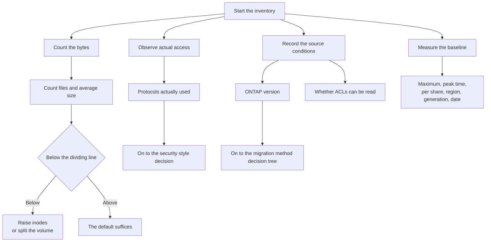

# You can run out of writes with capacity to spare

<!-- lang-switcher:start -->
🌐 [日本語](../../../../ja/playbooks/01-assess/notes/counting-bytes-is-not-counting-files.md) | [English](counting-bytes-is-not-counting-files.md) | [🏠 Repository home](../../../README.md)
<!-- lang-switcher:end -->

[🏠 Repository Top](../../../README.md) | [Playbook 01 — Assess](../README.md)

This is the English translation. Japanese is authoritative for technical accuracy.

---

## Conclusion

**An inventory that counts only bytes leads to a volume that cannot be written to while capacity remains.**

A volume counts files, directories, and Snapshot copies with inodes (file pointers). **Once inodes are exhausted, no new file can be created on that volume even with free space available.**

And the **symptom is misleading**, which was confirmed by measurement. The error is `No space left on device`, which points at capacity — and capacity is free. **Only creation stops; writes to existing files continue.** Details are in [What happens when they run out](#what-happens-when-they-run-out).

The default is **one per 32 KiB**. And **how it grows is where the documentation and measurement disagree.** The documentation states that volumes of 648 GiB and above all cap at 21,251,126, while in the verification environment the count grew in proportion to size. The discrepancy is in [The average file size where it starts to bind](#the-average-file-size-where-it-starts-to-bind).

**The conclusion is the same under either premise: do not assume a number, read `FilesCapacity` in your own environment.** Where many files are small, inodes can run out before capacity does.

> **Evidence**: `documented` — the inode default, limits, and behaviour rest on AWS documentation.
> The average file sizes below are **arithmetic from published defaults**, not measured values.
> Steps for measuring your own environment are in
> "[Confirming this in your own environment](#confirming-this-in-your-own-environment)".

---

## The average file size where it starts to bind

**This is where the documentation and measurement disagree. Both are given.**

The AWS documentation states that **volumes of 648 GiB and above all default to 21,251,126**. If that holds, larger volumes have less headroom per file, and an environment with a small average file size exhausts inodes before capacity.

**Measurement, however, did not reach that cap.** In the verification environment the count grew in proportion to volume size.

| Volume | Size | Measured `FilesCapacity` | Bytes / inode |
|---|---|---|---|
| 100 GiB FlexVol (two of them) | 107,374,182,400 B | **3,112,959** | 34,493 |
| 1 TiB FlexVol | 1,099,511,627,776 B | **31,876,709** | 34,493 |
| 2 TiB FlexVol | 2,199,023,255,552 B | **63,753,417** | 34,493 |
| ~1.85 TiB FlexGroup (three constituents) | 2,034,678,398,976 B | **58,988,760** | 34,493 |

**The ratio between the 2 TiB and 1 TiB inode counts is exactly 2.0, and both exceed 648 GiB.** So in this environment nothing capped out.

The values match `size × 0.95 ÷ 32 KiB` almost exactly (off by 1 to 24). **One per 32 KiB of the capacity remaining after roughly 5% reservation** appears to be applied as a default ratio regardless of size.

> **Tier of this section**: `verified` (verified on 2026-08-06). **It sits outside this note's overall
> `documented` tier.** The environment was `ap-northeast-1`, `SINGLE_AZ_1` (first generation), one HA
> pair, 128 MBps throughput, 1,024 GiB SSD, 3,072 SSD IOPS (`AUTOMATIC`). **The ONTAP version was not
> captured at the time of this verification** (`DescribeFileSystems` does not return
> `FileSystemTypeVersion`. **It is obtainable through the ONTAP REST API**; a separate verification
> confirmed `9.17.1P7D1`). Measurement was read-only observation of CloudWatch
> `FilesCapacity` (`Maximum`) alone; no attempt was made to exhaust inodes. The recorded values are in
> [Limits and quotas](../../../../ja/reference/limits/).

**The design conclusion does not change.** Under either premise, **inodes are finite, and exhausting them stops writes even with free capacity.** Only "how soon" differs.

**So do not assume a number — read `FilesCapacity` in your own environment.** The procedure is in [Confirming this in your own environment](#confirming-this-in-your-own-environment). Designing for the capping behaviour leads to splitting volumes unnecessarily; designing for the proportional behaviour runs short where many files are small. **Either way, measuring settles it.**

Inodes can be raised manually, but there is a ceiling.

| Item | Value |
|---|---|
| Default ratio | One per 32 KiB (documentation says up to 648 GiB; measurement did not reach the cap) |
| Ratio it can be raised to | **One per 4 KiB** |
| Per-volume ceiling | **2 billion** |

**2 billion is an absolute ceiling.** Even raised to 2 billion on a 50 TiB volume, an average file size of about 27 KiB is the dividing line. Below that, the volume has to be split.

Raising it is done with ONTAP CLI `volume modify`. The setting that always uses the maximum (`-files-set-maximum true`) requires advanced mode. **It is not enabled by the defaults at creation.**

---

## What happens when they run out

**This was measured.** A 20 MiB volume (the FlexVol minimum) was mounted over NFSv3 and files were created until it stopped.

| Observation | Value |
|---|---|
| Total inodes | 566 |
| **Already used right after creation** | **96** (not zero, even on an empty volume) |
| Files that could be created | 470 |
| `df -i` at exhaustion | `IUsed 566 / IFree 0 / IUse% 100%` |
| **`df -h` at the same moment** | **448K used of 19M (3%)** |
| Creating a new file | **fails**: `No space left on device` |
| Writing data to an existing file | **succeeds** |

**All three matter operationally.**

1. **The error names the wrong resource.** `No space left on device` (`ENOSPC`) reads as a capacity shortage. **Looking at capacity and concluding "there is space" never reaches the cause.**
2. **The symptom is partial.** Creation stops while writes continue, so depending on the application only some operations fail. A fault where "some of it works" is harder to isolate.
3. **Even an empty volume has consumed inodes.** 96 were in use from the start. On a small volume that is not a negligible share.

> **Tier of this section**: `verified` (verified on 2026-08-06). The environment was `ap-northeast-1`,
> `SINGLE_AZ_1` (first generation), one HA pair, 128 MBps throughput, 1,024 GiB SSD, mounted over
> NFSv3. **The ONTAP version was not captured at the time of this verification** (it is obtainable
> through the ONTAP REST API). The record is in [Limits and quotas](../../../../ja/reference/limits/).

**Note that the ratio at 20 MiB does not match the larger volumes.** It works out to 37,052 B/inode, against the 34,493 B/inode observed from 100 GiB to 2 TiB. **The ratio table above cannot be extrapolated down to the minimum size.**

---

## Snapshots that consume inodes

What inodes count is **files, directories, and Snapshot copies**. Raising Snapshot retention consumes inodes too.

A retention design decided on capacity alone misses this share. The relationship between the retention ceiling and capacity is in [Having Snapshots and being able to recover are different things](../../../domains/data-protection/notes/snapshots-are-not-a-recovery-plan.md#limits-and-retention-periods).

**There is also a ceiling on files per directory.** A layout that puts a large number of files in one directory hits that ceiling separately from inodes. Migration tools sometimes fail there.

---

## Working back from decisions you cannot undo

**An inventory is not about adding items.** Only the things that change a later decision are worth measuring.

Put the other way round, **the items you did not measure show up as settings you cannot reverse.**

| Inventory item | The decision it settles | Reference |
|---|---|---|
| File count and average file size | Whether the inode default suffices, or the volume must be split | Above in this note |
| Files per directory | Whether the migration tool runs to completion | Above in this note |
| Protocols actually in use | **The volume's security style.** It changes how permissions are evaluated | [Security style and permission evaluation](../../../domains/multiprotocol-identity/notes/security-style-and-permission-evaluation.md) |
| Whether the migration account can read ACLs | Whether ACLs go missing while the job reports "success" | [ACL preservation is a permissions problem](../../../../ja/playbooks/03-migrate/notes/preserving-acls-during-migration.md#必要な特権) |
| Source ONTAP version | Whether SnapMirror is usable, or an upgrade comes first | [Migration method decision tree](../../../../ja/reference/decision-trees/migration-method.md#バージョン互換性の確認移行元が-ontap-の場合) |
| Region and generation | **The throughput and IOPS ceilings themselves.** First generation is halved outside four regions | [Throughput is not determined by a single value](../../../domains/performance/notes/where-throughput-is-determined-and-shared.md#the-ceiling-varies-by-generation-configuration-and-region) |
| Amount of metadata | SSD capacity. It stays on SSD regardless of the tiering policy | [Monitoring fails on averages](../../05-operate/notes/monitoring-fails-on-averages.md#ssd-used-even-with-tiering-policy-all) |
| Throughput needed in a single namespace | Whether a FlexVol suffices or a FlexGroup is needed | [The unit of sharing is the HA pair](../../../domains/performance/notes/where-throughput-is-determined-and-shared.md#the-unit-of-sharing-is-the-ha-pair) |
| Active Directory dependencies | The SVM's join requirements: domain name, DNS, OU, administrators group | [Pre-production review](../../../../ja/playbooks/04-build/checklists/pre-production-review.md) |
| Performance baseline | Makes "it got slower" after migration verifiable | Below in this note |

---

## The difference between "configured" and "in use"

**A protocol inventory built from configuration data will be wrong.** It produces both shares that are enabled but nobody uses, and paths that are not in the configuration register at all.

The choice of security style follows the access paths that actually exist. **Whether both protocols touch the same data** is the deciding question, and that cannot be answered from configuration — only from observed access.

---

## Capturing a performance baseline in comparable form

When someone says it got slower after the migration, **there is nothing to verify against without a comparison point.** Record the baseline in this shape.

| What to record | Why |
|---|---|
| Maximum, not average | Averages hide saturation. The reason is in [Monitoring fails on averages](../../05-operate/notes/monitoring-fails-on-averages.md) |
| The peak-period value and the time it occurred | An average alone does not describe the conditions to reproduce |
| A breakdown per share and per volume | A whole-system figure cannot identify the volume responsible |
| The region and generation at measurement time | The ceilings themselves differ, so a figure without its conditions cannot be compared |
| The measurement date | To line it up against configuration changes |

**"A figure without its conditions cannot be compared" is the policy across this repository.** Details are in [Evidence classification policy](../../../evidence-policy.md).

---

## Inventory flow

---

## Confirming this in your own environment

**Average file size is what to measure first.** Comparing it against the dividing line alone decides whether the volume design changes.

| # | Step | What it tells you |
|---|---|---|
| 1 | Count total bytes and total files at the source, and divide | Average file size. **Comparing against the table above is enough to decide** |
| 2 | Identify the single directory with the most files | Whether it is near the per-directory ceiling |
| 3 | Look at `FilesCapacity` and `FilesUsed` on the destination | Actual inode consumption. Also visible as "Available files (inodes)" in the console |
| 4 | Observe access over a period and aggregate by protocol | **Actual use, not configuration.** Input for the security style decision |
| 5 | Try reading ACLs with the migration account | Prevents ACLs going missing under a "no errors" result |
| 6 | Record peak-period throughput and IOPS as maximums | The comparison baseline after migration |
| 7 | Record the region and generation | The ceilings themselves differ |

Steps 1 and 2 are self-contained at the source and can run before FSx for ONTAP exists. **Those two alone close off the design decisions that are most expensive to reverse.**

---

## Common misconceptions

| Misconception | Reality |
|---|---|
| Estimating capacity is enough for an inventory | Exhausting inodes means **no new file can be created even with free capacity** |
| `No space left on device` means a capacity shortage | **Inode exhaustion produces the same error.** Capacity may well be free |
| Nothing can be written once inodes run out | **Writes to existing files continue.** Only creation stops |
| An empty volume uses zero inodes | Measurement found 96 already in use |
| Making the volume bigger increases inodes | **The documentation says it caps at 648 GiB; measurement grew in proportion.** Do not assume — read it in your own environment |
| Inodes can be raised without limit later | One per 4 KiB is the ratio ceiling and **2 billion** per volume is absolute |
| Inodes are a count of files | They count files, directories, **and Snapshot copies** |
| Always-use-maximum inodes is the default | It is not. It is set explicitly with ONTAP CLI (advanced mode) |
| Configuration data is enough for a protocol inventory | It produces both enabled-but-unused shares and paths missing from the register |
| Setting the tiering policy to `All` removes the need to size SSD | Metadata always stays on SSD |
| An average is enough for a baseline | Averages hide saturation. Maximums and peak times are needed |
| Recording the numbers alone makes them comparable | Without region, generation, and date they cannot be compared |

---

## Primary sources

| Point | Source |
|---|---|
| The definition of inodes, the default of one per 32 KiB, **the statement that 648 GiB and above is fixed at 21,251,126** (where measurement disagrees), raising to one per 4 KiB, the 2 billion ceiling, and that Snapshot copies are counted | [AWS: Volume storage capacity](https://docs.aws.amazon.com/fsx/latest/ONTAPGuide/volume-storage-capacity.html) |
| The measured `FilesCapacity` (100 GiB / 1 TiB / 2 TiB / FlexGroup) and the environment | Measured. Recorded in [Limits and quotas](../../../../ja/reference/limits/) |
| That exhausting inodes stops writes, and the conditions requiring a manual increase | [AWS: Your volume has insufficient storage capacity](https://docs.aws.amazon.com/fsx/latest/ONTAPGuide/low-volume-capacity.html) |
| The `volume modify` procedure for raising it, and that `-files-set-maximum` is advanced mode | [AWS: Updating the maximum number of files on a volume](https://docs.aws.amazon.com/fsx/latest/ONTAPGuide/increase-volume-max-files.html) |
| The `FilesCapacity` / `FilesUsed` metrics and how to check them in the console | [AWS: Monitoring a volume's file capacity](https://docs.aws.amazon.com/fsx/latest/ONTAPGuide/view-volume-file-capacity.html) |
| That migration tools hit the per-directory file ceiling | [AWS: Troubleshooting issues with DataSync tasks](https://docs.aws.amazon.com/datasync/latest/userguide/troubleshooting-tasks.html) |
| That metadata stays on SSD regardless of the tiering policy | [AWS: Migrating to FSx for ONTAP using NetApp SnapMirror](https://docs.aws.amazon.com/fsx/latest/ONTAPGuide/migrating-fsx-ontap-snapmirror.html) |

---

## Related documents

- [Playbook 01 — Assess](../README.md) — this module's hub
- [Migration method decision tree](../../../../ja/reference/decision-trees/migration-method.md) — choosing a method from the inventory results
- [Security style and permission evaluation](../../../domains/multiprotocol-identity/notes/security-style-and-permission-evaluation.md) — a decision that follows from actual protocol use
- [ACL preservation is a permissions problem, not a tooling problem](../../../../ja/playbooks/03-migrate/notes/preserving-acls-during-migration.md) — permissions to confirm before migrating
- [Throughput is not determined by a single value](../../../domains/performance/notes/where-throughput-is-determined-and-shared.md) — region and generation change the ceilings
- [Monitoring fails on averages](../../05-operate/notes/monitoring-fails-on-averages.md) — why the baseline is taken as maximums
- [Limits and quotas](../../../../ja/reference/limits/) — limits with sources and verification dates
- [Evidence classification policy](../../../evidence-policy.md)

---

[🏠 Repository Top](../../../README.md) | [Playbook 01 — Assess](../README.md)

<!-- lang-switcher:start -->
🌐 [日本語](../../../../ja/playbooks/01-assess/notes/counting-bytes-is-not-counting-files.md) | [English](counting-bytes-is-not-counting-files.md) | [🏠 Repository home](../../../README.md)
<!-- lang-switcher:end -->
