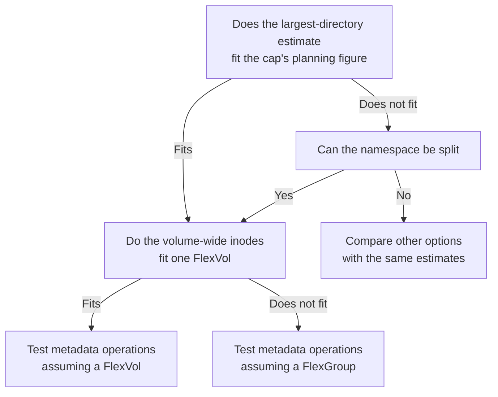

# Does Amazon FSx for NetApp ONTAP suit a high-file-count workload?

The total file count does not decide it. Estimate volume-wide inodes, the largest directory, and how metadata operations concentrate, separately, and check each one fits.

<!-- lang-switcher:start -->
🌐 [日本語](../../../../ja/playbooks/01-assess/notes/file-count-fit-depends-on-namespace-shape.md) | [English](file-count-fit-depends-on-namespace-shape.md) | [🏠 Repository home](../../../README.md)
<!-- lang-switcher:end -->

## What you will learn

- That whether a workload is high-file-count depends on the shape of its namespace, not its total.
- The four estimates to have before deciding, and where each is covered.
- The conditions where FSx for ONTAP suits the workload, the conditions where other options deserve a look, and FSx for ONTAP's own constraints.

## What this note does not answer

- Limits and performance figures of other services (only their names and links to official material).
- Measured metadata-operation performance on FSx for ONTAP (this repository has not measured it).
- The behavior of a configuration that collects data through the S3 API into an origin and distributes it with FlexCache (see "What is not measured, and where it is tracked" below).

## Prerequisite level

intermediate

## Body

[🏠 Repository home](../../../README.md) | [Playbook 01 — Assess](../README.md)

This is the English translation. Japanese is authoritative for technical accuracy.

> **Evidence**: `documented` — the decision criteria come from a NetApp Technical Report (the TR below, a document about ONTAP in general), and the FSx for ONTAP values from AWS documentation. Whether the TR's values and behavior hold on FSx for ONTAP is not verified.
> The TR is NetApp, "High-file-count NAS workloads : ONTAP Technical Reports" (docs.netapp.com; PDF generated 2026-09-30; no version number or revision history). Per-section sources are under each table and in "Primary sources".

---

### Conclusion

**The total file count alone does not decide whether FSx for ONTAP suits a high-file-count workload.** The TR states there is no specific file-count threshold at which every workload becomes high-file-count. The same several million files behave differently spread across many directories than gathered in one.

> "There is no specific file-count threshold at which every workload becomes a high-file-count workload."
> — TR, page "NetApp ONTAP High File Count Workloads for NAS volumes", section "What is meant by a high-file-count workload?"

The decision takes four separate estimates. Volume-wide inodes are covered by [You can run out of writes with capacity to spare](counting-bytes-is-not-counting-files.md), and the largest directory by [What limits how many files fit in one directory?](../../../domains/performance/notes/directory-size-is-capped-separately-from-file-count.md)

---

### What makes a workload high-file-count

| Factor (the TR's list) | What it affects |
|---|---|
| How many files and directories a volume holds | The inode ceiling, and the capacity the inode file uses |
| How many names concentrate in one directory | maxdir-size, and the cost of enumeration |
| How often files are created, opened, enumerated, renamed, and deleted | Node CPU and memory, and client latency |
| File name and path length, character set, and protocol-generated alternate names | How many names fit in one directory |
| Whether access is spread across directories, FlexGroup constituents, and nodes | Parallelism, and concentration on one node |
| How often applications scan or list the whole namespace | The cost of enumeration |
| The number and retention of Snapshot copies | Inodes and capacity, and retained metadata |

Source: TR, page "[NetApp ONTAP High File Count Workloads for NAS volumes](https://docs.netapp.com/us-en/ontap-technical-reports/high-file-count-workloads/high-file-count-workloads-01-overview.html)", section "What is meant by a high-file-count workload?". The right-hand column is this note's arrangement.

---

### Four estimates to have before deciding

| Estimate (TR) | Where to measure | Reference |
|---|---|---|
| Total file-system objects over the workload lifecycle | The source's file and directory counts and their growth | [You can run out of writes with capacity to spare](counting-bytes-is-not-counting-files.md) |
| Peak entries in the largest directory | The largest directory at the source | [What limits how many files fit in one directory?](../../../domains/performance/notes/directory-size-is-capped-separately-from-file-count.md) |
| Peak create, lookup, enumeration, and delete rates | Application processing, and jobs that scan (backup, scanners) | "What is not measured, and where it is tracked" below |
| Capacity for user data, inodes, directories, indexes, Snapshot copies, and growth | Source capacity and retention design | [You can run out of writes with capacity to spare](counting-bytes-is-not-counting-files.md#three-sources-side-by-side) |

Source: TR, page "[Planning approach](https://docs.netapp.com/us-en/ontap-technical-reports/high-file-count-workloads/high-file-count-workloads-13-planning.html)", the opening of the page.

The TR's recommendations page says to keep a volume inode forecast and a largest-directory forecast separately, and not to derive one from the other. A namespace split across many directories can exhaust inodes without any large directory, and one flat directory can reach maxdir-size while millions of inodes remain. Where ACLs are heavy, it says to start from up to twice the projected file and directory count (section "Size maxfiles and maxdir-size independently").

---

### Conditions where FSx for ONTAP suits the workload

| Condition | Basis | How to check |
|---|---|---|
| The namespace can be split wide or deep, and the largest-directory estimate fits the 320 MB default's planning figure | The TR recommends splitting directories (the recommendations page, section "Prefer a sharded directory structure"). The FSx for ONTAP 320 MB default is stated in AWS Prescriptive Guidance | Compare the source's largest directory with [the names table](../../../domains/performance/notes/directory-size-is-capped-separately-from-file-count.md#how-many-names-fit-in-one-directory) |
| The same data is served over SMB and NFS, keeping ACLs and named streams — which also use inodes, so count them | The TR counts ACLs and named streams as inodes (page "High file counts and inode capacity in ONTAP", section "How an inode count increments"). The protocol conditions are in the [file storage options comparison](../../../../ja/reference/comparison/file-storage-options.md#fsx-for-ontap-が適合する条件と適合しない条件) | Add ACLs, named streams, and directories to the inode estimate |
| The volume-wide file count is expected to exceed one FlexVol, and the data can be spread on a FlexGroup | The TR lists FlexGroup for when total capacity, file count, or parallelism is needed (the recommendations page, section "Select the appropriate volume architecture"). FSx for ONTAP offers FlexGroup ([AWS: Managing FSx for ONTAP volumes](https://docs.aws.amazon.com/fsx/latest/ONTAPGuide/managing-volumes.html)) | Check placement and the unit of sharing in [Throughput is not set by one value](../../../domains/performance/notes/where-throughput-is-determined-and-shared.md) |
| Many small files are to be protected with Snapshot and SnapMirror, with the change volume estimated | The TR states that SnapMirror replicates changed metadata as well as file data, so many creates, deletes, or renames can make transfers expensive (page "NetApp ONTAP High File Count Workloads for NAS volumes", section "High-file-count challenges") | Count creates, deletes, and renames per day at the source |

### Conditions where other options deserve a look

| Condition | Basis | How to check |
|---|---|---|
| The application cannot give up one flat directory, and the name estimate exceeds the cap's planning figure (about half for Japanese names) | The TR allows raising maxdir-size but states that the cost of full enumeration remains (page "Impact of maxdir-size", section "Performance impact") | Count the names and their shape in the largest directory, and confirm on the application side why it cannot be split |
| Metadata operations concentrate on one directory and do not parallelize with more nodes | The TR states a FlexGroup does not automatically parallelize operations on one logical directory (the recommendations page, section "Select the appropriate volume architecture") | Measure at the source the share of peak operations aimed at one directory |
| No operation can be sustained that monitors the inode ceiling, inode use, and the largest directory | On FSx for ONTAP the default inode count is not the maximum, and the ceiling is raised manually ([AWS: Updating the maximum number of files on a volume](https://docs.aws.amazon.com/fsx/latest/ONTAPGuide/increase-volume-max-files.html)) | Confirm there is an owner and a procedure for that monitoring and for raising the ceiling |
| Only NFSv4-family protocols are needed, with no Windows, ACLs, or `nconnect` | The conditions in the [file storage options comparison](../../../../ja/reference/comparison/file-storage-options.md#fsx-for-ontap-が適合する条件と適合しない条件) | Observe actual protocol and ACL use at the source |

This note gives no figures for other options. Amazon EFS: [Amazon EFS quotas](https://docs.aws.amazon.com/efs/latest/ug/limits.html). Amazon FSx for OpenZFS: [What is Amazon FSx for OpenZFS?](https://docs.aws.amazon.com/fsx/latest/OpenZFSGuide/what-is-fsx.html). The overall choice: [Choosing an AWS storage service](https://docs.aws.amazon.com/decision-guides/latest/decision-guides/choosing-aws-storage-service.html) and this repository's [file storage selection decision tree](../../../../ja/reference/decision-trees/file-storage-selection.md). For any option, apply the same four estimates, and confirm that option's values in its own official material.

---

### Constraints of FSx for ONTAP itself

| Constraint | Source and tier |
|---|---|
| The default inode count is not the maximum; raising it takes a manual increase | AWS documentation (`documented`) |
| A volume holds up to 2 billion inodes. The gap to the TR's FlexVol absolute ceiling of 2,040,109,451 is not verified | AWS documentation (`documented`); the gap is not verified |
| maxdir-size is a per-volume setting shared by every directory | AWS Prescriptive Guidance (`documented`) |
| AWS Prescriptive Guidance and the TR word differently whether maxdir-size can be lowered after raising it | [What limits how many files fit in one directory?](../../../domains/performance/notes/directory-size-is-capped-separately-from-file-count.md#raising-the-cap-and-where-the-two-documents-differ) |
| The inode file and directory files use volume capacity and do not shrink after deletes | TR (ONTAP in general, `documented`). Not verified on FSx for ONTAP |
| Whether the release-specific features the TR lists (the 9.13.1 default inode change, the 9.14.1 320 MB default, 9.17.1 index placement) are available on your file system | Depends on the ONTAP version; not verified on FSx for ONTAP |

---

### How to choose

The diagram below summarizes the table that follows it. The same content is written in the table too.



| Question | Answer | What to check next |
|---|---|---|
| Does the largest-directory estimate fit the cap's planning figure | Fits | Whether the volume-wide inodes fit one FlexVol |
| Same | Does not fit | Whether the namespace can be split |
| Can the namespace be split | Yes | Whether the volume-wide inodes fit one FlexVol |
| Same | No | Compare other options with the same four estimates |
| Do the volume-wide inodes fit one FlexVol | Fits | Test metadata operations assuming a FlexVol |
| Same | Does not fit | Test metadata operations assuming a FlexGroup |

No end point is a verdict; each names what to check next. On either a FlexVol or a FlexGroup, concentration on one directory remains.

---

### What is not measured, and where it is tracked

This repository has no FSx for ONTAP measurement of metadata operations or enumeration. The TR states that sequential bandwidth tests do not predict this behavior, so test create, lookup, stat, rename, unlink, and enumeration with a cold and a warm cache (the recommendations page, section "Test metadata operations, not only throughput").

> "Sequential bandwidth tests do not predict high-file-count behavior."
> — TR, the recommendations page, same section

Metadata operations and enumeration in a configuration that collects data through the S3 API into an origin and distributes it with FlexCache are tracked as a not-yet-measured item in [S3-Burst-on-ONTAP-Files issue #235](https://github.com/Yoshiki0705/S3-Burst-on-ONTAP-Files/issues/235).

---

### Common misconceptions

| Misconception | Reality |
|---|---|
| A workload is high-file-count once it passes some number of files | The TR states there is no specific threshold. The shape of the namespace and the operation rates decide it |
| Enough capacity means enough files | Inodes run out separately from capacity ([You can run out of writes with capacity to spare](counting-bytes-is-not-counting-files.md)) |
| A throughput test settles it | Sequential bandwidth tests do not predict it. Test metadata operations (TR) |
| A FlexGroup parallelizes operations on one directory too | Operations on one logical directory are not automatically parallelized (TR) |

---

### Primary sources

Every TR row refers to NetApp, "High-file-count NAS workloads : ONTAP Technical Reports" (docs.netapp.com; PDF generated 2026-09-30; no version number or revision history). The recommendations page is [high-file-count-workloads-14](https://docs.netapp.com/us-en/ontap-technical-reports/high-file-count-workloads/high-file-count-workloads-14-best-practices.html).

| Point | Source |
|---|---|
| No specific file-count threshold; the factors that make a workload high-file-count | TR, page "[NetApp ONTAP High File Count Workloads for NAS volumes](https://docs.netapp.com/us-en/ontap-technical-reports/high-file-count-workloads/high-file-count-workloads-01-overview.html)", section "What is meant by a high-file-count workload?" |
| SnapMirror replicating metadata too, so many creates, deletes, or renames can be expensive | Same page, section "High-file-count challenges" |
| The four estimates | TR, page "[Planning approach](https://docs.netapp.com/us-en/ontap-technical-reports/high-file-count-workloads/high-file-count-workloads-13-planning.html)", the opening of the page |
| Keeping two forecasts separately; up to twice the count where ACLs are heavy | The TR's recommendations page, section "Size maxfiles and maxdir-size independently" |
| Splitting directories | Same page, section "Prefer a sharded directory structure" |
| Choosing FlexVol or FlexGroup; a FlexGroup not parallelizing one directory | Same page, section "Select the appropriate volume architecture" |
| Testing metadata operations | Same page, section "Test metadata operations, not only throughput" |
| ACLs and named streams counted as inodes | TR, page "[High file counts and inode capacity in ONTAP](https://docs.netapp.com/us-en/ontap-technical-reports/high-file-count-workloads/high-file-count-workloads-08-maxfiles-high-file-counts.html)", section "How an inode count increments" |
| The cost of enumeration remaining | TR, page "[Impact of maxdir-size](https://docs.netapp.com/us-en/ontap-technical-reports/high-file-count-workloads/high-file-count-workloads-05-maxdirsize-impact.html)", section "Performance impact" |
| The default inode count, manual increase, and the 2 billion ceiling | [AWS: Volume storage capacity](https://docs.aws.amazon.com/fsx/latest/ONTAPGuide/volume-storage-capacity.html), [AWS: Updating the maximum number of files on a volume](https://docs.aws.amazon.com/fsx/latest/ONTAPGuide/increase-volume-max-files.html) |
| The FSx for ONTAP maxdir-size default of 320 MB and its per-volume scope | [AWS Prescriptive Guidance: Deploying Amazon FSx for NetApp ONTAP in an enterprise environment](https://docs.aws.amazon.com/pdfs/prescriptive-guidance/latest/fsx-ontap-enterprise-deployment/fsx-ontap-enterprise-deployment.pdf) (PDF; initial publication 2023-08-29), maximum directory size section (p.15) |
| FlexVol and FlexGroup available on FSx for ONTAP | [AWS: Managing FSx for ONTAP volumes](https://docs.aws.amazon.com/fsx/latest/ONTAPGuide/managing-volumes.html) |
| The inode capacity and use metrics | [AWS: Monitoring a volume's file capacity](https://docs.aws.amazon.com/fsx/latest/ONTAPGuide/view-volume-file-capacity.html) |
| Other options (no figures given) | [Amazon EFS quotas](https://docs.aws.amazon.com/efs/latest/ug/limits.html), [What is Amazon FSx for OpenZFS?](https://docs.aws.amazon.com/fsx/latest/OpenZFSGuide/what-is-fsx.html), [Choosing an AWS storage service](https://docs.aws.amazon.com/decision-guides/latest/decision-guides/choosing-aws-storage-service.html) |

---

### Related documents

- [Playbook 01 — Assess](../README.md) — this module's hub
- [You can run out of writes with capacity to spare](counting-bytes-is-not-counting-files.md) — the volume-wide inode estimate
- [What limits how many files fit in one directory?](../../../domains/performance/notes/directory-size-is-capped-separately-from-file-count.md) — the largest-directory estimate
- [File storage options comparison](../../../../ja/reference/comparison/file-storage-options.md) — comparison by protocol and where the primary copy lives
- [File storage selection decision tree](../../../../ja/reference/decision-trees/file-storage-selection.md)
- [Evidence classification policy](../../../evidence-policy.md)

[🏠 Repository home](../../../README.md) | [Playbook 01 — Assess](../README.md)

## Verify it in your environment

Every step is read-only. Gather the four estimates in order.

| # | Estimate | Step |
|---|---|---|
| 1 | Total objects | Count all files and directories at the source |
| 2 | Largest directory | Find the directory with the largest directory file at the source |
| 3 | Operation rates | Take peak-period create, lookup, enumeration, and delete counts from application logs or source metrics |
| 4 | Capacity | Read each target volume's inode ceiling and use |

```bash
# Migration source (NFS mount): total objects, and the 10 largest leaf directories
find /mnt/source -xdev | wc -l
find /mnt/source -name .snapshot -prune -o -type d -ls -links 2 -prune | sort -rn -k 7 | head
```

```bash
# Target (ONTAP REST API, read-only): inode ceiling and use per volume
curl -sk -u fsxadmin \
  "https://<management-endpoint>/api/storage/volumes?fields=files.maximum,files.used"
```

The same values are available as CloudWatch `FilesCapacity` / `FilesUsed` ([AWS: Monitoring a volume's file capacity](https://docs.aws.amazon.com/fsx/latest/ONTAPGuide/view-volume-file-capacity.html)).

### Expected output

The first `find` returns the total object count, used for the inode estimate in [You can run out of writes with capacity to spare](counting-bytes-is-not-counting-files.md). The second returns the directory-file size in bytes in column 7, compared against [the names table](../../../domains/performance/notes/directory-size-is-capped-separately-from-file-count.md#how-many-names-fit-in-one-directory). `curl` returns each volume's `files.maximum` and `files.used`. If any of the four meets a row in "Conditions where other options deserve a look" above, compare other options with the same estimates.

## Read next

[What limits how many files fit in one directory?](../../../domains/performance/notes/directory-size-is-capped-separately-from-file-count.md)
