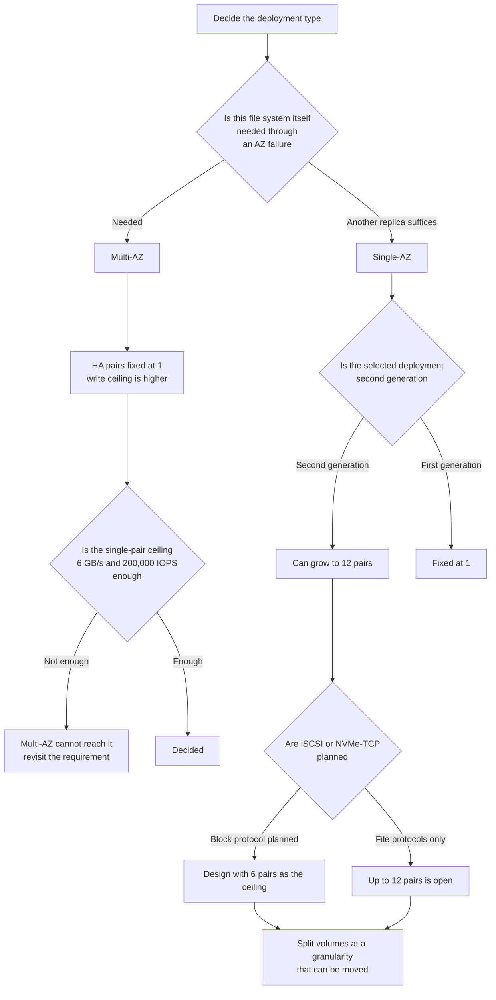

# Can the deployment type be changed later?

No — it is fixed at creation, and the availability choice also caps scale-out.

<!-- lang-switcher:start -->
🌐 [日本語](../../../../ja/playbooks/02-design/notes/deployment-type-is-decided-once.md) | [English](deployment-type-is-decided-once.md) | [🏠 Repository home](../../../README.md)
<!-- lang-switcher:end -->

## What you will learn

- That the deployment type cannot be changed after creation, and changing it means migrating to a new file system.
- That the availability (Multi-AZ / Single-AZ) and generation choice fixes the HA-pair scale-out ceiling at the same time.

## What this note does not answer

- Generation- or deployment-type price ratios (revised over time; see the current pricing page).
- What happens to existing LUNs or connections when a seventh HA pair is added (undocumented).

## Prerequisite level

intermediate

## Body

[🏠 Repository Top](../../../README.md) | [Playbook 02 — Design](../README.md)

This is the English translation. Japanese is authoritative for technical accuracy.

---

### Conclusion

**AWS explicitly states that a file system's deployment type cannot be changed after creation.** Changing it requires a new file system and data migration by backup restore, SnapMirror, AWS DataSync, or a copy tool.

What matters is that **this single choice fixes both availability and the scale-out ceiling at the same time.**

**Only second-generation Single-AZ can grow beyond one HA pair.** Multi-AZ is fixed at one pair in both the first and second generation.

So the approach of "start on Multi-AZ and add HA pairs later if performance runs short" **does not work.** At that point it becomes a rebuild.

> **Evidence**: `documented` — mutability, ceilings, and protocol constraints rest on AWS
> documentation. **The statement about the default deployment-type selection is
> `field-observation`** — confirmed on the console in the Tokyo region (2026-09-21); other regions
> are unverified. The UI can change, so verify it in your own region before creating a file system.
> **Price ratios are not included.** Generation-based pricing differences are revised,
> so refer to the current pricing page. Steps for your own environment are in
> "[Verify in your own environment](#verify-in-your-own-environment)".

---

### The four deployment types and the HA pair counts available

| Deployment type | Generation | HA pairs | Can it grow later |
|---|---|---|---|
| `SINGLE_AZ_1` | First generation | 1 | **No** |
| `SINGLE_AZ_2` | Second generation | **up to 12** | **Yes (up to 12)** |
| `MULTI_AZ_1` | First generation | 1 | **No** |
| `MULTI_AZ_2` | Second generation | 1 | **No** |

**Going from `SINGLE_AZ_1` to `SINGLE_AZ_2` is also a rebuild.** Same Single-AZ or not, a different generation is a different deployment type, and AWS directs you to migrate to a new file system.

The migration routes are restore from backup, SnapMirror, AWS DataSync, and third-party copy tools. Choosing among them is in [Migration method decision tree](../../../../ja/reference/decision-trees/migration-method.md).

**Watch what the console pre-selects.** Quick create does not even show a generation choice — the latest generation available in the region is chosen automatically. On Standard create, as observed in the Tokyo region (2026-09-21), "Multi-AZ 2" is the initial selection (the radio button's `checked` state) for deployment type. **"Second generation" does not mean "Single-AZ."** Multi-AZ 2 (1 HA pair) and Single-AZ 2 (up to 12 HA pairs) are both second-generation deployment types — generation and AZ topology are independent axes. Confirm which deployment type is actually selected on the creation screen before creating the file system.

---

### Choosing between Multi-AZ and Single-AZ

| Point | Single-AZ | Multi-AZ |
|---|---|---|
| Scope of data replication | Within one AZ (a separate fault domain) | **Across two AZs** |
| Write replication | Synchronous | Synchronous |
| HA pairs | Up to 12 on second generation | **Fixed at 1** |
| Write throughput ceiling | Lower than Multi-AZ | **Higher than Single-AZ** |
| Failover | Managed automatically by the service | Managed automatically by the service |
| Cost | Lower than Multi-AZ | Higher than Single-AZ |

**The trade-off is symmetric.** Multi-AZ buys continuity through an AZ failure and a higher write ceiling, in exchange for accepting the ceiling of a single HA pair. Single-AZ (second generation) buys scale-out room and cost, in exchange for designing cross-AZ availability yourself.

**Either way, a write reaches both file servers before the client gets a response.** Being synchronous is common to both.

The deciding question is whether **this file system itself** has to remain usable through an AZ failure. If a replica in another region or AZ is enough, Single-AZ becomes a candidate. What each recovery mechanism covers is in [Having Snapshots and being able to recover are different things](../../../domains/data-protection/notes/snapshots-are-not-a-recovery-plan.md#what-each-mechanism-protects-against).

---

### What happens when you add an HA pair

Adding an HA pair on second-generation Single-AZ is **non-disruptive and completes in minutes.** There are side effects, though.

| What happens | What it means |
|---|---|
| The new HA pair carries **the same throughput capacity and SSD capacity** as the existing ones | Performance cannot be added on its own. **Capacity and cost grow in the same proportion** |
| **Adding it does not make anything faster** | Existing volumes have to be moved to the new pair and clients remounted |
| **An added HA pair cannot be removed** | For a temporary boost, consider raising throughput capacity instead |
| Throughput capacity, SSD capacity, and provisioned IOPS cannot be changed while the addition runs | Change work cannot be run concurrently |

In the documentation's example, adding one pair to a file system of 2 pairs at 12 GBps and 2 TiB produces 18 GBps and 3 TiB. **6 GBps and 1 TiB arrive together.**

"Adding it does not make anything faster" feeds back into design. **Unless volumes are cut at a granularity that can be moved, adding an HA pair later cannot be put to use.** How a FlexVol sits on one aggregate is in [The unit of sharing is the HA pair](../../../domains/performance/notes/where-throughput-is-determined-and-shared.md#the-unit-of-sharing-is-the-ha-pair).

---

### The 6-HA-pair ceiling for block protocols

| Protocol | Condition |
|---|---|
| iSCSI | Available on file systems with **6 or fewer HA pairs** |
| NVMe/TCP | Available on **second generation with 6 or fewer HA pairs** |

AWS supports iSCSI on file systems with 6 or fewer HA pairs, and NVMe/TCP on second-generation file systems with 6 or fewer HA pairs. **This documentation does not define what happens to existing LUNs or connections while a seventh pair is added.**

If block protocols are in the plan, **design the file system with 6 pairs as the ceiling.** An added HA pair cannot be removed.

Note also that adding an HA pair enables the NVMe cache by default on the new nodes. Disabling it is recommended for throughput-oriented workloads.

---

### The ceiling of a single HA pair

A single HA pair is described as reaching roughly **6 GB/s of throughput and 200,000 IOPS**. General file shares and content management fit inside that range.

Needing to exceed it — large-scale EDA, seismic analysis, clustered databases, HPC — is the reason to choose a scale-out configuration.

**Put the other way round, no scale-out design is needed if you do not expect to exceed it.** That the ceilings themselves vary by generation, configuration, and region is in [Throughput is not determined by a single setting](../../../domains/performance/notes/where-throughput-is-determined-and-shared.md#the-ceiling-varies-by-generation-configuration-and-region).

---

### Irreversible items that are not on the checklist

[Pre-production review](../../../../ja/playbooks/04-build/checklists/pre-production-review.md#不可逆な項目の一覧) (日本語) covers the irreversible items at volume and SVM level. **File-system-level irreversible items are this note's scope.**

| Item | Changeable | If you want to change it |
|---|---|---|
| Deployment type (Single-AZ / Multi-AZ) | **No** | Create a new file system and move the data |
| Generation (first / second) | **No** | Same. It is part of the deployment type |
| The AZ it sits in | **No** | Same |
| Removing an added HA pair | **No** | It cannot be removed. Handle it by adjusting throughput capacity |
| The HA pair ceiling | Determined by the deployment type | On Multi-AZ the ceiling is 1 |

---

### Design flow



---

### Common misconceptions

| Misconception | Reality |
|---|---|
| The deployment type can be changed later | **AWS states that it cannot be changed after creation.** Create a new file system and move the data |
| Single-AZ 1 to Single-AZ 2 is a settings change | It is a different deployment type. It becomes a rebuild |
| HA pairs can be added later on Multi-AZ too | **They cannot.** Both generations are fixed at one pair |
| Adding an HA pair automatically makes things faster | Existing volumes have to be moved to the new pair and remounted |
| An HA pair can be added when needed and taken back later | **It cannot be removed.** A temporary boost is done by adjusting throughput capacity |
| Adding an HA pair is purely a performance decision | SSD capacity grows in the same proportion. It is a cost decision too |
| HA pairs behave the same however many you add | **Only file systems with 6 or fewer pairs are supported for block protocols.** The transition when adding pair 7 is not documented |
| Multi-AZ always has higher performance | Its write ceiling is higher, but the single-HA-pair ceiling applies |
| Single-AZ has lower availability | It is placed in a separate fault domain within one AZ, with the same synchronous replication and failover. The difference is continuity through an AZ failure |

---

### Primary sources

| Point | Source |
|---|---|
| That the deployment type cannot be changed after creation, that Single-AZ 1 to Single-AZ 2 is also a rebuild, and the migration routes | [AWS: Creating file systems](https://docs.aws.amazon.com/fsx/latest/ONTAPGuide/creating-file-systems.html) |
| That first-generation and second-generation Multi-AZ are one pair and second-generation Single-AZ is up to 12. That addition is non-disruptive and takes minutes, and removal is impossible. That the new pair carries the same throughput and SSD capacity. That moving and remounting are required. That capacity cannot be changed during the addition. The condition of 6 or fewer pairs for iSCSI and NVMe/TCP. The NVMe cache default | [AWS: Adding high-availability (HA) pairs](https://docs.aws.amazon.com/fsx/latest/ONTAPGuide/adding-HA-pairs.html) |
| The four deployment types and which generation each maps to | [AWS SDK reference: deploymentType](https://docs.aws.amazon.com/sdk-for-kotlin/api/latest/fsx/aws.sdk.kotlin.services.fsx.model/-create-file-system-ontap-configuration/deployment-type.html) |
| That the Multi-AZ standby sits in another AZ and is replicated synchronously, and that Multi-AZ 1 is first generation while Multi-AZ 2 is second | [AWS: Availability, durability, and deployment options](https://docs.aws.amazon.com/fsx/latest/ONTAPGuide/high-availability-AZ.html) |
| That the Multi-AZ write throughput ceiling is higher than Single-AZ, and that a write reaches both file servers before responding | [AWS Storage Blog: Best practice configuration of Amazon FSx for NetApp ONTAP for Microsoft SQL Server workloads](https://aws.amazon.com/blogs/storage/best-practice-configuration-of-amazon-fsx-for-netapp-ontap-for-microsoft-sql-server-workloads/) <!-- allow:sales-vocabulary - exact external title --> |
| The 6 GB/s and 200,000 IOPS of a single HA pair, and the workloads that justify scale-out | [AWS Storage Blog: How to size an FSx for ONTAP file system](https://aws.amazon.com/blogs/storage/how-to-size-an-amazon-fsx-for-netapp-ontap-file-system/) |
| That Quick create chooses the region's latest generation automatically | [AWS: Getting started with Amazon FSx for NetApp ONTAP](https://docs.aws.amazon.com/fsx/latest/ONTAPGuide/getting-started.html) |
| The Standard create default deployment-type selection (Tokyo region, console observation, 2026-09-21) | Own-environment confirmation. The screenshot from this note is kept as a private verification record |

---

### Related documents

- [Playbook 02 — Design](../README.md) — this module's hub
- [Throughput is not determined by a single setting](../../../domains/performance/notes/where-throughput-is-determined-and-shared.md) — sharing at HA pair level and the FlexVol constraint
- [You can run out of writes with capacity to spare](../../01-assess/notes/counting-bytes-is-not-counting-files.md) — the inventory items that feed this design
- [Pre-production review](../../../../ja/playbooks/04-build/checklists/pre-production-review.md#不可逆な項目の一覧) (日本語) — irreversible items at volume and SVM level
- [Migration method decision tree](../../../../ja/reference/decision-trees/migration-method.md) — migration routes when changing the deployment type
- [Having Snapshots and being able to recover are different things](../../../domains/data-protection/notes/snapshots-are-not-a-recovery-plan.md) — what AZ and region failures cover
- [Limits and quotas](../../../../ja/reference/limits/) — limits with sources and verification dates
- [Evidence classification policy](../../../evidence-policy.md)

[🏠 Repository Top](../../../README.md) | [Playbook 02 — Design](../README.md)

---

<a id="verify-in-your-own-environment"></a>

## Verify it in your environment

**Checking the items in this note after building is too late.** Do it at the design review stage.

| # | Step | What it tells you |
|---|---|---|
| 1 | Estimate whether the expected peak fits inside 6 GB/s and 200,000 IOPS | Whether Multi-AZ is available. Exceeding it means second-generation Single-AZ |
| 2 | Confirm whether iSCSI / NVMe/TCP are planned | Whether the HA pair ceiling has to be 6 |
| 3 | Agree with stakeholders whether "this file system itself" is needed through an AZ failure | The basis for the Multi-AZ / Single-AZ decision |
| 4 | Check that the volume granularity is a unit that can later move to another pair | Whether adding an HA pair can be put to use |
| 5 | Add one HA pair in a test environment and record the duration and how capacity grows | **Confirm the non-disruptive, minutes-long claim in your own environment.** Do it in a test environment, because it cannot be removed |
| 6 | State the chosen deployment type, generation, and AZ in the design document | The record of agreement on irreversible items |

Step 5 **belongs in a test environment.** An added HA pair cannot be removed.

The following read-only command reads the deployment type and current HA pair count of an existing file system.

```bash
aws fsx describe-file-systems --file-system-id <fs-id> \
  --query 'FileSystems[0].OntapConfiguration.[DeploymentType,HAPairs]'
```

### Expected output

The `DeploymentType` (one of `SINGLE_AZ_1` / `SINGLE_AZ_2` / `MULTI_AZ_1` / `MULTI_AZ_2`) and the current `HAPairs` are returned. These two settle how far the file system can grow and whether block protocols are usable.

## Read next

[Where does migrating from SaaS start?](../../03-migrate/notes/saas-source-migration-scoping.md)
