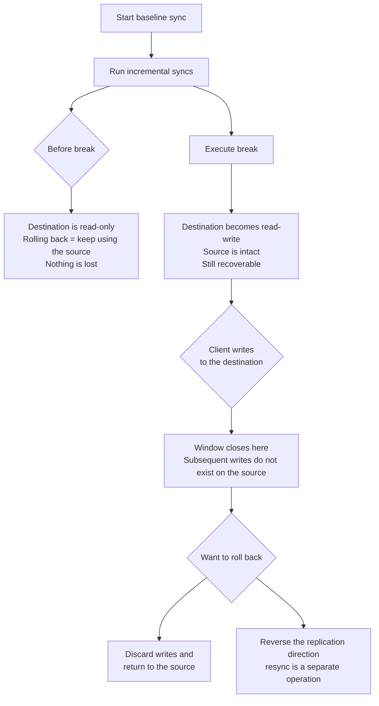

# The Rollback Window Closes the Moment a Client Writes

<!-- lang-switcher:start -->
🌐 [日本語](../../../../ja/playbooks/03-migrate/notes/where-the-rollback-window-closes.md) | [English](where-the-rollback-window-closes.md) | [🏠 Repository home](../../../README.md)
<!-- lang-switcher:end -->

[🏠 Repository Top](../../../README.md) | [Playbook 03 — Migration](../README.md)

> This is the English translation. Japanese is authoritative for technical accuracy.

---

## Conclusion

**A SnapMirror destination remains read-only until you break the relationship.** Before the break, rolling back simply means continuing to use the source. Nothing is lost.

Breaking makes the destination read-write, **without affecting the source.** At this point the source data is intact, so you can still go back.

**The window closes the moment a client writes to the destination.** From that point on, those writes do not exist on the source. Rolling back means either discarding those writes or **reversing the replication direction** (a separate operation). "Reverting the cutover configuration" is not a viable rollback path.

One more thing. **Incremental sync depends on a common Snapshot on the source.** If you delete a SnapMirror-created Snapshot on the source, **incremental transfer becomes impossible and you must restart from a baseline sync.** This is the largest schedule risk in any migration.

> **Evidence**: `documented` — command sequences, states, and constraints are based on AWS official documentation, AWS Storage Blog, and AWS re:Post articles.
> **No measured transfer times are included.** Duration depends on bandwidth and data volume.
> Measurement steps are in "[Verify in your own environment](#verify-in-your-own-environment)".

---

## Baseline Sync and Incremental Sync

| Phase | Command | Description |
|---|---|---|
| Baseline sync | `snapmirror initialize` | Transfers a Snapshot from the source to the destination |
| Incremental sync (one-shot) | `snapmirror update` | Transfers changes since the last sync, once |
| Incremental sync (scheduled) | `snapmirror modify -schedule hourly` | Keeps the destination continuously up to date on a schedule |

**When migrating live data, keep incremental syncs running until cutover.** If you plan to start the baseline sync just before cutover, the transfer time becomes your downtime.

### Conditions That Break Incremental Sync

| Condition | What happens |
|---|---|
| **A SnapMirror-created Snapshot was deleted on the source** | The newest common Snapshot (NCS) is lost; **incremental transfer is impossible.** You must restart from a baseline sync |
| The destination was taken offline / restricted | SnapMirror cannot update |
| A storage efficiency job ran concurrently with SnapMirror | Running them concurrently is not recommended |
| **A destination volume from a previous SnapMirror relationship was reused** | Reuse is not recommended. **Create a new volume** |
| NAT exists in the path | **SnapMirror does not support NAT** |

**Rows 1 and 4 are "start over" failures.** In migration planning, prohibiting these two in operational procedures is the cheapest mitigation.

---

## Cutover Sequence

**What determines downtime is where in this sequence you stop clients.**

| # | Operation | What to verify |
|---|---|---|
| 1 | Transfer the final delta with `snapmirror update` | — |
| 2 | Check the state | `Mirror State` is `Snapmirrored`, `Relationship Status` is `Idle` |
| 3 | **Check `Last Transfer End Timestamp`** | **This represents how current the destination data is.** If it is stale, do not cut over |
| 4 | Stop clients | Downtime begins here |
| 5 | Halt future transfers with `snapmirror quiesce` | Verify `Relationship Status` becomes `Quiesced` |
| 6 | Make the destination read-write with `snapmirror break` | — |
| 7 | Remount shares (SMB / NFS / iSCSI) | — |
| 8 | Resume clients | Downtime ends here |

**Downtime is only between steps 4 and 8.** The transfer itself finishes by step 1. Therefore what you need to shorten is not transfer time, but **the working time of steps 5–7**.

Do not skip step 3. **`Idle` means "not currently transferring" — it does not mean "up to date."**

---

## How Far Back Can You Roll?

**There is no rollback path called "revert the cutover configuration."** Rolling back is a decision about what to do with the data written to the destination.

### Notes on Rolling Back with resync

`snapmirror resync` re-establishes the relationship, but **user-created Snapshots are not replicated.** Exported Snapshots on the destination are deleted, and clients see the destination's active file system.

To avoid issues with Snapshot policy replication, **the `preserve` parameter is recommended.** However, this is supported only in XDP relationships.

**A rollback is not a "return to the previous state" — it creates a new state.** Before writing a procedure, confirm what is preserved and what is lost.

---

## Conditions That Affect Transfer Performance

| Condition | Impact |
|---|---|
| Data protocol network utilization exceeds 50% | **Using a dedicated failover group for intercluster communication is recommended** |
| Round-trip time (RTT) between source and destination | Can cause write latency |
| Destination volume size | To keep it the same as or slightly larger than the source, enabling autogrow with `volume autosize` is recommended |
| Contention with background tasks | Client traffic is prioritized, so transfers slow during peak hours |

The last row matters operationally. **If transfers are slower than expected, the cause may be prioritization, not bandwidth.** The mechanism is described in [Monitoring fails on averages](../../../../ja/playbooks/05-operate/notes/monitoring-fails-on-averages.md).

---

## Verify in Your Own Environment

**What you should measure is not transfer time but the working time of steps 5–7.** That is the downtime.

| # | Step | What you can confirm |
|---|---|---|
| 1 | Run a baseline sync in a test environment and record the duration | Real time for baseline sync given your data volume and bandwidth |
| 2 | Run one incremental sync and record the duration | Time for the final sync just before cutover |
| 3 | Time the full `quiesce` → `break` → mount sequence | **Actual downtime.** A measurement, not an estimate |
| 4 | Add `Last Transfer End Timestamp` verification to the runbook | Prevents cutting over with stale data |
| 5 | Confirm the source is intact after break | The premise for rollback. Verify you can actually read it |
| 6 | Compare ACLs on the destination against the source | Whether permissions are preserved. Steps are in [ACL preservation is a permissions problem](../../../../ja/playbooks/03-migrate/notes/preserving-acls-during-migration.md#自環境での確認手順) |
| 7 | Run the rollback procedure once in the test environment | **Whether the written procedure actually works.** Do not try it for the first time in production |

Many migration plans skip step 7. **A rollback procedure — even one you hope never to use — must be verified to work.**

---

## Common Misconceptions

| Misconception | Reality |
|---|---|
| You can roll back anytime after cutover | **The window closes the moment a client writes to the destination.** After that it becomes a decision about what to do with those writes |
| Breaking affects the source | It does not. The source remains intact |
| You can write to the destination before break | **It is read-only.** You cannot write until break |
| `Relationship Status` of `Idle` means up to date | `Idle` means no transfer is in progress. Freshness is indicated by `Last Transfer End Timestamp` |
| Downtime is determined by transfer time | The transfer finishes before cutover. Downtime is from `quiesce` to mount |
| Snapshots on the source can be deleted | **Deleting a SnapMirror-created Snapshot makes incremental transfer impossible.** You must restart from a baseline sync |
| A failed destination volume can be reused | Reuse is not recommended. Create a new volume |
| SnapMirror works over NAT | **It does not** |
| `resync` restores the original state | User-created Snapshots are not replicated. It creates a new state |

---

## Primary Sources Referenced

| Topic | Source |
|---|---|
| Baseline sync with `snapmirror initialize`, one-shot incremental with `snapmirror update`, scheduled incremental with `snapmirror modify -schedule` | [AWS: Migrating to FSx for ONTAP using NetApp SnapMirror](https://docs.aws.amazon.com/fsx/latest/ONTAPGuide/migrating-fsx-ontap-snapmirror.html) |
| Destination is read-only until break, cutover sequence (state check → `Last Transfer End Timestamp` check → `quiesce` → `break` → mount), `Last Transfer End Timestamp` represents data freshness | [AWS Storage Blog: Migrating on-premises file shares to FSx for ONTAP](https://aws.amazon.com/blogs/storage/migrating-on-premises-file-shares-to-amazon-fsx-for-netapp-ontap/) |
| Destination is created online and read-only, break makes it writable without affecting the source, scheduled incremental updates | [AWS Storage Blog: Cross-region disaster recovery with FSx for ONTAP](https://aws.amazon.com/blogs/storage/cross-region-disaster-recovery-with-amazon-fsx-for-netapp-ontap/) |
| `resync` does not replicate user-created Snapshots, exported Snapshots on destination are deleted, `preserve` is supported only with XDP | [AWS re:Post: Why does the snapshot policy stop working after snapmirror resync?](https://repost.aws/knowledge-center/fsx-ontap-snapmirror-resync) |
| Incremental transfer depends on the common Snapshot (NCS), do not reuse destination volumes, do not take destination offline, do not run efficiency jobs concurrently, NAT not supported, dedicated failover group recommended above 50% utilization, RTT impact, `volume autosize` recommendation | [AWS re:Post: How can I optimize SnapMirror performance?](https://repost.aws/knowledge-center/fsx-ontap-optimize-snapmirror) |
| Procedure to recreate the relationship and volume when transfer state becomes inconsistent | [AWS re:Post: How do I troubleshoot SnapMirror issues?](https://repost.aws/knowledge-center/fsx-ontap-troubleshoot-snapmirror) |

---

## Related Documents

- [Playbook 03 — Migration](../README.md) — Module hub
- [Migration Method Decision Tree](../../../../ja/reference/decision-trees/migration-method.md) — Method selection and version compatibility
- [ACL Preservation Is a Permissions Problem, Not a Tooling Problem](../../../../ja/playbooks/03-migrate/notes/preserving-acls-during-migration.md) — Post-migration ACL comparison steps
- [Running Out of Space Despite Spare Capacity](../../../../ja/playbooks/01-assess/notes/counting-bytes-is-not-counting-files.md) — What to count before migration
- [Having Snapshots and Being Able to Recover Are Different Things](../../../domains/data-protection/notes/snapshots-are-not-a-recovery-plan.md) — The destination is not a backup target
- [Monitoring Fails on Averages](../../../../ja/playbooks/05-operate/notes/monitoring-fails-on-averages.md) — Diagnosing slow transfers
- [Evidence Classification Policy](../../../evidence-policy.md)

---

[🏠 Repository Top](../../../README.md) | [Playbook 03 — Migration](../README.md)

<!-- lang-switcher:start -->
🌐 [日本語](../../../../ja/playbooks/03-migrate/notes/where-the-rollback-window-closes.md) | [English](where-the-rollback-window-closes.md) | [🏠 Repository home](../../../README.md)
<!-- lang-switcher:end -->
