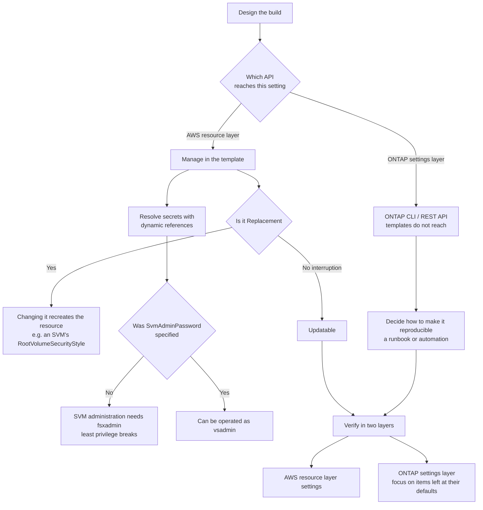

# The IaC boundary is set by the API surface, not by preference

<!-- lang-switcher:start -->
🌐 [日本語](../../../../ja/playbooks/04-build/notes/what-iac-cannot-reach.md) | [English](what-iac-cannot-reach.md) | [🏠 Repository home](../../../README.md)
<!-- lang-switcher:end -->

[🏠 Repository Top](../../../README.md) | [Playbook 04 — Build](../README.md)

This is the English translation. Japanese is authoritative for technical accuracy.

---

## Conclusion

**"What to manage as IaC" is already settled by what the API reaches, before any policy decides it.**

File systems, SVMs, volumes, backups, and tags can be created, updated, and deleted through the Amazon FSx API and templates. <!-- allow:naming - the AWS API name -->

**ONTAP-level settings, on the other hand, are reachable only through ONTAP CLI or the ONTAP REST API.** Examples:

| Setting | Route that reaches it |
|---|---|
| Requiring SMB encryption | **ONTAP CLI only** (`vserver cifs security modify`) |
| A volume's inode ceiling | **ONTAP CLI only** (`volume modify -files`) |
| Converting FlexVol to FlexGroup | **ONTAP CLI only** |
| **Creating a Snapshot of an ONTAP volume** | **ONTAP CLI / REST only.** Confirmed by measurement (below) |
| **Clearing the SnapLock audit log volume designation** | **ONTAP level only.** Confirmed by measurement (below). **Clearing it still does not allow deletion** |
| **Obtaining the reason a volume deletion failed** | **ONTAP level only.** The AWS API does not return the reason (below) |

So **a successful template does not mean a finished configuration.** A policy of "manage everything as IaC" cannot cross this boundary. What needs designing is not where the boundary sits, but **how to make the far side of it reproducible.**

> **Evidence**: `documented` — the route for each operation and the template update behaviour rest on
> AWS documentation and the CloudFormation reference.
> **No particular tooling configuration is recommended.** Steps for your own environment are in
> "[Confirming this in your own environment](#confirming-this-in-your-own-environment)".

---

## Boundaries found by measurement

**Each of these was confirmed by actually trying it and finding that templates and the AWS CLI do not reach.**

| Finding | Detail |
|---|---|
| **`CreateSnapshot` is FSx for OpenZFS only** | Run against an ONTAP volume it returns `Unable to create a snapshot because the volume was not found`. **The volume exists and is `CREATED`.** ONTAP Snapshots are the domain of Snapshot policies or ONTAP CLI / REST |
| **A SnapLock audit log volume cannot be deleted through the AWS API** | Neither an ordinary delete nor `BypassSnaplockEnterpriseRetention=true` works. The SVM-side designation is not exposed in the API, and **ONTAP REST can clear it — but clearing it does not make deletion possible** (during the minimum six-month retention, neither the volume, the SVM, nor the file system can be deleted). Details in [SnapLock enabling and locking are separate](../../../../ja/domains/data-protection/notes/snaplock-and-layered-ransomware-readiness.md#監査ログボリュームによるファイルシステム全体の-6-か月固定) (日本語) |
| **A failed volume deletion is not visible in the response** (the reason does live inside the AWS API) | `delete-volume` enters `DELETING`, returns to `CREATED`, and **the response carries no error.** `AdministrativeActions` is `null` too. However **the reason is in `LifecycleTransitionReason` from `DescribeVolumes`**. The ONTAP side is not required |
| **`UpdateVolume` is asynchronous and leaves no trace** | The change was not observed at 30 seconds and was confirmed at 120 to 180 seconds. **It is not recorded in `AdministrativeActions`** (`null`). Running it again in succession is rejected with `There is an update already in progress.` |

**The asynchrony of `UpdateVolume` is what affects how verification is designed.** A successful API response does not mean the change landed, and nothing is recorded, so **re-reading `DescribeVolumes` is the only way to confirm.** During this verification a short wait led to reading the state too early and misdiagnosing it once as "ignored".

> **Tier**: `verified` (verified on 2026-08-06, `ap-northeast-1`, `SINGLE_AZ_1`).
> The record is in [Limits and quotas](../../../../ja/reference/limits/).

**If you automate post-build verification, build it on that asynchrony.** Make the pass condition "re-read it and the value is what was intended", not "the API returned 200".

---

## What templates cover, and how updates behave

Update behaviour feeds straight into design. **Changing a property marked `Replacement` recreates the resource.**

| Property | Behaviour on update | What it means |
|---|---|---|
| An SVM's `RootVolumeSecurityStyle` | **Replacement** | **Changing it recreates the SVM.** This is a different thing from changing a volume's security style |
| `FsxAdminPassword` | No interruption | Rotation can be done safely through the template |
| `SvmAdminPassword` | — | An SVM can be created without it, but with the side effect below |

An SVM's root volume security style is chosen from `UNIX` / `NTFS` / `MIXED`. **Changing that choice later replaces the resource**, so read [A volume's security style determines the permission model](../../../domains/multiprotocol-identity/notes/security-style-and-permission-evaluation.md) before deciding.

---

## Handling secrets

`FsxAdminPassword` and `SvmAdminPassword` are template properties. **Which means they can be written into the template in plain text.**

| Approach | Detail |
|---|---|
| Do not write them in plain text | Resolve them from AWS Secrets Manager with CloudFormation **dynamic references** |
| Keep them out of the repository | Both templates and parameter files can end up in a public repository |
| Assume rotation | Updating `FsxAdminPassword` does not cause an interruption |

`FsxAdminPassword` has constraints. **It is 8 to 50 characters and cannot contain newlines or certain control characters.** An automatic generation policy outside that range fails at creation.

### How omitting `SvmAdminPassword` breaks least privilege

**Without `SvmAdminPassword`, that SVM has to be administered with `fsxadmin`.**

`fsxadmin` is the administrator for the whole file system. So the operator of a single SVM is handed privileges over the entire file system.

**With it specified, that SVM can be administered as `vsadmin` from ONTAP CLI / REST API.** To operate with least privilege, specify it when creating the SVM. How the privileges divide is in [Separating administrators](../../../../ja/domains/security-governance/notes/what-the-platform-gives-and-what-stays-yours.md#権限設計--管理者の分離) (日本語).

---

## Automating Active Directory integration

An SVM's AD join can be specified in a template, but **the join itself depends on the state of AD.** What automation has to cover:

| Target | Caution |
|---|---|
| Domain name and DNS addresses | Prerequisites for joining |
| The OU that holds computer objects | Specify a location where delegation is already in place |
| Administrators group | Specify a group with the privileges the join needs |
| NetBIOS name | **Do not reuse a name that failed.** A computer account is left behind in AD |
| Service account password | Treat it as a secret |

**An AD join cannot be judged by "did the template succeed".** Check the join state through the SVM's lifecycle state. The prerequisites are in [Domain — Multiprotocol & Identity](../../../domains/multiprotocol-identity/).

---

## Automating post-build verification

**IaC success does not mean the configuration is complete.** As shown above, ONTAP-level settings sit outside the template. Verification therefore needs two layers.

| Layer | What to verify | Route |
|---|---|---|
| AWS resource layer | That the file system, SVMs, and volumes exist with the intended settings | Amazon FSx API <!-- allow:naming - the AWS API name --> |
| ONTAP settings layer | Required SMB encryption, inode ceilings, export policies, tiering policies | ONTAP CLI / REST API |

**The items to check hardest are the ones where leaving the default produces environment-to-environment differences.**

| Item | Why check it |
|---|---|
| Tiering policy and cooling period | **The default differs by creation route.** [Tiering defaults differ by creation method](../../../../ja/playbooks/06-optimize/notes/tiering-defaults-differ-by-creation-method.md) (日本語) |
| Inode ceiling | The default stops growing past 648 GiB. [You can run out of writes with capacity to spare](../../01-assess/notes/counting-bytes-is-not-counting-files.md) |
| Required SMB encryption | Disabled at the time the SVM is created |
| Volume style | The default varies between FlexVol and FlexGroup with the HA pair count |

The items to clear before going to production are collected in [Pre-production review](../../../../ja/playbooks/04-build/checklists/pre-production-review.md) (日本語). **Confirm restore and monitoring by "we tried it", not by "we configured it".**

---

## Cloning development and test environments

| Method | Characteristics |
|---|---|
| FlexClone | Fast, because it references the original data. It does not consume disk throughput |
| Restore from backup into a new volume | Can be run through the Amazon FSx API. Scoped to the same region <!-- allow:naming - the AWS API name --> |
| SnapMirror | Can replicate to another file system or another region |

### An operational interaction with FlexClone

**Creating a FlexClone after an SSD capacity decrease operation has started pauses that decrease.** ONTAP splits clone relationships when moving a volume, and this avoids storage being duplicated on the new disks.

**Resuming it requires deleting the FlexClones created after the decrease started.** Deleting them resumes it automatically.

If "provide test environments as clones" and "shrink SSD to cut cost" run at the same time, the latter stops.

**Where users create their own clones, QoS non-inheritance and the volume count ceiling apply on top of this interaction.** The summary is in [Putting training dataset versions on a scheduled Snapshot loses them](../../../../ja/domains/data-utilization/notes/dataset-versions-and-experiment-branches.md#実験ブランチ--flexclone-の効果と-3-つの制約) (日本語).

### Converting between FlexVol and FlexGroup

| Item | Detail |
|---|---|
| FlexVol default | File systems with one HA pair |
| FlexGroup default | File systems on **second generation with two or more HA pairs** |
| Conversion | **ONTAP CLI only.** It produces a FlexGroup with a single constituent |
| Recommended method | **Move the data with AWS DataSync.** This distributes it evenly across constituents |
| Before converting | **Delete the FlexVol's backups.** ONTAP does not rebalance automatically on conversion |

**Conversion is possible but not recommended.** If there is a plan to add HA pairs, designing as FlexGroup from the start is cheaper. The relationship is in [The deployment type is decided once](../../02-design/notes/deployment-type-is-decided-once.md).

---

## Build flow

---

## Confirming this in your own environment

**The first thing to establish is how many settings sit outside the template.**

| # | Step | What it tells you |
|---|---|---|
| 1 | List the ONTAP settings of a template-built environment from the CLI | **Which settings are not in the template.** This measures the boundary |
| 2 | Check the tiering policy and cooling period | Whether a creation-route difference in defaults has appeared |
| 3 | Check whether SMB encryption is required | Whether it is still at the disabled default |
| 4 | Check the inode ceiling | Whether the default suffices |
| 5 | Check whether `SvmAdminPassword` was specified | Whether operation is possible without handing out `fsxadmin` |
| 6 | Create a FlexClone in a test environment and record the duration | The real time for cloning an environment |
| 7 | Create a FlexClone during an SSD decrease and confirm the decrease stops | **Measuring the interaction.** Do it in a test environment |
| 8 | Apply the same template twice and confirm no diff appears | Idempotency |

Step 1 is the most valuable. **"The list of settings not in the template" is exactly the scope for a runbook or automation.**

---

## Common misconceptions

| Misconception | Reality |
|---|---|
| Everything can be managed as IaC | **ONTAP-level settings are not reachable from a template.** Required SMB encryption, inode ceilings, FlexGroup conversion, and so on |
| A successful template means a finished configuration | The ONTAP settings layer remains. Verification needs two layers |
| Security style can be changed at any time | An SVM's `RootVolumeSecurityStyle` is **Replacement**. Changing it recreates the SVM |
| `SvmAdminPassword` is optional, so it can be omitted | Omitting it makes `fsxadmin` necessary for SVM administration, which **breaks least privilege** |
| Passwords can be left to automatic generation | `FsxAdminPassword` is 8 to 50 characters and cannot contain newlines. A policy outside that fails at creation |
| An AD join can be judged by template success | It depends on the state of AD. Check the SVM's lifecycle state |
| A FlexClone is an independent copy | It references the original data, and it has an interaction that **stops an SSD decrease** |
| A FlexVol can become a FlexGroup at any time | ONTAP CLI only, and **the recommendation is moving data with DataSync**. Backups must be deleted before converting |
| Cloning an environment means restoring a backup | FlexClone and SnapMirror are also options. Restore is scoped to the same region |

---

## Primary sources

| Point | Source |
|---|---|
| The scope of management operations available from the console, AWS CLI, and ONTAP CLI / API (creating and updating file systems, SVMs, volumes, backups, and tags; administrative accounts and passwords; SMB and iSCSI; network reachability) | [AWS: Administering FSx for ONTAP resources](https://docs.aws.amazon.com/fsx/latest/ONTAPGuide/administering-file-systems.html) |
| That omitting `SvmAdminPassword` means administering the SVM with `fsxadmin`, that specifying it allows ONTAP CLI / REST API administration, and the values and Replacement-on-update behaviour of `RootVolumeSecurityStyle` | [AWS CloudFormation: AWS::FSx::StorageVirtualMachine](https://docs.aws.amazon.com/AWSCloudFormation/latest/TemplateReference/aws-resource-fsx-storagevirtualmachine.html) |
| That `FsxAdminPassword` is the administrative password for ONTAP CLI and the REST API, the 8 to 50 character constraint, and that updating it causes no interruption | [AWS CloudFormation: AWS::FSx::FileSystem OntapConfiguration](https://docs.aws.amazon.com/AWSCloudFormation/latest/TemplateReference/aws-properties-fsx-filesystem-ontapconfiguration.html) |
| Dynamic references, which resolve secrets without putting them in plain text in a template | [AWS CloudFormation: Dynamic references](https://docs.aws.amazon.com/AWSCloudFormation/latest/UserGuide/dynamic-references.html) |
| The default conditions and size ranges for FlexVol and FlexGroup, that conversion is ONTAP CLI only, that moving data with DataSync is recommended, that backups must be deleted before converting, and that no automatic rebalance occurs | [AWS: Managing FSx for ONTAP volumes](https://docs.aws.amazon.com/fsx/latest/ONTAPGuide/managing-volumes.html) |
| That creating a FlexClone after an SSD decrease starts pauses the decrease, and that deleting the clone resumes it automatically | [AWS: Troubleshooting SSD decrease operation issues](https://docs.aws.amazon.com/fsx/latest/ONTAPGuide/ssd-decrease-troubleshooting.html) |
| How to administer an SVM from ONTAP CLI | [AWS: Managing FSx for ONTAP storage virtual machines](https://docs.aws.amazon.com/fsx/latest/ONTAPGuide/managing-svms.html) |

---

## Related documents

- [Playbook 04 — Build](../README.md) — this module's hub
- [Pre-production review](../../../../ja/playbooks/04-build/checklists/pre-production-review.md) (日本語) — items to clear after building
- [Tiering defaults differ by creation method](../../../../ja/playbooks/06-optimize/notes/tiering-defaults-differ-by-creation-method.md) (日本語) — the representative case of defaults varying by creation route
- [You can run out of writes with capacity to spare](../../01-assess/notes/counting-bytes-is-not-counting-files.md) — the inode ceiling is set from ONTAP CLI
- [The deployment type is decided once](../../02-design/notes/deployment-type-is-decided-once.md) — the premise behind choosing FlexGroup
- [Encryption at rest is automatic; in transit is off by default](../../../../ja/domains/security-governance/notes/what-the-platform-gives-and-what-stays-yours.md) (日本語) — SMB encryption and separating administrators
- [A volume's security style determines the permission model](../../../domains/multiprotocol-identity/notes/security-style-and-permission-evaluation.md) — the premise behind a choice that carries Replacement
- [Evidence classification policy](../../../evidence-policy.md)

---

[🏠 Repository Top](../../../README.md) | [Playbook 04 — Build](../README.md)

<!-- lang-switcher:start -->
🌐 [日本語](../../../../ja/playbooks/04-build/notes/what-iac-cannot-reach.md) | [English](what-iac-cannot-reach.md) | [🏠 Repository home](../../../README.md)
<!-- lang-switcher:end -->
