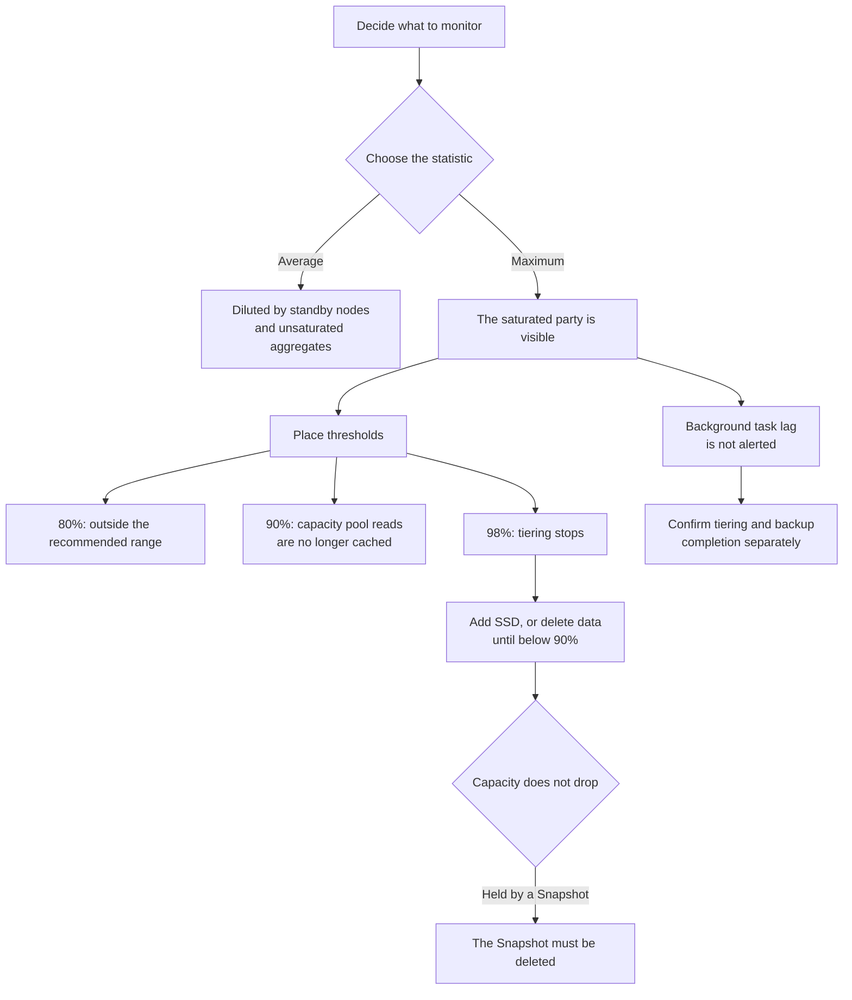

# Monitoring fails on averages

<!-- lang-switcher:start -->
🌐 [日本語](../../../../ja/playbooks/05-operate/notes/monitoring-fails-on-averages.md) | [English](monitoring-fails-on-averages.md) | [🏠 Repository home](../../../README.md)
<!-- lang-switcher:end -->

[🏠 Repository Top](../../../README.md) | [Playbook 05 — Operate](../README.md)

This is the English translation. Japanese is authoritative for technical accuracy.

---

## Conclusion

**Decide which statistic (Average / Maximum) you read before you decide the threshold.** Monitored on averages, a saturated file system looks healthy.

There are two reasons, and both are structural.

1. **Standby nodes pull the average down.** Odd-numbered file servers are preferred, even-numbered ones are standby. A standby node handles traffic only while its partner is unavailable, so its utilisation normally reads low. **Averaging the two produces roughly half the value by design.**
2. **One saturated aggregate is buried in the average.** Utilisation metrics (those whose names end in `Utilization`) emit one data point per aggregate and per file server for each period. A FlexVol sits on **exactly one** aggregate, so the saturated aggregate is precisely the one holding the volume that has the problem.

A third problem is worse, and choosing the statistic does not prevent it. **FSx for ONTAP prioritises client traffic over background tasks** — tiering, storage efficiency, and backups. During periods of high load these **fall behind without raising an alert.**

> **Evidence**: `documented` — the thresholds and behaviour rest on AWS documentation.
> **No measured figures for how much slower it gets at a given threshold are included.** Steps for
> confirming this in your own environment are in
> "[Confirming this in your own environment](#confirming-this-in-your-own-environment)".

---

## The SSD utilisation bands, and what changes at each point

80% is a recommendation, but **there are two points beyond it where behaviour changes.** A threshold placed only at 80% cannot explain what happens after it is crossed.

| SSD utilisation | What happens |
|---|---|
| up to 80% | The recommended range. **Temporary spikes are tolerated.** Keeping the sustained average below 80% preserves room to grow and keeps tiering working normally |
| 90% and above | **Data read from the capacity pool tier is no longer cached on SSD.** Every read goes to the capacity pool |
| 98% and above | **Tiering stops entirely.** Performance degradation appears |

**There are only two ways back from 98%.** Add SSD capacity, or delete data until SSD utilisation is below 90%. Tiering resumes once it drops under 90%.

---

## Why capacity does not drop — deleted data held by Snapshots

If SSD utilisation does not change after deleting data, **a Snapshot containing the deleted data still exists.** Freeing space requires deleting the Snapshot.

This means capacity monitoring and retention policy are the same problem. **Snapshot retention design is part of capacity design.** The relationship between retention period and limits is in [Having Snapshots and being able to recover are different things](../../../domains/data-protection/notes/snapshots-are-not-a-recovery-plan.md#limits-and-retention-periods).

---

## SSD used even with tiering policy `All`

**Every write lands on SSD first, regardless of the tiering policy.** It moves to the capacity pool afterwards.

**File metadata is always held on SSD, regardless of the tiering policy.** So even a volume with `All` tiering never reaches zero SSD consumption. **A rule of thumb is SSD : capacity pool = 1 : 10.**

Sizing on the assumption that "`All` means no SSD is needed" runs short on the metadata alone.

---

## Order for isolating a performance regression

**Look at whether the network or the disk saturates first.** The order matters — it runs from the widest blast radius downward.

| # | What to look at | Judgement |
|---|---|---|
| 1 | SSD utilisation | Has it passed 90% / 98%? If so, that is the cause |
| 2 | Network throughput utilisation | Has it reached 100%? It is **a ratio against the capacity of one HA pair** |
| 3 | Disk IOPS utilisation | Has it reached 100%? Read it per aggregate |
| 4 | Background task lag | Are tiering and backups keeping up? |

Step 2 needs care. `NetworkThroughputUtilization` covers **all traffic, including background tasks** (SnapMirror, tiering, backups). If client load is low while utilisation is high, background tasks are running.

---

## Warnings FSx for ONTAP raises, and alarms you build yourself

FSx for ONTAP displays a warning when a metric approaches or crosses a predefined threshold **across multiple consecutive data points.** **A single spike does not raise one.**

Warnings appear on the **Monitoring & performance** dashboard. CloudWatch alarms in the `ALARM` state are listed in the same **Summary** section.

To build your own SSD capacity alarm, the configuration the documentation gives is:

- **Namespace**: Detailed File System Metrics under `AWS/FSx` <!-- allow:naming - the CloudWatch namespace itself -->
- **Metric**: **`MAX(StorageCapacityUtilization)`**
- **Period**: 5 minutes
- **Condition**: static threshold, greater than or equal to 80

**The use of `MAX` is the point.** The reasons at the top of this note apply here directly. Leaving the filter empty makes it fire as soon as any one file system crosses the threshold.

---

## Monitoring granularity and retention

| Item | Value |
|---|---|
| Default publishing interval | 1 minute |
| Exceptions | `FileServerDiskThroughputBalance` and `FileServerDiskIopsBalance` are 5 minutes |
| Retention | 15 months |
| Metric categories | file system / file server / per aggregate / per tier / volume / detailed volume |

**The category is determined by the dimensions.** "Capacity per volume broken down by tier" is a detailed volume metric and cannot be produced from file system metrics.

---

## Monitoring design flow

---

## Confirming this in your own environment

**Measure how far apart the average and the maximum are in your own environment.** On some configurations the gap is small enough that the average would still show it — but that is only sayable after checking.

| # | Step | What it tells you |
|---|---|---|
| 1 | Plot `DiskIopsUtilization` for the same period as Average and as Maximum | **How much dilution there is.** This is the basis for rebuilding the monitoring |
| 2 | Break utilisation down per file server and compare odd- against even-numbered | How much the standby node pulls the average down |
| 3 | Watch tiering progress during a load test | How far background tasks fall behind under client priority |
| 4 | Delete data and watch SSD utilisation change | Whether a Snapshot is holding the capacity |
| 5 | Measure SSD consumption on a volume with `All` tiering | Whether the metadata share matches the 1 : 10 guide |
| 6 | Record the generation (first / second) and the region | The limits themselves differ |

Step 1 comes first because **it is the cheapest and the most effective.** It only requires redrawing existing metrics with a different statistic.

The premise behind step 6 is in [Throughput is not determined by a single value](../../../domains/performance/notes/where-throughput-is-determined-and-shared.md).

---

## Common misconceptions

| Misconception | Reality |
|---|---|
| Utilisation averages 40%, so there is headroom | **Standby nodes pull the average down.** The average reads low even when the preferred node is saturated |
| The aggregate average is low, so there is no problem | A FlexVol sits on one aggregate. **The one saturated aggregate is holding the volume with the problem** |
| A threshold at 80% is enough | Caching stops at 90% and tiering stops at 98%. **Behaviour changes in stages after it is crossed** |
| Crossing 80% temporarily requires immediate action | Temporary spikes are tolerated. The **sustained average** is what to judge on |
| Setting the tiering policy to `All` means no SSD is consumed | Every write goes to SSD first and metadata always stays on SSD. The guide is 1 : 10 |
| Deleting data increases free SSD space | Not while a Snapshot containing the deleted data remains |
| Backups have not failed, so they are keeping up | Background tasks are **deprioritised below client traffic.** The lag is not alerted |
| High network utilisation means client load | SnapMirror, tiering and backup traffic are in the same metric |
| Adding SSD recovers immediately after crossing 98% | Tiering resumes only **after dropping below 90%** |

---

## Primary sources

| Point | Source |
|---|---|
| Odd-numbered nodes are preferred and even-numbered are standby so utilisation reads low; `NetworkThroughputUtilization` is a ratio against one HA pair and includes background tasks | [AWS: Second-generation file system metrics](https://docs.aws.amazon.com/fsx/latest/ONTAPGuide/so-file-system-metrics.html) |
| Utilisation metrics are emitted per aggregate and per file server; the rest are a single total | [AWS: File system metrics](https://docs.aws.amazon.com/fsx/latest/ONTAPGuide/file-system-metrics.html) |
| Namespace, 1-minute interval with two exceptions, 15-month retention, metric categories | [AWS: Monitoring with Amazon CloudWatch](https://docs.aws.amazon.com/fsx/latest/ONTAPGuide/monitoring-cloudwatch.html) |
| 80% recommendation, spike tolerance, the alarm configuration using `MAX(StorageCapacityUtilization)` | [AWS: Creating a storage capacity utilization alarm](https://docs.aws.amazon.com/fsx/latest/ONTAPGuide/alarm-low-primary-storage.html) |
| No caching at 90%, tiering stops at 98%, SSD stages capacity pool writes and random reads | [AWS re:Post: How do I troubleshoot slow performance?](https://repost.aws/knowledge-center/fsx-ontap-fix-slow-performance) |
| All writes pass through SSD, tiering resumes after deleting down below 90%, Snapshots hold deleted data | [AWS re:Post: Why didn't the capacity change after changing the tiering policy to ALL?](https://repost.aws/knowledge-center/fsx-ontap-volume-tiering-troubleshoot) |
| Client traffic is prioritised over background tasks (tiering, storage efficiency, backups), metadata is always on SSD, the 1 : 10 guide | [AWS: Migrating to FSx for ONTAP using NetApp SnapMirror](https://docs.aws.amazon.com/fsx/latest/ONTAPGuide/migrating-fsx-ontap-snapmirror.html) |
| Warnings require multiple consecutive data points; where they appear on the dashboard | [AWS: Performance warnings and recommendations](https://docs.aws.amazon.com/fsx/latest/ONTAPGuide/performance-insights-FSxN.html) <!-- allow:naming - the AWS documentation URL -->|

---

## Related documents

- [Playbook 05 — Operate](../README.md) — this module's hub
- [Throughput is not determined by a single value](../../../domains/performance/notes/where-throughput-is-determined-and-shared.md) — how the limits themselves are set. The FlexVol-to-aggregate relationship is there
- [Having Snapshots and being able to recover are different things](../../../domains/data-protection/notes/snapshots-are-not-a-recovery-plan.md) — retention design is the same problem as capacity design
- [Pre-production review](../../../../ja/playbooks/04-build/checklists/pre-production-review.md) (日本語) — includes an item for confirming monitoring is in place
- [Limits and quotas](../../../../ja/reference/limits/) — limits with sources and verification dates
- [Evidence classification policy](../../../evidence-policy.md)

---

[🏠 Repository Top](../../../README.md) | [Playbook 05 — Operate](../README.md)

<!-- lang-switcher:start -->
🌐 [日本語](../../../../ja/playbooks/05-operate/notes/monitoring-fails-on-averages.md) | [English](monitoring-fails-on-averages.md) | [🏠 Repository home](../../../README.md)
<!-- lang-switcher:end -->
