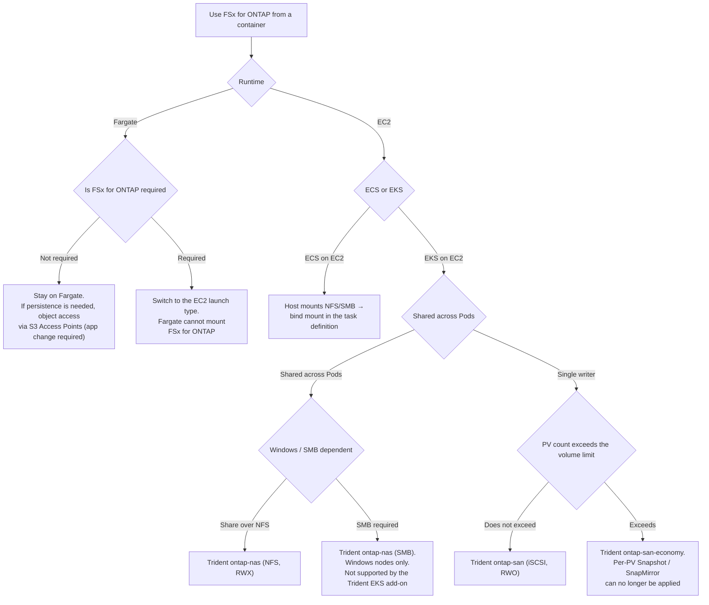

# Whether a container can use FSx for ONTAP as a datastore

<!-- lang-switcher:start -->
🌐 [日本語](../../../ja/reference/decision-trees/container-datastore-selection.md) | [English](container-datastore-selection.md) | [🏠 Repository home](../../README.md)
<!-- lang-switcher:end -->

[🏠 Repository home](../../README.md) | [Reference](../../../ja/reference/README.md) | [Decision trees index](../../../ja/reference/decision-trees/README.md) | [Domain — Block storage](../../domains/block-storage/README.md)

---

## Conclusion

**The first branch of this decision tree is neither the container orchestrator nor the required protocol. It is whether the runtime is Fargate or EC2.**

Whether a container on Amazon ECS / Amazon EKS can use FSx for ONTAP as a persistent volume (PV) or data area is **decided the moment you choose AWS Fargate.** Fargate cannot mount FSx for ONTAP on either ECS or EKS. This is the strongest constraint, so it comes first.

**And containerizing does not bring FSx for ONTAP integration with it.** AWS Transform's containerization goes as far as Dockerizing source code and deploying it; the persistent-storage configuration is not part of the output. Integration is a separate step you add — NetApp Trident (EKS) or a host mount (ECS on EC2).

**The first two questions settle the route.**

| Order | Question | Why it comes first |
|---|---|---|
| 1 | Is the runtime Fargate or EC2 | **On Fargate, FSx for ONTAP cannot be attached.** The option disappears before performance or sharing requirements are considered |
| 2 | ECS or EKS | The reachability form differs. ECS on EC2 is a **host mount bind-mounted in**, EKS on EC2 is the **Trident CSI driver** |
| 3 | Shared across Pods or single writer | On EKS, shared uses `ontap-nas` (NFS/SMB, RWX), single writer uses `ontap-san` (iSCSI, RWO) |
| 4 | Does the expected PV count exceed the volume limit | If it does, `ontap-san-economy`. The decision is in [Kubernetes block volumes meet the volume limit (日本語)](../../../ja/domains/block-storage/notes/kubernetes-block-volumes-and-the-volume-limit.md) |
| 5 | Windows / SMB dependent | The SMB PV is `ontap-nas` and **Windows nodes only**. The Trident EKS add-on does not support it |

> **Tier**: `documented` — the branch conditions are based on AWS / NetApp official documentation (confirmed 2026-09-22).
> **The container route has not been confirmed on real hardware.** The measurements this repository and its siblings hold cover the EC2 rehost route only; the path from a container to FSx for ONTAP (Trident PVs, host mounts) is at the literature-review stage.
> The implementation (five configurations as CloudFormation templates) lives in [FSx-for-ONTAP-Container-Datastore-Patterns](https://github.com/Yoshiki0705/FSx-for-ONTAP-Container-Datastore-Patterns).

---

## The selection flow

**The same content is given as a table.** Mermaid does not render in every context, is not reliably reachable by a screen reader, and is not extractable by a crawler. **No decision exists only inside the diagram.**

| # | Question | Answer | Destination |
|---|---|---|---|
| 1 | Runtime | Fargate | Go to 2 |
| 1 | same | EC2 | Go to 3 |
| 2 | Is FSx for ONTAP required | Not required | **Stay on Fargate.** If persistence is needed, object access via S3 Access Points (the app needs an S3 SDK change) |
| 2 | same | Required | **Switch to the EC2 launch type.** Fargate cannot mount FSx for ONTAP |
| 3 | ECS or EKS | ECS on EC2 | **The host mounts NFS/SMB and the task definition bind-mounts it.** The container runtime does not mount it directly |
| 3 | same | EKS on EC2 | Go to 4 |
| 4 | Shared across Pods | Single writer | Go to 5 |
| 4 | same | Shared across Pods | Go to 6 |
| 5 | Does the PV count exceed the volume limit | Does not exceed | **Trident `ontap-san` (iSCSI, RWO)** |
| 5 | same | Exceeds | **Trident `ontap-san-economy`.** Per-PV Snapshot / SnapMirror / QoS can no longer be applied |
| 6 | Windows / SMB dependent | Share over NFS | **Trident `ontap-nas` (NFS, RWX)** |
| 6 | same | SMB required | **Trident `ontap-nas` (SMB).** Windows nodes only, and not supported by the Trident EKS add-on |

---

## Terminals that do not reach FSx for ONTAP

**This decision tree does not reach FSx for ONTAP at two terminals.** Both are the case where Fargate was chosen.

| Terminal | The situation | Why FSx for ONTAP cannot be used |
|---|---|---|
| **Object access via S3 Access Points** | Running on Fargate, persistence is needed, but mounting FSx for ONTAP is not required | **Fargate cannot use FSx for ONTAP through a volume mount.** An ECS Fargate task definition supports only bind mount host volumes and Amazon EFS; EKS Fargate cannot run the Trident node pod (DaemonSet, privileged). Reading and writing as objects leaves S3 Access Points as the route, but **the app must be changed to use the S3 SDK** |
| **Switch to the EC2 launch type** | Want to run on Fargate, but mounting FSx for ONTAP is required | Same as above. **In this case you give up Fargate's operational simplicity and choose EC2 worker nodes (EKS) or the EC2 launch type (ECS).** They do not coexist |

**Fargate's operational simplicity and FSx for ONTAP persistent volumes are a trade-off.** Choosing one gives up the other. A stateless workload suits Fargate and does not need FSx for ONTAP.

---

## The reasoning for each branch

| Branch | What it is based on |
|---|---|
| Fargate cannot mount FSx for ONTAP (ECS) | An ECS Fargate task definition supports only bind mount host volumes and Amazon EFS; `dockerVolumeConfiguration` is not supported |
| Fargate cannot mount FSx for ONTAP (EKS) | Trident runs a node pod (DaemonSet, privileged) on each worker node, and EKS Fargate cannot run DaemonSets, privileged Pods, or HostNetwork. The only persistence usable on Fargate is Amazon EFS (static only) |
| ECS on EC2 goes through a host mount | AWS documents the procedure as mounting NFS on EC2 Linux and bind-mounting it, and creating an SMB global mapping on EC2 Windows and bind-mounting it. **The container runtime does not mount FSx for ONTAP directly** |
| EKS on EC2 uses Trident | The AWS EKS User Guide points to NetApp Trident (a CSI-compliant driver) as the means to use FSx for ONTAP from EKS. There is no separate AWS-native CSI driver for FSx for ONTAP |
| Shared vs single writer splits the driver | NetApp's integration guide makes "NAS driver if multiple Pods share one PVC, iSCSI block driver if not" the default choice |
| PV count selects `ontap-san-economy` | `ontap-san` creates a FlexVol plus a LUN per PV, so the PV count lands directly on the volume-count limit. NetApp states that `ontap-san-economy` should be used only when the expected PV count exceeds the volume limit. Details in [Kubernetes block volumes meet the volume limit (日本語)](../../../ja/domains/block-storage/notes/kubernetes-block-volumes-and-the-volume-limit.md) |
| The SMB PV is Windows nodes only | SMB volumes are `ontap-nas` only, Windows nodes only, and not supported by the Trident EKS add-on |
| AWS Transform containerization does not configure persistent storage | The scope of containerization is Dockerizing and deploying; the output (Helm chart / Terraform module) does not include PV / PVC / StorageClass configuration |

The source URLs and the measured / unconfirmed tiers for every item are in the implementation repository [FSx-for-ONTAP-Container-Datastore-Patterns](https://github.com/Yoshiki0705/FSx-for-ONTAP-Container-Datastore-Patterns), in its derivation document on containerization and FSx for ONTAP integration.

---

## Where this decision tree hands off

**The implementation after a terminal is chosen is not covered in this repository.**

[FSx-for-ONTAP-Container-Datastore-Patterns](https://github.com/Yoshiki0705/FSx-for-ONTAP-Container-Datastore-Patterns) holds the five configurations as CloudFormation templates. **That side holds the implementation and this repository holds the decision.**

**The order for going through both is this.**

| Step | Which decision tree | What it decides |
|---|---|---|
| 1 | This decision tree | The runtime, the reachability form, and which driver |
| 2 | [Kubernetes block volumes meet the volume limit (日本語)](../../../ja/domains/block-storage/notes/kubernetes-block-volumes-and-the-volume-limit.md) | Whether `ontap-san` or `ontap-san-economy`. **It depends on whether the PV count hits the volume limit** |
| 3 | The sibling's CloudFormation templates | Running the chosen configuration at minimal scale: Trident on EKS on EC2, the host mount on ECS on EC2, S3 Access Points on Fargate |

**If you chose Fargate and landed on object access via S3 Access Points**, [how a request through an S3 Access Point is judged (日本語)](../../../ja/reference/decision-trees/access-point-authorization.md) and data-utilization's [reaching data without copies (日本語)](../../../ja/domains/data-utilization/notes/reaching-data-without-copies.md) cover authorization and the access path.

---

## What this decision tree does not answer

| Question | Where it lives |
|---|---|
| The detailed difference between `ontap-san` and `ontap-san-economy`, and the volume-limit figures | [Kubernetes block volumes meet the volume limit (日本語)](../../../ja/domains/block-storage/notes/kubernetes-block-volumes-and-the-volume-limit.md) |
| The earlier decision of which AWS file storage | [Choosing an AWS file storage (日本語)](../../../ja/reference/decision-trees/file-storage-selection.md) |
| Sorting the migration path (source code / VM / dedicated tool) that led here | [The migration path to containers or a modernized runtime splits three ways](../../playbooks/03-migrate/notes/migration-paths-to-containers.md) |
| The block layout after FSx for ONTAP is chosen | [Choosing a block protocol and layout (日本語)](../../../ja/reference/decision-trees/block-protocol-and-layout.md) |
| The authorization evaluation order through an S3 Access Point | [How a request through an S3 Access Point is judged (日本語)](../../../ja/reference/decision-trees/access-point-authorization.md) |
| The CloudFormation template for each of the five configurations | [FSx-for-ONTAP-Container-Datastore-Patterns](https://github.com/Yoshiki0705/FSx-for-ONTAP-Container-Datastore-Patterns) |
| **The real-hardware behaviour of the container route** | **Unconfirmed.** Data consistency, failover behaviour, and avoiding the Amazon EBS multipath conflict when using iSCSI are covered at the implementation repository's real-hardware verification stage |
| AWS Transform containerization's supported languages and scope | The implementation repository [FSx-for-ONTAP-Container-Datastore-Patterns](https://github.com/Yoshiki0705/FSx-for-ONTAP-Container-Datastore-Patterns) and its derivation document |

---

## Common misconceptions

| Misconception | Reality |
|---|---|
| Containerizing brings FSx for ONTAP integration with it | **It does not.** AWS Transform containerization goes as far as Dockerizing and deploying; the persistent-storage configuration is not in the output. You add Trident or a host mount separately |
| Even on Fargate, installing a CSI driver lets you use FSx for ONTAP | **It does not.** Trident needs a node pod (DaemonSet, privileged), and EKS Fargate cannot run it. An ECS Fargate task definition does not include FSx for ONTAP among its supported volumes |
| Choose the orchestrator (ECS / EKS) first | **The runtime (Fargate / EC2) is decided first.** On Fargate, FSx for ONTAP cannot be attached on either ECS or EKS |
| EKS always uses a Trident PV | ECS on EC2 uses a **host mount bind-mounted in**, not Trident. EKS on EC2 is the one that uses Trident |
| To share across Pods, make iSCSI RWX | Block RWX only makes the raw block device visible to multiple nodes; arbitration is the cluster filesystem's responsibility. **Sharing defaults to `ontap-nas` (NFS/SMB)** |
| `ontap-san-economy` is always better | **Per-PV Snapshot, SnapMirror, and QoS can no longer be applied.** Choose it only when the PV count is expected to exceed the volume limit |
| The SMB PV works on Linux nodes too | **Windows nodes only**, and not supported by the Trident EKS add-on |
| ECS Fargate supports EFS, so it should support FSx for ONTAP too | **They are different.** ECS Fargate's supported volumes are bind mount host volumes and Amazon EFS only; FSx for ONTAP is not included |

---

## Related documents

- [Decision trees index (日本語)](../../../ja/reference/decision-trees/README.md) — the other decision trees
- [The migration path to containers or a modernized runtime splits three ways](../../playbooks/03-migrate/notes/migration-paths-to-containers.md) — sorting the migration path before it converges here
- [Choosing an AWS file storage (日本語)](../../../ja/reference/decision-trees/file-storage-selection.md) — before entering containers, which file storage at all
- [Kubernetes block volumes meet the volume limit (日本語)](../../../ja/domains/block-storage/notes/kubernetes-block-volumes-and-the-volume-limit.md) — Trident driver choice and the volume limit
- [Choosing a block protocol and layout (日本語)](../../../ja/reference/decision-trees/block-protocol-and-layout.md) — the block decision after FSx for ONTAP is chosen
- [How a request through an S3 Access Point is judged (日本語)](../../../ja/reference/decision-trees/access-point-authorization.md) — authorization when Fargate lands on S3 Access Points
- [FSx-for-ONTAP-Container-Datastore-Patterns](https://github.com/Yoshiki0705/FSx-for-ONTAP-Container-Datastore-Patterns) — the five configurations as CloudFormation templates (implementation)
- [Cross-repository citation index (日本語)](../../../ja/reference/cross-repo-index.md) — how the siblings are cited

---

[🏠 Repository home](../../README.md) | [Reference](../../../ja/reference/README.md) | [Decision trees index](../../../ja/reference/decision-trees/README.md) | [Domain — Block storage](../../domains/block-storage/README.md)

<!-- lang-switcher:start -->
🌐 [日本語](../../../ja/reference/decision-trees/container-datastore-selection.md) | [English](container-datastore-selection.md) | [🏠 Repository home](../../README.md)
<!-- lang-switcher:end -->
