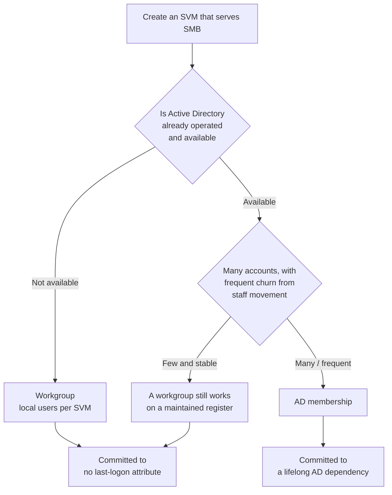
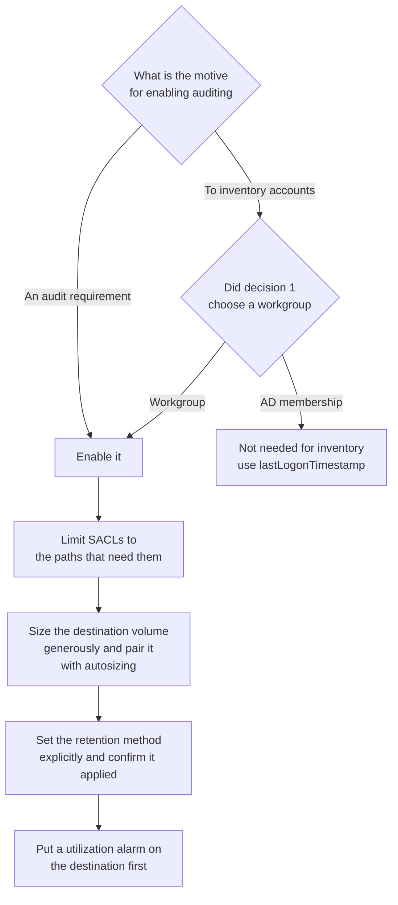

# Two choices decide SMB user management and auditing

<!-- lang-switcher:start -->
🌐 [日本語](../../../ja/reference/decision-trees/smb-identity-and-audit.md) | [English](smb-identity-and-audit.md) | [🏠 Repository home](../../README.md)
<!-- lang-switcher:end -->

[Decision trees index](../../../ja/reference/decision-trees/README.md)

---

## Conclusion

**Two choices are hard to change later when serving SMB from Amazon FSx for NetApp ONTAP.**

| # | Choice | When it is fixed |
|---|---|---|
| 1 | **Where identities live** — a workgroup (local users per SVM), or Active Directory membership | At SVM creation. **Changing it later involves deleting the CIFS server** |
| 2 | **Whether auditing runs continuously** — for an audit requirement, or to inventory accounts | At design time. Enabling it adds availability concerns |

**The two are not independent.** Choosing a workgroup removes any attribute holding a last logon time, so the only route to an inventory is file access auditing — which turns choice 2 from "whether to do it" into "how to do it safely".

**Each branch also carries consequences that public documentation does not state.** Those take time to attribute once encountered, so this tree's main use is less the branching itself than **showing what each branch commits you to before you pick one**.

> **Evidence**: `documented` — **which options exist** is stated in AWS and NetApp documentation
> ([sources](#primary-sources)). **This tree holds no measurements of its own.** Each branch's
> consequences live in the corresponding note, which records the verification date, region, and
> ONTAP version. Cite figures, thresholds, and durations from the notes, not from this tree.

---

## Decision 1 — Where identities live

The reasoning for each branch follows. **The recommended side's constraints are stated too.**

| Aspect | Workgroup + local users | AD membership |
|---|---|---|
| Reading a last logon time | **No such attribute exists.** Requires enabling, retaining, and parsing file access audit logs | AD's `lastLogonTimestamp` |
| External dependency | None | **Depends on AD availability for its whole life**, not only at join time |
| Central user management | **Independent per SVM.** Accounts cannot be reused | Per domain |
| Coordination with AD operators | Not needed | Needed |
| Responsibility for audit log capacity | **Taken on for the sake of the inventory** | Not needed for inventory purposes |
| Scope of an authentication failure investigation | Contained within the SVM | Includes reachability to a domain controller |

**How to choose**: account count and churn decide it. **Dozens of accounts with frequent movement point to AD membership**; **a small, stable set points to a workgroup with a maintained register.** Choosing a workgroup means weighing the cost of enabling auditing for the inventory against the cost of operating AD. **Both branches carry operational cost; they differ in where it sits.**

---

## Decision 2 — Whether auditing runs continuously

The reasoning behind the branches:

| Concern | Detail |
|---|---|
| Side effect of enabling | **When the audit destination volume fills, client access stops.** Not at the moment it becomes full |
| Scope of the stop | **Only paths carrying a SACL.** Volumes in the same SVM that are not audited are unaffected |
| Means of detection | **The EMS event that directly reports the write failure is not visible to customers.** What remains are capacity-side proxies |
| Judging health | `vserver audit show` reports `Auditing State: true` **even while access is stopped**. It cannot serve as a health signal |
| Retention settings | The rotation-count method and the retention-period method are **mutually exclusive**. Setting one disables the other |
| Side effect on the inventory | **The very share given a SACL for the inventory is the first to stop when capacity runs out.** Widening the scope widens the outage |

**How to choose**: with an audit requirement there is no choice to make. **When enabling it only for an inventory, first check whether decision 1 can choose AD membership.** If AD is available, the inventory costs nothing in availability design.

**If you do enable it, order matters.** Prefer a design that **does not fill** — explicit retention, a generous initial size, autosizing — over one that detects and reacts. **The warning-to-stop window is not reproducible.** Measured values, and why they do not repeat, are in [the note on destination exhaustion](../../../ja/domains/security-governance/notes/audit-log-space-and-client-access.md) (日本語).

---

## What each branch commits you to

**The consequences fixed by a branch, laid out to be read before choosing.** Measurement details live in the notes.

| Branch | What you take on | Detail |
|---|---|---|
| **Both branches** | **Deleting the CIFS server leaves that SVM unable to serve SMB.** Unjoining AD involves that deletion. Recreating through the ONTAP CLI does not restore it; the ONTAP REST API does | [An SVM that cannot serve SMB](../../../ja/domains/multiprotocol-identity/notes/smb-service-lost-on-cifs-server-delete.md) (日本語) |
| **Both branches** | **No administrative role can change a service policy.** Enumerating roles to find one is wasted effort | [The `fsxadmin` section of the same note](../../../ja/domains/multiprotocol-identity/notes/smb-service-lost-on-cifs-server-delete.md#fsxadmin-では追加できないこと) (日本語) |
| Workgroup | **Local users carry no last-logon attribute.** An inventory has to be built from audit logs, and "no activity" does not mean "not needed", so automating deletion is a separate judgment | [No last-logon attribute exists](../../../ja/domains/multiprotocol-identity/notes/local-user-inventory-without-last-logon.md) (日本語) |
| Workgroup | **Logon audit events are per session, not per login action.** Counting them wrongly produces false positives in the inventory | [4624 is recorded, but what it counts is sessions](../../../ja/domains/security-governance/notes/smb-logon-audit-event-coverage.md) (日本語) |
| AD membership | **The AD dependency lasts for the life of the SVM, not just the join.** Service account credential expiry is symptomless in steady state and surfaces at the next maintenance | [The AD dependency lasts a lifetime](../../../ja/domains/multiprotocol-identity/notes/ad-dependency-lasts-the-lifetime.md) (日本語) |
| Auditing enabled | **Destination exhaustion stops client access.** No customer-visible EMS event reports the write failure, leaving only capacity-side proxies | [Destination exhaustion stops access](../../../ja/domains/security-governance/notes/audit-log-space-and-client-access.md) (日本語) |

---

## Working back from a symptom

**Once you know which branch's constraint you hit, there is one place to look.**

| Symptom | Constraint most likely in play | What to look at first |
|---|---|---|
| The CIFS server was created but SMB will not connect | Both branches (CIFS deletion) | Whether the data LIF's service list includes `data-cifs` |
| An SVM that used to connect stops after AD configuration was rebuilt | Same. **Unjoining involves a deletion** | Same. Creation date is irrelevant |
| Trying to fix the service policy returns a "not a recognized command" error | Same (role restriction) | The command family's access in `security login role show -role <role>` |
| SMB clients stop with an error indicating an audit failure | The auditing branch | Utilization of the audit destination volume |
| Auditing is enabled but no files appear at the destination | Same | Free space on the destination. **`Auditing State` cannot decide this** |
| An account judged unused in the inventory turns out to be in use | Workgroup branch (session granularity) | How logon events were counted, and the SACL on the target paths |
| Authentication works in steady state but fails after maintenance | AD membership branch | Validity of the service account credentials |

---

## Common misconceptions

| Misconception | Reality |
|---|---|
| Recreating the CIFS server brings SMB back | **Recreating through the ONTAP CLI does not.** The command succeeds; the lost service is not restored |
| A different administrative role can fix the service policy | **Every available role is read-only** for it, and no role can change it |
| Inability to serve SMB depends on when the SVM was created | What correlates is not creation date but the **CIFS server deletion history** |
| Enabling auditing can only stop auditing | **Client access to paths carrying a SACL stops** |
| `vserver audit show` tells you whether auditing is writing | It reports `Auditing State: true` **even while stopped** |
| The write failure can be detected from an EMS event | **The event that reports it directly is not visible to customers.** Capacity-side proxies are what remain |
| Local users also have a last logon record | **No such attribute exists** |
| Counting logon events gives a login count | They are **per session**. Reusing an existing session emits no new event |
| AD membership is a build-time task | **The dependency lasts for the life of the SVM** |
| Retention can set both a count and a period | They are **mutually exclusive**. Setting one disables the other |

---

## Limits of this tree

- **Which options exist is documented, but this tree did not measure any branch's consequences.** Verification date, region, and ONTAP version are in the notes linked from the tables above. **Cite figures from the notes.**
- **Every consequence derives from observations in a single verification environment.** Follow each note on how far it generalizes. **This tree shows what can happen, not how often.**
- **No comparison with on-premises ONTAP was made.** Where an administrator can edit a service policy directly, the recovery path differs, so procedures written for those environments may not transfer.
- **Directory services other than AD, such as LDAP, are out of scope.** This tree covers the workgroup and AD-membership choice only.
- **The ordering in decision 2** (limit the scope, then leave capacity headroom, then set retention explicitly, then add the alarm) **is a design judgment derived from measurement.** The ordering itself was not comparatively tested.

---

## Primary sources

| Concern | Source |
|---|---|
| Configuring file access auditing, and how audit targets are specified | [AWS: Auditing file access](https://docs.aws.amazon.com/fsx/latest/ONTAPGuide/file-access-auditing.html) |
| That the audit destination is a dedicated volume or qtree, and the default log size | [NetApp: Plan the auditing configuration](https://docs.netapp.com/us-en/ontap/nas-audit/plan-auditing-config-concept.html) |
| That destination volume exhaustion stops an SMB share from serving data | [NetApp KB: CIFS share not serving data because the Audit Log Destination is full](https://kb.netapp.com/on-prem/ontap/da/NAS/NAS-KBs/CIFS_share_not_serving_data_because_the_Audit_Log_Destination_is_full) |
| The EMS event definition for the write failure, and denial of service on SACL-enabled objects | [NetApp EMS: `adt.dest` events](https://docs.netapp.com/us-en/ontap-ems/adt-dest-events.html) |
| Prerequisites for AD membership, and the delegated permissions a service account needs | [AWS: Prerequisites for using a self-managed Microsoft AD](https://docs.aws.amazon.com/fsx/latest/ONTAPGuide/self-manage-prereqs.html) |
| That a rotation count and a retention period are mutually exclusive | [NetApp: `vserver audit modify`](https://docs.netapp.com/us-en/ontap-cli/vserver-audit-modify.html) |
| Volume autosizing that grows on a utilization threshold | [AWS: Enabling volume autosizing](https://docs.aws.amazon.com/fsx/latest/ONTAPGuide/enable-volume-autosizing.html) |

---

## Related documents

- [An SVM that cannot serve SMB](../../../ja/domains/multiprotocol-identity/notes/smb-service-lost-on-cifs-server-delete.md) (日本語) — **the constraint common to both branches.** Cause, and recovery through the ONTAP REST API
- [No last-logon attribute exists; the inventory has to come from audit logs](../../../ja/domains/multiprotocol-identity/notes/local-user-inventory-without-last-logon.md) (日本語) — the workgroup branch, including a staged rollout
- [4624 is recorded, but what it counts is sessions](../../../ja/domains/security-governance/notes/smb-logon-audit-event-coverage.md) (日本語) — the nature of the events an inventory relies on
- [Destination exhaustion stops access, but not at the moment it fills](../../../ja/domains/security-governance/notes/audit-log-space-and-client-access.md) (日本語) — the consequence in decision 2, with measurements and observable signals
- [The AD dependency lasts a lifetime](../../../ja/domains/multiprotocol-identity/notes/ad-dependency-lasts-the-lifetime.md) (日本語) — the AD membership branch
- [Security style determines the permission model](../../domains/multiprotocol-identity/notes/security-style-and-permission-evaluation.md) — the premise when NFS is served alongside
- [Decision trees index](../../../ja/reference/decision-trees/README.md)
- [Evidence Policy](../../evidence-policy.md)

---

<!-- lang-switcher:start -->
🌐 [日本語](../../../ja/reference/decision-trees/smb-identity-and-audit.md) | [English](smb-identity-and-audit.md) | [🏠 Repository home](../../README.md)
<!-- lang-switcher:end -->
