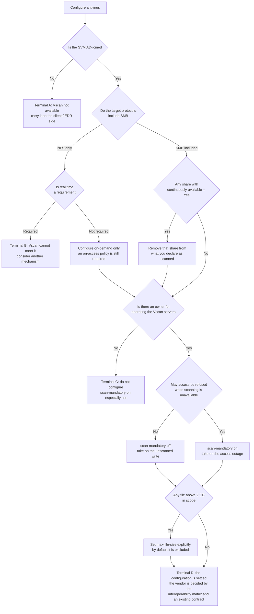

# How far antivirus scanning applies

[🏠 Repository home](../../README.md) | [Decision trees index](../../../ja/reference/decision-trees/README.md) | [Domain — Security and governance](../../domains/security-governance/README.md)

---

## Conclusion

**No terminal of this tree names a vendor.**

The first material anyone finds on antivirus for Amazon FSx for NetApp ONTAP is a list of six supported vendors, but **the differences between the six cannot be decided here.** The version combination is in the NetApp Interoperability Matrix, and cost and operations are decided by an existing contract. **This repository holds neither.**

**What can be decided is the five things settled before a vendor.**

1. **Whether Vscan is available at all** (is the SVM AD-joined)
2. **Whether scanning can be real time** (do the target protocols include SMB)
3. **Whether any share falls outside the scanning scope** (`continuously-available`)
4. **Which of an access outage and an unscanned write you take on** (`scan-mandatory`)
5. **Whether any file falls into the default exclusion** (2 GB)

> **Tier**: `documented` — each branch is based on AWS and NetApp documentation and a NetApp KB article (**retrieved 2026-09-15**). **No measurement in this repository.** How far `fsxadmin` can run the `vserver vscan` commands is **unverified**, so one more constraint may sit ahead of condition 1.

---

## The decision flow

**The same content is carried in a table.** So that the judgement is available where the diagram does not render.

| # | Condition | Yes | No |
|---|---|---|---|
| 1 | Is the SVM AD-joined | To condition 2 | **Terminal A.** Vscan's privileged user is a domain account, so it drops out |
| 2 | Do the target protocols include SMB | To condition 3 | To condition 2-1 (NFS only) |
| 2-1 | NFS only, and is real time a requirement | **Terminal B.** on-access is SMB only, so it cannot be met | Configure on-demand only. **An on-access policy is still required** |
| 3 | Any share with `continuously-available` set to `Yes` | **Remove it from what you declare**. To condition 4 | To condition 4 |
| 4 | Is there an owner for operating the Vscan servers | To condition 5 | **Terminal C.** Do not configure |
| 5 | May access be refused when scanning is unavailable | `scan-mandatory on`. To condition 6 | `scan-mandatory off`. To condition 6 |
| 6 | Any file above 2 GB in scope | Set `max-file-size` explicitly. **Terminal D** | **Terminal D** |

---

## The reasoning for each branch

| Branch | Reasoning |
|---|---|
| **Why condition 1 comes first** | **It is the strongest constraint.** The privileged user a Vscan server connects to the SVM with is a domain user account, and it must exist in the scanner pool's privileged-user list. An SVM running in workgroup mode does not meet that premise |
| **Why condition 2 precedes condition 3** | The protocol decides whether on-access is possible at all. The protocol the on-access policy creation accepts is `CIFS`, and it cannot be configured against an NFS export. **A real-time requirement falls here** |
| **Why condition 2-1 routes to "another mechanism"** | on-demand runs on a cron schedule or by hand. **It does not intervene at the moment of the write.** Where real time is a requirement, it will be carried at a different layer |
| **Why condition 3 precedes the configuration** | **Virus scanning is not performed on an SMB share with `continuously-available` set to `Yes`, and there is no way to enable it.** Noticing after configuring means correcting a scope you had already declared |
| **Why condition 4 precedes `scan-mandatory`** | **`scan-mandatory on` converts a gap in operations into an access outage.** A client's access request is denied when no Vscan server answers. Choosing that setting with no owner for operations, patching and monitoring turns an outage into an availability incident |
| **Why condition 5 is a pair** | Either choice takes something on. `on` takes **an access outage**; `off` takes **access to something unscanned**. **Neither is the correct answer.** The only choice available is which to take on |
| **Why condition 6 comes last** | The exclusions apply regardless of the `scan-mandatory` setting. **Even with `on`, a file above 2 GB is out of scope by default.** It sits after condition 5 because someone who chose `on` and misses this concludes "mandatory scanning means everything is covered" |
| **Why terminal D names no vendor** | The differences between the six are decided by the version combination, cost and an existing contract, **and this repository holds nothing to decide them with.** Stopping here is more accurate than writing a recommendation with no material behind it |

**Condition 2 asks about share and export protocols, which is a different question from where a write lands.** Where writes also land through an S3 access point on the same volume, **on-access does not reach that path.** The policy's protocol is `CIFS`, so a write through an S3 access point becomes something on-demand picks up afterwards. **Recording and detection work by other mechanisms** (ONTAP auditing records it and ARP detects it), but **nothing refuses it as it lands.** The per-path table is in [Whether a write can be refused inline, by where it lands](../../domains/security-governance/notes/vscan-scope-is-bounded-before-the-vendor.md#whether-a-write-can-be-refused-inline-by-where-it-lands).

**Choosing on-demand at condition 2-1 still requires creating an on-access policy.** NetApp's documentation states that an on-access policy is required for an on-demand scan, and describes avoiding on-access scanning by setting `-scan-files-with-no-ext false` and `-file-ext-to-exclude *` to exclude every extension. **Configuring on the premise that "we are NFS-only so on-access is irrelevant" stops here.**

---

## What to read next, per terminal

| Terminal | State | What to read next |
|---|---|---|
| **A** | Vscan not available | [Options for restricting access compared](../../../ja/reference/comparison/access-restriction-options.md) (日本語) — the layers the mechanisms sit in |
| **B** | on-access is a requirement but the estate is NFS only | [The antivirus choice is settled before the vendor — the options compared symmetrically](../../domains/security-governance/notes/vscan-scope-is-bounded-before-the-vendor.md#the-options-compared-symmetrically) |
| **C** | No owner for operations | [An exhausted audit destination stops client access](../../domains/security-governance/notes/audit-log-space-and-client-access.md) — the same shape, earlier |
| **D** | The configuration is settled | Confirm the ONTAP version and antivirus product version combination in the NetApp Interoperability Matrix. **Beyond that is outside this repository** |

---

## Verify in your own environment

| # | Step | What it establishes |
|---|---|---|
| 1 | Check the SVM's AD join state | Condition 1 |
| 2 | List the shares and exports by protocol | Condition 2. **The NFS share of them is on-demand only** |
| 3 | List the SMB shares with `continuously-available` set to `Yes` | Condition 3. **What to remove from the declaration** |
| 4 | Check the state of the existing `default_CIFS` policy | "Unconfigured" and "the default is enabled" are different |
| 5 | Try `vserver vscan on-access-policy show` as `fsxadmin` | **The unverified item.** Whether a permission boundary sits ahead of condition 1 |
| 6 | Measure the largest file in scope | Condition 6. The default exclusion is 2 GB |
| 7 | Write down who operates, patches and monitors the Vscan servers | Condition 4. **A blank means terminal C** |

---

## Common misconceptions

| Misconception | Actually |
|---|---|
| This tree decides the vendor | **It does not.** Terminal D reaches the shape of the configuration; the differences between the six are decided by the interoperability matrix and an existing contract |
| The product is the first thing decided | **The first thing settled is whether the SVM is AD-joined.** Without it, Vscan is not a candidate |
| NFS can be scanned in real time too | on-access is against SMB. An NFS export is in scope for on-demand |
| NFS-only means no on-access policy is needed | **An on-access policy is required for an on-demand scan** |
| `scan-mandatory on` is the safe choice | **It is the choice that takes on an access outage.** Either choice takes something on |
| `scan-mandatory on` means every file is scanned | A file matching an exclusion is out of scope. **The default size exclusion is 2 GB** |
| Creating a share puts it in scope | A share with `continuously-available` set to `Yes` is not scanned, **and there is no way to enable it** |
| Nothing is scanned because nothing is configured yet | ONTAP creates `default_CIFS` and enables it for every SVM |
| Condition 2 including SMB means every write is in scope for on-access | **A share's protocol and where a write lands are different questions.** on-access does not reach a write landing through an S3 access point |
| These are constraints specific to FSx for ONTAP | **They are all general ONTAP properties.** No FSx for ONTAP-specific difference was found |

---

## Primary sources consulted

| Point | Source | Retrieved |
|---|---|---|
| That FSx for ONTAP supports third-party antivirus through Vscan, and the six supported | [AWS: Use NetApp ONTAP Vscan with FSx for ONTAP](https://docs.aws.amazon.com/fsx/latest/ONTAPGuide/using-vscan.html) | 2026-09-15 |
| That the privileged user is a domain user account; that the three scanner policies are system-defined; the four `vscan-fileop-profile` values | [NetApp: Antivirus architecture with ONTAP Vscan](https://docs.netapp.com/us-en/ontap/antivirus/architecture-concept.html) | 2026-09-15 |
| The on-access policy's `-protocol CIFS`; `scan-mandatory` behaviour and the precedence of exclusions; the 2 GB default size exclusion; that an SMB share with `continuously-available` set to `Yes` is not scanned; that `default_CIFS` is created by default; that an on-access policy is required for an on-demand scan | [NetApp: Create ONTAP Vscan on-access policies](https://docs.netapp.com/us-en/ontap/antivirus/create-on-access-policy-task.html) | 2026-09-15 |
| That on-demand can target NFS exports and reuses the existing Vscan servers | [NetApp KB: How does vscan work](https://kb.netapp.com/on-prem/ontap/da/NAS/NAS-KBs/How_does_vscan_work) | 2026-09-15 |

---

## Related documents

- [The antivirus choice is settled before the vendor](../../domains/security-governance/notes/vscan-scope-is-bounded-before-the-vendor.md) — the note this tree rests on
- [ISV and SaaS solution map by problem](../isv-solution-map.md) — options for other problem areas
- [Domain — Security and governance](../../domains/security-governance/README.md) — this module's hub
- [Options for restricting access compared](../../../ja/reference/comparison/access-restriction-options.md) (日本語) — after terminal A
- [An exhausted audit destination stops client access](../../domains/security-governance/notes/audit-log-space-and-client-access.md) — after terminal C
- [Where a setting is created](../../../ja/reference/decision-trees/where-a-setting-is-created.md) (日本語) — `fsxadmin`'s permission boundary
- [Evidence Policy](../../evidence-policy.md)

---

[🏠 Repository home](../../README.md) | [Decision trees index](../../../ja/reference/decision-trees/README.md) | [Domain — Security and governance](../../domains/security-governance/README.md)

<!-- lang-switcher:start -->
🌐 [日本語](../../../ja/reference/decision-trees/vscan-antivirus-scope.md) | [English](vscan-antivirus-scope.md) | [🏠 Repository home](../../README.md)
<!-- lang-switcher:end -->
