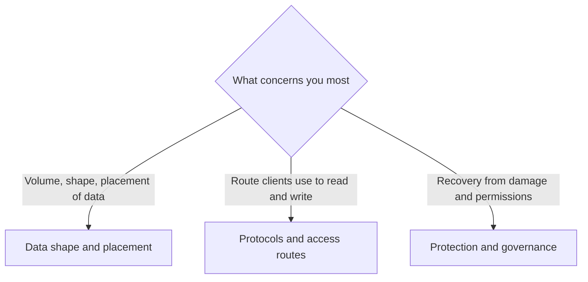

# Workload entry map

[🏠 Repository home](../README.md) | [Reference](../../ja/reference/README.md)

---

## Conclusion

**This map is an index from the shape of the workload you run to the note sections to read first.** You do not need to know the names of the playbooks or domains modules; start from the row closest to your workload.

**There are three ways in, chosen by what concerns you most.**

- **If the volume, shape, or placement of the data concerns you** → [Data shape and placement](#data-shape-and-placement). NAS with very many small files, large parallel writes, reads from many clients or sites, and the capacity cost of cold data
- **If the route clients use to read and write concerns you** → [Protocols and access routes](#protocols-and-access-routes). SMB, NFS, and S3 Access Points
- **If recovering from damage, and who can do what, concerns you** → [Protection and governance](#protection-and-governance). Using SnapMirror destinations, ransomware readiness, and governing and auditing the admin plane

**This page carries no findings of its own.** Each row links to a note section, and numbers, limits, and versions live only in the linked note. Copying them here would leave a stale value behind when only the note is corrected.

> **Tier**: `documented` — records where each linked note and section lives. Most linked findings are ONTAP-general `documented`, and each note separates out how Amazon FSx for NetApp ONTAP behaves as its own "unverified" scope. **Before using a finding for tuning or a design decision, read that note's unverified scope.** A row in this map does not mean the behavior has been verified on FSx for ONTAP.

---

## Entry points by workload

The tier of each row is the tier of the linked note. "Problem it prevents" describes, in words, the failure that tends to happen when you proceed without reading the note; the values are in the linked note. Links marked (日本語) lead to pages that exist only in Japanese.

### Data shape and placement

| Workload | Read first (section links) | Read next | Problem it prevents |
|---|---|---|---|
| NAS with very many small files (home directories, source trees, EDA work areas, and similar) | [Running out of writes with capacity to spare — what happens when they run out](../playbooks/01-assess/notes/counting-bytes-is-not-counting-files.md#what-happens-when-they-run-out) / [The average file size where it starts to bind](../playbooks/01-assess/notes/counting-bytes-is-not-counting-files.md#the-average-file-size-where-it-starts-to-bind) | [The per-directory cap — what happens at the cap](../domains/performance/notes/directory-size-is-capped-separately-from-file-count.md#what-happens-at-the-cap) / [What AWS documents and what is not verified on FSx for ONTAP](../domains/performance/notes/directory-size-is-capped-separately-from-file-count.md#what-aws-documents-and-what-is-not-verified-on-fsx-for-ontap) / [Fit for high file counts — the estimates to have before deciding](../playbooks/01-assess/notes/file-count-fit-depends-on-namespace-shape.md#four-estimates-to-have-before-deciding) | New files cannot be created while capacity remains. One directory fills up before the volume as a whole does |
| Large parallel writes (ingest) | [FlexGroup — ingest balancing happens at creation time](../domains/performance/notes/flexgroup-balances-at-file-creation-not-afterward.md#ingest-balancing-happens-at-creation-time) / [Converting from FlexVol does not redistribute data](../domains/performance/notes/flexgroup-balances-at-file-creation-not-afterward.md#converting-from-flexvol-does-not-redistribute-data) | [What AWS states and what is unverified](../domains/performance/notes/flexgroup-balances-at-file-creation-not-afterward.md#what-aws-states-and-what-is-unverified) | The skew in existing data survives a later configuration change, and some members fill up before the others |
| Reads from many clients or sites (Origin and FlexCache) | [Conditions under which FlexCache helps](../../ja/domains/data-utilization/notes/reaching-data-without-copies.md#flexcache-が効く条件) (日本語) / [FlexCache invalidation and consistency](../../ja/domains/data-utilization/notes/reaching-data-without-copies.md#flexcache-の無効化と整合) (日本語) | [Attribute caching and the unverified scope](../../ja/domains/data-utilization/notes/reaching-data-without-copies.md#属性キャッシュの扱いと未確認の範囲) (日本語) | Placing a cache in front of data whose read pattern it does not help. Mistaking the mechanism that keeps a cache from returning stale content for time-based expiry |
| Capacity cost of cold data (tiering) | [The deciding question — does data come back when read](../../ja/reference/comparison/tiering-policies.md#判断の分かれ目--読んだときに戻るか) (日本語) / [Workloads that AUTO does not suit](../../ja/reference/comparison/tiering-policies.md#auto-が向かないワークロードの条件) (日本語) | [Cooling period and read-back behavior](../../ja/reference/comparison/tiering-policies.md#cooling-period-と読み戻しの挙動) (日本語) / [Tiering on SnapMirror destinations](../../ja/reference/comparison/tiering-policies.md#snapmirror-の宛先での階層化) (日本語) | Periodic full reads keep data from cooling, so the expected capacity reduction never happens. Assuming the destination writes to the same tier as the source |

### Protocols and access routes

| Workload | Read first (section links) | Read next | Problem it prevents |
|---|---|---|---|
| SMB file servers, SQL Server over SMB | [SMB signing and sealing defaults and their performance impact](../../ja/domains/security-governance/notes/what-the-platform-gives-and-what-stays-yours.md#smb-署名と-sealing-の既定値と性能への影響) (日本語) / [Enforcing SMB encryption and clients that cannot connect](../../ja/domains/security-governance/notes/what-the-platform-gives-and-what-stays-yours.md#smb-暗号化の強制によるクライアント接続の不可) (日本語) | [Handling the minimum SMB version](../../ja/domains/security-governance/notes/what-the-platform-gives-and-what-stays-yours.md#smb-10-の無効化と最小版の扱い) (日本語) / [ONTAP-general premises for Multichannel, CA shares, and oplocks](../../ja/reference/comparison/file-storage-options.md#multichannelca-共有oplock-の-ontap-一般の前提) (日本語) | Enforcing encryption leaves some clients unable to connect. Mistaking a performance difference caused by signing or encryption for a shortage of capacity or performance. Treating ONTAP-general premises as verified on FSx for ONTAP |
| Linux workloads over NFS | [NFSv4.x versions and their feature differences](../../ja/reference/file-protocol-resource-map.md#nfsv4x-の版と機能差) (日本語) / [Encryption in transit](../../ja/reference/file-protocol-resource-map.md#転送中の暗号化) (日本語) | [Where NFS over TLS stands and its unverified scope on FSx for ONTAP](../../ja/domains/security-governance/notes/what-the-platform-gives-and-what-stays-yours.md#nfs-over-tls-の位置づけと-fsx-for-ontap-での未確認の範囲) (日本語) | Finding out late that the features available differ by the version you mount. Designing on the assumption that NFS over TLS is available on FSx for ONTAP |
| Reading and writing files through the S3 API (S3 Access Points) | [Why TR limits and behavior do not carry over to S3 Access Points](../../ja/domains/data-utilization/notes/s3-access-point-constraints.md#tr-4814-の上限値と挙動が-s3-access-points-に当てはまらないこと) (日本語) | [Can FSx for ONTAP S3 Access Points be used as S3](../../ja/domains/data-utilization/notes/s3-access-point-constraints.md) (日本語) / [Client access route decision tree](../../ja/reference/decision-trees/client-access-route.md) (日本語) | Applying the values and behavior from ONTAP S3 material to S3 Access Points as they are. Designing on the assumption that every operation an S3 bucket supports is available |

### Protection and governance

| Workload | Read first (section links) | Read next | Problem it prevents |
|---|---|---|---|
| Analytics and validation on a DR destination (reading SnapMirror destinations) | [SnapMirror policy types and the limits on retention, lag, and fan-out](../../ja/reference/comparison/data-protection-methods.md#snapmirror-のポリシー種別と保持ラグ扇形展開の上限) (日本語) / [A live destination readable without a break](../../ja/reference/comparison/data-protection-methods.md#break-なしで読める稼働中の宛先) (日本語) | [Restore testing](../../ja/reference/comparison/data-protection-methods.md#リストアテスト) (日本語) | Breaking the relationship only to read the destination, which stops later transfers. Choosing the wrong policy type and missing the expected retention or lag. Counting on DR without having confirmed that a restore works |
| Ransomware readiness, regulatory requirements | [ARP model generations and learning periods, by version and volume type](../../ja/domains/data-protection/notes/snaplock-and-layered-ransomware-readiness.md#arp-の世代と学習期間の版とボリューム種別による違い) (日本語) / [Snapshot locking applied to volumes that are not SnapLock volumes](../../ja/domains/data-protection/notes/snaplock-and-layered-ransomware-readiness.md#派生機能-snapshot-locking-の非-snaplock-ボリュームへの適用) (日本語) / [Placing a logical air gap (cyber vault) as an immutability layer](../../ja/domains/data-protection/notes/snaplock-and-layered-ransomware-readiness.md#論理エアギャップcyber-vaultという不変性層の置き方) (日本語) | [The approval gate for irreversible operations](../../ja/domains/security-governance/notes/irreversible-operations-need-separate-approval.md#承認ゲート) (日本語) / [Why "we do not use SnapLock" is not protection](../../ja/domains/security-governance/notes/irreversible-operations-need-separate-approval.md#snaplock-を使っていないの保護としての不成立) (日本語) | Estimating when protection starts without checking, by version and volume type, whether there is a learning period. Assuming no irreversible operation exists because SnapLock is not in use, then being unable to delete data under a lock |
| Governing and auditing the admin plane | [Decomposing the controls that protect the admin plane](../domains/security-governance/notes/admin-plane-protection-depends-on-several-controls.md#decomposing-the-controls-that-protect-the-admin-plane) / [How to choose — which control to start with](../domains/security-governance/notes/admin-plane-protection-depends-on-several-controls.md#how-to-choose--which-control-to-start-with) | [The identity an audit record keeps for writes through an S3 Access Point](../../ja/domains/data-utilization/notes/fpolicy-fits-by-how-writes-land.md#s3-access-point-経由の書き込みが監査ログに残す識別情報) (日本語) / [What antivirus settles before the vendor](../domains/security-governance/notes/vscan-scope-is-bounded-before-the-vendor.md#the-four-things-settled-before-the-vendor) / [Whether a write can be refused inline, by where it lands](../domains/security-governance/notes/vscan-scope-is-bounded-before-the-vendor.md#whether-a-write-can-be-refused-inline-by-where-it-lands) | Treating a single control as protecting the admin plane. Assuming the audit log shows who wrote a file even for writes through S3 Access Points. Choosing an antivirus product before noticing a write route that cannot be stopped at the moment it lands |

---

## Selection flow

Choose the section to read from what concerns you most. The table below carries the same content as the diagram.

| What concerns you most | Section to read |
|---|---|
| Volume, shape, and placement of data | [Data shape and placement](#data-shape-and-placement) |
| Route clients use to read and write | [Protocols and access routes](#protocols-and-access-routes) |
| Recovery from damage and permissions | [Protection and governance](#protection-and-governance) |

If more than one concern applies, read every section that matches. The rows are not ranked against each other.

---

## Common misconceptions

| Misconception | In fact |
|---|---|
| What this map lists has been verified | This map verifies nothing. The tier of each row is the linked note's tier, and most are ONTAP-general documentation. For behavior on FSx for ONTAP, read each note's unverified scope |
| My workload is not in the table, so no row applies | Read the row with the nearest shape. What selects a row is not the industry or product name but the number and size of files, the read and write route, and the protection requirements |
| This is the same as the industry resource map | The [industry resource map](../../ja/reference/industry-resource-map.md) (日本語) leads from an industry to public case studies and implementation patterns; this map leads from the shape of a workload to note sections |

---

## Related documents

| Document | Relationship |
|---|---|
| [Industry resource map](../../ja/reference/industry-resource-map.md) (日本語) | Reading order when entering from an industry, and an index of case studies and implementation patterns |
| [Modernization journey map](modernization-journey-map.md) | What to read after migration, and in which order |
| [Navigation guide](../navigation.md) | Entry routes by situation and role |
| [Evidence policy](../evidence-policy.md) | What tiers such as `documented` and `verified` mean |
| [Pre-production review](../../ja/playbooks/04-build/checklists/pre-production-review.md) (日本語) | Checking the items you cannot change later |

---
[🏠 Repository home](../README.md) | [Reference](../../ja/reference/README.md)
<!-- lang-switcher:start -->
🌐 [日本語](../../ja/reference/workload-entry-map.md) | [English](workload-entry-map.md) | [🏠 Repository home](../README.md)
<!-- lang-switcher:end -->
