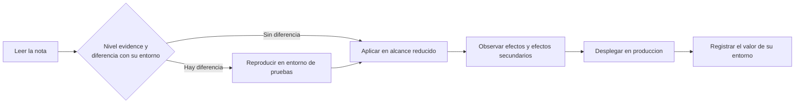
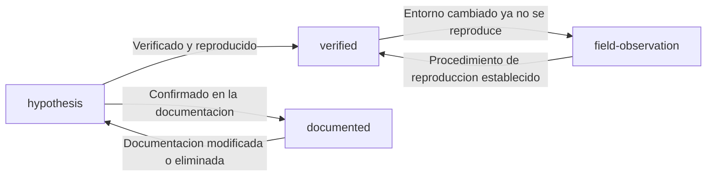

# Política de clasificación del conocimiento

<!-- lang-switcher:start -->
🌐 [日本語](../ja/evidence-policy.md) | [English](../en/evidence-policy.md) | [한국어](../ko/evidence-policy.md) | [简体中文](../zh-CN/evidence-policy.md) | [繁體中文](../zh-TW/evidence-policy.md) | [Français](../fr/evidence-policy.md) | [Deutsch](../de/evidence-policy.md) | [Español](evidence-policy.md) | [🏠 Inicio del repositorio](README.md)
<!-- lang-switcher:end -->

---

## Conclusión

Todo el conocimiento de este repositorio lleva un nivel `evidence` de cuatro grados. A partir de ese nivel, juzgue **hasta qué punto la afirmación es fiable y puede aplicarse a su entorno**. El nivel figura en el frontmatter en forma legible por máquina, y `make lint` comprueba los metadatos obligatorios de cada nivel.

Elevar un nivel, es decir moverlo hacia una mayor fiabilidad, exige añadir la evidencia correspondiente. Bajarlo está siempre permitido.

---

## Los cuatro niveles

| Nivel | Significado | Metadatos obligatorios | Cómo debe tratarlo quien lee |
|---|---|---|---|
| `verified` | Reproducido por la autoría en el entorno indicado | `verified_on` (fecha de verificación) + el entorno de pruebas en el cuerpo del texto | Fiable en esas condiciones de entorno. Condiciones distintas exigen volver a verificar |
| `documented` | Consta en la documentación del proveedor o de AWS | `source` (URL o nombre del documento) | Puede tratarse como fuente primaria, atendiendo a las diferencias de versión y región |
| `field-observation` | Observado una vez en campo, sin confirmar que se reproduzca | Indicación explícita de «no reproducido» en el cuerpo del texto | Pista para una hipótesis. No debe generalizarse |
| `hypothesis` | Deducción lógica, sin verificar | Indicación explícita de «sin verificar» en el cuerpo del texto | Punto de partida de una verificación. No puede fundamentar una decisión |

---

## Por qué es necesaria esta clasificación

La información obtenida en el soporte técnico de campo es de naturaleza muy distinta.

- Lo que está escrito en la documentación oficial
- Valores medidos y reproducidos en un entorno de pruebas
- Un comportamiento observado una sola vez cuya causa no se ha identificado
- Una suposición del tipo «probablemente sea así»

Presentadas con el mismo tono, estas categorías resultan indistinguibles para quien lee. En particular, escribir **un comportamiento observado una sola vez** como si fuera una especificación general lleva a diseñar sobre una premisa falsa. Explicitar el nivel alinea la fuerza de la afirmación con la fuerza de la evidencia.

---

## Condiciones obligatorias al publicar una cifra

Una cifra `verified` va siempre acompañada de sus condiciones de medición. Una cifra sin condiciones no es reproducible, y una cifra no reproducible no sirve para decidir.

| Elemento a indicar | Ejemplo |
|---|---|
| Versión de ONTAP | `9.17.1P7D1` |
| Región | `ap-northeast-1` |
| Configuración | Ajuste de rendimiento, tipo de volumen, tipo de cliente |
| Método de medición | Herramienta, paralelismo, tamaño de archivo, número de ejecuciones |
| Fecha de medición | `2026-08-06` |

Además, deben explicitarse las siguientes distinciones.

| Distinción necesaria | Qué ocurre si se confunde |
|---|---|
| Ejecución puntual vs estimación de producción | Una medición aislada se usa como base del dimensionamiento de capacidad |
| Este entorno de pruebas vs límite general del servicio | Un valor propio de un entorno se cita como especificación del servicio |
| Consideración de diseño vs juicio jurídico o de cumplimiento | Una orientación se trata como fundamento legal |
| Señal de asistencia de la IA vs decisión final | El resultado de una valoración automática se da por firme sin revisión humana |

---

## Antes de adoptarlo en producción

Un nivel solo indica «hasta dónde se puede confiar»; **no garantiza que se cumpla en su entorno.** Antes de pasar a producción, compruebe lo siguiente según el nivel.

| Nivel | Qué hacer sin excepción antes de producción |
|---|---|
| `verified` | Detectar las diferencias entre el entorno de pruebas indicado y el propio. Si difiere la versión, la región o la configuración, volver a medir |
| `documented` | Abrir realmente la fuente y comprobar que la versión vigente sigue diciendo lo mismo. La documentación se revisa |
| `field-observation` | Comprobar si se reproduce en el entorno propio. Si no se reproduce, la afirmación no sirve como premisa |
| `hypothesis` | Verificar antes de usar. No fundamentar un diseño en una deducción sin verificar |

### Secuencia de adopción



| # | Paso | Objetivo |
|---|---|---|
| 1 | Comprobar el nivel `evidence` y las condiciones de entorno indicadas | Establecer qué está realmente verificado |
| 2 | Anotar las diferencias con el entorno propio: versión, región, configuración, carga | Delimitar qué debe volver a verificarse |
| 3 | Reproducir en un entorno de pruebas con la misma configuración que producción | Evitar conocer el comportamiento por primera vez en producción |
| 4 | Aplicar en un alcance limitado y observar | Detectar a pequeña escala los efectos secundarios imprevistos |
| 5 | Registrar el resultado obtenido en el entorno propio | Material para la siguiente decisión. Las diferencias son bienvenidas mediante una [Issue](https://github.com/Yoshiki0705/FSx-for-ONTAP-Adoption-Playbook/issues) |

**El paso 3 no es opcional en operaciones irreversibles.** Los ajustes sin marcha atrás, como habilitar SnapLock, no deben llegar a producción sin una confirmación previa en entorno de pruebas.

---

## Promoción y degradación



| Transición | Trabajo necesario |
|---|---|
| → `verified` | Indicar el entorno de pruebas y añadir `verified_on`. Describir el procedimiento de reproducción en el cuerpo del texto |
| → `documented` | Añadir la URL en `source`. Cita literal de 30 palabras como máximo; por norma, resumir |
| `verified` → `field-observation` | Añadir en el texto por qué ha dejado de reproducirse. Conservar el valor como histórico |
| → `hypothesis` | Indicar por qué se ha perdido el fundamento |

**Una degradación no es una pérdida de calidad.** Mostrar con honestidad que la evidencia se ha perdido es más seguro para quien lee que dejar en pie un `verified` obsoleto.

---

## Errores de interpretación frecuentes

| Idea equivocada | Realidad |
|---|---|
| `documented` es lo más fiable | La documentación y la implementación pueden divergir. `verified` es un hecho constatado en un entorno concreto |
| Si es `verified`, en producción se obtendrá el mismo resultado | Es una medición en un entorno de pruebas. Una configuración o carga distinta cambia el resultado |
| `field-observation` no debería publicarse | Tiene valor, siempre que no se generalice y se indique que no se ha confirmado la reproducibilidad |
| Sin promoción una nota no tiene valor | Compartir un punto de partida de verificación como `hypothesis` también tiene valor |

---

## Cómo escribir el frontmatter

```yaml
---
title: SnapMirror の初期同期でスループットが出ない場合の切り分け
lifecycle: [migrate]
domains: [performance]
evidence: verified
verified_on: 2026-08-06
ontap_version: 9.17.1P7D1
region: ap-northeast-1
lang: ja
---
```

Lo que comprueba `make lint`:

- para `evidence: verified`, que exista `verified_on` y que no sea una fecha futura
- para `evidence: documented`, que exista `source`
- para `evidence: field-observation`, que el texto incluya una mención equivalente a «no reproducido»
- para `evidence: hypothesis`, que el texto incluya una mención equivalente a «sin verificar»
- que los valores de `lifecycle` y `domains` estén en el vocabulario definido

---

## Documentos relacionados

- [Guía de navegación](navigation.md)
- [CONTRIBUTING.md](../../CONTRIBUTING.md)
- [AGENTS.md](../../AGENTS.md) — convenciones para agentes de IA
- [Inicio del repositorio](README.md)

---

<!-- lang-switcher:start -->
🌐 [日本語](../ja/evidence-policy.md) | [English](../en/evidence-policy.md) | [한국어](../ko/evidence-policy.md) | [简体中文](../zh-CN/evidence-policy.md) | [繁體中文](../zh-TW/evidence-policy.md) | [Français](../fr/evidence-policy.md) | [Deutsch](../de/evidence-policy.md) | [Español](evidence-policy.md) | [🏠 Inicio del repositorio](README.md)
<!-- lang-switcher:end -->
