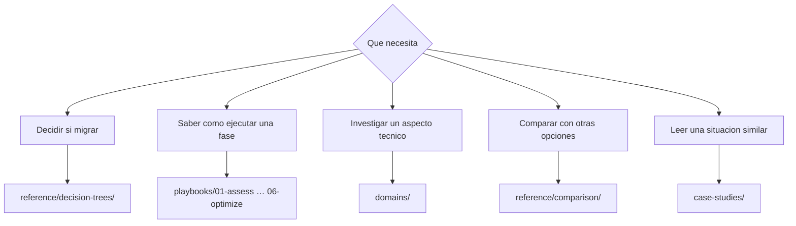

# Guía de navegación

<!-- lang-switcher:start -->
🌐 [日本語](../ja/navigation.md) | [English](../en/navigation.md) | [한국어](../ko/navigation.md) | [简体中文](../zh-CN/navigation.md) | [繁體中文](../zh-TW/navigation.md) | [Français](../fr/navigation.md) | [Deutsch](../de/navigation.md) | [Español](navigation.md) | [🏠 Inicio del repositorio](README.md)
<!-- lang-switcher:end -->

---

## Conclusión

Hay tres puntos de entrada. **Si es su primera visita, empiece por [Partir de su entorno](#partir-de-su-entorno)**: elija la fila que corresponda a su configuración y le indicará un orden de lectura.

En caso contrario, entre por `playbooks/` cuando su pregunta sea «en qué fase estoy», y por `domains/` cuando sea «necesito documentarme sobre este tema». Ambos caminos llegan a las mismas notas. Si hay varias opciones sobre la mesa y no consigue decidir, empiece por `reference/decision-trees/`.

---

## Por dónde empezar

---

## Partir de su entorno

Las ramas anteriores parten de «qué quiere saber». Use esta tabla para partir de **«dado mi configuración, qué debería leer»**. La columna izquierda describe su entorno; el resto da un orden de lectura.

| Su entorno | Leer primero | Leer después |
|---|---|---|
| El origen es ONTAP (local u otra nube) | [Árbol de decisión de métodos de migración](../ja/reference/decision-trees/migration-method.md) (日本語) | [Evaluación](../en/playbooks/01-assess/) → [Diseño](../en/playbooks/02-design/) (English) |
| El origen es un servidor de archivos Windows (SMB, con las ACL NTFS que deben conservarse) | [Árbol de decisión de métodos de migración](../ja/reference/decision-trees/migration-method.md) (日本語) | [Multiprotocolo e identidad](../en/domains/multiprotocol-identity/) (English) |
| El origen es un NAS que no es ONTAP | [Árbol de decisión de métodos de migración](../ja/reference/decision-trees/migration-method.md) (日本語) | [Evaluación](../en/playbooks/01-assess/) (English) |
| NFS y SMB sobre los mismos datos | [El estilo de seguridad determina el modelo de permisos](../ja/domains/multiprotocol-identity/notes/security-style-and-permission-evaluation.md) (日本語) | [Seguridad y gobernanza](../en/domains/security-governance/) (English) |
| La integración con Active Directory es un requisito | [Multiprotocolo e identidad](../en/domains/multiprotocol-identity/) (English) | [Diseño](../en/playbooks/02-design/) (English) |
| Diseñar la gestión de usuarios SMB y la auditoría | [Árbol de decisión — identidad SMB y auditoría](../en/reference/decision-trees/smb-identity-and-audit.md) (English) | [Multiprotocolo e identidad](../en/domains/multiprotocol-identity/) (English) |
| SMB dejó de servirse sin aviso | [Una SVM que no puede servir SMB](../ja/domains/multiprotocol-identity/notes/smb-service-lost-on-cifs-server-delete.md) (日本語) | [Árbol de decisión — identidad SMB y auditoría](../en/reference/decision-trees/smb-identity-and-audit.md) (English) |
| Habilitar registros de auditoría / inventariar usuarios locales | [El agotamiento del destino detiene el acceso](../ja/domains/security-governance/notes/audit-log-space-and-client-access.md) (日本語) | [No existe atributo de último inicio de sesión](../ja/domains/multiprotocol-identity/notes/local-user-inventory-without-last-logon.md) (日本語) |
| Despliegue nuevo, sin nada que migrar | [Diseño](../en/playbooks/02-design/) (English) | [Construcción](../en/playbooks/04-build/) → [Operación](../en/playbooks/05-operate/) (English) |
| Ya en marcha, ajustando el rendimiento | [Rendimiento](../en/domains/performance/) (English) | [Optimización](../en/playbooks/06-optimize/) (English) |
| Ya en marcha, revisando los costes | [Coste](../en/domains/cost/) (English) | [Optimización](../en/playbooks/06-optimize/) (English) |
| Comprobar si un diseño alcanza un límite | [Límites y cuotas](../ja/reference/limits/) | [Diseño](../en/playbooks/02-design/) (English) |
| Acceder mediante la API de S3 o desde una plataforma de analítica | [Requisitos previos de FSx for ONTAP S3 AP](../ja/domains/data-utilization/notes/s3-access-point-constraints.md) (日本語) | [Redactar la política del punto de acceso](../en/domains/security-governance/notes/access-point-authorization-layers.md) (English) |

Dos cosas que conviene saber sobre los enlaces anteriores.

| Marca | Qué esperar |
|---|---|
| **(日本語)** / **(English)** | No hay versión en español. El material en profundidad solo existe en japonés e inglés. Las URL, los comandos y los términos de producto son independientes del idioma |
| Enlaces `reference/`, sin marca | Escritos como archivos bilingües: el japonés y el inglés comparten las mismas tablas, por lo que se leen tal cual |

Las solicitudes de traducción son bienvenidas mediante una [Issue](https://github.com/Yoshiki0705/FSx-for-ONTAP-Adoption-Playbook/issues).

**Sea cual sea la fila, no aplique directamente en producción lo que lea aquí.** Compruebe el nivel `evidence` de cada nota y siga el procedimiento [Antes de adoptarlo en producción](evidence-policy.md#antes-de-adoptarlo-en-producción).

---

## Eje de ciclo de vida — `playbooks/`

El punto de entrada que sigue el avance del proyecto. La salida de cada fase es la entrada de la siguiente. Los enlaces llevan a la versión en inglés.

| # | Módulo | Salida principal | Leer después |
|---|---|---|---|
| 01 | [Evaluación](../en/playbooks/01-assess/) | Inventario actual, lista de restricciones | 02 Diseño |
| 02 | [Diseño](../en/playbooks/02-design/) | Decisiones de configuración, elementos irreversibles fijados | 03 Migración |
| 03 | [Migración](../en/playbooks/03-migrate/) | Plan de migración, procedimiento de conmutación, procedimiento de reversión | 04 Construcción |
| 04 | [Construcción](../en/playbooks/04-build/) | Infrastructure as code, automatización, verificación posterior | 05 Operación |
| 05 | [Operación](../en/playbooks/05-operate/) | Diseño de la supervisión, runbooks | 06 Optimización |
| 06 | [Optimización](../en/playbooks/06-optimize/) | Resultados de mejora de rendimiento y coste | — |

---

## Eje temático — `domains/`

El punto de entrada que parte de un tema. Se referencia en todas las fases del ciclo de vida. Los enlaces llevan a la versión en inglés.

| Módulo | Pregunta típica |
|---|---|
| [Protección de datos](../en/domains/data-protection/) | Cómo diseñar la política de Snapshot / se puede restaurar realmente |
| [Aprovechamiento de datos](../en/domains/data-utilization/) | Puede la analítica y la IA usarlos sin multiplicar copias |
| [Seguridad y gobernanza](../en/domains/security-governance/) | Cómo diseñar el cifrado, la auditoría y los permisos |
| [Rendimiento](../en/domains/performance/) | Dónde se decide el rendimiento y dónde se comparte |
| [Coste](../en/domains/cost/) | Por qué divergen la estimación y la medición |
| [Multiprotocolo e identidad](../en/domains/multiprotocol-identity/) | Por qué difieren los permisos entre NFS y SMB |

---

## Referencia transversal — `reference/`

Escrita como archivos bilingües en japonés e inglés.

| Directorio | Cuándo usarlo |
|---|---|
| [Árboles de decisión](../ja/reference/decision-trees/) | Existen varias opciones y hay que elegir una |
| [Matrices de comparación](../ja/reference/comparison/) | Hay que exponer las contrapartidas frente a otras opciones |
| [Límites y cuotas](../ja/reference/limits/) | Hay que confirmar que un diseño no alcanzará un límite |
| [Glosario](../ja/reference/glossary/) | Se necesita la definición de un término de ONTAP o AWS |

## Impartición de talleres — `workshop-studio/`

| Directorio | Cuándo usarlo |
|---|---|
| [`workshop-studio/`](../ja/workshop-studio/) | Tiempos medidos y selección de módulos para ajustar un taller público de AWS Workshop Studio al tiempo real del evento (日本語) |

---

## Casos — `case-studies/`

[Case Studies](../en/case-studies/) recoge los hallazgos del soporte técnico de campo como **lecciones generalizadas**. No contiene nombres de empresas ni de organizaciones, ni identificadores reales, ni configuraciones que permitan identificar a una organización.

Cada caso sigue esta forma.

| Sección | Contenido |
|---|---|
| Situación | Solo sector y orden de magnitud (p. ej. manufactura / varios cientos de TB) |
| Problema | Qué estaba fallando |
| Opciones consideradas | Las alternativas descartadas, y por qué |
| Decisión | Qué se eligió y con qué razonamiento |
| Resultado | Qué ocurrió realmente, incluidas las desviaciones respecto a lo previsto |
| Lección generalizable | La parte trasladable a otros entornos |

---

## Cómo leer el nivel de confianza

El frontmatter de cada nota lleva un nivel `evidence`. **No cite una nota sin haberlo comprobado.**

| Nivel | En una línea |
|---|---|
| `verified` | Reproducido por la autoría en el entorno indicado |
| `documented` | Consta en la documentación oficial |
| `field-observation` | Observado una vez, no reproducido. No generalizable |
| `hypothesis` | Expectativa razonada, sin verificar |

Consulte la [política de clasificación del conocimiento](evidence-policy.md) para el detalle.

---

## Errores de interpretación frecuentes

| Idea equivocada | Realidad |
|---|---|
| `playbooks/` y `domains/` contienen información distinta | Referencian las mismas notas desde dos ejes. No es duplicación, sino varias vías de acceso |
| Las cifras se pueden aplicar directamente a su entorno | Una cifra va unida a su entorno de medición. Condiciones distintas exigen volver a verificar |
| Los casos incluyen configuraciones concretas | Están abstraídos deliberadamente. No se incluye nada que pueda identificar a una organización |
| Los valores límite están siempre al día | Las entradas de `reference/limits/` llevan fecha de verificación. Vuelva a comprobar todo lo que tenga una fecha antigua |

---

## Documentos relacionados

- [Política de clasificación del conocimiento](evidence-policy.md)
- [CONTRIBUTING.md](../../CONTRIBUTING.md) — convenciones de redacción
- [AGENTS.md](../../AGENTS.md) — convenciones para agentes de IA
- [llms.txt](../../llms.txt) — mapa del repositorio para LLM

---

<!-- lang-switcher:start -->
🌐 [日本語](../ja/navigation.md) | [English](../en/navigation.md) | [한국어](../ko/navigation.md) | [简体中文](../zh-CN/navigation.md) | [繁體中文](../zh-TW/navigation.md) | [Français](../fr/navigation.md) | [Deutsch](../de/navigation.md) | [Español](navigation.md) | [🏠 Inicio del repositorio](README.md)
<!-- lang-switcher:end -->
