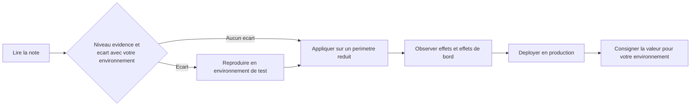
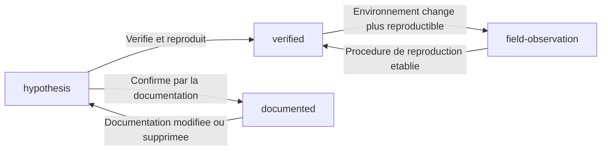

# Politique de classification des connaissances

<!-- lang-switcher:start -->
🌐 [日本語](../ja/evidence-policy.md) | [English](../en/evidence-policy.md) | [한국어](../ko/evidence-policy.md) | [简体中文](../zh-CN/evidence-policy.md) | [繁體中文](../zh-TW/evidence-policy.md) | [Français](evidence-policy.md) | [Deutsch](../de/evidence-policy.md) | [Español](../es/evidence-policy.md) | [🏠 Accueil du dépôt](README.md)
<!-- lang-switcher:end -->

---

## Conclusion

Toute connaissance de ce dépôt porte un niveau `evidence` à quatre degrés. En vous appuyant sur ce niveau, jugez **dans quelle mesure l'affirmation peut être considérée comme fiable et appliquée à votre environnement**. Le niveau figure sous forme lisible par machine dans le frontmatter, et `make lint` vérifie les métadonnées obligatoires propres à chaque niveau.

Élever un niveau, c'est-à-dire le déplacer vers une confiance supérieure, exige d'ajouter la preuve correspondante. L'abaisser est toujours permis.

---

## Les quatre niveaux

| Niveau | Signification | Métadonnées obligatoires | Ce que le lecteur doit en faire |
|---|---|---|---|
| `verified` | Reproduit par l'auteur dans l'environnement indiqué | `verified_on` (date de vérification) + l'environnement de test dans le corps du texte | Fiable dans ces conditions d'environnement. Des conditions différentes exigent une revérification |
| `documented` | Figure dans la documentation de l'éditeur ou d'AWS | `source` (URL ou nom du document) | Peut être traité comme source primaire, en restant attentif aux écarts de version et de région |
| `field-observation` | Observé une fois sur le terrain, sans confirmation de reproductibilité | Mention explicite « non reproduit » dans le corps du texte | Piste d'hypothèse. Ne doit pas être généralisé |
| `hypothesis` | Déduction logique, non testée | Mention explicite « non vérifié » dans le corps du texte | Point de départ d'une vérification. Ne peut fonder une décision |

---

## Ce à quoi les niveaux ne répondent pas

Un niveau classe **la provenance d'une affirmation.** Ce n'est **ni un degré d'investigation, ni une échelle de confiance.** C'est à cette frontière que le sens se déplace lors d'un lien croisé avec un dépôt utilisant un autre vocabulaire.

### `documented` n'implique pas une mesure

`documented` signifie seulement qu'un document de l'éditeur ou d'AWS l'énonce. **Il ne porte aucune affirmation selon laquelle l'auteur a confirmé le comportement.** Le seul niveau qui revendique une mesure est `verified`.

Ainsi, « la source primaire l'énonce, mais cela n'a pas été vérifié sur du matériel réel » relève de `documented`. **Rien n'est perdu dans cette correspondance**, précisément parce que `documented` n'a jamais impliqué une mesure. Lorsqu'un autre dépôt nomme ce même état `unverified` ou similaire, il se transpose tel quel en `documented`.

### L'absence de documentation n'est pas un niveau

« Nous avons cherché sans trouver d'énoncé dans les sources publiques » est **une affirmation sur l'état de la documentation, non sur le comportement du produit.** Les quatre niveaux classent ce qui étaye une affirmation ; aucun n'exprime l'absence d'étaiement.

N'utilisez pas `hypothesis` ici. `hypothesis` signifie **qu'une attente raisonnée existe.** L'employer sans en avoir une donne à la note l'apparence d'un raisonnement qu'elle ne possède pas.

Écrivez-le dans le corps du texte. **Indiquez la date et le périmètre de la recherche** — par exemple « en date de 2026-08, aucun énoncé trouvé dans la documentation AWS » — afin que le lecteur sache quand et où vous avez cherché. Pour les limites et quotas, la place est la section « Could not be measured » (le titre y est en japonais et en anglais) de [Limites et quotas](../ja/reference/limits/) (日本語).

---

## Pourquoi cette classification est nécessaire

Les informations issues du support technique de terrain sont de nature très différente.

- Ce qui est écrit dans la documentation officielle
- Les valeurs mesurées, reproduites en environnement de test
- Un comportement observé une seule fois, dont la cause n'est pas identifiée
- Une supposition du type « ce doit être ainsi »

Présentées sur le même ton, ces catégories deviennent indiscernables pour le lecteur. En particulier, écrire **un comportement observé une seule fois** comme s'il s'agissait d'une spécification générale conduit le lecteur à concevoir sur une prémisse fausse. Expliciter le niveau aligne la force de l'affirmation sur la force de la preuve.

---

## Conditions obligatoires pour publier un chiffre

Un chiffre `verified` s'accompagne toujours de ses conditions de mesure. Un chiffre sans conditions n'est pas reproductible, et un chiffre non reproductible ne sert pas à décider.

| Élément à indiquer | Exemple |
|---|---|
| Version d'ONTAP | `9.17.1P7D1` |
| Région | `ap-northeast-1` |
| Configuration | Réglage du débit, type de volume, type de client |
| Méthode de mesure | Outil, parallélisme, taille des fichiers, nombre d'exécutions |
| Date de mesure | `2026-08-06` |

Les distinctions suivantes doivent en outre être explicitées.

| Distinction à faire | Ce qui arrive si elle est confondue |
|---|---|
| Exécution ponctuelle vs estimation de production | Une mesure isolée sert de base au dimensionnement de la capacité |
| Cet environnement de test vs limite générale du service | Une valeur propre à un environnement est citée comme spécification du service |
| Considération de conception vs jugement juridique ou de conformité | Une orientation est traitée comme un fondement juridique |
| Signal d'assistance de l'IA vs décision finale | Le résultat d'un jugement automatique est acté sans validation humaine |

---

## Avant l'adoption en production

Un niveau indique seulement « jusqu'où l'on peut se fier » ; il **ne garantit pas que cela se vérifie dans votre environnement.** Avant la mise en production, contrôlez ce qui suit selon le niveau.

| Niveau | À faire impérativement avant la production |
|---|---|
| `verified` | Relever les écarts entre l'environnement de test indiqué et le vôtre. Si la version, la région ou la configuration diffère, mesurer à nouveau |
| `documented` | Ouvrir effectivement la source et vérifier que la version courante dit toujours la même chose. La documentation est révisée |
| `field-observation` | Vérifier que cela se reproduit chez vous. Sinon, l'affirmation ne peut servir de prémisse |
| `hypothesis` | Vérifier avant d'utiliser. Ne pas fonder une conception sur une déduction non testée |

### Procédure d'adoption



| # | Étape | Objectif |
|---|---|---|
| 1 | Vérifier le niveau `evidence` et les conditions d'environnement indiquées | Établir ce qui est réellement vérifié |
| 2 | Noter les écarts avec votre environnement : version, région, configuration, charge | Délimiter ce qui doit être revérifié |
| 3 | Reproduire dans un environnement de test de même configuration que la production | Éviter de découvrir le comportement en production |
| 4 | Appliquer sur un périmètre limité et observer | Détecter à petite échelle les effets de bord imprévus |
| 5 | Consigner le résultat obtenu chez vous | Matière à la décision suivante. Les écarts sont bienvenus via une [Issue](https://github.com/Yoshiki0705/FSx-for-ONTAP-Adoption-Playbook/issues) |

**L'étape 3 n'est pas facultative pour une opération irréversible.** Un réglage sans retour possible, comme l'activation de SnapLock, ne doit pas atteindre la production sans confirmation préalable en environnement de test.

---

## Promotion et rétrogradation



| Transition | Travail requis |
|---|---|
| → `verified` | Indiquer l'environnement de test et ajouter `verified_on`. Décrire la procédure de reproduction dans le corps du texte |
| → `documented` | Ajouter l'URL dans `source`. Citation littérale de 30 mots au maximum ; la paraphrase est la règle |
| `verified` → `field-observation` | Consigner dans le corps du texte pourquoi cela ne se reproduit plus. Conserver la valeur comme historique |
| → `hypothesis` | Indiquer pourquoi le fondement a disparu |

**Une rétrogradation n'est pas une perte de qualité.** Montrer honnêtement que la preuve a disparu est plus sûr pour le lecteur que de laisser en place un `verified` périmé.

---

## Idées fausses courantes

| Idée fausse | Réalité |
|---|---|
| `documented` est le plus fiable | Documentation et implémentation peuvent diverger. `verified` est un fait constaté dans un environnement précis |
| Si c'est `verified`, la production donnera le même résultat | C'est une mesure en environnement de test. Une configuration ou une charge différente change le résultat |
| `field-observation` ne devrait pas être publié | Cela a de la valeur, à condition de ne pas généraliser et d'indiquer que la reproductibilité n'est pas confirmée |
| Sans promotion, une note n'a pas de valeur | Partager un point de départ de vérification sous `hypothesis` a aussi de la valeur |

---

## Rédiger le frontmatter

```yaml
---
title: SnapMirror の初期同期でスループットが出ない場合の切り分け
lifecycle: [migrate]
domains: [performance]
evidence: verified
verified_on: 2026-08-06
ontap_version: 9.17.1P7D1
region: ap-northeast-1
lang: ja
---
```

Ce que `make lint` vérifie :

- pour `evidence: verified`, la présence de `verified_on` et une date non future
- pour `evidence: documented`, la présence de `source`
- pour `evidence: field-observation`, une mention équivalente à « non reproduit » dans le corps du texte
- pour `evidence: hypothesis`, une mention équivalente à « non vérifié » dans le corps du texte
- que les valeurs de `lifecycle` et `domains` figurent dans le vocabulaire défini

---

## Documents liés

- [Guide de navigation](navigation.md)
- [CONTRIBUTING.md](../../CONTRIBUTING.md)
- [AGENTS.md](../../AGENTS.md) — conventions pour les agents d'IA
- [Accueil du dépôt](README.md)

---

<!-- lang-switcher:start -->
🌐 [日本語](../ja/evidence-policy.md) | [English](../en/evidence-policy.md) | [한국어](../ko/evidence-policy.md) | [简体中文](../zh-CN/evidence-policy.md) | [繁體中文](../zh-TW/evidence-policy.md) | [Français](evidence-policy.md) | [Deutsch](../de/evidence-policy.md) | [Español](../es/evidence-policy.md) | [🏠 Accueil du dépôt](README.md)
<!-- lang-switcher:end -->
