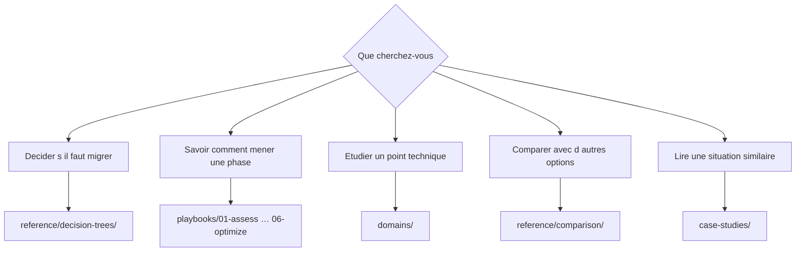

# Guide de navigation

<!-- lang-switcher:start -->
🌐 [日本語](../ja/navigation.md) | [English](../en/navigation.md) | [한국어](../ko/navigation.md) | [简体中文](../zh-CN/navigation.md) | [繁體中文](../zh-TW/navigation.md) | [Français](navigation.md) | [Deutsch](../de/navigation.md) | [Español](../es/navigation.md) | [🏠 Accueil du dépôt](README.md)
<!-- lang-switcher:end -->

---

## Conclusion

Il y a trois points d'entrée. **S'il s'agit de votre première visite, commencez par [Partir de votre environnement](#partir-de-votre-environnement)** : choisissez la ligne correspondant à votre configuration et elle vous donne un ordre de lecture.

Sinon, entrez par `playbooks/` lorsque votre question est « à quelle phase en suis-je », et par `domains/` lorsqu'elle est « je dois me documenter sur ce sujet ». Les deux chemins mènent aux mêmes notes. Si plusieurs options sont sur la table et que vous n'arrivez pas à trancher, commencez par `reference/decision-trees/`.

---

## Par où commencer

---

## Partir de votre environnement

Les branches ci-dessus partent de « que voulez-vous savoir ». Utilisez plutôt ce tableau pour partir de **« compte tenu de ma configuration, que dois-je lire »**. La colonne de gauche décrit votre environnement ; le reste donne un ordre de lecture.

| Votre environnement | À lire d'abord | À lire ensuite |
|---|---|---|
| La source est ONTAP (sur site ou autre cloud) | [Arbre de décision des méthodes de migration](../ja/reference/decision-trees/migration-method.md) (日本語) | [Évaluation](../en/playbooks/01-assess/) → [Conception](../en/playbooks/02-design/) (English) |
| La source est un serveur de fichiers Windows (SMB, conservation des ACL NTFS exigée) | [Arbre de décision des méthodes de migration](../ja/reference/decision-trees/migration-method.md) (日本語) | [Multiprotocole et identité](../en/domains/multiprotocol-identity/) (English) |
| La source est un NAS non ONTAP | [Arbre de décision des méthodes de migration](../ja/reference/decision-trees/migration-method.md) (日本語) | [Évaluation](../en/playbooks/01-assess/) (English) |
| NFS et SMB sur les mêmes données | [Le style de sécurité détermine le modèle de permissions](../ja/domains/multiprotocol-identity/notes/security-style-and-permission-evaluation.md) (日本語) | [Sécurité et gouvernance](../en/domains/security-governance/) (English) |
| L'intégration Active Directory est un prérequis | [Multiprotocole et identité](../en/domains/multiprotocol-identity/) (English) | [Conception](../en/playbooks/02-design/) (English) |
| Concevoir la gestion des utilisateurs SMB et l'audit | [Arbre de décision — identité SMB et audit](../en/reference/decision-trees/smb-identity-and-audit.md) (English) | [Multiprotocole et identité](../en/domains/multiprotocol-identity/) (English) |
| SMB a cessé d'être servi sans prévenir | [Un SVM incapable de servir SMB](../ja/domains/multiprotocol-identity/notes/smb-service-lost-on-cifs-server-delete.md) (日本語) | [Arbre de décision — identité SMB et audit](../en/reference/decision-trees/smb-identity-and-audit.md) (English) |
| Activer les journaux d'audit / inventorier les utilisateurs locaux | [L'épuisement de la destination interrompt l'accès](../ja/domains/security-governance/notes/audit-log-space-and-client-access.md) (日本語) | [Aucun attribut de dernière connexion](../ja/domains/multiprotocol-identity/notes/local-user-inventory-without-last-logon.md) (日本語) |
| Nouveau déploiement, rien à migrer | [Conception](../en/playbooks/02-design/) (English) | [Construction](../en/playbooks/04-build/) → [Exploitation](../en/playbooks/05-operate/) (English) |
| Déjà en production, réglage des performances | [Performance](../en/domains/performance/) (English) | [Optimisation](../en/playbooks/06-optimize/) (English) |
| Déjà en production, révision des coûts | [Coût](../en/domains/cost/) (English) | [Optimisation](../en/playbooks/06-optimize/) (English) |
| Vérifier qu'une conception n'atteint pas une limite | [Limites et quotas](../ja/reference/limits/) | [Conception](../en/playbooks/02-design/) (English) |
| Accéder aux données via l'API S3 ou depuis une plateforme d'analyse | [Prérequis de FSx for ONTAP S3 AP](../ja/domains/data-utilization/notes/s3-access-point-constraints.md) (日本語) | [Rédiger la politique de point d'accès](../en/domains/security-governance/notes/access-point-authorization-layers.md) (English) |

Deux choses à savoir sur les liens ci-dessus.

| Marquage | À quoi s'attendre |
|---|---|
| **(日本語)** / **(English)** | Pas de version française. Le contenu approfondi n'existe qu'en japonais et en anglais. Les URL, les commandes et les termes produit restent indépendants de la langue |
| Liens `reference/`, sans marquage | Rédigés en fichiers bilingues : le japonais et l'anglais partagent les mêmes tableaux, ils sont donc lisibles tels quels |

Les demandes de traduction sont bienvenues via une [Issue](https://github.com/Yoshiki0705/FSx-for-ONTAP-Adoption-Playbook/issues).

**Quelle que soit la ligne, n'appliquez pas directement en production ce que vous lisez ici.** Vérifiez le niveau `evidence` de chaque note et suivez la procédure [Avant l'adoption en production](evidence-policy.md#avant-ladoption-en-production).

---

## Axe cycle de vie — `playbooks/`

Le point d'entrée qui suit l'avancement du projet. La sortie de chaque phase est l'entrée de la suivante. Les liens mènent à la version anglaise.

| # | Module | Sortie principale | À lire ensuite |
|---|---|---|---|
| 01 | [Évaluation](../en/playbooks/01-assess/) | Inventaire actuel, liste des contraintes | 02 Conception |
| 02 | [Conception](../en/playbooks/02-design/) | Décisions de configuration, éléments irréversibles arrêtés | 03 Migration |
| 03 | [Migration](../en/playbooks/03-migrate/) | Plan de migration, procédure de basculement, procédure de retour arrière | 04 Construction |
| 04 | [Construction](../en/playbooks/04-build/) | Infrastructure as code, automatisation, vérification après construction | 05 Exploitation |
| 05 | [Exploitation](../en/playbooks/05-operate/) | Conception de la supervision, runbooks | 06 Optimisation |
| 06 | [Optimisation](../en/playbooks/06-optimize/) | Résultats d'amélioration des performances et des coûts | — |

---

## Axe thématique — `domains/`

Le point d'entrée qui part d'un sujet. Référencé à toutes les phases du cycle de vie. Les liens mènent à la version anglaise.

| Module | Question type |
|---|---|
| [Protection des données](../en/domains/data-protection/) | Comment concevoir la politique Snapshot / peut-on réellement restaurer |
| [Valorisation des données](../en/domains/data-utilization/) | L'analytique et l'IA peuvent-elles s'en servir sans multiplier les copies |
| [Sécurité et gouvernance](../en/domains/security-governance/) | Comment concevoir le chiffrement, l'audit et les permissions |
| [Performance](../en/domains/performance/) | Où le débit se décide et où il est partagé |
| [Coût](../en/domains/cost/) | Pourquoi les estimations et les mesures divergent |
| [Multiprotocole et identité](../en/domains/multiprotocol-identity/) | Pourquoi les permissions diffèrent entre NFS et SMB |
| [Stockage bloc](../en/domains/block-storage/) | Ce qui est déjà décidé avant de choisir iSCSI ou NVMe-oF |

---

## Référence transversale — `reference/`

Rédigée en fichiers bilingues japonais et anglais.

| Répertoire | Quand l'utiliser |
|---|---|
| [Arbres de décision](../ja/reference/decision-trees/) | Plusieurs options existent et il faut en choisir une |
| [Matrices de comparaison](../ja/reference/comparison/) | Il faut poser les compromis face aux autres options |
| [Limites et quotas](../ja/reference/limits/) | Il faut confirmer qu'une conception n'atteindra pas une limite |
| [Glossaire](../ja/reference/glossary/) | Il faut la définition d'un terme ONTAP ou AWS |

## Animation d'ateliers — `workshop-studio/`

| Répertoire | Quand l'utiliser |
|---|---|
| [`workshop-studio/`](../ja/workshop-studio/) | Durées mesurées et sélection des modules pour tenir un atelier public AWS Workshop Studio dans le temps réellement disponible (日本語) |

---

## Études de cas — `case-studies/`

[Case Studies](../en/case-studies/) rassemble les constats issus du support technique de terrain sous forme de **leçons généralisées**. Aucun nom d'entreprise ou d'organisation, aucun identifiant réel, aucune configuration permettant d'identifier une organisation n'y figure.

Chaque étude de cas suit cette forme.

| Section | Contenu |
|---|---|
| Situation | Secteur et ordre de grandeur uniquement (par ex. industrie manufacturière / plusieurs centaines de To) |
| Problème | Ce qui n'allait pas |
| Options envisagées | Les alternatives écartées, et pourquoi |
| Décision | Ce qui a été choisi et sur quel raisonnement |
| Résultat | Ce qui s'est réellement passé, y compris les écarts par rapport aux attentes |
| Leçon généralisable | La part transposable à d'autres environnements |

---

## Comment lire le niveau de confiance

Le frontmatter de chaque note porte un niveau `evidence`. **Ne citez pas une note sans l'avoir vérifié.**

| Niveau | En une ligne |
|---|---|
| `verified` | Reproduit par l'auteur dans l'environnement indiqué |
| `documented` | Figure dans la documentation officielle |
| `field-observation` | Observé une fois, non reproduit. Non généralisable |
| `hypothesis` | Attente raisonnée, non testée |

Voir la [politique de classification des connaissances](evidence-policy.md) pour le détail.

---

## Idées fausses courantes

| Idée fausse | Réalité |
|---|---|
| `playbooks/` et `domains/` contiennent des informations différentes | Ils référencent les mêmes notes selon deux axes. Ce n'est pas une duplication mais plusieurs chemins d'accès |
| Les chiffres s'appliquent directement à votre environnement | Un chiffre va de pair avec son environnement de mesure. Des conditions différentes exigent une revérification |
| Les études de cas donnent des configurations concrètes | Elles sont volontairement abstraites. Rien qui puisse identifier une organisation n'y figure |
| Les valeurs limites sont toujours à jour | Les entrées de `reference/limits/` portent une date de vérification. Revérifiez tout ce qui porte une date ancienne |

---

## Documents liés

- [Politique de classification des connaissances](evidence-policy.md)
- [CONTRIBUTING.md](../../CONTRIBUTING.md) — conventions de rédaction
- [AGENTS.md](../../AGENTS.md) — conventions pour les agents d'IA
- [llms.txt](../../llms.txt) — carte du dépôt pour les LLM

---

<!-- lang-switcher:start -->
🌐 [日本語](../ja/navigation.md) | [English](../en/navigation.md) | [한국어](../ko/navigation.md) | [简体中文](../zh-CN/navigation.md) | [繁體中文](../zh-TW/navigation.md) | [Français](navigation.md) | [Deutsch](../de/navigation.md) | [Español](../es/navigation.md) | [🏠 Accueil du dépôt](README.md)
<!-- lang-switcher:end -->
