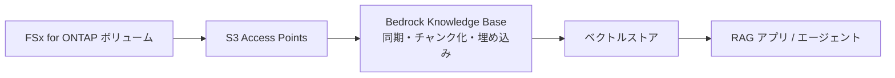

# Bedrock Knowledge Base のデータソースに FSx for ONTAP を使う

> RAG・生成 AI にナレッジを供給する基盤。FSx for ONTAP は **S3 Access Points 経由のデータソース**として読ませる。連携は AWS 公式チュートリアルにあり、兄弟リポジトリで実装済み。

[🏠 リポジトリトップ](../../../../README.md)

---

Amazon Bedrock Knowledge Base のデータソースとして、Amazon FSx for NetApp ONTAP 上のファイルをコピーせずに使う経路を扱います。Bedrock Knowledge Base はエージェントそのものではなく、**エージェントや RAG アプリがデータを読むための基盤**です。[Amazon Quick](../quick/README.md) と同じく「データソース」の関わり方で、Quick がレポート作成に寄せた製品なのに対し、こちらは RAG・生成 AI アプリ全般の土台になります。

---

## このページの但し書き

| 内容 | 確度と根拠 |
|---|---|
| S3 Access Points 経由で Bedrock Knowledge Base のデータソースにできること | AWS 公式チュートリアルに記載（`documented`）。兄弟リポジトリ 2 つで実装済み（下の「実装への導線」） |
| 取り込み時に元の ACL が平坦化されること | このリポジトリの [既存ノート](../../domains/data-utilization/notes/reaching-data-without-copies.md) に依拠 |
| 回答精度・レイテンシ・取り込み時間・コスト | **このページでは扱いません。** 構成（ベクトルストア、チャンキング、モデル）で変わるため、各実装リポジトリの測定を参照してください |

---

## 連携経路（documented）

**ファイルは FSx for ONTAP に置いたまま、S3 Access Points を Bedrock Knowledge Base のデータソースに指定します。** 取り込み（同期）時に Bedrock がファイルを読み、チャンクに分けて埋め込みを作り、ベクトルストアに格納します。

上の流れを文で述べると、ボリュームに付けた S3 Access Points をデータソースとして Bedrock Knowledge Base が同期し、作られたベクトルストアを RAG アプリやエージェントが検索します。元ファイルは FSx for ONTAP から出ません。

| 前提 | 内容 |
|---|---|
| ONTAP バージョン | 9.17.1 以降（S3 Access Points の要件） |
| S3 Access Points とボリューム | 同一 AWS リージョン・同一 AWS アカウント所有。詳細は [FSx for ONTAP S3 AP は「S3 として使える」わけではない](../../domains/data-utilization/notes/s3-access-point-constraints.md) |
| S3 との差分 | S3 Event Notifications は使えない。更新の取り込みは定期同期などで起動する |

---

## 権限の扱い — 索引に届かない元の ACL

**Quick と同じ制約がここにもあります。** S3 Access Points 経由の要求はすべて、アクセスポイントに固定した 1 つのファイルシステム ID で認可されます。したがって Bedrock Knowledge Base が作る索引には、**元のファイルごとの ACL は載りません。** 仕組みは [S3 Access Points は全リクエストを 1 つの ID で認可する](../../domains/data-utilization/notes/reaching-data-without-copies.md) にあります。

利用者ごとに見せる範囲を変えたいなら、ACL とは別の仕組みを置きます。置き場所は 3 つあり、既存ノートの [AI / RAG で設計する対象](../../domains/data-utilization/notes/reaching-data-without-copies.md#ai--rag-で設計する対象) で比較しています。

| 方式 | 境界の位置 |
|---|---|
| 索引を権限で分ける | 権限の境界ごとに別の索引・別の S3 Access Points を用意する |
| 索引側でフィルタする | 検索クエリのメタデータフィルタで絞る |
| 取得後に判定する | 取得したチャンクのメタデータと呼び出し元の ID を突き合わせる |

下の RAG リポジトリは 3 つ目の方式で、文書ごとの権限メタデータと利用者の SID / UID・GID を検索時に照合し、一致しなければ返さない（fail-closed）構成です。

---

## 実装への導線（兄弟リポジトリ）

**実装と測定は、それぞれのリポジトリにあります。** このページは判断の入口で、手順と数値は持ちません。

| リポジトリ | 何があるか |
|---|---|
| [FSx-for-ONTAP-Agentic-Access-Aware-RAG](https://github.com/Yoshiki0705/FSx-for-ONTAP-Agentic-Access-Aware-RAG) | Bedrock Knowledge Base と S3 Vectors を使う Permission-aware RAG + Agentic AI の実装（AWS CDK）。権限は別索引で保守し、検索時に照合する |
| [FSx-for-ONTAP-S3AccessPoints-Serverless-Patterns — `genai/kb-selfservice-curation/`](https://github.com/Yoshiki0705/FSx-for-ONTAP-S3AccessPoints-Serverless-Patterns/tree/main/solutions/genai/kb-selfservice-curation) | Bedrock Knowledge Base のセルフサービス運用パターン |
| [同 — `flexcache/rag-enterprise-files/`](https://github.com/Yoshiki0705/FSx-for-ONTAP-S3AccessPoints-Serverless-Patterns/tree/main/solutions/flexcache/rag-enterprise-files) | FlexCache 系パターンの 1 つとしての Permission-aware RAG |
| [同 — `amplify-portal/`](https://github.com/Yoshiki0705/FSx-for-ONTAP-S3AccessPoints-Serverless-Patterns/tree/main/solutions/amplify-portal) | ファイルポータル UI（Amplify Gen2）。ファイルの閲覧・AI 処理を 1 つの画面にまとめる |

---

## フェーズごとの使いどころ（適合判断・未検証）

**この節は著者の判断です。** 連携の成立は上の実装で確認されていますが、各フェーズへの当てはめは判断です。

| フェーズ | 何ができるか | 根拠 |
|---|---|---|
| 運用・最適化（05-operate / 06-optimize） | 業務ファイルを移動せず、社内文書検索や問い合わせ対応の RAG に使える | コピーを作らないので、権限・保持・削除を 2 か所で管理しなくて済む |
| 構築（04-build） | S3 Access Points・IAM・索引の権限設計を組む | 権限の方式はこの段階で決める。後から変えると索引の作り直しになる |
| 評価・設計（01-assess / 02-design） | 権限要件から方式を選ぶ | 元の ACL に任せる設計はこの経路では成立しない |

---

## 参考資料（一次情報）

- [Build a RAG application using Amazon Bedrock Knowledge Bases with FSx for ONTAP（AWS 公式チュートリアル）](https://docs.aws.amazon.com/fsx/latest/ONTAPGuide/tutorial-build-rag-with-bedrock.html) — 連携の手順
- [Accessing FSx for ONTAP data with S3 access points（FSx for ONTAP ガイド）](https://docs.aws.amazon.com/fsx/latest/ONTAPGuide/using-access-points-with-aws-services.html) — AWS サービスから S3 Access Points を使う前提

---

## 関連

- [AI エージェントのジャンル入口](../README.md)
- [Amazon Quick を FSx for ONTAP のデータソースにする](../quick/README.md) — 同じ「データソース」の関わり方で、レポート作成に寄せた製品
- [S3 Access Point の権限設計 — 2 層の評価](../../domains/security-governance/notes/access-point-authorization-layers.md)
- [Domain — データ活用](../../domains/data-utilization/)

---

[🏠 リポジトリトップ](../../../../README.md)
