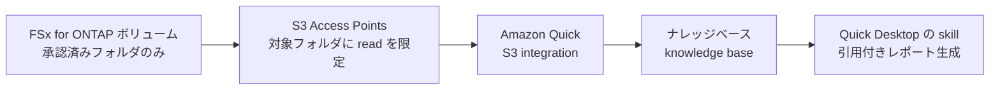

# Amazon Quick を FSx for ONTAP のデータソースにする

[🏠 リポジトリトップ](../../../../README.md)

---

Amazon Quick から Amazon FSx for NetApp ONTAP 上のファイルを、コピーを作らずデータソースとして扱う経路を扱います。**連携パターンと前提条件は AWS 公式ブログで確認済みですが、著者環境での再現は未実施です。** どの記述がどちらかは、各節で明示します。

---

## このページの但し書き

| 内容 | 確度 |
|---|---|
| Quick × FSx for ONTAP の連携経路、前提条件、構成手順の骨格 | AWS 公式ブログに出典（本ページ末尾）。`documented` 相当 |
| 権限が単一 ID で平坦化されること | このリポジトリの [既存ノート](../../domains/data-utilization/notes/reaching-data-without-copies.md) の実測・出典に依拠 |
| 所要時間の短縮幅、回答精度、実際の使用感 | **未検証。** 著者が Quick を FSx for ONTAP 環境で動かして得た結果ではありません |

「レポート作成が数時間から数分になる」といった効果は**ブログの主張として引用**し、断定しません。導入判断の前に、対象データと権限要件で自環境で確かめてください。

---

## Amazon Quick とは（documented）

Amazon Quick は、AI アシスタント / エージェント型のデジタルワークスペースです。ブラウザ版に加え、ローカルファイルアクセス・バックグラウンド処理・個人ナレッジグラフを持つデスクトップアプリ（Amazon Quick Desktop）があります。

このページで扱うのは、**FSx for ONTAP 上のファイルを移動せずに Quick のナレッジベース（knowledge base）へ取り込み、レポートや分析に使う**経路です。ブログでは、週次レポート作成のワークフローを Quick Desktop の skill（再利用可能な指示のまとまり）として組む例が示されています。

---

## 連携経路（documented）

**ファイルは FSx for ONTAP に置いたまま、S3 Access Points 経由で Quick に読ませます。** 経路の骨格は次のとおりです。

上の流れを文で述べると、承認したレポート用フォルダだけを S3 Access Points で公開し、Quick の S3 integration がそのプレフィックスからナレッジベースを作り、Quick Desktop の skill がそれを引用してレポートや要約を生成します。**元ファイルは FSx for ONTAP から出ません。** 分析のためにデータレイクへ全量コピーする設計と違い、コピーの権限・保持・削除を別に管理する必要がありません（コピーを作らない 3 手段の比較は [コピーを増やさずデータへ届ける](../../domains/data-utilization/notes/reaching-data-without-copies.md) にあります）。

### 前提条件（documented）

| 前提 | 内容 |
|---|---|
| FSx for ONTAP の ONTAP バージョン | 9.17.1 以降 |
| S3 Access Points とボリュームの位置 | **同一 AWS リージョン・同一 AWS アカウント所有**。ボリュームはマウント済みでジャンクションパスを持つ |
| Amazon Quick | Enterprise サブスクリプション（S3 integration・ナレッジベース・スペースを作成する権限） |
| IAM | Quick が使うロールに、対象プレフィックスへの最小権限 read（`s3:ListBucket` / `s3:GetObject`） |

**S3 Access Points とボリュームが同一リージョン・同一アカウントである制約は、AP を作る側の制約です。** この前提と S3 との差分は [FSx for ONTAP S3 AP は「S3 として使える」わけではない](../../domains/data-utilization/notes/s3-access-point-constraints.md) にあります。

### 構成手順の骨格（documented）

ブログの手順は 7 段です。**このジャンルの主眼は FSx for ONTAP 側の適合判断なので、骨格だけを示し、画面操作の詳細はブログに譲ります。**

1. 承認済みフォルダを 1 つに絞る（ドラフトや対象外ファイルはフォルダの外に置く）
2. ボリュームに S3 Access Points をアタッチする
3. Quick が使うロールに、対象プレフィックスへの最小権限 read を付与する
4. Quick の S3 integration を作り、承認済みプレフィックスからナレッジベースを作る
5. 配信先（例: Slack）の連携を設定する
6. レポート生成の skill を作る
7. Quick Desktop をレポート作業の場として使う

**Quick の skill は反復ワークフローを定義する仕組みです。** トリガーフレーズで同じレポート手順を毎回起動できます。skill の詳細な書き方はブログとユーザーガイドにあります。

---

## 権限は 2 つの別の層で決まる（主軸）

**ここがこのページの主眼です。** Quick から FSx for ONTAP のファイルを読ませるとき、権限は**層の違う 2 つ**で決まります。混同すると、元のファイル ACL がそのまま効くと誤解します。

| 層 | 何が権限を決めるか | 確度 |
|---|---|---|
| **取り込み層（S3 Access Points → Quick）** | S3 Access Points に固定した**単一のファイルシステム ID**。元のファイルごとの ACL は引き継がれない | 既存ノートに依拠（`verified` / `documented`） |
| **利用者層（Quick 側）** | Quick の S3 integration で構成する **document-level ACL** | ブログに `documented` |

### 取り込み層 — 元の ACL の平坦化

**S3 Access Points 経由のファイルアクセス要求は、すべて設定した 1 つのファイルシステム ID で認可されます。** つまり、元のファイルごとの ACL は取り込みのパイプラインには引き継がれません。ナレッジベースを作る時点で権限は平坦化されます。この仕組みと帰結は [S3 Access Points は全リクエストを 1 つの ID で認可する](../../domains/data-utilization/notes/reaching-data-without-copies.md) にあります。

**帰結**: S3 Access Points に与える ID の権限が、Quick が見えるデータの上限になります。広い権限の ID を固定すると、Quick はその範囲すべてを見ます。**用途に絞った ID を固定し、承認済みフォルダだけを公開する**のが、この層での絞り方です。ID とネットワークの 2 層評価は [S3 Access Point の権限設計](../../domains/security-governance/notes/access-point-authorization-layers.md) にあります。

### 利用者層 — ユーザー別制御は Quick 側の別設計

**元の ACL が平坦化されるので、「誰がどのファイルを見てよいか」を Quick で再現したいなら、それは別の仕組みで設計します。** ブログは、per-user / per-group の制御が要る場合に Quick の S3 integration で **document-level ACL** を構成する、と述べています。これはナレッジベース作成時に決める設定で、後から足す前提にはできません。

**この 2 つは独立です。** 取り込み層で平坦化された権限を、利用者層の document-level ACL が再度絞り直す形になります。**Quick が FSx for ONTAP の ACL を自動で引き継ぐわけではありません。** 元のファイル権限に任せる設計は、この経路では成立しません。要求元ユーザーで絞る仕組みを置ける位置は 3 つあり、その比較は [既存ノートの AI / RAG の設計](../../domains/data-utilization/notes/reaching-data-without-copies.md#ai--rag-で設計する対象) にあります。

> **ガバナンスに関する補足**: 承認済みフォルダを 1 つに絞る運用は、取り込み層で見える範囲を最小化する操作です。document-level ACL は利用者層の絞り込みで、別に決めます。**片方だけでは、意図した境界になりません。** 監査で「誰が読んだか」を追うには、S3 Access Points に CloudTrail の S3 データイベントを構成すると呼び出し元の IAM プリンシパルを記録できます（ONTAP のファイルアクセス監査に残るのは AP に固定した ID です）。

---

## FSx for ONTAP のどのフェーズに効くか（適合判断・未検証）

**この節は著者の判断で、実測ではありません。**

| フェーズ | 見込み | 根拠（未検証） |
|---|---|---|
| 運用・最適化（05-operate / 06-optimize） | 効きやすい | 既存の業務ファイルを移動せず、レポート・分析の反復作業に重ねる用途。ブログの週次レポート例がこれにあたる |
| 構築（04-build） | 部分的 | S3 Access Points の作成・IAM 設計・ナレッジベース構成は構築作業。ただし Quick 自体が FSx for ONTAP を構築するわけではない |
| 評価・設計（01-assess / 02-design） | 効きにくい | データソース化の対象ではあるが、設計判断そのものを生成する用途ではない |

**ブログが挙げる効果**（週次レポート作成が数時間から数分になる）は、ブログの主張であり著者の実測ではありません。導入の可否は、対象データの量・更新頻度・権限要件で自環境で確かめてください。

---

## 参考資料（一次情報）

- [Governed reports with Amazon Quick Desktop and Amazon FSx for NetApp ONTAP（AWS 公式ブログ）](https://aws.amazon.com/blogs/machine-learning/governed-reports-with-amazon-quick-desktop-and-amazon-fsx-for-netapp-ontap/) — 連携パターン、7 段の手順、前提条件、document-level ACL の位置づけ
- [Amazon S3 integration（Amazon Quick Suite ユーザーガイド）](https://docs.aws.amazon.com/quicksuite/latest/userguide/s3-integration.html) — S3 integration とナレッジベースの構成
- [Accessing FSx for ONTAP data with S3 access points（FSx for ONTAP ガイド）](https://docs.aws.amazon.com/fsx/latest/ONTAPGuide/using-access-points-with-aws-services.html) — S3 Access Points を AWS サービスから使う前提

---

## 関連

- [AI エージェントのジャンル入口](../README.md)
- [S3 Access Points は全リクエストを 1 つの ID で認可する](../../domains/data-utilization/notes/reaching-data-without-copies.md) — 取り込み層で ACL が平坦化される仕組み
- [S3 Access Point の権限設計 — 2 層の評価](../../domains/security-governance/notes/access-point-authorization-layers.md) — ID とネットワークの絞り込み
- [FSx for ONTAP S3 AP は「S3 として使える」わけではない](../../domains/data-utilization/notes/s3-access-point-constraints.md) — 同一リージョン・同一アカウントの前提

---

[🏠 リポジトリトップ](../../../../README.md)
