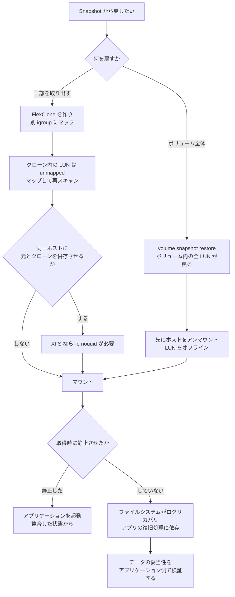

# LUN の Snapshot は既定で crash-consistent

[🏠 リポジトリトップ](../../../../../README.md) | [Domain — ブロックストレージ](../README.md)

---

## 結論

**LUN を含むボリュームの Snapshot は、既定で crash-consistent です。** 電源を抜いた瞬間のディスクと同じ状態が保存されます。

**これは「戻せない」ではありません。** ジャーナルを持つファイルシステムやデータベースは、そこから復旧処理を経て起動できます。**検証環境では、Snapshot からクローンした LUN をマウントし、Snapshot 取得前に書いたファイルが読めました。** XFS はログのリカバリを実行してマウントしました。

**問題は保証の範囲です。** crash-consistent が保証するのは「その時刻のブロックが揃っていること」までで、**アプリケーションがその状態から一貫したデータとして起動できることは保証しません。** データベースがメモリに持っていてまだ書いていないものは入りません。

そして重要な点として、**ONTAP の application-consistent というフラグは記録用です。** NetApp のドキュメントは「ONTAP の観点では違いはない」と明記しています。**フラグは、アプリケーションを静止させてから取ったのか、させずに取ったのかを区別するための記録であって、静止そのものを行いません。**

**静止は別の仕組みが行います。** AWS は SnapCenter を挙げており、FSx for ONTAP では**追加のライセンス費用なしで**使えると記載しています。

> **区分**: `documented` — 整合性の定義、フラグの位置づけ、SnapCenter の役割は NetApp / AWS 公式ドキュメントの記載に基づきます（2026-09-05 に確認）。
> **一部は `verified`**（検証日 2026-09-05、`ap-northeast-1`、ONTAP 9.18.1P5）— 既定の snapshot policy で Snapshot が取られること、クローン経由で Snapshot 前の内容が読めること、解放したブロックが Snapshot に移ること。
> **データベースを載せた検証はしていません。** アプリケーション整合性の実挙動は未検証です。
> 自環境での確認手順は [自環境での確認手順](#自環境での確認手順) にあります。

---

## 3 つの整合性の言い分け

| 区分 | 保証されること | 保証されないこと |
|---|---|---|
| **crash-consistent** | その時刻のブロックが揃っている | アプリケーションが一貫した状態から起動すること |
| **application-consistent** | アプリケーションを静止させた時点の状態 | — |
| **ONTAP の `application-consistent` フラグ** | **記録のみ。** 静止させて取ったことの目印 | **何も。** ONTAP の観点では crash-consistent と違いはありません |

**混同されやすいのは 3 行目です。** API に `application_consistent` というフィールドがあるので、指定すれば整合性が得られるように見えます。**NetApp のドキュメントは、これが記録用であり、ホストのアプリケーションと連携していないと明記しています。**

**スケジュール Snapshot は crash-consistent です。** ボリュームの snapshot policy が動かす Snapshot は静止を伴いません。

---

## crash-consistent で足りるかの判断

**足りる場合と足りない場合があります。** 「常に application-consistent にすべき」ではありません。

| ワークロード | crash-consistent で足りるか |
|---|---|
| ジャーナルファイルシステム上のファイル置き場 | **多くの場合足ります。** マウント時にログリカバリが走ります |
| ログ先行書き込みを持つデータベースで、復旧に時間をかけられる | **戻せます。** ただし起動時のリカバリ時間と、コミット済みかどうかの判定はアプリケーション側の話です |
| 複数の LUN にまたがるデータベース（data と log が別ボリューム） | **足りません。** ボリュームごとに Snapshot の時刻が違うため、相互整合しません |
| バックアップの整合性を監査で示す必要がある | **足りません。** 静止した記録が要ります |

**3 行目がレイアウトと結びつきます。** 相互整合が必要なら同じボリュームに置く、という判断になります。詳細は [LUN の並べ方が決めているのは復旧の粒度](lun-layout-decides-recovery-granularity.md) にあります。

---

## 検証環境で確認できたこと

**Snapshot からクローンした LUN は、Snapshot 取得前の内容を保持していました。**

| # | 操作 | 結果 |
|---|---|---|
| 1 | XFS でフォーマットした LUN にマーカーファイルを書き、`sync` した | — |
| 2 | ボリュームの Snapshot を取得（既定の設定、静止なし） | 作成成功 |
| 3 | その Snapshot から FlexClone を作成 | 0.092 GiB、実データのコピーなし |
| 4 | クローン内の LUN を別 igroup にマップし、`-o nouuid` でマウント | **マーカーが読めました** |
| 5 | `dmesg` | XFS が **Starting recovery / Ending recovery** を記録 |

**手順 5 が crash-consistent の実像です。** ファイルシステムはクリーンにアンマウントされた状態ではなく、**ログのリカバリを経てマウントされました。** `sync` していたためデータは揃っていましたが、していなければ揃っていない可能性がありました。

**データベースを載せた検証はしていません。** アプリケーションがこの状態から起動するかは、そのアプリケーションの復旧処理に依存します。

---

## Snapshot が容量を握ること

**Snapshot は削除したデータを保持します。** これは整合性とは別の問題ですが、同じボリュームで同時に起きます。

検証環境で、LUN 内のファイルを削除して `fstrim` を実行したところ、**ボリュームの使用量は戻りましたが、`snapshot.used` が 0 から 3.983 GiB に増えました。** 間に既定の snapshot policy が Snapshot を取っており、解放されたブロックをその Snapshot が保持していました。

**5% の snapshot 予約がこれを吸収しました。** 予約に収まらなければ、次は active file system 側の空きが減ります。詳細は [容量は 3 か所で数えられる](capacity-is-counted-in-three-places.md) にあります。

**AWS が SQL Server の構成で snapshot policy を `none` にすることを挙げているのは、静止していない Snapshot に価値がないという理由に加えて、この容量の側面もあります。**

---

## 静止させる仕組みの位置

**SnapCenter は、ホスト側にアプリケーション別のプラグインを置き、Snapshot の前に I/O を静止させます。**

| 項目 | 内容 |
|---|---|
| 構成 | 中央のサーバー + アプリケーション別のホスト側プラグイン（SQL Server、Oracle、SAP HANA、PostgreSQL など） |
| FSx for ONTAP での費用 | **追加のライセンス費用なし**と AWS が記載 |
| SQL Server での推奨 | **ボリュームの snapshot policy を `none` に。** スケジュール Snapshot は application-consistent ではないため |
| ログバックアップ | **専用のボリュームに置く** |
| クローンのための余裕 | ボリューム容量の **0.5% 以上**を空けておく |
| クローンの所要 | 1 TB のデータベースの iSCSI LUN で通常 5 分以内 |
| VMware プラグイン | crash-consistent と VM-consistent に対応。仮想化されたデータベースは application-consistent |

**SnapCenter を使わない選択もあります。** アプリケーション側で静止のスクリプトを書き、その前後で Snapshot を取る形です。**AWS の 100 万 IOPS の記事も、複数ファイルシステムにまたがる Snapshot の整合には調整スクリプトが必要で、アプリケーション整合にはホスト側の関与が必要と書いています。**

**どちらを選んでも、静止はストレージの外側で起きます。** これがブロックストレージとファイル共有の違いです。

---

## 複製先で必要になる手順

**SnapMirror でボリュームを複製しても、宛先で LUN がすぐ使えるわけではありません。**

宛先ボリュームを書き込み可能にした後、**LUN を igroup にマップし、ホストから iSCSI セッションを張り、ストレージを再スキャン**します。**igroup のマッピングは複製と一緒に移りません。**

**検証環境の FlexClone でも同じでした。** クローン内の LUN は `state=online` でしたが `mapped=unmapped` でした。**復旧手順にこのステップを書いておかないと、切り替え時に止まります。**

---

## 復旧フロー

---

## 自環境での確認手順

| # | 手順 | 確認できること |
|---|---|---|
| 1 | `volume show -fields snapshot-policy` で対象ボリュームのポリシーを確認する | スケジュール Snapshot が動いているか |
| 2 | `volume snapshot show` で既存の Snapshot と使用量を確認する | Snapshot が容量を握っていないか |
| 3 | 検証環境で LUN にマーカーを書き `sync` し、Snapshot を取ってから FlexClone 経由でマウントし、マーカーを確認する | **戻せることの確認** |
| 4 | 手順 3 のマウント時に `dmesg` でログリカバリが走ったかを確認する | **crash-consistent の実像** |
| 5 | `sync` せずに同じことを行い、結果を比べる | 静止の有無で何が変わるか |
| 6 | 実際のアプリケーション（データベースなど）を載せて手順 3 を行い、**起動するかどうか**を確認する | **このノートで未検証の部分。ここが本番の判断材料です** |
| 7 | 静止の仕組みを使う場合、Snapshot の前後でアプリケーションのログを確認する | 静止が実際に行われているか |
| 8 | 復旧手順書に、宛先での LUN マップと再スキャンが書かれているかを確認する | マッピングが複製されないこと |

手順 3・4・5・6 は**検証環境で行ってください。** 手順 6 は本番相当のデータで行う価値がありますが、本番のボリュームに対しては行わないでください。

---

## よくある誤解

| 誤解 | 実際 |
|---|---|
| Snapshot があればデータベースをその時点から起動できる | **既定は crash-consistent です。** 起動できるかはアプリケーションの復旧処理に依存します |
| API の `application_consistent` を指定すれば整合性が得られる | **記録用のフラグです。** ONTAP の観点では違いがなく、静止は行われません |
| スケジュール Snapshot でもアプリケーション整合が取れる | **取れません。** 静止を伴いません |
| crash-consistent では戻せない | **戻せます。** 検証環境では Snapshot 前の内容が読めました。保証の範囲が違うだけです |
| 複数の LUN を別ボリュームに置いても Snapshot は同時刻 | **ボリュームごとに時刻が違います。** 相互整合が必要なら同居させます |
| Snapshot は容量を消費しない | **削除したデータを保持します。** 検証環境で 3.983 GiB を握っていました |
| SnapCenter は別途ライセンス費用がかかる | AWS は FSx for ONTAP で**追加のライセンス費用なし**と記載しています |
| SnapMirror で複製すれば宛先でそのまま LUN が使える | **LUN マップ・iSCSI セッション・再スキャンが必要です** |
| クローンは元と同じホストにそのままマウントできる | **XFS では `-o nouuid` が必要でした** |

---

## 検証環境

| 項目 | 値 |
|---|---|
| ONTAP バージョン | 9.18.1P5 |
| リージョン | `ap-northeast-1` |
| デプロイタイプ | `SINGLE_AZ_2`（第 2 世代、1 HA ペア） |
| ボリューム | 100 GiB、snapshot 予約 5%、snapshot policy `default` |
| LUN | 20 GiB、`os_type linux`、XFS |
| クライアント | Amazon Linux 2023、kernel 6.18.44-99.149.amzn2023.x86_64 |
| 検証日 | 2026-09-05 |

> **注意**: 上記はこの環境での実測であり、一般的なサービス上限や本番環境での再現を保証するものではありません。**データベースを載せた検証は行っていません。** アプリケーションが crash-consistent な状態から起動するかは、このノートでは確認していません。

---

## 参照した一次情報

| 論点 | 出典 |
|---|---|
| application-consistent と crash-consistent のフラグが記録用であり、ONTAP の観点では違いがないこと。既定が crash-consistent でスケジュール Snapshot も crash-consistent であること。API がホストのアプリケーションと連携していないこと | [NetApp: Application snapshots (REST API)](https://docs.netapp.com/us-en/ontap-restapi/application_applications_application.uuid_snapshots_endpoint_overview.html) |
| Snapshot が常に crash-consistent であること、アプリケーション整合には I/O の静止が必要であること、SnapCenter が追加ライセンス費用なしで使えること、snapshot policy を `none` にすること、ログバックアップを専用ボリュームに置くこと、0.5% の空き、1 TB のクローンが 5 分以内 | [AWS: Using SnapCenter to protect SQL Server workloads](https://aws.amazon.com/blogs/storage/using-netapp-snapcenter-with-amazon-fsx-for-netapp-ontap-to-protect-your-sql-server-workloads) |
| SnapCenter の構成（中央サーバーとアプリケーション別プラグイン）、VMware プラグインの整合性区分 | [NetApp: SnapCenter overview](https://docs.netapp.com/us-en/snapcenter/get-started/concept_snapcenter_overview.html) |
| SnapMirror 宛先で LUN マップ・iSCSI セッション・再スキャンが必要であること | [NetApp: Destination volume data access](https://docs.netapp.com/us-en/ontap/data-protection/configure-destination-volume-data-access-concept.html) |
| 複数ファイルシステムにまたがる Snapshot に調整スクリプトが必要で、アプリケーション整合にホスト側の関与が必要であること | [AWS Storage Blog: SAN: A million IOPs in AWS from Amazon FSx NetApp ONTAP](https://aws.amazon.com/blogs/storage/san-a-million-iops-in-aws-from-amazon-fsx-netapp-ontap/) <!-- allow:naming - 記事タイトルの原文 --> |
| snapshot 予約 0%、snapshot autodelete という構成例 | [AWS: Best practice configuration for Microsoft SQL Server workloads](https://aws.amazon.com/blogs/storage/best-practice-configuration-of-amazon-fsx-for-netapp-ontap-for-microsoft-sql-server-workloads) |
| ボリュームを LUN より 5% 以上大きくすること | [AWS: Creating an iSCSI LUN](https://docs.aws.amazon.com/fsx/latest/ONTAPGuide/create-iscsi-lun.html) |

---

## 関連ドキュメント

- [Domain — ブロックストレージ](../README.md) — このモジュールのハブ
- [LUN の並べ方が決めているのは復旧の粒度](lun-layout-decides-recovery-granularity.md) — 相互整合とレイアウトの関係
- [容量は 3 か所で数えられる](capacity-is-counted-in-three-places.md) — Snapshot が握る容量
- [Snapshot があることと復旧できることは別](../../data-protection/notes/snapshots-are-not-a-recovery-plan.md) — ファイル側の同じ論点
- [共有ブロックが設計を変える条件](when-shared-block-changes-the-design.md) — Snapshot が別課金にならないこと
- [ブロックストレージ横断リソースマップ](../../../reference/block-storage-resource-map.md) — 一次情報の索引
- [知見の分類ポリシー](../../../evidence-policy.md)

---

[🏠 リポジトリトップ](../../../../../README.md) | [Domain — ブロックストレージ](../README.md)
