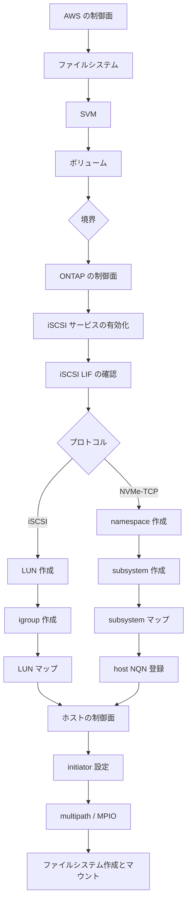

# LUN と igroup は AWS の API の外側にある

[🏠 リポジトリトップ](../../../../../README.md) | [Domain — ブロックストレージ](../README.md)

---

## 結論

**ブロックストレージの構築手順は、途中で必ず AWS の制御面から ONTAP の制御面へ移ります。境界はボリュームと LUN の間です。**

CloudFormation の Amazon FSx のリソースタイプは **6 種類だけ**です。`DataRepositoryAssociation` / `FileSystem` / `S3AccessPointAttachment` / `Snapshot` / `StorageVirtualMachine` / `Volume`。**LUN も igroup も NVMe subsystem も namespace も、リソースタイプが存在しません。** Amazon Amazon FSx の API のアクション一覧にも 1 つもありません。

**したがって「テンプレートを適用すればブロックが使える状態になる」という構成は作れません。** テンプレートが到達できるのはボリュームまでで、そこから先は ONTAP CLI か ONTAP REST API か、それらを叩くツールが必要です。

**この境界は好みではないので、設計できるのは境界の位置ではなく、境界の向こう側の再現方法です。** IaC の境界そのものの一般論は [IaC の境界は好みではなく API の表面で決まる](../../../playbooks/04-build/notes/what-iac-cannot-reach.md) にあります。**このノートはブロック固有の範囲を扱います。**

> **区分**: `documented` — リソースタイプとアクションの範囲、各ツールが提供するリソース名は公式ドキュメントとリポジトリの記載に基づきます（2026-09-05 に確認）。
> **特定のツール構成の推奨はしません。** 到達できる範囲の違いを示します。
> 自環境での確認手順は [自環境での確認手順](#自環境での確認手順) にあります。

---

## 境界の位置

| オブジェクト | AWS の API / CloudFormation | ONTAP CLI / REST |
|---|---|---|
| ファイルシステム | **届く** | 一部の設定のみ |
| SVM | **届く** | 一部の設定のみ |
| ボリューム | **届く** | 届く |
| **iSCSI サービスの有効化** | 届かない | **ここから ONTAP 側** |
| **iSCSI LIF** | 届かない | 届く |
| **LUN** | 届かない | 届く |
| **igroup** | 届かない | 届く |
| **LUN マップ** | 届かない | 届く |
| **NVMe subsystem** | 届かない | 届く |
| **NVMe namespace** | 届かない | 届く |
| **subsystem へのマップ / host NQN 登録** | 届かない | 届く |

**AWS のドキュメントのブロック手順が、どれも `ssh fsxadmin@<management endpoint>` から始まるのはこのためです。**

### ボリュームは両方から作れるが、作った側で見え方が変わること

**ボリュームの行が「両方に届く」になっているのは、選択の余地があるという意味です。そしてどちらで作るかが監視とバックアップを変えます。**

検証環境で AWS の API で 2 ボリューム、ONTAP の CLI で 2 ボリュームを作った結果です。

| 数え方 | 結果 |
|---|---|
| `aws fsx describe-volumes` | **3 件**（root + AWS で作った 2 件） |
| ONTAP の `volume show` | **5 件** |
| `aws cloudwatch list-metrics` の `VolumeId` の値 | **3 件** |

**ONTAP 側で作ったボリュームには `fsvol-` の ID が付きません。** そのため次のすべてから外れます。

| 外れるもの | 理由 |
|---|---|
| CloudWatch の `VolumeId` 次元 | ID が無い |
| AWS の API によるタグ付け | 同上 |
| AWS Backup の選択対象 | 同上 |
| タグベースのコスト配分 | タグが付かない |

**LUN は ONTAP 側にしか作れませんが、その容器であるボリュームは AWS 側で作れます。** 監視とバックアップを AWS 側で回すなら、**ボリュームは AWS の API、LUN は ONTAP** という分け方が噛み合います。**「ブロックだから全部 ONTAP 側」にすると、監視から静かに外れます。**

> **区分**: `verified`（検証日 2026-09-05、`ap-northeast-1`、`MULTI_AZ_2` 第 2 世代 1 HA ペア、ONTAP 9.18.1P5）— 件数の不一致と `VolumeId` 次元の不在。

監視側から見た同じ話は [ブロックの監視で見えるものと見えないもの](what-block-monitoring-shows.md) にあります。

---

## 境界の向こう側に届くツール

**選択肢は 4 つあり、到達範囲が同じではありません。**

| ツール | 到達できるもの | 到達できないもの |
|---|---|---|
| **ONTAP CLI**（SSH） | すべて | — |
| **ONTAP REST API** | すべて。`/api/storage/luns`、`/api/protocols/san/igroups`、`/api/protocols/san/lun-maps`、`/api/protocols/nvme/subsystems`、`/api/storage/namespaces`、`/api/protocols/nvme/subsystem-maps` | — |
| **NetApp Terraform provider** | `netapp-ontap_lun` / `_san_igroup` / `_san_lun-map` / `_iscsi_service` / `_nvme_namespace` | **`nvme_subsystem` と subsystem マップのリソースがありません**（v2.7.1、2026-09-05 に `docs/resources/` を確認）。namespace は作れてもマップできません |
| **Ansible `netapp.ontap`** | `na_ontap_lun` / `_lun_map` / `_lun_map_reporting_nodes` / `_igroup` / `_igroup_initiator` / `_iscsi` / `_nvme` / `_nvme_namespace` / `_nvme_subsystem` | 確認した範囲では NVMe を含めて揃っています |

**NVMe/TCP を Terraform だけで完結させることは、provider v2.7.1 の時点ではできません。** **リソースは追加されるので、使う前に現行版の `docs/resources/` を確認してください。** namespace の作成は `netapp-ontap_nvme_namespace` で書けますが、**subsystem の作成と namespace のマップは別の手段が必要です。** iSCSI であれば Terraform provider で LUN からマップまで届きます。

**Terraform を使う場合、AWS provider と NetApp provider の 2 つを同じ構成に置くことになります。** AWS provider の `aws_fsx_ontap_volume` までが片側で、`netapp-ontap_lun` からが反対側です。**この 2 つは依存関係を持つので、適用順序が構成に現れます。**

---

## 手順書が制御面をまたぐことの帰結

**「ボリュームまで IaC、LUN 以降は手順書」という分担は成立しますが、代償があります。**

| 帰結 | 内容 |
|---|---|
| **状態の突き合わせ先が 2 つ** | テンプレートの状態と ONTAP の状態を別々に確認する必要があります |
| **削除順序が逆になる** | ボリュームを消す前に LUN のマップを外す必要があります。テンプレートの削除だけでは順序が保証されません |
| **認証情報が 2 系統** | AWS の資格情報と `fsxadmin` の資格情報が別に必要です |
| **ドリフト検出が片側だけ** | CloudFormation のドリフト検出は LUN の変更を見ません |
| **復旧手順が分かれる** | SnapMirror 宛先で LUN を使えるようにする操作は、すべて ONTAP 側です |

**特に削除順序は事故になりやすい箇所です。** LUN がマップされたままのボリュームを消そうとしたときの理由は、AWS の API からは返りません。理由の取得が ONTAP 側にしかないことは [IaC の境界は好みではなく API の表面で決まる](../../../playbooks/04-build/notes/what-iac-cannot-reach.md) で扱っています。

---

## 公開されている実装例

**ブロック向けの自動化は AWS 側のサンプルより NetApp 側のリポジトリに集まっています。**

| リポジトリ | 内容 |
|---|---|
| [NetApp/FSx-ONTAP-samples-scripts](https://github.com/NetApp/FSx-ONTAP-samples-scripts) | `Management-Utilities/iscsi-vol-create-and-mount/`、`ec2-user-data-iscsi-create-and-mount/`（CloudFormation + user-data）、`Monitoring/LUN-monitoring/`、`Infrastructure_as_Code/Terraform/deploy-fsx-ontap-sqlserver/` <!-- allow:naming - リポジトリ名は識別子 --> |
| [NetApp/ontap-rest-python](https://github.com/NetApp/ontap-rest-python) | `examples/rest_api/lun_operations.py` |
| [NetApp/fsxn-iscsisetup-ps](https://github.com/NetApp/fsxn-iscsisetup-ps) | Windows ホストへの iSCSI 接続の PowerShell 自動化。**最終更新は 2023 年**で、現行 ONTAP での動作は未確認です |
| [NetApp/terraform-provider-netapp-ontap](https://github.com/NetApp/terraform-provider-netapp-ontap) | 上記のリソース群 |
| [ansible-collections/netapp.ontap](https://github.com/ansible-collections/netapp.ontap) | 上記のモジュール群 |

**`aws-samples` にブロック専用のリポジトリは見当たりませんでした。** FSx for ONTAP 関連のリポジトリは監査イベント、SnapMirror DR、EKS / ROSA 連携などが中心です。索引は [ブロックストレージ横断リソースマップ](../../../reference/block-storage-resource-map.md) にあります。

---

## セキュリティグループに現れる境界

**ポートの要件表も制御面ごとに分かれています。**

| ポート | 用途 | AWS の要件表に載っているか |
|---|---|---|
| 3260 | iSCSI | **載っています** |
| 4420 | NVMe/TCP のデータ | **載っていません**（手順の出力と re:Post の前提条件にのみ） |
| 8009 | NVMe/TCP の discovery | **載っていません**（手順の出力にのみ） |
| 22 | ONTAP CLI | 載っています |
| 443 | ONTAP REST API | 載っています |

**iSCSI 用に書いたセキュリティグループでは NVMe/TCP は通りません。** そして失敗は接続拒否ではなくタイムアウトとして現れるため、ホスト側の問題に見えます。詳細は [ブロックプロトコルの選択肢は世代と HA ペア数で先に狭まる](protocol-choice-is-bounded-before-you-choose.md) にあります。

---

## 構築フロー

**制御面は 2 つではなく 3 つです。** ホスト側が最後に来ます。ホスト側の範囲は [パスはフェイルオーバーの仕組みそのもの](paths-are-the-failover-mechanism.md) にあります。

---

## 自環境での確認手順

| # | 手順 | 確認できること |
|---|---|---|
| 1 | `aws fsx help` の出力に LUN や igroup の操作がないことを確認する | 境界の位置 |
| 2 | CloudFormation の Amazon FSx のリソースタイプ一覧を開き、6 種類であることを確認する | テンプレートで到達できる範囲 |
| 3 | `ssh fsxadmin@<management endpoint>` で接続し、`lun show` が動くことを確認する | ONTAP 側の到達経路 |
| 4 | ONTAP REST API に `GET /api/storage/luns` を投げる | 自動化に使える経路 |
| 5 | Terraform を使う場合、**現行版の** NetApp provider のリソース一覧に `nvme_subsystem` があるかを確認する | **v2.7.1 では NVMe/TCP を Terraform だけで完結できないこと。追加されていれば前提が変わります** |
| 6 | 検証環境で LUN をマップしたままボリュームを削除しようとし、返るエラーを記録する | 削除順序の依存関係と、AWS 側から理由が返らないこと |
| 7 | 構築手順書を読み返し、AWS の資格情報と `fsxadmin` の資格情報の受け渡しが書かれているかを確認する | 手順書が制御面をまたげているか |

手順 6 は**検証環境で行ってください。** 本番のボリュームで削除を試す操作ではありません。

---

## よくある誤解

| 誤解 | 実際 |
|---|---|
| テンプレートを適用すればブロックが使える状態になる | **ボリュームまでです。** LUN 以降はリソースタイプが存在しません |
| Amazon FSx の API に LUN の操作がどこかにある | **1 つもありません。** アクション一覧はボリューム・SVM・Snapshot・バックアップ・S3 Access Point で終わります |
| Terraform なら NVMe/TCP も全部書ける | **v2.7.1 に `nvme_subsystem` のリソースがありません**（2026-09-05 確認）。namespace は作れてもマップできません |
| ONTAP CLI と REST で到達範囲が違う | 確認した範囲ではどちらもブロックオブジェクト全体に届きます |
| CloudFormation のドリフト検出で LUN の変更も分かる | **見ていません。** ONTAP 側は別に確認する必要があります |
| セキュリティグループの要件表に従えばブロックは通る | **NVMe/TCP の 4420 と 8009 は要件表に載っていません** |
| `aws-samples` にブロックの自動化サンプルがある | 見当たりませんでした。**NetApp 側のリポジトリに集まっています** |

---

## 参照した一次情報

| 論点 | 出典 |
|---|---|
| CloudFormation の Amazon FSx のリソースタイプが 6 種類であること | [AWS: Amazon FSx resource type reference](https://docs.aws.amazon.com/AWSCloudFormation/latest/TemplateReference/AWS_FSx.html) |
| Amazon Amazon FSx の API のアクション一覧にブロックオブジェクトの操作がないこと | [AWS: Amazon FSx API operations](https://docs.aws.amazon.com/fsx/latest/APIReference/API_Operations.html) |
| LUN 作成が ONTAP CLI の手順であること | [AWS: Creating an iSCSI LUN](https://docs.aws.amazon.com/fsx/latest/ONTAPGuide/create-iscsi-lun.html) |
| NVMe/TCP が namespace → subsystem → map → host NQN の順で ONTAP CLI から作られること | [AWS: Provisioning NVMe/TCP for Linux](https://docs.aws.amazon.com/fsx/latest/ONTAPGuide/provision-nvme-linux.html) |
| セキュリティグループの要件表に 3260 があり 4420 がないこと | [AWS: Security groups](https://docs.aws.amazon.com/fsx/latest/ONTAPGuide/limit-access-security-groups.html) |
| NVMe/TCP のポート 4420 が必要であること | [AWS re:Post: Use NVMe/TCP to mount FSx for ONTAP on Linux](https://repost.aws/knowledge-center/ec2-mount-fsx-ontap-nvme-tcp) |
| ONTAP REST API のブロックオブジェクトのパス | [LUNs](https://docs.netapp.com/us-en/ontap-restapi/ontap/storage_luns_endpoint_overview.html) · [igroups](https://docs.netapp.com/us-en/ontap-restapi/ontap/protocols_san_igroups_endpoint_overview.html) · [LUN maps](https://docs.netapp.com/us-en/ontap-restapi/ontap/protocols_san_lun-maps_endpoint_overview.html) · [NVMe subsystems](https://docs.netapp.com/us-en/ontap-restapi/ontap/protocols_nvme_subsystems_endpoint_overview.html) · [namespaces](https://docs.netapp.com/us-en/ontap-restapi/ontap/storage_namespaces_endpoint_overview.html) |
| NetApp Terraform provider のリソース名と、v2.7.1 における `nvme_subsystem` の不在 | [NetApp/terraform-provider-netapp-ontap](https://github.com/NetApp/terraform-provider-netapp-ontap)（`docs/resources/`、2026-09-05 確認） |
| Ansible `netapp.ontap` のブロック関連モジュール | [ansible-collections/netapp.ontap](https://github.com/ansible-collections/netapp.ontap) |

---

## 関連ドキュメント

- [Domain — ブロックストレージ](../README.md) — このモジュールのハブ
- [IaC の境界は好みではなく API の表面で決まる](../../../playbooks/04-build/notes/what-iac-cannot-reach.md) — 境界の一般論とボリューム削除の失敗理由
- [ブロックプロトコルの選択肢は世代と HA ペア数で先に狭まる](protocol-choice-is-bounded-before-you-choose.md) — ポートの落とし穴
- [パスはフェイルオーバーの仕組みそのもの](paths-are-the-failover-mechanism.md) — 3 つ目の制御面
- [Kubernetes のブロック PV はボリューム数の上限に当たる](kubernetes-block-volumes-and-the-volume-limit.md) — Trident が使う制御面
- [ブロックストレージ横断リソースマップ](../../../reference/block-storage-resource-map.md) — 公開 IaC の索引
- [知見の分類ポリシー](../../../evidence-policy.md)

---

[🏠 リポジトリトップ](../../../../../README.md) | [Domain — ブロックストレージ](../README.md)
