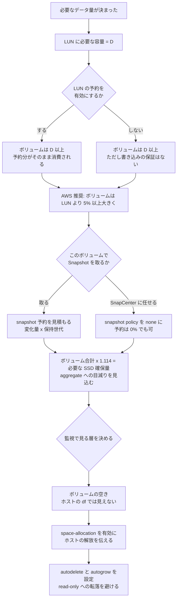

# 容量は 3 か所で数えられる

[🏠 リポジトリトップ](../../../../../README.md) | [Domain — ブロックストレージ](../README.md)

---

## 結論

**確保した SSD 容量から LUN が実際に使える容量までに、3 回の差し引きがあります。**

検証環境（SSD 1,024 GiB、100 GiB のボリューム 1 本、20 GiB の予約付き LUN 1 本）で実測した内訳です。

| 段 | 確保した値 | 実際に次の段で使える値 | 差 |
|---|---|---|---|
| SSD → aggregate | **1,024 GiB** | **907.03 GiB** | 116.97 GiB（11.4%） |
| ボリューム → active file system | **100 GiB** | **95 GiB** | 5 GiB（snapshot 予約 5%） |
| active file system → LUN が使える空き | **95 GiB** | **74.83 GiB** | 20.08 GiB（LUN の予約） |

**3 段目が特に見落とされます。`space-reserve` を有効にした 20 GiB の LUN は、1 バイトも書いていない状態でボリュームの 95 GiB から 20.078 GiB を消費しました。**

そして **この計上は即時ではありません。** 設定変更の直後に読むと**変更前の値が返ります。** 30 秒間隔で観測すると t+0 では変わっておらず、t+30 で変わり、t+240 まで安定していました。

**足りなくなったときに起きるのは書き込みエラーではなく、LUN が read-only に落ちることです。**

> **区分**: `verified`（検証日 2026-09-05、`ap-northeast-1`、`SINGLE_AZ_2` 第 2 世代 1 HA ペア、スループット容量 384 MBps、ONTAP 9.18.1P5）。
> **性能値は含めません。** 測ったのは容量の数え方と反映の遅れだけです。read-only への転落は AWS re:Post の記載に基づく `documented` です（自環境では起こしていません）。
> 自環境での確認手順は [自環境での確認手順](#自環境での確認手順) にあります。

---

## 3 か所の内訳

### SSD から aggregate へ

**1,024 GiB を確保したファイルシステムの aggregate は 907.03 GiB でした。** 差の約 117 GiB はボリュームに割り当てられません。

**この差は確保する容量に比例します。** SSD を増やせば aggregate も増えますが、比率としての目減りは残ります。**「1 TiB 確保したから 1 TiB 置ける」という見積りは、この段で既に外れます。**

### ボリュームから active file system へ

**100 GiB のボリュームの `afs_total` は 95 GiB でした。** snapshot 予約が既定で 5% あり、その分は LUN に使えません。

**LUN を 1 つも作っていない時点で、既に 5 GiB が LUN の側から見えなくなっています。**

snapshot 予約は変更できます。AWS は SQL Server の構成例で **snapshot 予約を 0% にする**ことを挙げています。ただし 0% にすると、Snapshot が使う容量は active file system 側から取られます。**どちらにしても容量は要ります。予約は「先に取るか、後で取るか」の違いです。**

### LUN の予約から実際の空きへ

**`space-reserve enabled` の 20 GiB LUN は、書き込み 0 の状態でボリュームの使用量を 20.078 GiB 増やしました。** 設定を無効にすると 0.093 GiB に戻り、有効にすると再び 20.171 GiB になりました。**両方向に可逆です。**

**既定は無効です。** REST API で作った LUN は `space_reserve=disabled` でした。有効にするのは明示的な選択です。

**ここに落とし穴があります。** AWS の SQL Server ベストプラクティスは **「LUN reservation enabled」** を挙げています。一方 FSx for ONTAP の API で作ったボリュームは **`space-guarantee none`、`fractional-reserve 0`** でした。NetApp のドキュメントでは、`fractional-reserve` はボリュームの guarantee が `none` のとき既定で 0 になり、**書き込みの保証は best-effort にしかなりません。** つまり **予約を有効にしても、上書きのための領域が保証されるわけではありません。** 予約が保証するのは「LUN のサイズ分の容量が他に使われないこと」までです。

---

## 計上の遅延

**設定を変えた直後の読み取りは、変更前の値を返します。**

| 経過 | `space-reserve` 有効化後の `used` | 無効化後の `used` |
|---|---|---|
| t+0s | 0.093 GiB（**変更前の値**） | 20.171 GiB（**変更前の値**） |
| t+30s | **20.171 GiB** | **0.093 GiB** |
| t+60s 〜 t+240s | 20.171 GiB | 0.093 GiB |

**このノートの最初の測定は 5 秒後に読んで「予約が効いていない」という誤った結論を出しました。** 30 秒待って初めて正しい値が出ました。

**帰結は運用に効きます。** 容量を変更するスクリプトが直後に検証すると、変更が反映されていない値を見て成功と判定します。**成功レスポンスは成功の証拠になりません。**

---

## 書き込めなくなる経路

### LUN 内のファイル削除では容量が戻らないこと

**20 GiB の thin LUN に 4 GiB 書き、そのファイルを削除しても、ボリュームの使用量は変わりませんでした。**

| 操作 | ボリューム `used` |
|---|---|
| フォーマット直後 | 20.08 GiB |
| 4 GiB 書き込み | **24.14 GiB** |
| ファイル削除 | **24.14 GiB（変わらない）** |
| `fstrim` | **20.17 GiB** |

**ストレージ側は、ホストのファイルシステムがどのブロックを解放したかを知りません。** `fstrim`（SCSI の UNMAP）が伝えて初めて戻ります。**これが `space-allocation` を有効にする理由です。**

**なお `space-allocation` は ONTAP 9.18.1P5 では既定で有効でした。** AWS は有効化を推奨していますが、REST API で作った LUN は最初から `enabled` でした。

### 戻った容量が Snapshot に移ること

**`fstrim` で戻したはずの容量は、free space にはなりませんでした。**

`snapshot.used` が 0 から **3.983 GiB** に増えていました。間に既定の snapshot policy が `hourly` の Snapshot を取っており、**解放されたブロックは Snapshot が保持しています。**

**5% の snapshot 予約（5 GiB）がこれを吸収し、`snapshot.reserve_available` は 1.017 GiB になりました。** 予約に収まったため active file system の空きは減っていません。**収まらなければ、次は active file system 側から取られます。**

**つまり「消したのに減らない」の原因は 2 段あります。** ホストが UNMAP を送っていないか、Snapshot が握っているかです。

### read-only への転落

**thin provisioning でファイルシステムが満杯になると、LUN は read-only に落ちます。** AWS re:Post は症状として `Space allocation failed write protect` と `critical space allocation error` を挙げ、復旧手順を **ボリューム拡張 → `lun resize` → OS 側の fsck** としています。

**この経路は自環境では起こしていません（`documented`）。** 起こす検証は本番相当のデータ破損を伴うため行っていません。

**書き込みエラーではなく read-only である点が重要です。** アプリケーションから見ると「ディスクが壊れた」ではなく「書けなくなった」という形で現れます。

---

## 容量が二重に見える例

**同じボリュームを LUN と NFS の両方から見ると、容量の表示が一致しません。**

検証環境で `df` は同じボリュームを **LUN 経由で 20 G、NFS 経由で 95 G** と表示しました。**LUN はその LUN のサイズを、NFS は active file system 全体を報告します。** どちらも間違っていません。

**監視で容量を見るときは、どの層の数字を見ているかを決めておいてください。** ホストの `df` は LUN の中身しか見ていないので、**ボリュームが満杯に近づいていることをホストからは検知できません。**

---

## 設計フロー

**`x 1.114` は検証環境での実測値（1024 / 907.03）です。** 一般的な比率として保証されるものではありません。自環境で確認してください。

---

## 自環境での確認手順

| # | 手順 | 確認できること |
|---|---|---|
| 1 | `storage aggregate show -fields size,usedsize` で aggregate のサイズを確認し、確保した SSD 容量と比べる | **1 段目の目減り** |
| 2 | `volume show -fields size,available,percent-snapshot-space` を確認する | **2 段目の snapshot 予約** |
| 3 | `lun show -fields space-reserve,size,size-used` で予約の有無を確認する | 3 段目の予約 |
| 4 | 予約を切り替え、**30 秒以上待ってから** ボリュームの使用量を読む | **計上の遅延。直後に読むと変更前の値が返ります** |
| 5 | LUN 上でファイルを作って削除し、ボリュームの使用量を見る。次に `fstrim` を実行して再度見る | UNMAP が伝わるまで戻らないこと |
| 6 | `volume snapshot show` で、解放したブロックが Snapshot に移っていないかを確認する | 2 つ目の「戻らない」理由 |
| 7 | `volume show -fields space-guarantee,fractional-reserve` を確認する | **`none` / `0` なら、予約しても上書きの保証は best-effort です** |
| 8 | ホストの `df` とボリュームの空きを並べて記録する | 監視でどちらを見るべきか |

手順 4 と 5 は**検証環境で行ってください。** 本番の LUN で予約を切り替えると、ボリュームの空き容量の計算が変わります。

---

## よくある誤解

| 誤解 | 実際 |
|---|---|
| 確保した SSD 容量がそのままボリュームに使える | **1,024 GiB の確保で aggregate は 907.03 GiB でした**（検証環境の実測） |
| 100 GiB のボリュームには 100 GiB 置ける | **既定の 5% snapshot 予約があり、active file system は 95 GiB でした** |
| LUN を作っただけでは容量を消費しない | **予約を有効にすると、書き込み 0 でもサイズ分を消費します** |
| 予約を有効にすれば上書きの領域が保証される | ボリュームの guarantee が `none`、`fractional-reserve` が 0 なので **best-effort です** |
| 設定変更の効果は直後に確認できる | **30 秒程度の遅れがあります。** 直後の読み取りは変更前の値です |
| LUN 上でファイルを消せば容量が戻る | **`fstrim` などで UNMAP を送るまで戻りません** |
| `fstrim` すれば free space になる | **Snapshot が握っていればそちらに移るだけです** |
| ホストの `df` を監視すれば容量切れが分かる | **LUN の中身しか見ていません。** ボリュームの満杯は検知できません |
| 容量が切れると書き込みエラーになる | **LUN が read-only に落ちます**（`documented`） |
| `space-allocation` は自分で有効にする必要がある | ONTAP 9.18.1P5 では**既定で有効**でした |

---

## 検証環境

| 項目 | 値 |
|---|---|
| ONTAP バージョン | 9.18.1P5 |
| リージョン | `ap-northeast-1` |
| デプロイタイプ | `SINGLE_AZ_2`（第 2 世代、1 HA ペア） |
| スループット容量 | 384 MBps（1 HA ペアの下限） |
| SSD 容量 | 1,024 GiB、IOPS は `AUTOMATIC`（3 per GiB） |
| ボリューム | 100 GiB、`space-guarantee none`、snapshot 予約 5%、snapshot policy `default` |
| LUN | 20 GiB × 2（予約あり / なし）、`os_type linux` |
| クライアント | Amazon Linux 2023、kernel 6.18.44-99.149.amzn2023.x86_64 |
| 検証日 | 2026-09-05 |

> **注意**: 上記はこの環境での実測であり、一般的なサービス上限や本番環境での再現を保証するものではありません。**特に `1024 → 907.03` の比率は構成に依存します。**

---

## 参照した一次情報

| 論点 | 出典 |
|---|---|
| ボリュームが LUN の入れ物であること、ボリュームが thin provisioned であること、LUN 内のデータ削除で容量が戻ること | [AWS: Managing FSx for ONTAP volumes](https://docs.aws.amazon.com/fsx/latest/ONTAPGuide/managing-volumes.html) · [AWS: How FSx for ONTAP works](https://docs.aws.amazon.com/fsx/latest/ONTAPGuide/how-it-works-fsx-ontap.html) |
| ボリュームを LUN より 5% 以上大きくすること、`space-allocation` を有効にする理由、LUN 最大 128 TB | [AWS: Creating an iSCSI LUN](https://docs.aws.amazon.com/fsx/latest/ONTAPGuide/create-iscsi-lun.html) |
| 満杯時に LUN が read-only に落ちること、復旧が拡張 → `lun resize` → fsck であること | [AWS re:Post: LUN in read-only mode](https://repost.aws/knowledge-center/fsx-ontap-lun-in-read-only-mode) |
| `space-guarantee none` / `space-slo thick` / `semi-thick` の違い、空間予約された LUN が作成時に容量を確保すること | [NetApp: SAN volumes](https://docs.netapp.com/us-en/ontap/volumes/san-volumes-concept.html) |
| `fractional-reserve` が 0 か 100 しか取らず、guarantee が `none` のとき既定で 0 になること、0 では書き込み保証が best-effort であること | [NetApp: Set fractional reserve](https://docs.netapp.com/us-en/ontap/san-admin/set-fractional-reserve-concept.html) |
| snapshot 予約 0%、LUN 予約有効、autodelete oldest_first、autosize autogrow という構成例 | [AWS: Best practice configuration for Microsoft SQL Server workloads](https://aws.amazon.com/blogs/storage/best-practice-configuration-of-amazon-fsx-for-netapp-ontap-for-microsoft-sql-server-workloads) |
| SSD 容量の最小値と IOPS の既定（3 per GiB） | [AWS: Quotas](https://docs.aws.amazon.com/fsx/latest/ONTAPGuide/limits.html) |

---

## 関連ドキュメント

- [Domain — ブロックストレージ](../README.md) — このモジュールのハブ
- [LUN の並べ方が決めているのは復旧の粒度](lun-layout-decides-recovery-granularity.md) — Snapshot 予約とレイアウトの関係
- [LUN の Snapshot は既定で crash-consistent](a-snapshot-of-a-lun-is-crash-consistent.md) — Snapshot が容量を握る側の話
- [共有ブロックが設計を変える条件](when-shared-block-changes-the-design.md) — Snapshot が別課金にならないことの裏側
- [容量が余っていても書けなくなる](../../../playbooks/01-assess/notes/counting-bytes-is-not-counting-files.md) — ファイル側の同じ構造
- [ブロックストレージの選択肢の比較](../../../reference/comparison/block-storage-options.md) — 最小構成のコスト
- [上限値・クォータ](../../../reference/limits/) — 出典と検証日付きの上限値
- [知見の分類ポリシー](../../../evidence-policy.md)

---

[🏠 リポジトリトップ](../../../../../README.md) | [Domain — ブロックストレージ](../README.md)
