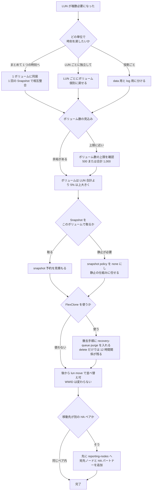

# LUN の並べ方が決めているのは復旧の粒度

[🏠 リポジトリトップ](../../../../../README.md) | [Domain — ブロックストレージ](../README.md)

---

## 結論

**LUN を 1 ボリューム 1 個にするか、まとめて置くかは、性能の判断ではありません。復旧の粒度の判断です。**

**Snapshot と SnapMirror はボリューム単位で動きます。** したがって

- **同じボリュームに置いた LUN は、1 回の Snapshot で相互に整合した複製が取れます。** そして**個別には戻せません**
- **別のボリュームに置いた LUN は、個別に戻せます。** そして**相互の整合は保証されません**

**この二択が LUN のレイアウトの本体です。** そして公開されている指針は一致していません。

| 出典 | 記載 |
|---|---|
| AWS: SQL Server ベストプラクティス | **1 ボリューム 1 LUN**（.MDF 用と .LDF 用に分ける） |
| AWS: SQL Server の高可用性 | **1 ボリュームに 3 LUN**（quorum / data / logs） |
| NetApp: LUN placement | **1:1 は formal best practice ではない。** 関連する LUN は同居させるのが通常 |
| AWS Transform | 移行元 1 サーバーの複数 LUN を **1 ボリュームに配置**し、後から `lun move` で分ける想定 |

**どれかが誤りというより、想定している復旧単位が違います。** 自分の復旧単位を決めてから読んでください。

**そして並べ替えは後からできます。** `lun move` はマウント済み・書き込み中の LUN を無停止で別ボリュームへ移し、**WWID も変わりませんでした。**

> **区分**: `verified`（検証日 2026-09-05、`ap-northeast-1`、`SINGLE_AZ_2` 第 2 世代 1 HA ペア、ONTAP 9.18.1P5）— `lun move` の無停止性と WWID の保持、Selective LUN Map の reporting node、FlexClone が LUN を持ち込むがマッピングは持ち込まないこと、孤立したクローン関係の危険。
> レイアウトの指針は各出典に基づく `documented` です。
> **性能値は含めません。** 自環境での確認手順は [自環境での確認手順](#自環境での確認手順) にあります。

---

## 復旧の粒度からの決め方

**問いは「LUN をいくつのボリュームに分けるか」ではなく「どの単位で時刻を戻したいか」です。**

| 復旧したい単位 | レイアウト | 得られるもの | 失うもの |
|---|---|---|---|
| データベース全体を 1 つの時刻へ | **1 ボリュームにまとめる** | 1 回の Snapshot で data と log が相互整合。SnapMirror のスケジュールも 1 本 | **LUN 単位で戻せません。** 1 つを戻すと全部戻ります |
| LUN ごとに独立して | **LUN ごとにボリュームを分ける** | 個別に戻せる | **相互の整合が保証されません。** スケジュールがボリューム数だけ増え、ボリューム数の上限に早く当たります |
| data と log は別、その中では一緒 | **役割ごとに分ける** | 実務でよく使われる中間 | 上の両方を部分的に引き受けます |

**NetApp の記載が「1:1 は best practice ではない」なのは、この整合性の側面が理由です。** 10 個の LUN を持つデータベースは通常 1 つのボリュームに置く、と書かれています。**理由は Snapshot と SnapMirror のポリシーがボリュームに掛かるので、まとめておけば原子的で相互整合した複製になるからです。**

**逆に 1:1 が理にかなう場面としてコンテナ化が挙げられています。** Kubernetes の PV は独立して作られ消されるので、1 PV = 1 ボリューム + 1 LUN という Trident の `ontap-san` の形が素直です。**ただしそれはボリューム数の上限に当たります。** 詳細は [Kubernetes のブロック PV はボリューム数の上限に当たる](kubernetes-block-volumes-and-the-volume-limit.md) にあります。

---

## ボリューム数の上限という現実的な天井

**LUN ごとにボリュームを分ける設計は、ボリューム数の上限に当たります。**

| 構成 | ボリューム数の上限 |
|---|---|
| 第 1 世代 | 500 |
| 第 2 世代・1 HA ペア | 500 |
| 第 2 世代・2 組以上 | **1,000（全 HA ペア合計）** |

**LUN 数の上限は AWS のドキュメントに記載がありません。** クォータのページに LUN・igroup・initiator・namespace・subsystem の項目は 1 つもありません。**つまり先に当たるのはボリューム数のほうです。**

**出典のない LUN 数の上限を設計値にしないでください。** このリポジトリも数値を持っていません。

---

## 並べ替えが後からできること

**`lun move` はマウント済み・書き込み中の LUN を別のボリュームへ移せました。**

検証環境で、20 GiB の LUN（使用量約 175 MiB）をマウントしたまま、0.5 秒間隔で書き込みを続けながら別ボリュームへ移動しました。

| 観測項目 | 結果 |
|---|---|
| 所要時間 | **5 秒未満**（この使用量で） |
| 書き込みの継続 | **継続。** I/O ループは死にませんでした |
| マウントの維持 | **維持。** `/mnt/lun` は同じデバイスにマウントされたまま |
| WWID | **変わりません。** `3600a0980` + serial hex が同一 |
| `dmesg` | 新しい SCSI ディスクの attach のみ。エラーなし |
| 移動後の書き込み | 成功 |
| 移動元のボリューム | 落ち着いて再読すると LUN は消えていました |

**WWID が変わらないことが実務上の要点です。** `/etc/fstab` や multipath の `alias` を書き換える必要がありません。

**所要時間は使用量に比例します。** 175 MiB で 5 秒未満というのはこの環境の値で、本番の LUN では長くなります。

**ただし移動先が別の HA ペアの場合は注意が必要です。** NetApp は、別の HA ペアへ LUN やボリュームを移す前に **宛先ノードとその HA パートナーを reporting-nodes に追加し、その後ホストで再スキャンする**必要があると記載しています。**検証環境は 1 HA ペアなのでこの条件に当たっておらず、複数 HA ペアでの `lun move` は未検証です。**

---

## Selective LUN Map が絞っている範囲

**新しい LUN マップでは Selective LUN Map が既定で有効でした。**

検証環境の LUN マップは reporting node として **所有ノードと HA パートナーの 2 ノード**を列挙していました。`lun move` の前後で変わりませんでした。

**1 HA ペアの構成ではこれが全ノードなので、効果が見えません。** HA ペアが複数ある構成では、これがホストから見えるパス数を抑える仕組みとして働きます。**パス数の設計は [パスはフェイルオーバーの仕組みそのもの](paths-are-the-failover-mechanism.md) にあります。**

**Trident はこの既定を前提にしています。** `ontap-san` ドライバでは `dataLIF` を指定せず、Selective LUN Map から multipath に必要な LIF を導出します。

---

## クローンと複製で「持ち込まれないもの」

**ボリュームを複製すると LUN は付いてきますが、マッピングは付いてきません。**

検証環境で、LUN を含むボリュームを Snapshot から FlexClone したところ、

| 項目 | 結果 |
|---|---|
| クローンの作成コスト | **0.092 GiB**（実データのコピーなし） |
| クローン内の LUN | **存在し、`state=online`** |
| クローン内の LUN のマッピング | **`mapped=unmapped`。** igroup は付いてきません |
| 別 igroup にマップして再スキャン | 成功。**Snapshot 取得前に書いたマーカーが読めました** |
| マウント | **`-o nouuid` が必要**。クローンは元と同じ XFS UUID を持つため、同一ホストで両方マウントするには指定が要ります |

**SnapMirror でも同じ構造です。** NetApp は、宛先ボリュームを書き込み可能にした後、**LUN を igroup にマップし、ホストから iSCSI セッションを張り、再スキャンする**必要があると記載しています。**複製の設計に、宛先側のマッピング手順を含めてください。** SnapMirror 側は自環境では検証していません（`documented`）。

---

## クローンを消しても親が消せない期間

**`volume delete` は即座に消しません。ボリュームは recovery queue に入り、既定で 12 時間以上そこに留まります。** その間、FlexClone の関係は生きたままなので、**親ボリュームを削除できません。**

検証環境の撤去中にこれに当たりました。順序は次のとおりです。

| # | 起きたこと |
|---|---|
| 1 | LUN を含むボリュームの FlexClone を ONTAP REST で作成 |
| 2 | それを offline にして `DELETE /api/storage/volumes/{uuid}` で削除。**呼び出しは成功** |
| 3 | **ONTAP はボリュームを `<名前>_<データセット ID>` に改名し、`volume show` から隠した**（検証環境では `blockverify_clone_1029`） |
| 4 | **`volume clone show` は関係を保持し続けた。** `FlexClone Parent Snapshot` は `(unavailable)`、状態は `offline` |
| 5 | **親ボリュームの削除がすべて失敗した。** CloudFormation、`aws fsx delete-volume --ontap-configuration SkipFinalBackup=true`、ONTAP CLI の `volume delete -force true`（advanced / diagnostic の両方） |

**依存が連鎖します。** ファイルシステムは SVM があると削除できず、SVM はボリュームがあると削除できず、ボリュームはクローンの関係があると削除できません。**削除できない間、課金は続きます。**

### 誤解を招くエラーメッセージ

**ONTAP が返す指示は、この状況では機能しません。**

```text
Failed to delete volume "..." because it has one or more clones.
Use "volume delete -vserver <svm name> -volume <clone name>" to delete clones.
```

**その `volume delete` は `entry doesn't exist` を返します。** recovery queue にあるボリュームは通常のボリュームではないため、`volume delete` の対象になりません。**メッセージは存在しないコマンドの実行を指示しています。**

### 解決手順

**`volume recovery-queue` を使います。advanced 権限が必要です。**

| # | 手順 |
|---|---|
| 1 | `set -privilege advanced` |
| 2 | `volume recovery-queue show` で、削除要求時刻と保持時間を確認する |
| 3 | `volume recovery-queue purge -vserver <svm> -volume <名前>_<データセット ID>` |
| 4 | `volume clone show` が空になったことを確認する |
| 5 | 親ボリューム → SVM → ファイルシステムの順に削除する |

**検証環境では手順 3 が即座に完了し、`volume clone show` は空になりました。** メタデータの更新のみなのでボリュームサイズに依存しません。

**待つこともできます。** 保持時間（検証環境では 12 時間）が過ぎれば自動で消えます。保持時間は `vserver modify -volume-delete-retention-hours` で変更できます。

**そして recovery queue には削除に成功したボリュームも入っています。** 検証環境では、CloudFormation が正常に削除した `blockverify_move_vol` も `blockverify_move_vol_1028` として残っていました。**「削除が成功した」と「容量が戻った」は別です。**

### Amazon FSx の API からは見えないこと

**FlexClone は一度も `describe-volumes` に現れませんでした。** recovery queue の中身も現れません。**AWS 側の一覧に出ないオブジェクトが、AWS 側の削除を止めます。**

CloudFormation が返すのは ONTAP のメッセージをそのまま包んだものなので、**原因の特定には ONTAP 側を見る必要があります。**

### 設計上の教訓

| 教訓 | 内容 |
|---|---|
| 削除 API の成功応答は削除完了の証拠にならない | ボリュームは recovery queue に移っただけです。**確認は `volume recovery-queue show` と `volume clone show` で行ってください** |
| 削除の順序を手順書に書く | **クローンを purge し、`volume clone show` が空になったことを確認してから**親ボリュームの削除に進みます |
| エラーメッセージの指示を鵜呑みにしない | ONTAP は `volume delete` を指示しますが、recovery queue のボリュームには効きません |
| 短命な検証環境では purge を撤去手順に入れる | 既定の 12 時間は、数時間で捨てる環境には長すぎます |

---

## 移行で入ってくるレイアウト

**AWS Transform でブロックストレージを移行すると、ONTAP の推奨とは違うレイアウトになります。**

移行元 1 サーバーの複数の LUN が **1 つのボリュームに配置**されます。ONTAP 側の 1:1 の想定とは異なるため、**移行後に `lun move` で並べ替えることが前提になります。** 起動ボリュームは EBS に残り、データボリュームが iSCSI で接続されます。

**移行直後のレイアウトを最終形と思わないでください。** 詳細は [直近のアップデートと設計への影響](../../../reference/recent-updates.md) にあります。

---

## 設計フロー



---

## 自環境での確認手順

| # | 手順 | 確認できること |
|---|---|---|
| 1 | 復旧したい単位を関係者と合意し、文書化する | **レイアウトの根拠。これがないと後で議論が戻ります** |
| 2 | `volume show -vserver <svm>` でボリューム数を数え、上限と比べる | 分ける設計が上限に当たらないか |
| 3 | `lun mapping show -fields reporting-nodes` を記録する | Selective LUN Map が絞っている範囲 |
| 4 | 検証環境で LUN をマウントし書き込みながら `lun move start` を実行し、所要時間・WWID・マウントの継続を記録する | **無停止性と WWID の保持を自環境で確認する** |
| 5 | 複数 HA ペアの環境なら、移動前に reporting-nodes へ宛先ノードと HA パートナーを追加する | **このノートで未検証の条件** |
| 6 | 検証環境で FlexClone を作り、クローン内の LUN が `mapped=unmapped` であることを確認する | 複製にマッピングが付いてこないこと |
| 7 | クローンをマウントする際に `-o nouuid` が必要かを確認する | 同一ホストで元とクローンを併用するときの前提 |
| 8 | クローンを削除し、`volume recovery-queue show` に残っていないか、`volume clone show` が空かを確認してから親ボリュームの削除に進む | **削除順序。`volume delete` の成功応答は削除完了の証拠になりません** |
| 9 | 検証環境でクローンを削除した直後に `volume recovery-queue show` を実行する | **削除したボリュームが 12 時間残ることの確認** |
| 10 | `volume recovery-queue purge -vserver <svm> -volume <名前>_<データセット ID>` を実行し、`volume clone show` が空になることを確認する | 撤去手順に入れるべきコマンド |

手順 4・6・7・8 は**検証環境で行ってください。** 特に手順 8 の順序を守らないと、親ボリュームが削除できない状態になり得ます。

---

## よくある誤解

| 誤解 | 実際 |
|---|---|
| 1 LUN 1 ボリュームが best practice | **NetApp は formal best practice ではないと明記しています。** AWS の 2 つの記事も一致していません |
| LUN をまとめると性能が落ちる | **決めているのは復旧の粒度です。** 性能の判断ではありません |
| 分けておけば後で困らない | **ボリューム数の上限に当たります。** LUN 数の上限は文書化されていません |
| レイアウトは後から変えられない | **`lun move` で無停止に変えられ、WWID も変わりませんでした** |
| `lun move` は同じ HA ペア内でも reporting-nodes の準備が必要 | 同一ペア内では不要でした。**別ペアへ移すときに必要です** |
| クローンや複製を作れば LUN がそのまま使える | **マッピングは付いてきません。** 別途 igroup にマップし再スキャンします |
| クローンは同じホストにそのままマウントできる | **XFS では `-o nouuid` が必要でした。** UUID が元と同一です |
| クローンは消せばきれいに消える | **`volume delete` は recovery queue に移すだけで、既定で 12 時間以上クローン関係が残り、親ボリュームを削除できません** |
| 親が消せないのは孤立した壊れたレコードのせい | **文書化された recovery queue の動作です。** `volume recovery-queue purge` で即座に解消します |
| ONTAP のエラーメッセージが示す `volume delete` を実行すればよい | **recovery queue のボリュームには効かず `entry doesn't exist` が返ります。** 使うのは `volume recovery-queue purge` です |
| ボリュームの削除が成功すれば容量はすぐ戻る | **recovery queue にある間は戻りません。** 削除に成功したボリュームもキューに入っています |
| AWS Transform が作るレイアウトが推奨形 | 1 サーバーの複数 LUN が 1 ボリュームに入ります。**`lun move` での並べ替えが前提です** |

---

## 検証環境

| 項目 | 値 |
|---|---|
| ONTAP バージョン | 9.18.1P5 |
| リージョン | `ap-northeast-1` |
| デプロイタイプ | `SINGLE_AZ_2`（第 2 世代、**1 HA ペア**） |
| ボリューム | 100 GiB × 2、`space-guarantee none`、snapshot 予約 5% |
| LUN | 20 GiB、`os_type linux`、XFS でフォーマットしてマウント |
| クライアント | Amazon Linux 2023、kernel 6.18.44-99.149.amzn2023.x86_64 |
| 検証日 | 2026-09-05 |

> **注意**: 上記はこの環境での実測であり、一般的なサービス上限や本番環境での再現を保証するものではありません。**HA ペアが 1 組のため、複数ペアにまたがる `lun move` と reporting-nodes の準備は検証していません。** `lun move` の所要時間は LUN の使用量に比例します。

---

## 参照した一次情報

| 論点 | 出典 |
|---|---|
| 1:1 が formal best practice ではないこと、関連する LUN を同居させる理由が Snapshot と SnapMirror の原子性であること、コンテナ化では 1:1 が理にかなうこと | [NetApp: LUN placement](https://docs.netapp.com/us-en/ontap-apps-dbs/oracle/oracle-storage-san-config-lun-placement.html) |
| 1 ボリューム 1 LUN（.MDF 用と .LDF 用）という構成例 | [AWS: Best practice configuration for Microsoft SQL Server workloads](https://aws.amazon.com/blogs/storage/best-practice-configuration-of-amazon-fsx-for-netapp-ontap-for-microsoft-sql-server-workloads) |
| 1 ボリュームに quorum / data / logs の 3 LUN という構成例、両ノードの IQN を 1 つの igroup に入れること | [AWS: SQL Server high availability with FSx for ONTAP](https://aws.amazon.com/jp/blogs/modernizing-with-aws/sql-server-high-availability-amazon-fsx-for-netapp-ontap/) |
| Selective LUN Map が新しい LUN マップで既定で有効であること、別の HA ペアへ移す前に reporting-nodes へ宛先ノードと HA パートナーを追加すること | [NetApp: Selective LUN Map](https://docs.netapp.com/us-en/ontap/san-admin/selective-lun-map-concept.html) |
| SnapMirror 宛先で LUN マップ・iSCSI セッション・再スキャンが必要であること | [NetApp: Destination volume data access](https://docs.netapp.com/us-en/ontap/data-protection/configure-destination-volume-data-access-concept.html) |
| ボリューム数の上限（第 2 世代 1 HA ペア 500、2 組以上で合計 1,000、第 1 世代 500）。LUN や igroup のクォータが記載されていないこと | [AWS: Quotas](https://docs.aws.amazon.com/fsx/latest/ONTAPGuide/limits.html) |
| ボリュームを LUN より 5% 以上大きくすること、LUN 最大 128 TB | [AWS: Creating an iSCSI LUN](https://docs.aws.amazon.com/fsx/latest/ONTAPGuide/create-iscsi-lun.html) |
| Trident の `ontap-san` が `dataLIF` を指定せず Selective LUN Map から LIF を導出すること | [NetApp: FSx for ONTAP configuration options and examples](https://docs.netapp.com/us-en/trident/trident-use/trident-fsx-examples.html) |
| `volume delete` が RW / DP ボリュームを部分削除状態にし、既定で 12 時間以上 recovery queue に保持すること | [NetApp: Protection against accidental ONTAP volume deletion](https://docs.netapp.com/us-en/ontap/volumes/protection-accidental-volume-deletion-concept.html) |
| `volume recovery-queue purge` がキューからボリュームを削除するコマンドであること | [NetApp: volume recovery-queue purge](https://docs.netapp.com/us-en/ontap-cli/volume-recovery-queue-purge.html) |
| クローンが削除できないときに recovery queue の purge を使うこと | [NetApp KB: Cannot delete clones on fully joined cluster](https://kb.netapp.com/on-prem/ontap/Ontap_OS/OS-KBs/Cannot_delete_clones_on_fully_joined_cluster_Reason__Operation_is_not_permitted) |
| クローン作成時の Snapshot がクローンの完全削除まで busy のまま保持され、recovery queue からの purge が必要になること | [NetApp KB: Behavior of snapshots created when doing volume clones](https://kb.netapp.com/on-prem/ontap/Ontap_OS/OS-KBs/What_is_the_behavior_of_snapshots_that_are_created_when_doing_volume_clones) |
| `volume delete` と `volume recovery-queue purge` がどちらもメタデータのみの更新で、ボリュームサイズに依存しないこと | [NetApp KB: Does the execution time depend on volume size](https://kb.netapp.com/on-prem/ontap/Ontap_OS/OS-KBs/Does_the_execution_time_of_volume_delete_and_volume_recovery-queue_purge_depend_on_volume_size_in_ONTAP) |

---

## 関連ドキュメント

- [Domain — ブロックストレージ](../README.md) — このモジュールのハブ
- [LUN の Snapshot は既定で crash-consistent](a-snapshot-of-a-lun-is-crash-consistent.md) — まとめて取った Snapshot が何を保証するか
- [容量は 3 か所で数えられる](capacity-is-counted-in-three-places.md) — Snapshot 予約とボリュームサイズ
- [パスはフェイルオーバーの仕組みそのもの](paths-are-the-failover-mechanism.md) — Selective LUN Map とパス数
- [Kubernetes のブロック PV はボリューム数の上限に当たる](kubernetes-block-volumes-and-the-volume-limit.md) — 1:1 が理にかなう場面
- [LUN と igroup は AWS の API の外側にある](block-objects-are-outside-the-aws-api.md) — 削除順序が制御面をまたぐこと
- [直近のアップデートと設計への影響](../../../reference/recent-updates.md) — AWS Transform が作るレイアウト
- [ブロックストレージ横断リソースマップ](../../../reference/block-storage-resource-map.md) — 資料間の食い違いの一覧
- [知見の分類ポリシー](../../../evidence-policy.md)

---

[🏠 リポジトリトップ](../../../../../README.md) | [Domain — ブロックストレージ](../README.md)
