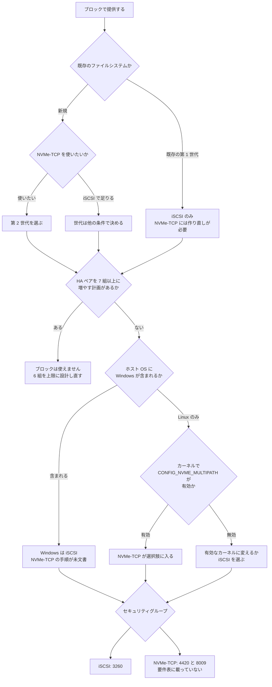

# ブロックプロトコルの選択肢は世代と HA ペア数で先に狭まる

[🏠 リポジトリトップ](../../../../../README.md) | [Domain — ブロックストレージ](../README.md)

---

## 結論

**iSCSI と NVMe/TCP のどちらを使うかは、選ぶ前に 3 つの条件で狭まっています。**

| 条件 | 効き方 |
|---|---|
| **世代** | **NVMe/TCP は第 2 世代のみ。** 第 1 世代では作り直し以外に道がありません |
| **HA ペア数** | **どちらも 6 組以下。** 7 組目を足すと両方使えなくなり、**足した HA ペアは削除できません** |
| **ホスト OS** | **Windows Server で NVMe/TCP は ONTAP 側で非対応です。** AWS に手順が無いのはその反映で、AWS 固有の制約ではありません（[NetApp KB](https://kb.netapp.com/on-prem/ontap/da/SAN/SAN-KBs/Does_NetApp_ONTAP_SAN_support_NVMe_TCP_with_Windows_Server)） |

**世代と HA ペア数は作成後に変えられません。** プロトコルの比較を始める前にここを確認してください。

そして **プロトコルを選んでも、使う LIF は同じです。** 検証環境の `iscsi_1` と `iscsi_2` は、どちらも `data_iscsi` と `data_nvme_tcp` の両方を service として持っていました。**ポートだけが違います（3260 と 4420）。**

**そのポートが落とし穴です。** AWS のセキュリティグループの要件表に **4420 は載っていません。** iSCSI 用に書いた規則では NVMe/TCP は通らず、失敗は接続拒否ではなくタイムアウトとして現れます。

> **区分**: `verified`（検証日 2026-09-05、`ap-northeast-1`、`SINGLE_AZ_2` 第 2 世代 1 HA ペア、ONTAP 9.18.1P5）— LIF の共有、サービスの既定状態、`os_type` の受理範囲、namespace の属性。
> 世代と HA ペアの制約、ポートの要件表の内容、Windows 手順の不在は AWS ドキュメントに基づく `documented` です。
> **性能の比較は含めません。** 自環境での確認手順は [自環境での確認手順](#自環境での確認手順) にあります。

---

## 世代と HA ペア数

| 条件 | iSCSI | NVMe/TCP |
|---|---|---|
| 第 1 世代（`SINGLE_AZ_1` / `MULTI_AZ_1`） | **使える** | **使えない** |
| 第 2 世代（`SINGLE_AZ_2` / `MULTI_AZ_2`） | 使える | **使える** |
| HA ペア 1〜6 組 | 使える | 第 2 世代なら使える |
| HA ペア 7 組以上 | **使えない** | **使えない** |

**HA ペアを 7 組以上にできるのは第 2 世代の Single-AZ だけです。** つまり「ブロックを使いながらスケールアウトの上限まで伸ばす」ことはできません。**ブロックを使う構成の HA ペア上限は 6 組です。**

**足した HA ペアは削除できません。** 7 組目を足した後にブロックが必要になったら、ファイルシステムを作り直すことになります。デプロイタイプと世代の不可逆性は [デプロイタイプは一度しか決められない](../../../playbooks/02-design/notes/deployment-type-is-decided-once.md) にあります。

**既存の LUN が 7 組目の追加でどうなるかは、AWS のドキュメントに記載がありません。** 「6 組を超えるファイルシステムではサポートされない」と書かれているだけです。**未記載を「消える」とも「残る」とも読み替えないでください。**

---

## LIF の共有とポートの差

検証環境の LIF は次のとおりでした。

| LIF | ノード | 持っている service |
|---|---|---|
| `iscsi_1` | -01 | **`data_iscsi` と `data_nvme_tcp`** |
| `iscsi_2` | -02 | **`data_iscsi` と `data_nvme_tcp`** |
| `nfs_smb_management_1` | -01 | `data_nfs`、`data_cifs` |

**ブロック用の LIF は 1 SVM に 2 本、ノードごとに 1 本です。** そして **この 2 本は SVM 単位です。** 2 つ目の SVM を作ると、そちらにも同じ名前の `iscsi_1` / `iscsi_2` ができました。**SVM を指定せずに LIF を数えると本数を誤ります。**

**ポートは分かれています。**

| ポート | 用途 | AWS のセキュリティグループ要件表 |
|---|---|---|
| 3260 | iSCSI | **載っています** |
| 4420 | NVMe/TCP のデータ | **載っていません** |
| 8009 | NVMe/TCP の discovery | **載っていません** |

**4420 は手順ページの出力例と re:Post の前提条件にだけ現れます。** 要件表だけを見てセキュリティグループを書くと、NVMe/TCP は通りません。**そして通らないときの症状はタイムアウトなので、規則ではなくホストの問題に見えます。**

> **必要なポートは、要件表ではなく使うプロトコルの手順ページから拾ってください。** [要件表](https://docs.aws.amazon.com/fsx/latest/ONTAPGuide/limit-access-security-groups.html)は TCP 3260 までで、4420 と 8009 は手順ページと re:Post 側にあります（2026-09-05 確認）。**要件表を網羅リストとして使うと、NVMe/TCP はタイムアウトします。**

---

## サービスは既定で有効

**新規に作った SVM では、iSCSI サービスも NVMe サービスも既に有効でした。**

| サービス | 検証環境での状態 |
|---|---|
| iSCSI | `enabled=true`。target IQN も払い出されていました |
| NVMe | `enabled=true`。作成しようとすると「既に存在する」と返りました |

**AWS の手順が指示するのは namespace と subsystem の作成で、サービスの有効化ではありません。** サービスがないと思って作成 API を呼ぶと、エラーになります。

---

## iSCSI と NVMe/TCP のオブジェクトの対応

**構造は同じで、名前が違います。**

| iSCSI | NVMe/TCP |
|---|---|
| LUN | namespace |
| igroup | subsystem |
| initiator の IQN | host の NQN |
| LUN マップ | subsystem マップ |
| ポート 3260 | ポート 4420（discovery 8009） |
| ALUA | ANA |

**検証環境で作った namespace の属性です。**

| 項目 | 値 |
|---|---|
| サイズ | 20 GiB |
| ブロックサイズ | **4 KiB** |
| `used` | 0（作成直後） |
| 状態 | `online` |

**AWS のドキュメントは namespace について space reservation の推奨を書いていません。** LUN については `space-allocation` の有効化を推奨していますが、namespace には対応する記載がありません。

---

## 新しい Windows 向け `os_type` の不在

**AWS は「すべての Windows バージョンで `windows_2008` を使う」と指示しています。** これは慣習ではありませんでした。

`os_type` に `windows_2022` を指定して LUN を作ろうとすると、次のエラーになりました。

```text
"windows_2022" is an invalid value for field "os_type"
```

**ONTAP 9.18.1P5 に新しい Windows の値は存在しません。** Windows Server 2022 のホストに対しても `windows_2008` を使います。**この値はブロックのオフセットと性能のためのもので、OS のバージョンを表すラベルではありません。**

Linux 側は `linux` です。igroup の `os_type` は LUN の `os_type` とは別に指定し、Windows のホスト向けには `windows` を使いました（`windows_2008` ではありません）。**LUN と igroup で受け付ける値が違います。**

---

## Windows の NVMe/TCP

**先に結論を書きます。ONTAP は Windows Server との NVMe/TCP をサポートしていません。** NetApp の KB が明示しており、Windows のサポート範囲はネイティブ NVMe ディスク（JBOD）に限られるとされています。回避策として NVMe/FC が挙げられていますが、**FSx for ONTAP は FC を提供しないので、この回避策は使えません。** Windows Server Insider Builds でのプレビューはあるものの、コマンドラインのみ・マルチパス無しという制約付きです（[NetApp KB](https://kb.netapp.com/on-prem/ontap/da/SAN/SAN-KBs/Does_NetApp_ONTAP_SAN_support_NVMe_TCP_with_Windows_Server)、2026-09-05 に確認）。

**つまり AWS のドキュメントに Windows 向けの NVMe/TCP 手順が無いのは、上流のサポート状況の反映です。** AWS のドキュメントの欠落として扱うべきものではありません。実際、ブロックの手順として列挙されているのは 3 つです。

- Provisioning iSCSI for Linux
- Provisioning iSCSI for Windows
- Provisioning NVMe/TCP for Linux

**`provision-nvme-windows.html` はサービス概要ページにリダイレクトされます。** かつて存在した URL のようですが、現在は本文が取得できません。

**これは「Windows で NVMe/TCP が使えない」という記載ではありません。** ドキュメントが沈黙している状態です。**未記載を非対応と書き換えないでください。** ただし **手順がないものを本番の前提にはできません。** Windows ホストが含まれるなら iSCSI を選ぶのが現実的です。

---

## Linux 側のカーネル構成という前提

**Amazon Linux 2023 では NVMe/TCP のネイティブ multipath が有効になっていませんでした。** カーネル `6.18.44-99.149.amzn2023.x86_64` は `CONFIG_NVME_MULTIPATH is not set` で、**同じ namespace が 2 つのブロックデバイスとして見えました。**

**AWS の手順は RHEL 9.3 を前提にしています。** 詳細と観測結果は [パスはフェイルオーバーの仕組みそのもの](paths-are-the-failover-mechanism.md#nvmetcp-のパスがカーネル構成に依存すること) にあります。

**プロトコル選択の観点では、こう読んでください。** NVMe/TCP を選ぶなら、**ホストのカーネルで multipath が有効かどうかが、世代や HA ペア数と同じ重みの前提条件になります。**

---

## 判断フロー



---

## 自環境での確認手順

| # | 手順 | 確認できること |
|---|---|---|
| 1 | `aws fsx describe-file-systems --query 'FileSystems[].OntapConfiguration.[DeploymentType,HAPairs]'` | 世代と HA ペア数。**NVMe/TCP が選べるか** |
| 2 | HA ペアを 7 組以上に増やす計画があるかを関係者と確認する | **計画があるならブロックは使えません** |
| 3 | ホスト OS の一覧を作り、Windows が含まれるかを確認する | NVMe/TCP を選べる範囲 |
| 4 | Linux ホストで `grep CONFIG_NVME_MULTIPATH /boot/config-$(uname -r)` | **NVMe/TCP で multipath が成立するか** |
| 5 | `network interface show -vserver <svm> -fields service-policy,address` で LIF と service を確認する | **iSCSI と NVMe/TCP が同じ LIF を使うこと** |
| 6 | セキュリティグループの受信規則に 3260 と、NVMe/TCP を使うなら 4420 があるかを確認する | **要件表に 4420 がないため、iSCSI 用の規則では通りません** |
| 7 | `vserver iscsi show` と `vserver nvme show` でサービスの状態を確認する | **既に有効なので作成する必要はありません** |
| 8 | 検証環境で `os_type` に新しい Windows の値を指定して LUN 作成を試す | **拒否されることの確認。`windows_2008` を使う根拠** |

手順 8 は**検証環境で行ってください。** 失敗する API 呼び出しを本番で試す操作です。

---

## よくある誤解

| 誤解 | 実際 |
|---|---|
| プロトコルは後から変えられる | **NVMe/TCP には第 2 世代が必要**で、第 1 世代なら作り直しです |
| NVMe/TCP は iSCSI の上位互換なのでいつでも選べる | 世代・HA ペア数・ホストのカーネル・Windows 手順の不在という 4 つの前提があります |
| iSCSI と NVMe/TCP は別の LIF を使う | **同じ LIF が両方の service を持っています** |
| iSCSI 用のセキュリティグループがあれば NVMe/TCP も通る | **ポートが違い、4420 は AWS の要件表に載っていません** |
| iSCSI サービスを有効化する手順が必要 | **新規 SVM で既に有効でした。** NVMe サービスも同様です |
| Windows Server 2022 なら `os_type` に新しい値がある | **`windows_2022` は拒否されました。** `windows_2008` を使います |
| LUN と igroup の `os_type` は同じ値 | LUN は `windows_2008`、igroup は `windows` でした |
| Windows で NVMe/TCP は使えない | **ドキュメントが沈黙しているだけです。** ただし手順がないものは本番の前提にできません |
| HA ペアを増やしてブロックの帯域を伸ばせる | **7 組目から使えなくなります。** 上限は 6 組です |
| 7 組目を足しても既存の LUN は残る | **記載がありません。** 未記載を「残る」と読み替えないでください |

---

## 検証環境

| 項目 | 値 |
|---|---|
| ONTAP バージョン | 9.18.1P5 |
| リージョン | `ap-northeast-1` |
| デプロイタイプ | `SINGLE_AZ_2`（第 2 世代、1 HA ペア） |
| スループット容量 | 384 MBps |
| Linux クライアント | Amazon Linux 2023、kernel 6.18.44-99.149.amzn2023.x86_64 |
| Windows クライアント | Windows Server 2022 Datacenter |
| 検証日 | 2026-09-05 |

> **注意**: 上記はこの環境での実測であり、一般的なサービス上限や本番環境での再現を保証するものではありません。**`os_type` の受理範囲は ONTAP バージョンに依存します。**

---

## 参照した一次情報

| 論点 | 出典 |
|---|---|
| iSCSI が HA ペア 6 組以下、NVMe/TCP が第 2 世代かつ 6 組以下であること。SVM のエンドポイントが `Nfs` / `Smb` / `Iscsi` / `Nvme` / `Management` の 5 種であること | [AWS: Accessing your FSx for ONTAP data](https://docs.aws.amazon.com/fsx/latest/ONTAPGuide/accessing-data-from-on-premises.html) · [AWS: Supported clients](https://docs.aws.amazon.com/fsx/latest/ONTAPGuide/supported-fsx-clients.html) |
| 7 組目でブロックプロトコルがサポートされなくなること、追加した HA ペアが削除できないこと | [AWS: Adding HA pairs](https://docs.aws.amazon.com/fsx/latest/ONTAPGuide/adding-HA-pairs.html) |
| デプロイタイプと世代が作成後に変更できないこと、世代ごとのスループット選択肢 | [AWS: Availability, durability, and deployment options](https://docs.aws.amazon.com/fsx/latest/ONTAPGuide/high-availability-AZ.html) |
| `os_type` に `windows_2008` を使うこと、`space-allocation` の推奨、LUN 最大 128 TB | [AWS: Creating an iSCSI LUN](https://docs.aws.amazon.com/fsx/latest/ONTAPGuide/create-iscsi-lun.html) |
| NVMe/TCP の namespace → subsystem → map → host NQN の順序、ポート 4420 と discovery 8009、前提クライアントが RHEL 9.3 であること、`iscsi_1` が iSCSI と NVMe/TCP の両方に使われること | [AWS: Provisioning NVMe/TCP for Linux](https://docs.aws.amazon.com/fsx/latest/ONTAPGuide/provision-nvme-linux.html) |
| セキュリティグループの受信規則の一覧に 3260 が含まれ、4420 と 8009 が含まれないこと | [AWS: Security groups](https://docs.aws.amazon.com/fsx/latest/ONTAPGuide/limit-access-security-groups.html) |
| NVMe/TCP に TCP 4420 の双方向開放と第 2 世代・6 HA ペア以下が必要であること | [AWS re:Post: Use NVMe/TCP to mount FSx for ONTAP on Linux](https://repost.aws/knowledge-center/ec2-mount-fsx-ontap-nvme-tcp) |
| NVMe/TCP が iSCSI に比べ MPIO の構成を単純にすること、2024-07 の追加 | [AWS: FSx for ONTAP supports NVMe-over-TCP](https://aws.amazon.com/about-aws/whats-new/2024/07/amazon-fsx-netapp-ontap-nvme-over-tcp) |
| ONTAP が iSCSI で ALUA、NVMe で ANA を使うこと | [NetApp: Multipathing](https://docs.netapp.com/us-en/ontap/san-config/host-support-multipathing-concept.html) |

---

## 関連ドキュメント

- [Domain — ブロックストレージ](../README.md) — このモジュールのハブ
- [ブロックプロトコルとレイアウトの決定木](../../../reference/decision-trees/block-protocol-and-layout.md) — この判断を 1 枚にしたもの
- [パスはフェイルオーバーの仕組みそのもの](paths-are-the-failover-mechanism.md) — LIF 本数とパス数、AL2023 の NVMe multipath
- [LUN と igroup は AWS の API の外側にある](block-objects-are-outside-the-aws-api.md) — ポートと制御面の境界
- [デプロイタイプは一度しか決められない](../../../playbooks/02-design/notes/deployment-type-is-decided-once.md) — 世代と HA ペアの不可逆性
- [共有ブロックが設計を変える条件](when-shared-block-changes-the-design.md) — そもそもブロックにするかの判断
- [ブロックストレージ横断リソースマップ](../../../reference/block-storage-resource-map.md) — 一次情報の索引
- [知見の分類ポリシー](../../../evidence-policy.md)

---

[🏠 リポジトリトップ](../../../../../README.md) | [Domain — ブロックストレージ](../README.md)
