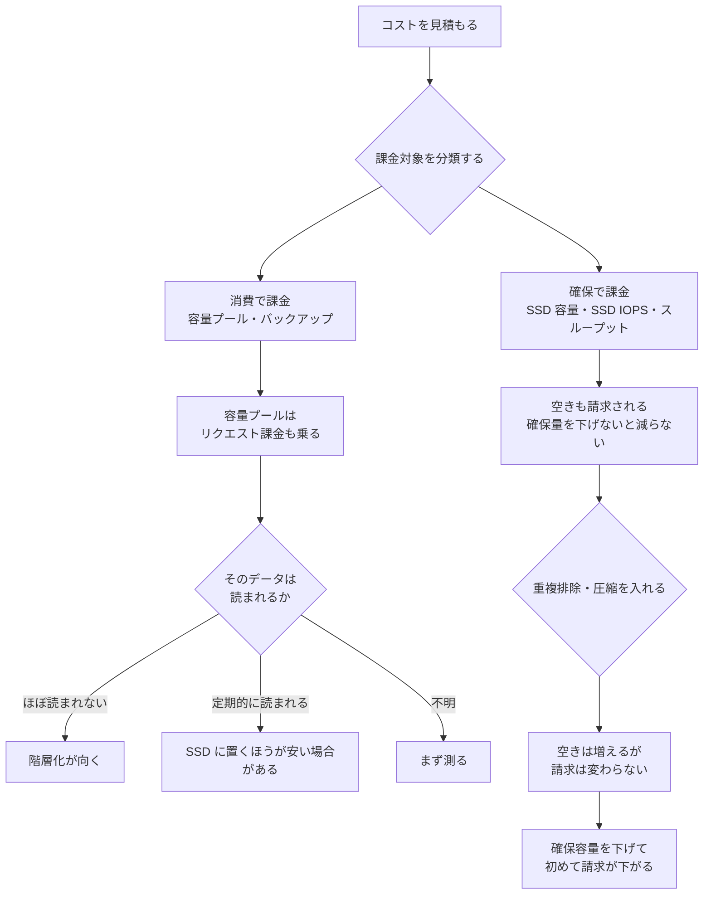

# 課金は「確保した量」と「使った量」に分かれる

[🏠 リポジトリトップ](../../../../../README.md) | [Domain — コスト](../README.md)

---

## 結論

**課金対象は「確保した量」で決まるものと「使った量」で決まるものに分かれます。** 見積もりが外れる原因はほぼここにあります。

- **SSD 容量とスループット容量は、確保した量で課金されます。** 使っていなくても請求されます。
- **容量プールとバックアップは、消費した量で課金されます。**

そしてもう 1 つ。**容量プールにはストレージ料金とは別に、読み取り・書き込みのリクエスト課金があります。** データにアクセスするたびに発生します。

だから「コールドデータを容量プールに落とせば安くなる」は**アクセス頻度次第で逆転します。** GB あたりは安くても、読まれ続けるならリクエスト課金が乗ります。

> **Evidence**: `documented` — 課金対象の区分は AWS 公式ドキュメントと料金ページの記載に基づきます。
> **具体的な金額と単価は載せません。** 料金は改定されるため、[FSx for ONTAP 料金ページ](https://aws.amazon.com/fsx/netapp-ontap/pricing/) と
> AWS Pricing Calculator を参照してください。自環境での確認手順は「[自分の環境で確かめる](#自分の環境で確かめる)」にあります。

---

## 何が課金対象か

| 課金対象 | 単位 | 確保 / 消費 |
|---|---|---|
| SSD 容量 | GB-月 | **確保した量** |
| SSD IOPS（3 IOPS/GB を超えて確保した分） | IOPS-月 | **確保した量** |
| スループット容量 | MBps-月 | **確保した量** |
| 容量プールのストレージ | GB-月 | 消費した量 |
| **容量プールのリクエスト** | 読み取り・書き込みごと | 消費した量 |
| バックアップストレージ | GB-月 | 消費した量（増分） |
| SnapLock ライセンス | — | 使用時 |
| S3 リクエストとデータ転送 | リクエスト・転送量 | S3 Access Point 経由のアクセス時 |

**SSD IOPS は 1 GB あたり 3 IOPS が既定で含まれます。** 追加課金はこれを超えて確保した分だけです。「IOPS を上げたら必ず課金が増える」わけではなく、3 IOPS/GB の範囲内なら含まれています。

バックアップは**増分**です。前回バックアップ以降の変更分だけが保存されるため、同じデータが二重に課金されることはありません。

---

## 階層化は「常に安くなる」わけではありません

容量プールは低頻度アクセスのデータ向けにコスト最適化されたストレージです。**ただし、そこに置いたデータを読むたびにリクエスト課金が発生します。**

判断は GB 単価だけでは決まりません。

| データの性質 | 階層化の向き |
|---|---|
| 書いたら基本的に読まれない（アーカイブ、監査ログの保管） | 向いています |
| 定期的に全件スキャンされる（バックアップ対象、インデックス再構築） | **リクエスト課金が積み上がります** |
| アクセス頻度が読めない | まず測ってから決めます |

さらに階層化には容量面の前提があります。**すべての書き込みは階層化ポリシーに関係なく最初に SSD に書かれ、メタデータは常に SSD に残ります。** 目安は SSD : 容量プール = 1 : 10 です。

つまり **`All` 階層化にしても SSD 消費はゼロになりません。** 詳細は [階層化ポリシーを `All` にしても SSD は使われます](../../../playbooks/05-operate/notes/monitoring-fails-on-averages.md#階層化ポリシーを-all-にしても-ssd-は使われます) にあります。

---

## 重複排除と圧縮は SSD の請求を下げません

**重複排除と圧縮はデータサイズを縮めますが、SSD は「確保した量」で課金されます。**

したがって効率化で空き容量が増えても、**確保容量を実際に下げないかぎり請求は変わりません。** 効果は「同じ確保容量にもっと入る」ことであり、「請求が下がる」ことではありません。

請求を下げたいなら、効率化で空いた分だけ**確保容量を減らす**操作が必要です。効果測定の手順は [自分の環境で確かめる](#自分の環境で確かめる) にあります。

---

## 課金されないと誤解されがちなもの

| 項目 | 実際 |
|---|---|
| AZ 間のレプリケーション転送（Multi-AZ） | **スループット容量の料金に含まれます。** 別建てのデータ転送課金はありません |
| 3 IOPS/GB までの SSD IOPS | 既定で含まれます |
| バックアップの重複データ | 増分バックアップなので二重課金されません |
| 最低利用料金・セットアップ料金 | ありません |

**Multi-AZ の AZ 間転送が別課金だという前提で見積もると、Multi-AZ を過大に高く見積もります。** 判断材料としては、[デプロイタイプは一度しか決められない](../../../playbooks/02-design/notes/deployment-type-is-decided-once.md#multi-az-と-single-az-の判断) にあるスループット上限と HA ペア数の制約のほうが効きます。

---

## Snapshot は容量として現れます

Snapshot は容量プールではなく**ボリュームの容量**を消費します。そして削除したデータを Snapshot が保持している場合、**データを削除しても空き容量は増えません。**

なお Snapshot が原因ではない場合もあります。**大量のデータやディレクトリを削除した直後は、空き容量の反映に時間がかかります。** ブロック所有権の計算処理が完了するまで、ブロックが空き容量に戻らないためです。これは想定された挙動で、ボリュームの性能には影響しません。**「削除したのに減らない」を Snapshot のせいと決める前に、時間を置いて再確認してください。**

保持ポリシーは容量の見積もりに直接効きます。上限との関係は [Snapshot があることと復旧できることは別](../../data-protection/notes/snapshots-are-not-a-recovery-plan.md#上限と保持期間) に、inode の消費は [容量が余っていても書けなくなる](../../../playbooks/01-assess/notes/counting-bytes-is-not-counting-files.md#snapshot-も-inode-を消費します) にあります。

---

## 見積もりが外れる典型的な前提

| 前提 | 何が起きるか |
|---|---|
| SSD は使った分だけ課金される | **確保した量で課金されます。** 空きも請求対象です |
| 容量プールに落とせば必ず安くなる | 読まれるデータはリクエスト課金が乗ります |
| `All` 階層化なら SSD はほぼ不要 | メタデータは常に SSD です。目安は 1 : 10 |
| 重複排除で請求が下がる | 確保容量を下げないかぎり変わりません |
| Multi-AZ は AZ 間転送で高くなる | 転送はスループット容量の料金に含まれます |
| HA ペアを足すのは性能の判断 | 同じ比率で SSD 容量が増えます。**最低スループットも上がります** |
| Snapshot は容量に影響しない | 容量と inode の両方を消費します |
| IOPS を上げると必ず課金が増える | 3 IOPS/GB までは含まれています |

HA ペア追加が最低スループットを上げる点は [スループットは 1 つの設定値では決まらない](../../performance/notes/where-throughput-is-determined-and-shared.md) にあります。**上限を上げる操作が下限も上げるため、コストの下振れ余地が狭まります。**

---

## トレードオフの提示のしかた

コストの議論は、**削れる額と引き換えに何を受け入れるのかを対称に並べる**と判断できます。片側だけを示すと決められません。

| 選択 | 下がるもの | 受け入れるもの |
|---|---|---|
| Single-AZ にする | ストレージとスループットの単価 | AZ 障害時の継続性を別の仕組みで設計する必要 |
| 階層化を積極的に使う | SSD の確保容量 | 容量プールのリクエスト課金と、読み取り遅延の増加 |
| スループット容量を下げる | MBps-月の課金 | ピーク時の余裕。背景タスクが後回しになる度合いが増える |
| Snapshot の保持を短くする | 容量消費 | 復旧できる時点の選択肢 |
| 確保 IOPS を 3 IOPS/GB に留める | IOPS-月の課金 | ランダム I/O が多い場合の性能余裕 |

**どれも「安くなる」と「何かを手放す」が対になっています。** 背景タスクが後回しにされる仕組みは [監視は平均値で失敗する](../../../playbooks/05-operate/notes/monitoring-fails-on-averages.md) にあります。

---

## 判断フロー

---

## 自分の環境で確かめる

**測る対象は「確保量と消費量の差」と「容量プールへのアクセス頻度」です。** この 2 つで見積もりのずれの大半が説明できます。

| # | 手順 | 確認できること |
|---|---|---|
| 1 | SSD の確保容量と実使用量を並べて記録する | **確保しているのに使っていない量。** 削減余地の大きさ |
| 2 | 容量プールへの読み取り・書き込みリクエスト数を一定期間集計する | リクエスト課金の規模。階層化の是非 |
| 3 | 重複排除・圧縮の前後で「実使用量」と「確保容量」を分けて記録する | **効率化が請求に効いていないことの確認。** 確保容量を下げる根拠になります |
| 4 | `All` 階層化ボリュームの SSD 消費を測る | メタデータ分が 1 : 10 の目安と合うか |
| 5 | Snapshot を削除して空き容量の変化を見る | Snapshot が保持している容量。**大量削除の直後は反映に時間がかかります** |
| 6 | 確保 IOPS が 3 IOPS/GB を超えているかを確認する | 追加課金が発生しているか |
| 7 | 測定時のリージョン・世代・デプロイタイプを記録する | 単価も上限も変わるため、条件なしの数値は比較に使えません |

手順 3 が最も見落とされます。**効率化の効果を「空き容量」で報告すると、請求が下がっていないことに気づけません。**

---

## よくある誤解

| 誤解 | 実際 |
|---|---|
| 使った分だけ払う | SSD・IOPS・スループットは**確保した量**で課金されます |
| 容量プールはストレージ料金だけ | **読み取り・書き込みのリクエスト課金**があります |
| コールドデータは全部落とせば得 | 定期的にスキャンされるならリクエスト課金が積み上がります |
| 重複排除で請求が下がる | 確保容量を下げるまで変わりません |
| バックアップは全量課金 | 増分です |
| Multi-AZ は AZ 間転送が別課金 | スループット容量の料金に含まれます |
| IOPS は上げれば必ず課金増 | 3 IOPS/GB までは含まれています |
| Snapshot はストレージ課金に無関係 | ボリュームの容量と inode を消費します |
| 階層化ポリシーを `All` にすれば SSD 課金はほぼゼロ | メタデータは常に SSD にあります |

---

## 参照した一次情報

| 論点 | 出典 |
|---|---|
| 6 つの課金対象、SSD IOPS が 3 IOPS/GB 超過分であること、容量プールに読み書きのリクエスト課金があること | [AWS: What is Amazon FSx for NetApp ONTAP?](https://docs.aws.amazon.com/fsx/latest/ONTAPGuide/what-is-fsx-ontap.html) |
| 確保と消費の区分、AZ 間レプリケーション転送がスループット容量の料金に含まれること、バックアップが増分であること、最低料金・セットアップ料金がないこと、S3 Access Point 経由のリクエストとデータ転送 | [AWS: FSx for ONTAP 料金](https://aws.amazon.com/fsx/netapp-ontap/pricing/) |
| 確保量に対する課金であること、容量プールとバックアップが消費量課金であること | [AWS: FSx for ONTAP の機能](https://aws.amazon.com/fsx/netapp-ontap/features/) |
| 重複排除・圧縮はデータを縮めるが確保済みストレージに対して課金されること、階層化がコスト削減手段であること | [AWS Prescriptive Guidance: Choose the right SMB file storage](https://docs.aws.amazon.com/prescriptive-guidance/latest/optimize-costs-microsoft-workloads/storage-fsx-smb.html) |
| SnapLock ライセンスが課金要素に含まれること | [AWS Storage Blog: How to size an FSx for ONTAP file system](https://aws.amazon.com/blogs/storage/how-to-size-an-amazon-fsx-for-netapp-ontap-file-system/) |
| 全書き込みが SSD 経由であること、メタデータが常に SSD にあること、1 : 10 の目安 | [AWS: Migrating to FSx for ONTAP using NetApp SnapMirror](https://docs.aws.amazon.com/fsx/latest/ONTAPGuide/migrating-fsx-ontap-snapmirror.html) |
| 大量削除の直後は空き容量の反映に時間がかかること（ブロック所有権の計算処理）、性能には影響しないこと | [AWS re:Post: Why didn't the available space update after I deleted a large amount of data?](https://repost.aws/knowledge-center/fsx-ontap-space-available-from-deletions) |

---

## 関連ドキュメント

- [Domain — コスト](../README.md) — このモジュールのハブ
- [デプロイタイプは一度しか決められない](../../../playbooks/02-design/notes/deployment-type-is-decided-once.md) — Single-AZ / Multi-AZ とスケールアウトの制約
- [スループットは 1 つの設定値では決まらない](../../performance/notes/where-throughput-is-determined-and-shared.md) — HA ペア追加が最低スループットを上げる
- [監視は平均値で失敗する](../../../playbooks/05-operate/notes/monitoring-fails-on-averages.md) — 階層化と背景タスクの挙動
- [Snapshot があることと復旧できることは別](../../data-protection/notes/snapshots-are-not-a-recovery-plan.md) — 保持設計と容量
- [容量が余っていても書けなくなる](../../../playbooks/01-assess/notes/counting-bytes-is-not-counting-files.md) — inode と Snapshot
- [上限値・クォータ](../../../reference/limits/) — 出典と検証日付きの上限値
- [知見の分類ポリシー](../../../evidence-policy.md)

---

[🏠 リポジトリトップ](../../../../../README.md) | [Domain — コスト](../README.md)
