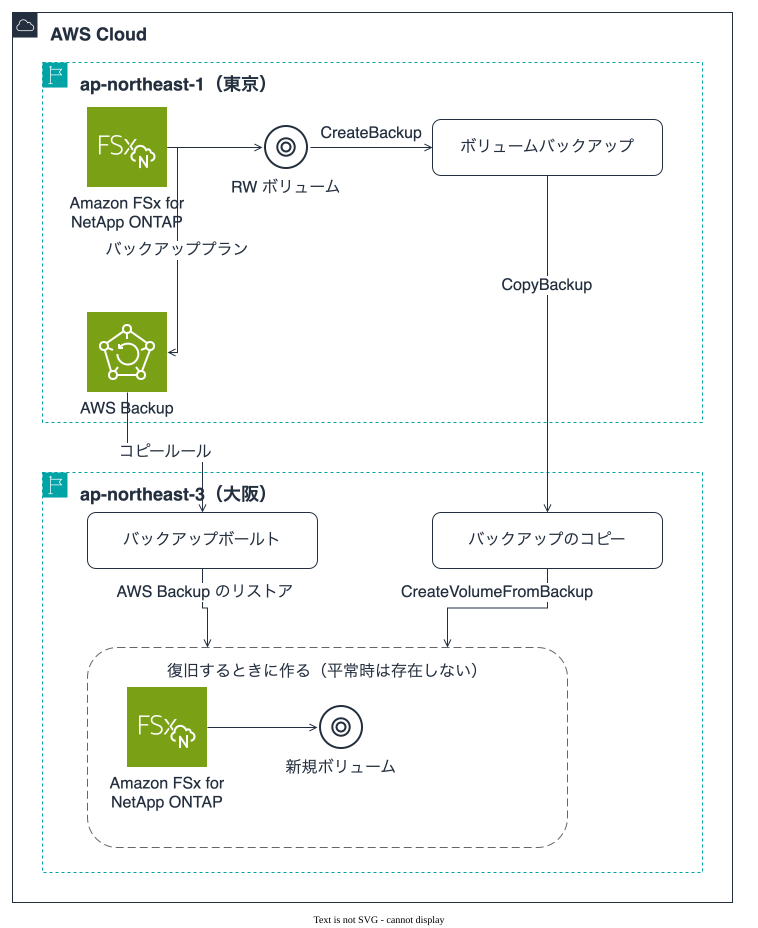
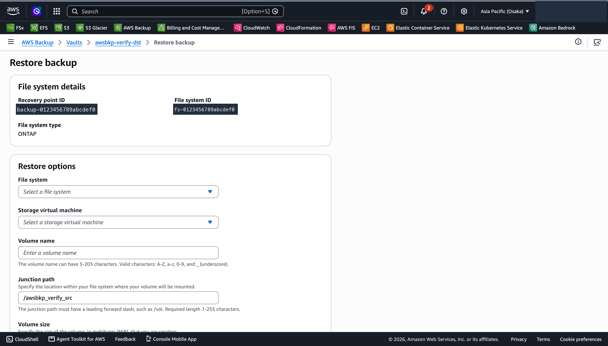
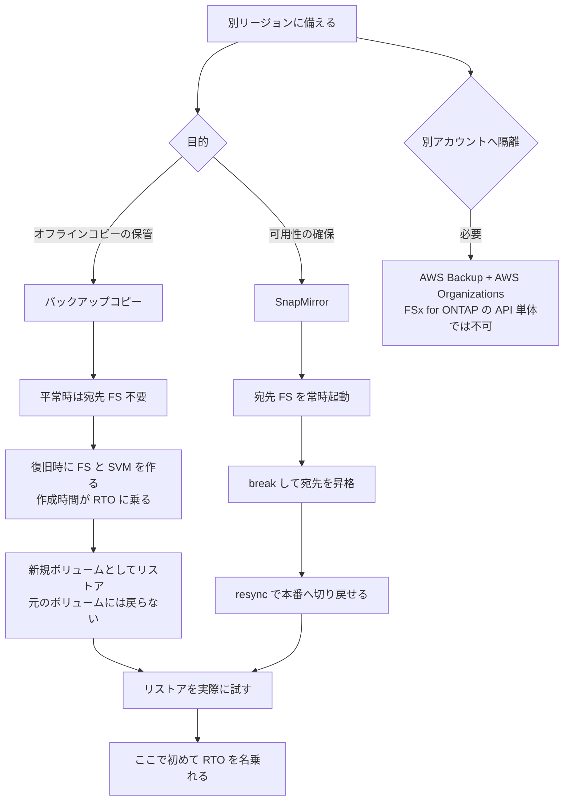

# バックアップコピーはリストアするまでファイルシステムを持たない

[🏠 リポジトリトップ](../../../../../README.md) | [Domain — データ保護](../README.md)

---

## 結論

**Amazon FSx for NetApp ONTAP のバックアップを、別リージョンと別アカウントへコピーできるようになりました。** 2026 年 8 月のアップデートで、それ以前は「ファイルシステムと同じリージョン・同じアカウントでバックアップを作成しリストアする」ことしかできませんでした。

設計上の意味はコピーができること自体ではなく、**コピー先にファイルシステムを持たなくてよくなったこと**です。従来、別リージョンにデータを置く手段は SnapMirror で、そのためにコピー先でファイルシステムを起動し続ける必要がありました。バックアップコピーは保存だけなら宛先のファイルシステムを要求せず、**必要になったときに作れば足ります**。

ただし**リストアの制約は変わっていません。** バックアップは、それが保存されているリージョンのファイルシステムにしかリストアできません。別リージョンに置いたバックアップからリストアするには、そのリージョンにファイルシステムと SVM が必要です。「コピーで DR が完結する」ではなく「**平常時に持つものが減った**」という差です。

> **区分**: `verified`（検証日 2026-08-28）。`ap-northeast-1` から `ap-northeast-3` へのコピーと、
> コピー先でのリストア・内容照合までを実測しました。**別アカウントへのコピーは実測していません**（`documented`）。
> 内訳は [何を実測し、何を実測していないか](#何を実測し何を実測していないか) にあります。



（ダークテーマ: [`backup-copy-cross-region-dark.svg`](../../../../_assets/images/backup-copy-cross-region-dark.svg)）

図の内容はこの後の表と本文でも述べています。要点は 3 つで、**大阪側は復旧するときまでファイルシステムを持たない**こと、**FSx for ONTAP の `CopyBackup` と AWS Backup のコピールールは別の機構**であること、**リストア先はバックアップが保存されているリージョンに限られ、それは 2 経路で共通**であることです。

---

## 何が変わったか

| 経路 | 以前 | 現在 | 手段 |
|---|---|---|---|
| 同一リージョン・同一アカウント | 可 | 可 | FSx for ONTAP のコンソール / CLI / API |
| **別リージョン・同一アカウント** | **不可** | **可** | FSx for ONTAP のコンソール / CLI / API (`CopyBackup`) |
| **別アカウント**（fan-in / fan-out） | **不可** | **可** | **AWS Backup + AWS Organizations** |

**別アカウントへのコピーは FSx for ONTAP の API だけでは行えません。** AWS Backup を経由し、アカウントの境界は AWS Organizations のポリシーで定義されます。fan-in は複数の本番アカウントから 1 つの隔離アカウントへ集約する形、fan-out は 1 つの本番アカウントから複数の隔離アカウントへ配る形です。

同一アカウントの別リージョンコピーは `USER_INITIATED` 種別で作られ、コピー元を指す `SourceBackupId` と `SourceBackupRegion` を保持します。

> **What's New は出ていますが、ONTAP ユーザーガイドの Document History には項目がありません。**
> Document History だけを追うと取りこぼします。[直近のアップデート](../../../reference/recent-updates.md)
> はこの経緯から出典の範囲を広げています。

---

## リストアの制約は変わっていない

ここを混ぜると設計を誤ります。**変わったのは「バックアップをどこに置けるか」で、「どこへリストアできるか」は同じです。**

| 主張 | 現在の状態 |
|---|---|
| バックアップを別リージョンへ置ける | **できるようになった** |
| バックアップを別アカウントへ置ける | **できるようになった**（AWS Backup 経由） |
| バックアップが保存されているリージョン以外のファイルシステムへリストアできる | **できません**（従来どおり） |
| リストア先は新規ボリュームになる | **従来どおり。** 既存ボリュームへの上書きリストアという経路はありません |

3 行目と 4 行目は公式ドキュメントに現在も明記されています。したがって別リージョンで復旧するときの手順は「**コピー済みバックアップがある + そのリージョンにファイルシステムと SVM を作る + 新規ボリュームとしてリストアする**」になります。宛先ファイルシステムを平常時に持たない選択をした場合、**その作成時間が RTO に加算されます**（実測では 20 分、後述）。

---

## 実測 — 東京から大阪へ

### 環境

| 項目 | 値 |
|---|---|
| コピー元 | `ap-northeast-1`、第 1 世代 `SINGLE_AZ_1`、1,024 GiB SSD、128 MBps |
| コピー先 | `ap-northeast-3`、同構成を検証用に新規作成 |
| ソースボリューム | FlexVol RW 1 GiB、階層化 `NONE`、ストレージ効率 無効 |
| データ | 5 ファイル 9.4 MiB（1 KiB / 1 MiB / 8 MiB / 37 B テキスト / UTF-8 名 4 KiB）、入れ子ディレクトリ、シンボリックリンク、`0640` のファイル 1 つ |
| KMS | 各リージョンの既定キー（`aws/fsx`）。カスタムキーは未使用 |
| クライアント | 各リージョンに `t3.micro`（Amazon Linux 2023）1 台、NFS でマウント |

`ap-northeast-3` で `SINGLE_AZ_1` が受理されたため、第 1 世代の最小構成（128 MBps）で検証できました。第 2 世代しか作れないリージョンでは最小スループットが 384 MBps になり、待機コストが約 1.9 倍になります。

### 所要時間

| 工程 | 所要 |
|---|---|
| バックアップのリージョン間コピー（1 回目） | 7 分 15 秒 |
| バックアップのリージョン間コピー（2 回目） | 6 分 01 秒 |
| コピー先ファイルシステムの作成 | 約 20 分 |
| コピー済みバックアップからのリストア（`CREATED` まで） | 13 分 21 秒 |

**この数値は 9.4 MiB のデータに対するものです。** 所要時間は固定的なオーバーヘッドが支配していて、データ量に比例する部分はほとんど見えていません。**自環境の RTO の根拠には使えません。** 公式ドキュメントはバックアップからのリストアを「数分から数時間」としており、サイズ依存であることを明記しています。

### 確認できたこと

| # | 確認したこと | 結果 |
|---|---|---|
| 1 | 同一アカウントでの別リージョンコピー | 成功。`SourceBackupId` / `SourceBackupRegion` を保持 |
| 2 | **ソースボリュームが既に削除済み**のバックアップのコピー | **成功。** ボリュームが存在しなくてもコピーできます |
| 3 | コピー後・リストア後の内容一致 | **sha256 が 5 ファイルすべて一致。** `0640` のパーミッション、シンボリックリンクの向き先、UTF-8 ファイル名も保持 |
| 4 | コピーが特定時点の像であること | バックアップ取得**後**に追加した 2 MiB のファイルは、リストアされたボリュームに存在しませんでした |
| 5 | コピー中のソースバックアップ削除 | 拒否。`BadRequest ... is being copied, can't be deleted` |
| 6 | リストア中のボリューム削除 | リストアがキャンセルされ、ボリュームは削除されました |

2 行目は運用上の含意があります。**ボリュームを消してしまった後でも、残っているバックアップを別リージョンへ退避できます。**

### コンソールから操作したときに気づく 4 点

CLI と同じ操作をコンソールで通したときに、画面側にしか現れない挙動がありました（2026-08-28 実測）。

| # | 挙動 | 影響 |
|---|---|---|
| 1 | **コピー画面の「送信先リージョン」の既定は同一リージョン** | 別リージョンへ送るには明示的な変更が必要です。既定のまま確認するとリージョン内コピーになります |
| 2 | 宛先リージョンを変えると、**表示される KMS キー ID が宛先リージョンの既定キーに変わる** | 「増分の条件は同一 KMS キー」が**宛先リージョンのキー**を指すことが画面で確認できます |
| 3 | リストアダイアログで、ファイルシステムに加えて **SVM が必須**（未選択だと赤い「必須」表示） | 「リストア先にファイルシステムが必要」だけでは足りません。**SVM も必要**です |
| 4 | **リストアボリュームのサイズの既定が 1 TiB** | ソースが 1 GiB でも 1 TiB が入っています。**1,024 GiB の宛先ではこれで容量を使い切ります** |

4 番が事故になりやすい箇所です。コンソールはジャンクションパス・ボリューム名・ストレージ効率はバックアップ元の値を初期選択しますが、**サイズだけは元の値ではありません。**

もう 1 点、リストアダイアログには **SnapLock を有効にする選択肢があります。** WORM は不可逆で影響範囲が対象ボリュームより広いため、この画面から有効にしないでください（[不可逆な操作の承認は作業の承認とは別に取る](../../security-governance/notes/irreversible-operations-need-separate-approval.md)）。

### リストア中は `RW` ではなく `DP` に見える

**リストア中のボリュームは `OntapVolumeType` が `DP` として返り、完了時に `RW` へ変わります。**

`CREATED` になった直後の値を読んで `DP` と記録し、「リストアすると読み取り専用ボリュームになる」と解釈しかけました。クライアントから書き込みを試すと**成功**し、読み直すと `RW` でした。`OntapVolumeType: RW` を明示したもう 1 回のリストアでも、`CREATING` の間は `DP` と返っていました。

| 状態 | `OntapVolumeType` |
|---|---|
| リストア中（`CREATING`） | `DP` |
| リストア完了後（`CREATED`） | `RW` |

**この値を監視や自動化の判定に使う場合、リストア中に読むと `DP` を見ます。** DP ボリュームはバックアップ対象外なので、「リストア直後に自動でバックアップを取る」処理を素朴に組むと、判定が状態に依存して揺れます。判定するなら `Lifecycle` が `CREATED` になったことを先に確認してください。

**コンソールでも同じ値が表示されます。** リストア中のボリューム詳細は「ライフサイクルの状態: 作成」と「ONTAP ボリュームタイプ: `DP`」を並べて表示し、フォームで Read-Write (RW) を選んでいてもこうなります。さらに**詳細画面は自動更新されません。** リストアが完了しても、再読み込みするまで `DP` のまま表示されていました。目視確認だけで判断すると、完了を見落とします。

### リストアされたボリュームの属性差

| 属性 | ソース | リストア後 | 備考 |
|---|---|---|---|
| `SizeInBytes` | 1 GiB | 1 GiB | リストア時に指定した値 |
| `VolumeStyle` | `FLEXVOL` | `FLEXVOL` | ボリュームスタイルはリストア時に変更できません（`documented`） |
| `StorageEfficiencyEnabled` | `false` | `true`（CLI で省略時）/ `false`（明示時） | **引き継がれないのではなく、`create-volume-from-backup` で省略したときの既定が `true`**。訂正あり（下記） |
| `SecurityStyle` | `UNIX` | API 応答では空 | NFS 経由のパーミッション動作は UNIX として正しく、フィールドのみ空。**CLI とコンソールの 2 経路で同じ結果。ただしソースボリュームは同一で、他のセキュリティスタイルでは未確認** |
| `TieringPolicy` | `NONE` | `NONE` | リストア時に指定した値 |

> **訂正**: 当初この表は「`StorageEfficiencyEnabled` は引き継がれませんでした」と記載していました。**誤りです。**
> コンソールからリストアすると、この項目は**バックアップ元の値（`無効`）が初期選択され**、そのまま `false` で
> リストアされました。最初の観測で `true` になったのは、CLI の `--ontap-configuration` でこのフィールドを
> 省略したためです。**リストアの挙動ではなく、API 呼び出しで省略したときの既定値**でした。
> リストアを CLI で組む場合は明示してください。

**ストレージ効率はリストア後に再確認してください。** 省略すると容量前提が変わります。

---

## 実測 — AWS Backup 経由のクロスリージョンコピーとリストア

2026-08-29（JST）に、同じ東京→大阪の経路を **AWS Backup** で実測しました。バックアッププランに
コピールールを付けた形と、オンデマンドのバックアップ + コピージョブの両方を通しています。ソースは
専用に作った 1 GiB の FlexVol（9,458,747 バイト、5 ファイル、シンボリックリンク・入れ子・UTF-8 名・
`0640` を含む）、宛先は検証用に作成した第 1 世代 `SINGLE_AZ_1` です。

| 工程 | 所要 |
|---|---|
| オンデマンドのバックアップジョブ | **4 分 02 秒** |
| オンデマンドのコピージョブ（東京 → 大阪） | **8 分 35 秒** |
| プラン起動のバックアップジョブ | **30 分 06 秒**（うち約 24 分は開始ウィンドウの待ち） |
| コピールールによる自動コピージョブ | **6 分 31 秒** |
| AWS Backup コンソールからのリストア | **16 分 16 秒** |
| 宛先ファイルシステムの作成 | 約 22 分 |

確認できたこと。

1. **コピールールは指示なしで発火します。** プランが起動し、コピージョブが自動で走り、
   大阪のバックアップボールトにリカバリポイントが増えました。
2. **リストア先は宛先リージョンの既存ファイルシステムと SVM で、できるのは新規ボリュームです。**
   ドロップダウンには大阪のファイルシステムと SVM しか出てきません。`CopyBackup` 経由と同じ制約です。



上の画面の「File system ID」はコピー元を指しています。宛先は下の「File system」で別に選びます。
コンソール表示が英語なのは撮影時の設定によるもので、他の画面（FSx for ONTAP 側）は日本語表示です。
3. **内容は一致しました。** 5 ファイルの sha256 がすべて一致し、シンボリックリンクの参照先、`0640`、
   UTF-8 のファイル名、入れ子ディレクトリ、mtime が保たれていました。
4. **リカバリポイントはコピー元のリソース ARN を保持します。** 大阪のボールトに並ぶリソース ID は
   東京のファイルシステムとボリュームを指し、リストア画面の「File system ID」も**コピー元**を表示します。

運用の判断に効く挙動が 4 つあります。

| 挙動 | 影響 |
|---|---|
| **プラン起動のジョブは `CREATED` で待つ** | 60 分の開始ウィンドウのうち約 24 分待ちました。「スケジュール時刻にバックアップができている」前提のランブックは、その分ずれます |
| **リストア画面の「ストレージ効率を有効化」は既定でオン** | ソースが無効でも `StorageEfficiencyEnabled: true` で戻りました。FSx for ONTAP 側のリストア画面はソースの値を初期選択するので、2 つのコンソールで挙動が違います |
| **`SecurityStyle` が空で戻る** | ソース `UNIX` に対して `null`。[属性差](#リストアされたボリュームの属性差) で 1 回だけ観測していた事象が、AWS Backup 経由でも再現しました |
| **`BackupSizeInBytes` は 0、リストアの進捗は 16 分間 `0.00%`** | どちらも監視やアラートの根拠には使えません |

撤収でひとつ引っかかりました。**`EXPIRED` になったリカバリポイントが消えるまでボールトは削除できません。**
`delete-recovery-point` の後も約 6 分間 `EXPIRED` として一覧に残り、その間 `delete-backup-vault` は
「contains recovery points」で拒否しました。基になる FSx for ONTAP のバックアップはその時点でまだ `AVAILABLE` でした。
撤収を自動化するならポーリングが必要です。

> **別アカウントへのコピーは実測していません**（`documented`）。AWS Organizations が前提のため、
> この検証は同一アカウント内に限っています。

---

## FlexGroup の扱い

公式ドキュメントの制約は「**FlexGroup ボリュームのバックアップの*コピー*には対応しない**」です。バックアップの作成ではなくコピーに掛かっています。

検証中に FlexGroup ボリューム（単一コンスティチュエント、1 アグリゲート、113 GiB プロビジョン）へ `CreateBackup` を実行したところ、**API は受理し、約 30 秒後に非同期で `FAILED`** になりました。メッセージは理由を示しません。

```text
Backup failed. Please delete the backup and try again.
```

対照として、同一セッション・同一資格情報で FlexVol RW ボリュームのバックアップは成功しています。したがって権限や資格情報の問題ではありません。

**ただしこれは 1 ボリュームでの 1 回の観測で、再現確認は未実施です。** 「FlexGroup のバックアップは作成できない」という一般化はしません。公式ドキュメントは FlexGroup バックアップの**リストア**について挙動を記述しており（HA ペア数が異なる場合にコンスティチュエントを追加する）、作成できない前提とは読めません。別途「**SnapLock の FlexGroup ボリューム**はバックアップできない」とだけ明記されています。

実務上の含意は 1 つです。**`AVAILABLE` な FlexGroup バックアップが得られなかったため、ドキュメントに書かれたコピー制約そのものは踏めませんでした。** FlexGroup を DR 設計に含める場合、自環境で作成側から確認してください。

---

## 残っている制約

| 制約 | 内容 |
|---|---|
| パーティション | 商用リージョン間、中国（北京・寧夏）間、GovCloud（US-East・US-West）間はそれぞれ可。**セット同士は跨げません** |
| 同一リージョンコピー | 任意のリージョンで可 |
| ソースの状態 | `AVAILABLE` であること |
| コピー中のソース削除 | 不可。**宛先が利用可能になってから削除できるまでに短い遅延があります** |
| 同時コピー数 | 1 ボリューム・1 宛先リージョン・1 KMS キーあたり 5 件 |
| アカウント単位の同時コピー数 | 1,000 件。超過分は拒否されます |
| FlexGroup | バックアップのコピーは非対応 |
| 別アカウントコピー | 中国（北京・寧夏）では非対応 |
| 初回コピー | 別リージョンへの初回は必ずフルコピー。以降は同一 KMS キーかつ既存コピーを保持している限り増分 |

最後の行は**コスト設計に効きます。** 宛先のコピーをすべて削除すると、次のコピーはフルに戻ります。「古い世代を掃除したらコピー時間と転送量が跳ねた」という形で現れます。

増分になること自体は今回**確認できていません。** 9.4 MiB と 11.4 MiB のコピーで所要時間は 7 分 15 秒と 6 分 01 秒で、この規模では固定オーバーヘッドに埋もれます。

---

## 本番に入れるときに決めること

**経路が成立することと、運用に載ることは別です。** 実測で経路は通りましたが、本番投入には以下を決める必要があります。

### 定期実行の仕組みは、`CopyBackup` にはありません

公式ドキュメントは FSx for ONTAP の `CopyBackup` を "**manually** copy volume backups" と記述しています。**コンソール / CLI / API から都度実行する形で、スケジューラを持ちません。**

| 経路 | 定期化の形 | 別アカウント |
|---|---|---|
| FSx for ONTAP の `CopyBackup` | **なし。** 自前の自動化（EventBridge Scheduler → Lambda など）が必要 | 不可 |
| AWS Backup のバックアッププラン | バックアップルールにコピー先を設定 | **可**（Organizations 前提） |

自前で組む場合、**`create-backup` の完了を待たずに `copy-backup` を呼ぶと失敗します**（ソースが `AVAILABLE` である必要があります）。

**`AUTOMATIC` タイプの自動バックアップをコピーできるかは未確認です。** What's New は「新規および既存のバックアップ」と書いていますが、種別への明示がありません。自動バックアップを退避の起点にする設計なら、1 世代で確認してから組んでください。

### リストアは CloudFormation で宣言できます

**`AWS::FSx::Volume` には `BackupId` プロパティがあります**（「新しいボリュームを作るのに使うバックアップの ID」）。ファイルシステム・SVM・バックアップからのリストアを 1 テンプレートで書けるため、**宛先リージョンに未デプロイのテンプレートを置いておく**形が取れます。平常時の課金はゼロで、復旧時は 1 回のデプロイになります。

**この形は本リポジトリではデプロイ検証していません**（CLI で同じ順序を通しただけです）。**デプロイ検証していない復旧テンプレートは復旧手順ではありません。** 一度デプロイして所要時間を計ってから手順書に載せてください。

### リストアの性能に効く条件

| 条件 | 内容 | 区分 |
|---|---|---|
| SSD 容量 | リストアされるデータは**まず SSD 層に書かれます**。空きが尽きるとリストアは一時停止し、空きができると自動再開します | `documented` |
| 世代 | **第 2 世代はリストア中でも読み取り可能**（メタデータのロード後）。**第 1 世代は完了待ち** | `documented` |
| 背景処理の優先度 | バックアップとリストアは**クライアント I/O より優先度が低く**、未使用のスループット容量を使います | `documented` |
| FlexVol の範囲 | FlexVol は 1 つの HA ペアを超えられません。大きなボリュームのリストア先は世代と容量で決まります | `documented` |

3 行目には運用上の含意があります。**業務のピークにバックアップを重ねると、どちらも遅くなります。**

### アプリケーション整合性は別の問題です

**バックアップはボリュームのポイントインタイムのコピーで、アプリケーションの静止点を取る仕組みではありません。** データベースを載せている構成で「別リージョンへコピーしているので DR は済んでいる」と読むと、リストアできてもデータベースが起動しない可能性があります。DB 側のバックアップ、またはバックアップ前の静止処理と組み合わせてください。

### 隔離が成立する条件

**コピーを別アカウントへ置いても、それだけでは削除耐性は得られません。** 隔離が成立するのは、**宛先アカウントの IAM や vault のポリシーが削除を防いでいる場合だけ**です。保持期間中の削除禁止そのものは WORM 系の機能（Object Lock、SnapLock、Vault Lock）の領域で、**いずれも不可逆なため有効化は別の承認を要します**（[不可逆な操作の承認は作業の承認とは別に取る](../../security-governance/notes/irreversible-operations-need-separate-approval.md)）。

一方で、**リストアが必ず新規ボリュームになることはインシデント対応では利点です。** 侵害されたボリュームを保全したまま、別ボリュームへリストアして業務を再開できます。

### 意図しないリージョンへコピーさせないガード

データの所在に要件がある場合、**`aws:RequestedRegion` の条件キーで `fsx:CopyBackup` の宛先を限定**してください。運用ルールだけでの担保は成立しません。

---

## レプリケーションとコピーは別の操作

選び分けの前に語を揃えます。「別リージョンにデータを持つ」を指して**レプリケーション**と**コピー**が混ざって使われますが、宛先に何が残るかが違います。

| | SnapMirror の**レプリケーション** | AWS Backup / `CopyBackup` の**コピー** |
|---|---|---|
| 宛先に置かれるもの | **ボリューム**（宛先 SVM 上の `DP` ボリューム） | **バックアップ（リカバリポイント）。** ボリュームはありません |
| ソースの変更 | **追従します**（スケジュールごとに差分転送） | **追従しません**（取得時点の像） |
| 宛先を使うには | 関係を break して昇格 | **リストアが必要で、できるのは新規ボリューム** |
| 関係の継続 | **続きます** | **続きません**（1 回ごとに独立した成果物） |
| RPO を決めるもの | レプリケーションのスケジュール（5 分まで） | バックアップの間隔（目安 60 分） |
| 本番へ戻す | 逆向きに `snapmirror resync` | **経路がありません** |

**AWS 側の語も分かれています。** AWS Backup のコンソールとドキュメントはこの操作を一貫して「コピー」と呼び、画面にも Copy jobs / Copy rule / `Copy type` と出ます（`verified`、2026-08-29）。FSx for ONTAP 側の API 名も `CopyBackup` です。レプリケーションは、Amazon S3 のクロスリージョンレプリケーションのように**宛先が実体として追従する機構**に使われる語です。

したがって「AWS Backup でクロスリージョンレプリケーションする」は、宛先に追従するボリュームがあるように読めます。ありません。逆に SnapMirror を「バックアップ」と呼ぶのもずれます。宛先は追従するので、**ソースで消したファイルは次の転送のあと宛先の最新状態からも消えます**（宛先の Snapshot に残る範囲は別）。世代を残すのは Snapshot か SnapVault の役割です。

> **SnapVault はさらに別の機構です。** 世代を宛先に貯める関係で、SnapMirror と同じ転送基盤を使いますが目的が違います。**バックアップコピーは ONTAP の SnapVault 関係を作るものではありません。**

---

## SnapMirror との選び分け

**どちらかが優れているという関係ではありません。** 公式ドキュメントに RPO / RTO の目安が示されており、守る対象が違います。

| 観点 | バックアップコピー | SnapMirror |
|---|---|---|
| 向いている状況 | オフラインコピーの保管が要件（コンプライアンス、隔離） | 別リージョンでの可用性確保が要件（DR） |
| RPO の目安 | **60 分**（`documented`） | **5 分**まで短縮可（`documented`） |
| RTO の目安 | **数分〜数時間**（サイズ依存、`documented`） | **一桁分**（`documented`） |
| 平常時に必要なもの | 宛先のファイルシステムは不要 | **宛先のファイルシステムを起動し続ける** |
| 宛先の書き込み | リストアするまで書き込み対象がありません | 宛先は読み取り専用。関係を break すると書き込み可能 |
| 復旧の形 | **新規ボリュームとしてリストア。** 元のボリュームには戻りません | 関係を break して宛先を昇格 |
| 本番へ戻す経路 | **バックアップコピーには戻す経路がありません。** 復旧側で運用を継続するか、改めて逆向きにコピーします | 関係を削除して DR 側から `snapmirror resync` で逆向きに再同期（`documented`） |
| トレードオフ | 復旧に宛先ファイルシステムの作成時間が乗る（実測 20 分）。RPO はバックアップ間隔ぶん粗い | 宛先の容量とスループットを常時支払う。クラスタ間ピアリングが必要で **NAT 非対応** |
| 前提条件 | ソースは `AVAILABLE` な RW ボリュームのバックアップ | クラスタ間ピアリングと経路設計 |

**「本番へ戻す」の非対称性が最も大きな差です。** SnapMirror は関係を逆向きに張り直して切り戻せます。バックアップコピーはリストアしかなく、できるのは新しいボリュームです。切り戻しを手順として持ちたい場合、バックアップコピーはその代替になりません。

> **`snapmirror resync` の注意点**: ユーザー作成の Snapshot は resync では複製されません。
> XDP 関係では `preserve` パラメータが使えます（`documented`）。

両方を使う構成も成立します。**SnapMirror で可用性を、バックアップコピーで隔離された保管を担う**という分担です。この場合、SnapMirror の宛先は `DP` ボリュームでバックアップ対象外なので、**バックアップは複製元で取り、そのバックアップをコピーします**（[Snapshot があることと復旧できることは別](snapshots-are-not-a-recovery-plan.md#バックアップできないボリュームがある)）。

---

## 国内 DR という観点

**大阪リージョンへのコピーは、国内にデータを留めたまま別リージョンへ退避する構成になります。**

| 論点 | 内容 |
|---|---|
| データの所在 | 東京・大阪の双方が国内。データ所在地の要件を国内で満たせます |
| 平常時のコスト | バックアップストレージのみ。大阪の消費量課金は $0.050/GB-月（2026-07-01 時点の料率） |
| 復旧時に必要なもの | 大阪にファイルシステムと SVM。**作成時間が RTO に乗ります**（実測 20 分） |
| 世代の可用性 | 大阪では `SINGLE_AZ_1` が作成できました（2026-08-28 実測）。第 2 世代の提供状況はリージョンで異なるため、**復旧手順を書く前に確認してください** |
| トレードオフ | SnapMirror より RPO / RTO が粗くなります。分単位の RPO が要件なら宛先ファイルシステムを常時持つ判断になります |

> **データ所在地の要件をどう満たすかは設計上の論点で、法令・規制の適合判断ではありません。**
> 規制要件の解釈は所管部門と規制当局の領域です。

---

## 選び方

**上から順に確認してください。** 答えが決まった時点で必要な構成が決まります。

| # | 確認項目 | 判断への影響 |
|---|---|---|
| 1 | 別リージョンに置く目的は保管か可用性か | 保管ならバックアップコピー、可用性なら SnapMirror が起点になります |
| 2 | 許容できる RPO は分単位か時間単位か | 分単位なら SnapMirror。バックアップコピーの目安は 60 分です |
| 3 | 復旧時にファイルシステム作成時間を許容できるか | 許容できないなら宛先を常時持つ構成になります |
| 4 | 本番へ切り戻す手順が必要か | 必要なら SnapMirror。**バックアップコピーに切り戻し経路はありません** |
| 5 | 別アカウントへの隔離が必要か | 必要なら **AWS Backup と AWS Organizations** が前提です |
| 6 | 対象に FlexGroup が含まれるか | コピー非対応。**作成側の挙動も自環境で確認してください** |
| 7 | 宛先の世代を掃除する運用があるか | すべて削除すると次のコピーがフルに戻ります |
| 8 | リストアを実際に試したか | **試していなければ RTO は推測値です** |

---

## 判断フロー



---

## よくある誤解

| 誤解 | 実際 |
|---|---|
| 別リージョンへコピーできるようになったので、そこから直接リストアできる | **リストア先はバックアップが保存されているリージョンのファイルシステムに限られます。** そのリージョンに作る必要があります |
| コピーがあれば宛先にファイルシステムは一切不要 | 保管には不要、**リストアには必要**です。作成時間が RTO に乗ります |
| バックアップコピーがあれば SnapMirror は不要 | RPO / RTO と切り戻しが違います。**バックアップコピーに切り戻し経路はありません** |
| FSx for ONTAP の API だけで別アカウントへコピーできる | 別アカウントは **AWS Backup + AWS Organizations** 経由です |
| ソースボリュームを消したらバックアップもコピーできない | **削除済みボリュームのバックアップもコピーできました**（実測） |
| コピーはリアルタイムに追従する | 特定時点の像です。取得後に追加したファイルは含まれません（実測） |
| リストアすると読み取り専用ボリュームになる | **リストア中に `DP` と返るだけ**で、完了後は `RW` です（実測） |
| リストアすればソースと同じ属性で戻る | `SecurityStyle` は API 応答で空になります。`StorageEfficiencyEnabled` は **CLI で省略すると `true`** になります（実測） |
| コンソールの既定値をそのまま確認すれば安全 | **ボリュームサイズの既定が 1 TiB** です（ソースが 1 GiB でも）。確認前に必ず見てください（実測） |
| リストアボリュームの状態はコンソールで追える | **詳細画面は自動更新されません。** 完了しても再読み込みするまで `DP` / 作成中のまま表示されました（実測） |
| コピーは常に増分 | 別リージョンへの初回はフルです。宛先のコピーをすべて削除すると次もフルに戻ります |
| 小さいデータで測った所要時間が RTO の根拠になる | 固定オーバーヘッドが支配します。**サイズ依存の部分は見えていません** |
| コピーは定期実行できる | **`CopyBackup` は手動のみ**です。定期化は AWS Backup か自前の自動化になります |
| 別アカウントへ置けば削除されない | **コピーは削除できます。** 隔離は宛先側の権限設計で成立します |
| ボリュームバックアップがあればデータベースも復旧できる | ボリュームのポイントインタイムです。**アプリケーションの静止点は別途必要**です |
| 復旧手順は CLI を並べれば足りる | リストアは `AWS::FSx::Volume` の `BackupId` で宣言できます。**デプロイ検証していないテンプレートは手順ではありません** |

---

## 何を実測し、何を実測していないか

| 項目 | 区分 |
|---|---|
| 同一アカウントの別リージョンコピー、削除済みボリュームのバックアップのコピー、内容一致、特定時点性、コピー中のソース削除拒否、リストア中のボリューム削除 | **実測**（2026-08-28、`ap-northeast-1` → `ap-northeast-3`） |
| リストア中の `OntapVolumeType` が `DP` になること（CLI・コンソールの両方で確認） | **実測**（同上） |
| コンソール側の 4 点（同一リージョン既定 / KMS キーの切り替わり / SVM 必須 / サイズ既定 1 TiB）と、詳細画面が自動更新されないこと | **実測**（2026-08-28、コンソール） |
| `StorageEfficiencyEnabled` が CLI で省略時に `true` になること（引き継がれないのではない） | **実測**（CLI とコンソールの 2 経路で確認。当初の記述を訂正） |
| `SecurityStyle` が API 応答で空になること | **2 経路で同じ結果。ただしソースボリュームは同一で、他のセキュリティスタイルでは未確認** |
| FlexGroup のバックアップ作成が非同期で失敗すること | **一度のみの観測。再現確認は未実施。一般化しません** |
| 別アカウントへのコピー、fan-in / fan-out | **未実測。** 公式ドキュメントの記載のみ |
| コピーが増分になること | **未実測。** この規模では所要時間から判定できません |
| 中国・GovCloud のパーティション制約、同時コピー数の上限 | **未実測。** 公式ドキュメントの記載のみ |
| リージョン間データ転送料の請求内訳 | **未確認。** 請求書との照合を行っていません |
| SnapMirror の逆向き再同期による切り戻し | **未実測。** 公式ドキュメントとブログの記載のみ |

---

## 自分の環境で確かめる

| # | 手順 | 確認できること |
|---|---|---|
| 1 | 小さい RW ボリュームでバックアップを取り、別リージョンへコピーする | 経路と権限（`fsx:CopyBackup` とソースリージョンへのアクセス） |
| 2 | コピー先にファイルシステムと SVM を作り、リストアする | **復旧に必要な工程の全体像と、その所要時間** |
| 3 | リストア前後で sha256 とパーミッションを比較する | データと権限が保たれているか |
| 4 | リストア中に `OntapVolumeType` を読む | 自動化が過渡状態をどう見るか |
| 5 | 同じ宛先へ 2 回目のコピーを行い、所要時間と転送量を比較する | 増分になっているか。**本番相当のデータ量で行ってください** |
| 6 | 宛先のコピーをすべて削除してから再度コピーする | フルコピーに戻ることと、その時間 |
| 7 | 検証リソースを削除し、削除できたことを API で確認する | 撤収手順。**残ると宛先の課金が続きます** |

手順 2 が要点です。**コピーの成功はバックアップが届いたことしか示しません。** 復旧できることは別の確認項目です。

---

## 参照した一次情報

| 論点 | 出典 |
|---|---|
| 別リージョン・別アカウントへのコピーが可能になったこと、それ以前は同一リージョン・同一アカウントに限られていたこと | [AWS What's New: FSx for NetApp ONTAP now supports copying backups across AWS Regions and accounts](https://aws.amazon.com/about-aws/whats-new/2026/08/fsx-ontap-cross-region-backup-copy/) |
| AWS Backup 経由の別リージョン・別アカウントコピー、ポリシーベースとオンデマンドの両方 | [AWS What's New: AWS Backup adds cross-Region and cross-account backup support for FSx for NetApp ONTAP](https://aws.amazon.com/about-aws/whats-new/2026/08/aws-backup-amazon-fsx-netapp-cross-account-region/) |
| コピーの経路、パーティション制約、同時コピー数、FlexGroup のコピー非対応、初回フル / 以降増分、`fsx:CopyBackup` の IAM 記述 | [AWS: Copying backups](https://docs.aws.amazon.com/fsx/latest/ONTAPGuide/copy-backups.html) |
| CLI / コンソールでのコピー手順、バックアップコピーと SnapMirror の選び分け、RPO 60 分 / 5 分と RTO の目安 | [AWS: Copying backups within the same AWS account](https://docs.aws.amazon.com/fsx/latest/ONTAPGuide/copying-backups-same-account.html) |
| リストア先がバックアップと同一リージョンに限られること、リストアは新規ボリュームになること、SnapLock FlexGroup がバックアップ対象外であること、リストア・バックアップのスループット目安 | [AWS: Protecting your data with volume backups](https://docs.aws.amazon.com/fsx/latest/ONTAPGuide/using-backups.html) |
| リストアがボリューム作成 API であること | [AWS: CreateVolumeFromBackup](https://docs.aws.amazon.com/fsx/latest/APIReference/API_CreateVolumeFromBackup.html) / [Restoring a backup to a new volume](https://docs.aws.amazon.com/fsx/latest/ONTAPGuide/to-restore-backups.html) |
| 第 1 世代・第 2 世代の最小スループットと最小 SSD 容量、FlexVol が 1 HA ペアを超えられないこと | [AWS: Quotas](https://docs.aws.amazon.com/fsx/latest/ONTAPGuide/limits.html) |
| リストアが SSD 層優先であること、SSD 不足で一時停止すること、第 2 世代はリストア中に読めること、バックアップ / リストアが背景処理であること | [AWS: Protecting your data with volume backups](https://docs.aws.amazon.com/fsx/latest/ONTAPGuide/using-backups.html) |
| `AWS::FSx::Volume` の `BackupId` でバックアップから新規ボリュームを作れること | [AWS CloudFormation: AWS::FSx::Volume](https://docs.aws.amazon.com/AWSCloudFormation/latest/TemplateReference/aws-resource-fsx-volume.html) |
| AWS Backup のバックアッププランでコピー先リージョンを指定できること | [AWS Backup: Creating backup copies across AWS Regions](https://docs.aws.amazon.com/aws-backup/latest/devguide/cross-region-backup.html) |
| SnapMirror の切り戻し手順（関係の削除と `snapmirror resync`） | [AWS Storage Blog: Implementing HA and DR for SQL Server Always-On FCI](https://aws.amazon.com/blogs/storage/implementing-ha-and-dr-for-sql-server-always-on-failover-cluster-instance-using-amazon-fsx-for-netapp-ontap/) |
| `snapmirror resync` でユーザー作成 Snapshot が複製されないこと | [AWS re:Post: Why does the snapshot policy stop working after snapmirror resync?](https://repost.aws/knowledge-center/fsx-ontap-snapmirror-resync) |
| 大阪リージョンの SSD・スループット・バックアップストレージ料率 | AWS Price List API（`AmazonFSx`、`ap-northeast-3`、effective 2026-07-01） |

---

## 関連ドキュメント

- [Domain — データ保護](../README.md) — このモジュールのハブ
- [Snapshot があることと復旧できることは別](snapshots-are-not-a-recovery-plan.md) — 各仕組みの守備範囲
- [SnapLock は有効化とロックが別](snaplock-and-layered-ransomware-readiness.md) — 不可逆な選択
- [データ保護方式の比較](../../../reference/comparison/data-protection-methods.md) — 方式の選定
- [直近のアップデートと設計への影響](../../../reference/recent-updates.md) — このアップデートの位置づけ
- [課金は「確保した量」と「使った量」に分かれる](../../cost/notes/provisioned-versus-consumed.md) — バックアップの課金特性
- [知見の分類ポリシー](../../../evidence-policy.md)

---

[🏠 リポジトリトップ](../../../../../README.md) | [Domain — データ保護](../README.md)
