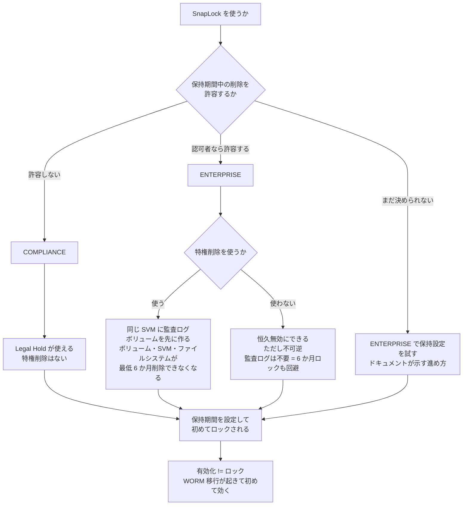

# SnapLock は有効化とロックが別

[🏠 リポジトリトップ](../../../../../README.md) | [Domain — データ保護](../README.md)

---

## 結論

**SnapLock には「あとで直す」ができない選択が 4 段あります。**

| # | 選択 | 不可逆性 |
|---|---|---|
| 1 | ボリュームで SnapLock を有効にする | **有効化は取り消せません** |
| 2 | 保持モード（`COMPLIANCE` / `ENTERPRISE`） | **一度設定すると変更できません** |
| 3 | 特権削除を「恒久的に無効」にする | **終端状態です。再有効化できません** |
| 4 | **監査ログボリュームを作る** | **ボリューム・SVM・ファイルシステムが最低 6 か月削除できなくなります** |

**4 番目は影響範囲が段違いです。** ほかの 3 つはボリューム単位の話ですが、**監査ログボリュームを 1 本作ると
ファイルシステムごと 6 か月削除できなくなります。Enterprise モードでも例外はありません。**
詳細は [監査ログボリュームはファイルシステムごと 6 か月固定します](#監査ログボリュームによるファイルシステム全体の-6-か月固定) にあります。

そして **「SnapLock を有効にする」ことと「ファイルがロックされる」ことは別です。** ロックを発生させるのは保持期間の設定と、WORM への移行です。有効化しただけでは何もロックされません。

Compliance と Enterprise の差は 1 点に集約されます。**Enterprise は保持期間中でも特権削除で消せます。Compliance は消せません。**

> **Evidence**: `documented` — モードの差・不可逆性・前提条件は AWS 公式ドキュメントと API リファレンスの記載に基づきます。
> **規制への適合を判断するものではありません。** ドキュメントが用途として挙げている規制名は事実として記載しますが、
> 適合の判断は読者側の監査・法務プロセスに属します。確認手順は「[自分の環境で確かめる](#自環境での確認手順)」にあります。

---

## Compliance と Enterprise の差

| 機能 | Compliance | Enterprise |
|---|---|---|
| 保持期間中の削除 | **できません** | **特権削除で可能**（認可されたユーザー） |
| 特権削除 | なし | あり |
| Legal Hold | **あり** | **なし** |
| イベントベース保持（EBR） | あり | あり |
| 自動コミット（autocommit） | あり | あり |
| volume-append モード | あり | あり |
| 監査ログボリューム | あり | あり |
| 容量プールへの階層化 | **対応**（SnapLock の種別に関係なく） | **対応** |

ドキュメントが挙げている用途はこうなっています。

- **Compliance**: 政府や業界固有の要件（SEC Rule 17a-4(f)、FINRA Rule 4511、CFTC Regulation 1.31 が名前で挙げられています）への対応、**およびランサムウェア対策**
- **Enterprise**: 組織内のデータ整合性と内部統制の強化、**Compliance を使う前に保持設定を試すこと**

**Enterprise の 2 番目の用途に注目してください。** モードは変更できないので、**本番で Compliance を使う前の検証先として Enterprise を使う**のが、ドキュメントが示す進め方です。

**EBR と Legal Hold の操作は ONTAP CLI と REST API でのみサポートされます。** テンプレートや Amazon FSx API では届きません。境界の考え方は [IaC の境界は API の表面で決まる](../../../playbooks/04-build/notes/what-iac-cannot-reach.md) にあります。

---

## 特権削除の前提

特権削除は Enterprise ボリュームでのみ使えます。既定は無効です。

| 項目 | 内容 |
|---|---|
| 削除できるのは誰か | **SnapLock 管理者だけ**です |
| 有効化の前提 | **同じ SVM に SnapLock 監査ログボリュームを先に作る必要があります** |
| 監査ログボリュームの最小保持期間 | **6 か月**。**この間ファイルシステムごと削除できなくなります**（[詳細](#監査ログボリュームによるファイルシステム全体の-6-か月固定)） |
| 監査ログ保持期間の指定手段 | **Amazon FSx の API には該当パラメータがありません。** `AuditLogVolume=true` を渡すと既定値が適用されます。値を選ぶには ONTAP の `snaplock log create -retention-period` が必要です |
| 恒久無効化 | **不可逆**。ただし恒久無効にすれば監査ログボリュームは不要になります |

> **恒久無効化を選ぶ判断材料が 1 つ増えます。** 特権削除を使わないと決めれば監査ログボリュームが不要になり、
> **6 か月の削除ロックも発生しません。** 逆に「とりあえず特権削除を有効にしておく」と、
> 監査ログボリュームの作成を通じてファイルシステムの寿命が 6 か月固定されます。

### 実測で確認した内容

| 項目 | 結果 |
|---|---|
| `SnaplockType` の変更 | **`UpdateVolume` に該当パラメータが存在しません。** 受理されるのは `AuditLogVolume` / `AutocommitPeriod` / `PrivilegedDelete` / `RetentionPeriod` / `VolumeAppendModeEnabled` の 5 つだけです |
| `PrivilegedDelete` / `AuditLogVolume` / `AutocommitPeriod` の既定 | `DISABLED` / `false` / `NONE` |
| `RetentionPeriod` の既定 | 既定 0 YEARS / 最小 0 YEARS / **最大 30 YEARS** |
| **`PERMANENTLY_DISABLED` からの復帰** | **`ENABLED` も `DISABLED` も拒否**: `Privileged-delete is permanently disabled on this volume.` |

**保持モードは「変更が拒否される」のではなく「変更する手段がない」形で固定されています。** デプロイタイプと同じ構造です。

**特権削除の有効化に監査ログボリュームが必要かどうかは判定できていません。** 監査ログボリュームの作成前と作成後の両方で試したため、**どちらが成立したのか帰属できません。** ドキュメントは必要と記載しています。

> **この節の区分**: `verified`（検証日 2026-08-06）。`ap-northeast-1`、`SINGLE_AZ_1`（第 1 世代）。
> **WORM へのコミットは行っていません。** ロック済みファイルの削除挙動は検証範囲外です。
> 記録は [上限値・クォータ](../../../reference/limits/) にあります。

---

## 監査ログボリュームによるファイルシステム全体の 6 か月固定

**影響はボリューム 1 本では終わりません。** AWS ドキュメントは警告として、監査ログボリュームの保持期間が
満了するまで**ボリューム・SVM・そのSVMが属するファイルシステム**のいずれも削除できないと記載しています。
**Enterprise モードでも例外はありません。**

| 削除できなくなる対象 | 期間 |
|---|---|
| 監査ログボリューム | 最低 6 か月 |
| **その SVM** | 同じ |
| **その SVM が属するファイルシステム** | 同じ |

> **検証環境でも使い捨てのファイルシステムで試してください。** ボリュームを作り直せば済む話ではなく、
> **ファイルシステムの寿命が 6 か月固定されます。** 本リポジトリの検証では、この制約を踏んだ結果として
> 検証用ボリューム 1 本が残置されています。

### AWS API での解除の不可

| 操作 | 結果 |
|---|---|
| マウント位置 | **`/snaplock_audit_log` のみ。** 他のパスは `SnapLock audit log volume can only be mounted at the junction path /snaplock_audit_log` で拒否されます |
| 通常の削除 | **`DELETING` に入ったのち `CREATED` に戻ります。エラーは返りません** |
| `BypassSnaplockEnterpriseRetention=true` | **効きません**（同上） |
| `AuditLogVolume=false` への変更 | 適用されませんでした |
| SVM 側の指定 | **Amazon FSx の API に露出していません** |

### ONTAP REST での指定解除と、削除可能化の不成立

**ここは当初「ONTAP レベルの操作で解除できる」と記載していた箇所の訂正です。** 実際に ONTAP REST API で
確認したところ、**SVM 側の指定解除は成功しましたが、それでもボリュームは削除できませんでした。**

| # | 操作 | 結果 |
|---|---|---|
| 1 | マウントしたまま SVM 側の指定を解除 | **失敗**: 先にアンマウントが必要 |
| 2 | アンマウントしてから指定を解除 | **成功**。SVM 側の指定は消えました |
| 3 | ボリューム側の `is_audit_log` を `false` に | **拒否**: **読み取り専用のフィールドです** |
| 4 | オフラインにして削除 | **失敗**（保持期間が未満了） |

**指定の解除とボリュームの削除可能性は別物です。** SVM 側の指定を外してもボリューム側のフラグは残り、
そのフラグは変更できません。**保持期間の満了を待つ以外の手段は見つかりませんでした。**

**特権削除を恒久無効にしていると、ログファイル自体も消せません。** 不可逆な選択を組み合わせた順序が
退路を狭めます。境界の考え方は [IaC の境界は API の表面で決まる](../../../playbooks/04-build/notes/what-iac-cannot-reach.md) にあります。

ONTAP レベルの削除拒否メッセージは阻害要因を 5 つ列挙します。**未期限の WORM ファイル、リーガルホールド下のファイル、未期限のロック済み Snapshot、未期限の監査ログボリューム、保留中の WAFL スキャンのためオンラインが必要** — です。削除できない場合、このどれに該当するかを確認してください。

> **この節の区分**: 削除できなくなる対象の範囲は `documented`（[AWS: Deleting SnapLock volumes](https://docs.aws.amazon.com/fsx/latest/ONTAPGuide/snaplock-delete-volume.html)）。
> 操作の可否と各エラーは `verified`（検証日 2026-08-06、`ap-northeast-1`、
> `SINGLE_AZ_1`、ONTAP `9.17.1P7D1`）。エラーコードを含む全記録は
> [上限値・クォータ](../../../reference/limits/) にあります。

---

## 派生機能 Snapshot locking の非 SnapLock ボリュームへの適用

**SnapLock 技術を使う Snapshot locking（Tamperproof Snapshot）は、SnapLock ボリュームでなくても
有効にできます。** つまり「このボリュームは SnapLock ではないから、不可逆な設定は入っていない」という
前提は成立しません。

| 項目 | SnapLock ボリューム | Snapshot locking |
|---|---|---|
| 対象ボリューム | SnapLock として作成したもののみ | **非 SnapLock でも可**（ONTAP 9.12.1 以降） |
| 有効化の取り消し | **不可（恒久）** | **全ロック済み Snapshot の失効まで不可** |
| ボリュームの削除 | 未期限の WORM ファイルがあると不可 | **未期限のロック済み Snapshot があると不可** |
| 保持期間の下限 | ボリューム設定は 0 も可 | **時間単位から選べます**（Hours 0–24 など） |
| Amazon FSx の API | `SnaplockConfiguration` で指定 | **パラメータが存在しません。** ONTAP CLI / REST 専用 |

ONTAP CLI は有効化時に確認を求めます。**文面が示す構造は監査ログボリュームと同じです。**

> `It cannot be disabled until all locked snapshots are past their expiry time. A volume with unexpired
> locked snapshots cannot be deleted.`

**保持期間がポリシーの世代数より優先される点も要注意です。** ロック済み Snapshot は `count` を超えても
削除されないため、**実測した 1 ボリューム 1,023 個の上限に、世代数の上限が効かないまま到達しえます。**
そこに並ぶのは削除できない Snapshot です。詳細は
[Snapshot があることと復旧できることは別](snapshots-are-not-a-recovery-plan.md#snapshot-のロックによる世代数上限の無効化)
にあります。

> **この節は `documented` です。** 有効化すると同種の削除ロックを新たに作るため、**検証していません。**
> 記載の出典は [参照した一次情報](#参照した一次情報) にあります。

---

## 満了したファイルへの特権削除の不可

**保持期間が満了した WORM ファイルに対して、特権削除は実行できません。** 満了後は通常の削除操作を使います。

つまり特権削除は「いつでも消せる万能の権限」ではなく、**保持期間中に限って使える例外操作**です。運用手順を書くときにここを取り違えると、満了後のファイルを消せない扱いにしてしまいます。

---

## 選択フロー

---

## 層で考えるランサムウェア対策

**単一の仕組みで足りるものはありません。** 層ごとに役割と限界が違います。

| 層 | 仕組み | 限界 |
|---|---|---|
| 予防 | FPolicy（Native / External モード）で拡張子に基づく操作を制限 | **拡張子に依存する挙動にしか効きません。さらに S3 Access Point 経由の操作には効きません**（実測 2026-08-26、ONTAP 9.18.1P3D1。`mandatory` 指定でも通過します） |
| 検知 | 疑わしいユーザー・ストレージの振る舞いを監視 | **検知は復旧でも遮断でもありません。** ARP の応答手順は警告・Snapshot・管理者による分類で、**書き込みを拒否する段がありません**（[ベンダーのドキュメント](https://docs.netapp.com/us-en/ontap/anti-ransomware/index.html)、2026-09-07 に全文確認）。**検知の閾値はサージ判定です** — 下記「暗号化を伴わない攻撃」を参照 |
| 復旧 | Snapshot からの復元。高速で、データ移動を伴いません | **同一ファイルシステム内にあります。** ボリュームやファイルシステムが失われると一緒に失われます |
| 不変性 | **SnapLock Compliance** | 保持期間中は削除できません。**その代わり自分でも消せません** |

### 暗号化を伴わない攻撃

**大量の改名・削除、拡張子の書き換えだけを行う攻撃は、ARP の検知対象に入っています。** ここを
「対象外」と考えると層の設計を誤ります。ARP/AI がボリューム単位で保持している検知パラメータには、
高エントロピーのデータレートと並んで **改名・削除・作成の操作レート**と**未知の拡張子**が含まれます。

**問題は対象の有無ではなく閾値です。**

| 検知入力 | 閾値の形 |
|---|---|
| 改名の操作レート | **過去に観測された値に対する 100% のサージ** |
| 削除の操作レート | 同じく 100% のサージ |
| 未知の拡張子 | **1 つの新しい拡張子で 5 件**の create / rename が、**48 時間継続**したとき |

**3 行目の読み方を一度誤りました。** 「48 時間内に 5 *種類*」ではありません。[modify のリファレンス](https://docs.netapp.com/us-en/ontap-cli-9161/security-anti-ransomware-volume-attack-detection-parameters-modify.html)の文言のほうが明確で、「**number of files observed with a new file extension** not seen before for create/rename operations」と書かれています（2026-09-07 に確認）。**数えているのはファイルの件数**です。[CLI のリファレンス](https://docs.netapp.com/us-en/ontap-cli-9171/security-anti-ransomware-volume-attack-detection-parameters-show.html)は
「新しい拡張子が観測され、**その拡張子で** threshold 件のファイルが create / rename され、**その状態が
この期間続いたとき**攻撃として報告される」と記載しています（2026-09-07 に全文確認）。**件数は 1 拡張子
あたりで、かつ継続時間の条件が付きます。**

**サージ判定の基準も文書にあります。** 絶対レートではなく「**過去に観測された値**」に対する百分率の比較で、
同じリファレンスに記載されています。**新規に作成したボリュームには比較対象の履歴がありません。**

なお `relaxing-popular-file-extensions` が `true` のとき、**一般的とみなされる拡張子は安全扱い**になります
（`.mp3` などが例として挙げられています）。この一覧の内容は公開されていません。

**そして、パラメータで切り替えられない検知経路が 2 つあります。** リファレンスはどちらも
「**常に有効で、このパラメータに依存しない**」と記載しています。

| 常時有効な経路 | 記載 |
|---|---|
| **ファイル単位**の高エントロピーのデータレート | ボリューム単位のパラメータとは別に、常に有効 |
| 拡張子とエントロピーを**組み合わせた**検知 | 同じく、パラメータに依存しない |

**つまり上の表は切り替え可能な入力の一覧であって、検知入力の全体ではありません。** この帰結は
**2 方向に効きます。**

| 方向 | 意味 |
|---|---|
| あるパラメータを `false` にしても | **同じ事象が常時有効な経路で拾われうる。** 無効化は不可視化ではありません |
| **あるケースが検知されなかったとき** | **特定のパラメータの挙動として説明できません。** 常時有効な経路も同時に走っています |

**後者が上の測定の解釈に直接効きます。** 言えるのは「改名のパラメータが効かなかった」ではなく、
**「この入力群のどれからも 30 分以内に判定が出なかった」**までです。

**この閾値が実際にどう効くかを測りました。** 新規に作成した FlexVol 4 本に ARP/AI を有効化し、
低エントロピーのテキスト 1,000 件を置いてから、それぞれ別の操作を行っています。

| ケース | 操作 | 30 分後の判定 |
|---|---|---|
| **対照** | 高エントロピーのデータで内容を上書き | **検知（6 分後、`moderate`）** |
| a | 1,000 件を一括改名（内容不変） | 検知なし |
| b | 1,000 件を一括削除 | 検知なし |
| c | 未知の拡張子へ書き換え（内容不変。1 拡張子あたり 100〜1,000 件） | 検知なし |

**経路は NFSv3 です**（Linux クライアントから `vers=3` でマウント）。**SMB と S3 Access Point 経由では
測っていません。** アクセスポイント経由の検知については別の実測があります（[S3 Access Point の制約](../../data-utilization/notes/s3-access-point-constraints.md)）。

**S3 Access Point 経由の操作が、改名・削除のカウンタに数えられるかは分かっていません。**
**パラメータをプロトコルで限定する記述は、show（9.17.1）にも modify（9.16.1）にもありません。**
つまり「NAS ボリュームだから有効」という限定も**確認できていません** — 有効かどうかではなく、
**カウンタが S3 経路の操作を拾うかが分かっていない**、という状態です。
**この点についての記載を、私が読んだ [CLI リファレンス](https://docs.netapp.com/us-en/ontap-cli-9171/security-anti-ransomware-volume-attack-detection-parameters-show.html)には見つけられませんでした**（2026-09-07）。
**「拾わない」ではありません。** 経路を変えた同一設計の測定が答えになります。

**対照群が検知されたので、これは「ARP が動いていなかった」ではありません。**

**ただし c は、閾値についての結論を出せません。** 件数の条件（1 拡張子あたり 5 件）は 100〜1,000 件で
超えています。**問題は期間の条件で、その読み方が文書から決まりません。**

`for this duration` は **2 通りに読めます。**

| 読み方 | c への意味 |
|---|---|
| **その期間内に** | **条件は満たしています**（数秒で 1,000 件、48 時間内）。非検知は**評価周期の遅れ**の話になります |
| **その期間続けて** | **条件を満たしていません。** 30 分の観測で 48 時間の条件は試せません |

**どちらが正しいかを、この記述からは決められません。** そして前者を捨てられません——`attack_probability` が
書き込みから 10 分以上遅れて動くことは実測済みなので、**遅れによる非検知は成り立つ説明**です。

**したがって c について言えるのは「閾値についての結論が出せない」までです。** 「試せていない」と書くと、
**確定していない解釈が確定したものとして下流に流れます。** 一度そう書いて訂正しました。

**解釈を決めずに済む設計があります。** `-duration-in-hours` を超える時間にわたって書き続け、観測も
その時間より長く続ける形です。**どちらの読みでも条件が満たされます。**

**a と b も同じ理由で限定されます。** サージは過去に観測された値との比較なので、**作成直後のボリュームには
比較対象がありません。** 測ったのは機構の性質ではなく、**履歴の不在**である可能性があります。

**観測されていることと攻撃と判定されることは別**という点は残ります — ARP は書き換えた拡張子をすべて
`file_extensions_observed` に記録していました。

> **Evidence**: `field-observation` — 2026-09-07、ap-northeast-1、ONTAP 9.18.1P3D1、ARP/AI
> （`state=enabled` を要求後に読み返して確認）、FlexVol 10 GiB × 4、各 1,000 ファイル / 7.9 MB。
> **1 回の観測で、再現していません。** そして **「ARP は改名・削除を検知しない」とは読まないでください** —
> 監視対象には入っており、この構成・この規模で 30 分以内に判定されなかった、というだけです。
>
> **測っていない条件が 2 つあります。どちらも設計の欠陥で、機構の性質ではありません。**
>
> | 未測定の条件 | 理由 |
> |---|---|
> | サージ判定の基準 | 比較対象は**過去に観測された値**（文書に記載）。**新規ボリュームには履歴がありません** |
> | 未知拡張子の期間 | **`for this duration` の読み方が文書から決まりません。** 「期間内に」なら条件は満たしており、非検知は評価周期の遅れの話になります |
>
> **サージ側は「文書に沿った説明」であって、推測ではありません。** そして**確認はされていません。**
> **期間側は、そもそも読み方が決まっていません。** 解釈を採らずに済ませる方法があるので、そちらを採ります。
>
> **追試の設計はこれで決まります — 履歴のあるボリューム上で、`-duration-in-hours` を超える時間にわたって
> 書き続け、観測もその時間より長く続ける。** 新規ボリュームで測ると機構ではなく**履歴の不在**を測り、
> 30 分で観測を打ち切ると**期間の解釈に判定を委ねる**ことになります。経路は NFS と S3 Access Point の
> 両方が必要です（現状は NFSv3 のみ）。

**層の設計としての意味。** 予防層の FPolicy は拡張子リストに載っている拡張子にしか効かず、検知層の
ARP は閾値を超えないと判定しません。**「どちらかが拾う」と期待できる範囲は、両方の閾値の外側では
狭くなります。** そして検知は遮断ではないため、**この攻撃型に対する実効的な備えは復旧層に寄ります。**

**復旧層の限界が最も見落とされます。** Snapshot は同一ファイルシステム内にあるため、ボリューム削除には対応できません。守備範囲の全体は [何から守れるのか](snapshots-are-not-a-recovery-plan.md#守れる対象) にあります。

**不変性層のコストは「自分でも消せない」ことです。** これは欠点ではなく仕様で、だからこそ Compliance がランサムウェア対策の用途として挙げられています。ただし容量とコストの見積もりに直接効きます。保持期間中は削除できないので、**容量計画は保持期間で決まります。**

SnapLock ボリュームも容量プールへ階層化できます。**種別に関係なく対応しています。** 階層化のコスト構造は [階層化は「常に安くなる」わけではありません](../../cost/notes/provisioned-versus-consumed.md#階層化が常に安くなるとは限らない理由) にあります。

---

## 自環境での確認手順

**不可逆な選択なので、検証は必ず検証環境で行ってください。** 本番で試す対象ではありません。

**そして手順 3 を試すなら、使い捨てのファイルシステムを用意してください。** 特権削除の有効化には監査ログ
ボリュームが必要で、**それを作った時点でファイルシステムごと 6 か月削除できなくなります。** 他の検証と
同居させると、そのファイルシステム全体が 6 か月残ります。

| # | 手順 | 確認できること |
|---|---|---|
| 1 | 検証環境で Enterprise ボリュームを作り、保持期間を設定する | **有効化とロックが別であること。** 保持期間の設定前後で挙動が変わります |
| 2 | 保持期間中のファイルを通常の削除で消そうとする | WORM が効いていること |
| 3 | 特権削除を有効にし、同じファイルを消す | 前提の監査ログボリュームが必要であること |
| 4 | 保持期間が満了したファイルに特権削除を試す | **実行できないこと。** 満了後は通常の削除です |
| 5 | 保持期間の設定値で容量がどう推移するかを記録する | **削除できない期間の容量。** コスト見積もりの根拠 |
| 6 | SnapLock ボリュームを容量プールへ階層化する | 種別に関係なく対応していること |
| 7 | Compliance を使う前に Enterprise で保持設定を検証する | ドキュメントが示す進め方。モードは変更できません |

手順 4 と 7 が実務で効きます。**手順 7 を飛ばして Compliance を本番に入れると、保持期間の設定ミスを修正できません。**

---

## よくある誤解

| 誤解 | 実際 |
|---|---|
| SnapLock を有効にすればファイルがロックされる | **有効化とロックは別です。** 保持期間の設定と WORM 移行で効きます |
| 保持モードはあとで変えられる | **一度設定すると変更できません** |
| Enterprise なら管理者がいつでも消せる | **保持期間中に限って**特権削除が使えます。満了後は通常の削除です |
| 満了したファイルは特権削除で消す | **特権削除は実行できません。** 通常の削除を使います |
| 特権削除はすぐ有効にできる | **同じ SVM に監査ログボリュームが必要**です。最小保持期間は 6 か月です |
| ボリュームの保持期間を 0 にしておけば安全 | **縛るパラメータが別です。** ボリュームの `RetentionPeriod` が 0 年でも、監査ログ設定の保持期間がファイルシステムをロックします |
| 特権削除は後から無効・有効を切り替えられる | 恒久無効は**終端状態**です。実測で再有効化が拒否されました |
| 保持モードは変更を試せば拒否される | **変更するパラメータ自体がありません** |
| 監査ログボリュームは任意の場所に作れる | **`/snaplock_audit_log` のみ**です |
| 監査ログボリュームは後で削除できる | **最低 6 か月削除できません。** AWS API でも ONTAP REST でも同じです |
| 影響は監査ログボリューム 1 本にとどまる | **SVM とファイルシステムも同じ期間削除できなくなります** |
| ONTAP レベルで操作すれば削除できる | **SVM 側の指定は解除できますが、削除できるようにはなりません。** ボリューム側のフラグは読み取り専用です |
| Enterprise モードなら管理者権限で削除できる | **監査ログボリュームには例外がありません。** ドキュメントが明示しています |
| 削除に失敗すれば API がエラーを返す | **`delete-volume` の応答は `CREATED` に戻るだけです。** 理由は `DescribeVolumes` の `LifecycleTransitionReason` にあります（本件は `Cannot delete the volume because it contains unexpired log files.`） |
| Legal Hold は両モードで使える | **Compliance のみ**です |
| EBR と Legal Hold はコンソールから操作できる | **ONTAP CLI と REST API のみ**です |
| SnapLock ボリュームは階層化できない | 種別に関係なく容量プールへ階層化できます |
| Compliance にすれば復旧対策は完了 | 不変性の層です。予防・検知・復旧は別の層です |
| Snapshot があればランサムウェアから復旧できる | Snapshot は同一ファイルシステム内にあります。ボリューム削除には対応できません |

---

## 参照した一次情報

| 論点 | 出典 |
|---|---|
| 2 つの保持モードの差（保持期間中の削除、特権削除、Legal Hold、EBR、autocommit、volume-append、監査ログボリューム）、ドキュメントが挙げる用途と規制名、SnapLock 種別に関係なく容量プールへ階層化できること、EBR と Legal Hold が ONTAP CLI と REST API のみであること | [AWS: How SnapLock works](https://docs.aws.amazon.com/fsx/latest/ONTAPGuide/how-snaplock-works.html) |
| 特権削除が SnapLock 管理者のみであること、有効化に監査ログボリュームが必要であること、満了した WORM ファイルには特権削除を実行できないこと、恒久無効化が不可逆で監査ログボリュームが不要になること | [AWS: Understanding SnapLock Enterprise](https://docs.aws.amazon.com/fsx/latest/ONTAPGuide/snaplock-enterprise.html) |
| `SnaplockType` が設定後に変更できないこと、`PERMANENTLY_DISABLED` が終端状態であること、特権削除の既定が `DISABLED` であること、監査ログボリュームの最小保持期間が 6 か月であること | [AWS API Reference: CreateSnaplockConfiguration](https://docs.aws.amazon.com/fsx/latest/APIReference/API_CreateSnaplockConfiguration.html) |
| Compliance ボリュームの WORM ファイルが保持期間満了まで削除できないこと | [AWS: Understanding SnapLock Compliance](https://docs.aws.amazon.com/fsx/latest/ONTAPGuide/snaplock-compliance.html) |
| 監査ログボリュームの位置づけ | [AWS: SnapLock audit log volumes](https://docs.aws.amazon.com/fsx/latest/ONTAPGuide/snaplock-audit-log-volumes.html) |
| Snapshot locking が非 SnapLock ボリュームで有効化できること（ONTAP 9.12.1 以降）、全ロック済み Snapshot の失効まで無効化できないこと、未期限のロック済み Snapshot があるボリュームを削除できないこと、ボリュームの失効時刻がロック済み Snapshot の最大失効時刻になること、保持期間が世代数より優先されること、保持期間の設定範囲、コンプライアンスクロックの初期化が前提であること | [NetApp Docs: Lock an ONTAP snapshot for protection against ransomware attacks](https://docs.netapp.com/us-en/ontap/snaplock/snapshot-lock-concept.html) |
| Tamperproof Snapshot が SnapLock 技術を用い、非 SnapLock ボリュームでも Snapshot の削除を防ぐこと | [NetApp: SnapLock and tamperproof snapshots for ransomware protection](https://docs.netapp.com/us-en/ontap-technical-reports/ransomware-solutions/ransomware-snaplock-tamperproof-snapshots.html) |
| **監査ログボリュームの保持期間が満了するまで、ボリューム・SVM・ファイルシステムのいずれも削除できないこと**（Enterprise モードでも同じ）、Enterprise ボリュームの削除に `fsx:BypassSnapLockEnterpriseRetention` 権限が必要であること | [AWS: Deleting SnapLock volumes](https://docs.aws.amazon.com/fsx/latest/ONTAPGuide/snaplock-delete-volume.html) |
| FPolicy の Native / External モードによる拡張子ベースの保護、検知の位置づけ、復旧手段としての Snapshot、Snapshot が同一ファイルシステム内にあること | [AWS Storage Blog: Protecting data against ransomware with FSx for ONTAP](https://aws.amazon.com/blogs/storage/protecting-data-against-ransomware-with-amazon-fsx-for-netapp-ontap/) |

---

## 関連ドキュメント

- [Domain — データ保護](../README.md) — このモジュールのハブ
- [Snapshot があることと復旧できることは別](snapshots-are-not-a-recovery-plan.md) — 仕組みごとの守備範囲
- [保存時の暗号化は自動、転送時は既定で無効](../../security-governance/notes/what-the-platform-gives-and-what-stays-yours.md) — 監査と権限の分離
- [課金は「確保した量」と「使った量」に分かれる](../../cost/notes/provisioned-versus-consumed.md) — 保持期間が容量に効く仕組み
- [IaC の境界は API の表面で決まる](../../../playbooks/04-build/notes/what-iac-cannot-reach.md) — EBR と Legal Hold が届かない理由
- [本番投入前レビュー](../../../playbooks/04-build/checklists/pre-production-review.md#不可逆な項目の一覧) — 不可逆項目の一覧
- [知見の分類ポリシー](../../../evidence-policy.md)

---

[🏠 リポジトリトップ](../../../../../README.md) | [Domain — データ保護](../README.md)
