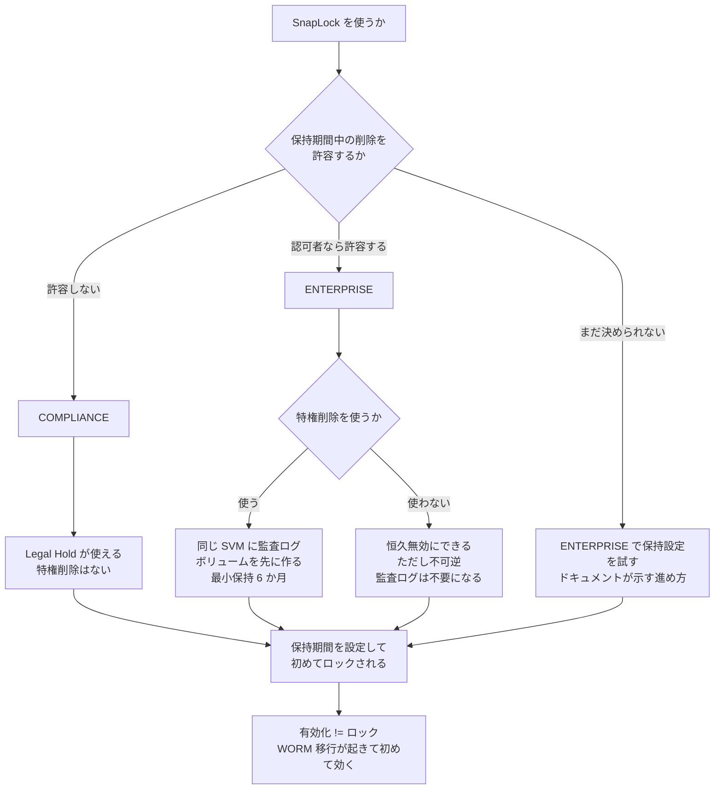

# SnapLock は有効化とロックが別

[🏠 リポジトリトップ](../../../../../README.md) | [Domain — データ保護](../README.md)

---

## 結論

**SnapLock には不可逆な選択が 3 段あります。** どれも「あとで直す」ができません。

| # | 選択 | 不可逆性 |
|---|---|---|
| 1 | ボリュームで SnapLock を有効にする | **有効化は取り消せません** |
| 2 | 保持モード（`COMPLIANCE` / `ENTERPRISE`） | **一度設定すると変更できません** |
| 3 | 特権削除を「恒久的に無効」にする | **終端状態です。再有効化できません** |

そして **「SnapLock を有効にする」ことと「ファイルがロックされる」ことは別です。** ロックを発生させるのは保持期間の設定と、WORM への移行です。有効化しただけでは何もロックされません。

Compliance と Enterprise の差は 1 点に集約されます。**Enterprise は保持期間中でも特権削除で消せます。Compliance は消せません。**

> **Evidence**: `documented` — モードの差・不可逆性・前提条件は AWS 公式ドキュメントと API リファレンスの記載に基づきます。
> **規制への適合を判断するものではありません。** ドキュメントが用途として挙げている規制名は事実として記載しますが、
> 適合の判断は読者側の監査・法務プロセスに属します。確認手順は「[自分の環境で確かめる](#自分の環境で確かめる)」にあります。

---

## Compliance と Enterprise の差

| 機能 | Compliance | Enterprise |
|---|---|---|
| 保持期間中の削除 | **できません** | **特権削除で可能**（認可されたユーザー） |
| 特権削除 | なし | あり |
| Legal Hold | **あり** | **なし** |
| イベントベース保持（EBR） | あり | あり |
| 自動コミット（autocommit） | あり | あり |
| volume-append モード | あり | あり |
| 監査ログボリューム | あり | あり |
| 容量プールへの階層化 | **対応**（SnapLock の種別に関係なく） | **対応** |

ドキュメントが挙げている用途はこうなっています。

- **Compliance**: 政府や業界固有の要件（SEC Rule 17a-4(f)、FINRA Rule 4511、CFTC Regulation 1.31 が名前で挙げられています）への対応、**およびランサムウェア対策**
- **Enterprise**: 組織内のデータ整合性と内部統制の強化、**Compliance を使う前に保持設定を試すこと**

**Enterprise の 2 番目の用途に注目してください。** モードは変更できないので、**本番で Compliance を使う前の検証先として Enterprise を使う**のが、ドキュメントが示す進め方です。

**EBR と Legal Hold の操作は ONTAP CLI と REST API でのみサポートされます。** テンプレートや Amazon FSx API では届きません。境界の考え方は [IaC の境界は API の表面で決まる](../../../playbooks/04-build/notes/what-iac-cannot-reach.md) にあります。 <!-- allow:naming - AWS の API 名 -->

---

## 特権削除には前提と例外があります

特権削除は Enterprise ボリュームでのみ使えます。既定は無効です。

| 項目 | 内容 |
|---|---|
| 削除できるのは誰か | **SnapLock 管理者だけ**です |
| 有効化の前提 | **同じ SVM に SnapLock 監査ログボリュームを先に作る必要があります** |
| 監査ログボリュームの最小保持期間 | **6 か月** |
| 恒久無効化 | **不可逆**。ただし恒久無効にすれば監査ログボリュームは不要になります |

### 実測で確認した内容

| 項目 | 結果 |
|---|---|
| `SnaplockType` の変更 | **`UpdateVolume` に該当パラメータが存在しません。** 受理されるのは `AuditLogVolume` / `AutocommitPeriod` / `PrivilegedDelete` / `RetentionPeriod` / `VolumeAppendModeEnabled` の 5 つだけです |
| `PrivilegedDelete` / `AuditLogVolume` / `AutocommitPeriod` の既定 | `DISABLED` / `false` / `NONE` |
| `RetentionPeriod` の既定 | 既定 0 YEARS / 最小 0 YEARS / **最大 30 YEARS** |
| **`PERMANENTLY_DISABLED` からの復帰** | **`ENABLED` も `DISABLED` も拒否**: `Privileged-delete is permanently disabled on this volume.` |

**保持モードは「変更が拒否される」のではなく「変更する手段がない」形で固定されています。** デプロイタイプと同じ構造です。

**特権削除の有効化に監査ログボリュームが必要かどうかは判定できていません。** 監査ログボリュームの作成前と作成後の両方で試したため、**どちらが成立したのか帰属できません。** ドキュメントは必要と記載しています。

> **この節の区分**: `verified`（検証日 2026-08-06）。`ap-northeast-1`、`SINGLE_AZ_1`（第 1 世代）。
> **WORM へのコミットは行っていません。** ロック済みファイルの削除挙動は検証範囲外です。
> 記録は [上限値・クォータ](../../../reference/limits/) にあります。

---

## 監査ログボリュームは作る前に置き場所を決めてください

**実測で、AWS API では削除できないことを確認しました。**

| 項目 | 結果 |
|---|---|
| マウント位置 | **`/snaplock_audit_log` のみ。** 他のパスは `SnapLock audit log volume can only be mounted at the junction path /snaplock_audit_log` で拒否されます |
| 通常の削除 | 拒否。理由: `Cannot delete the volume because it is configured as a SnapLock audit log volume` |
| `BypassSnaplockEnterpriseRetention=true` | **効きません。** `Lifecycle` が `CREATED` に戻ります |
| `AuditLogVolume=false` への変更 | 適用されませんでした |
| SVM 側の指定 | **Amazon FSx の API に露出していません** <!-- allow:naming - AWS の API 名 --> |

**つまり監査ログボリュームを作ると、AWS API の操作だけでは取り消せません。** 解除には ONTAP レベルの操作が必要です。境界の考え方は [IaC の境界は API の表面で決まる](../../../playbooks/04-build/notes/what-iac-cannot-reach.md) にあります。

Enterprise ボリュームの削除拒否メッセージは阻害要因を 4 つ列挙します。**未期限の WORM ファイル、リーガルホールド下のファイル、未期限のロック済み Snapshot、未期限の監査ログボリューム**です。削除できない場合、このどれに該当するかを確認してください。

そして例外があります。

**保持期間が満了した WORM ファイルに対して、特権削除は実行できません。** 満了後は通常の削除操作を使います。

つまり特権削除は「いつでも消せる万能の権限」ではなく、**保持期間中に限って使える例外操作**です。運用手順を書くときにここを取り違えると、満了後のファイルを消せない扱いにしてしまいます。

---

## 選択フロー

---

## ランサムウェア対策は層で考える

**単一の仕組みで足りるものはありません。** 層ごとに役割と限界が違います。

| 層 | 仕組み | 限界 |
|---|---|---|
| 予防 | FPolicy（Native / External モード）で拡張子に基づく操作を制限 | **拡張子に依存する挙動にしか効きません** |
| 検知 | 疑わしいユーザー・ストレージの振る舞いを監視 | 検知は復旧そのものではありません |
| 復旧 | Snapshot からの復元。高速で、データ移動を伴いません | **同一ファイルシステム内にあります。** ボリュームやファイルシステムが失われると一緒に失われます |
| 不変性 | **SnapLock Compliance** | 保持期間中は削除できません。**その代わり自分でも消せません** |

**復旧層の限界が最も見落とされます。** Snapshot は同一ファイルシステム内にあるため、ボリューム削除には対応できません。守備範囲の全体は [何から守れるのか](snapshots-are-not-a-recovery-plan.md#何から守れるのか) にあります。

**不変性層のコストは「自分でも消せない」ことです。** これは欠点ではなく仕様で、だからこそ Compliance がランサムウェア対策の用途として挙げられています。ただし容量とコストの見積もりに直接効きます。保持期間中は削除できないので、**容量計画は保持期間で決まります。**

SnapLock ボリュームも容量プールへ階層化できます。**種別に関係なく対応しています。** 階層化のコスト構造は [階層化は「常に安くなる」わけではありません](../../cost/notes/provisioned-versus-consumed.md#階層化は常に安くなるわけではありません) にあります。

---

## 自分の環境で確かめる

**不可逆な選択なので、検証は必ず検証環境で行ってください。** 本番で試す対象ではありません。

| # | 手順 | 確認できること |
|---|---|---|
| 1 | 検証環境で Enterprise ボリュームを作り、保持期間を設定する | **有効化とロックが別であること。** 保持期間の設定前後で挙動が変わります |
| 2 | 保持期間中のファイルを通常の削除で消そうとする | WORM が効いていること |
| 3 | 特権削除を有効にし、同じファイルを消す | 前提の監査ログボリュームが必要であること |
| 4 | 保持期間が満了したファイルに特権削除を試す | **実行できないこと。** 満了後は通常の削除です |
| 5 | 保持期間の設定値で容量がどう推移するかを記録する | **削除できない期間の容量。** コスト見積もりの根拠 |
| 6 | SnapLock ボリュームを容量プールへ階層化する | 種別に関係なく対応していること |
| 7 | Compliance を使う前に Enterprise で保持設定を検証する | ドキュメントが示す進め方。モードは変更できません |

手順 4 と 7 が実務で効きます。**手順 7 を飛ばして Compliance を本番に入れると、保持期間の設定ミスを修正できません。**

---

## よくある誤解

| 誤解 | 実際 |
|---|---|
| SnapLock を有効にすればファイルがロックされる | **有効化とロックは別です。** 保持期間の設定と WORM 移行で効きます |
| 保持モードはあとで変えられる | **一度設定すると変更できません** |
| Enterprise なら管理者がいつでも消せる | **保持期間中に限って**特権削除が使えます。満了後は通常の削除です |
| 満了したファイルは特権削除で消す | **特権削除は実行できません。** 通常の削除を使います |
| 特権削除はすぐ有効にできる | **同じ SVM に監査ログボリュームが必要**です。最小保持期間は 6 か月です |
| 特権削除は後から無効・有効を切り替えられる | 恒久無効は**終端状態**です。実測で再有効化が拒否されました |
| 保持モードは変更を試せば拒否される | **変更するパラメータ自体がありません** |
| 監査ログボリュームは任意の場所に作れる | **`/snaplock_audit_log` のみ**です |
| 監査ログボリュームは後で削除できる | **AWS API では削除できません。** ONTAP レベルの操作が必要です |
| Legal Hold は両モードで使える | **Compliance のみ**です |
| EBR と Legal Hold はコンソールから操作できる | **ONTAP CLI と REST API のみ**です |
| SnapLock ボリュームは階層化できない | 種別に関係なく容量プールへ階層化できます |
| Compliance にすれば復旧対策は完了 | 不変性の層です。予防・検知・復旧は別の層です |
| Snapshot があればランサムウェアから復旧できる | Snapshot は同一ファイルシステム内にあります。ボリューム削除には対応できません |

---

## 参照した一次情報

| 論点 | 出典 |
|---|---|
| 2 つの保持モードの差（保持期間中の削除、特権削除、Legal Hold、EBR、autocommit、volume-append、監査ログボリューム）、ドキュメントが挙げる用途と規制名、SnapLock 種別に関係なく容量プールへ階層化できること、EBR と Legal Hold が ONTAP CLI と REST API のみであること | [AWS: How SnapLock works](https://docs.aws.amazon.com/fsx/latest/ONTAPGuide/how-snaplock-works.html) |
| 特権削除が SnapLock 管理者のみであること、有効化に監査ログボリュームが必要であること、満了した WORM ファイルには特権削除を実行できないこと、恒久無効化が不可逆で監査ログボリュームが不要になること | [AWS: Understanding SnapLock Enterprise](https://docs.aws.amazon.com/fsx/latest/ONTAPGuide/snaplock-enterprise.html) |
| `SnaplockType` が設定後に変更できないこと、`PERMANENTLY_DISABLED` が終端状態であること、特権削除の既定が `DISABLED` であること、監査ログボリュームの最小保持期間が 6 か月であること | [AWS API Reference: CreateSnaplockConfiguration](https://docs.aws.amazon.com/fsx/latest/APIReference/API_CreateSnaplockConfiguration.html) |
| Compliance ボリュームの WORM ファイルが保持期間満了まで削除できないこと | [AWS: Understanding SnapLock Compliance](https://docs.aws.amazon.com/fsx/latest/ONTAPGuide/snaplock-compliance.html) |
| 監査ログボリュームの位置づけ | [AWS: SnapLock audit log volumes](https://docs.aws.amazon.com/fsx/latest/ONTAPGuide/snaplock-audit-log-volumes.html) |
| FPolicy の Native / External モードによる拡張子ベースの保護、検知の位置づけ、復旧手段としての Snapshot、Snapshot が同一ファイルシステム内にあること | [AWS Storage Blog: Protecting data against ransomware with FSx for ONTAP](https://aws.amazon.com/blogs/storage/protecting-data-against-ransomware-with-amazon-fsx-for-netapp-ontap/) |

---

## 関連ドキュメント

- [Domain — データ保護](../README.md) — このモジュールのハブ
- [Snapshot があることと復旧できることは別](snapshots-are-not-a-recovery-plan.md) — 仕組みごとの守備範囲
- [保存時の暗号化は自動、転送時は既定で無効](../../security-governance/notes/what-the-platform-gives-and-what-stays-yours.md) — 監査と権限の分離
- [課金は「確保した量」と「使った量」に分かれる](../../cost/notes/provisioned-versus-consumed.md) — 保持期間が容量に効く仕組み
- [IaC の境界は API の表面で決まる](../../../playbooks/04-build/notes/what-iac-cannot-reach.md) — EBR と Legal Hold が届かない理由
- [本番投入前レビュー](../../../playbooks/04-build/checklists/pre-production-review.md#不可逆な項目の一覧) — 不可逆項目の一覧
- [知見の分類ポリシー](../../../evidence-policy.md)

---

[🏠 リポジトリトップ](../../../../../README.md) | [Domain — データ保護](../README.md)
