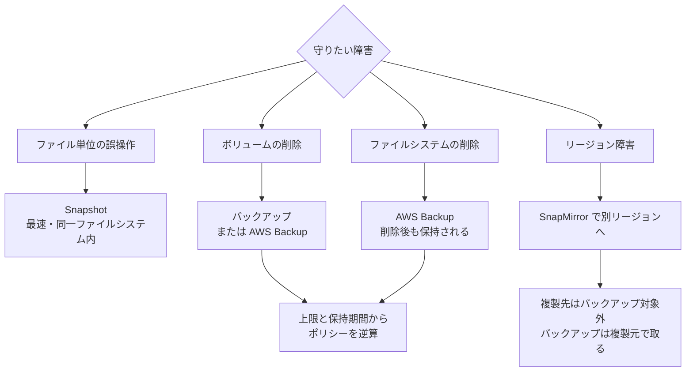

# Snapshot があることと復旧できることは別

[🏠 リポジトリトップ](../../../../../README.md) | [Domain — データ保護](../README.md)

---

## 結論

Snapshot、バックアップ、SnapMirror は**守れる障害の範囲が違います。** どれか 1 つで足りることはありません。

**最も重要な差はここです。Snapshot は同一ファイルシステム内に存在します。** だから復元が速く、データ移動を伴いません。同じ理由で、**ボリュームやファイルシステム自体が失われると Snapshot も一緒に失われます。**

「毎時 Snapshot を取っているので復旧できる」— これは誤削除やランサムウェアには当てはまりますが、ボリューム削除には当てはまりません。

> **Evidence**: `documented` — 各仕組みの範囲と制約は AWS 公式ドキュメントの記載に基づきます。
> **復旧時間の実測値は含みません。** RTO を名乗るには自環境での復元訓練が必要です。手順は
> 「[自分の環境で確かめる](#自分の環境で確かめる)」にあります。

---

## 何から守れるのか

| 障害 | Snapshot | バックアップ | AWS Backup | SnapMirror |
|---|:---:|:---:|:---:|:---:|
| ファイルの誤削除・誤更新 | ○ | ○ | ○ | △（複製先から取り出す） |
| ランサムウェアによる暗号化 | ○ | ○ | ○ | △（複製済みなら伝播しうる） |
| **ボリュームの削除** | **✕** | ○ | ○ | ○ |
| **ファイルシステムの削除** | **✕** | △ | **○** | ○ |
| リージョン障害 | ✕ | ✕ | 構成次第 | ○（別リージョンへ複製時） |

**AWS Backup で作成したユーザー起動バックアップは、対象のボリュームやファイルシステムを削除しても保持されます。** ここが Snapshot との決定的な差です。

そして**バックアップの復元先は、そのバックアップが保存されているリージョンと同じリージョンのファイルシステム**に限られます。バックアップだけでリージョン障害に備えることはできません。別リージョンへの備えが必要なら SnapMirror の構成が前提になります。

---

## バックアップできないボリュームがある

**読み書き（RW）以外のボリュームはバックアップの対象外です。**

| 対象外のボリューム | 実務上の意味 |
|---|---|
| データ保護（DP）ボリューム | SnapMirror の**複製先はバックアップできません** |
| ロードシェアリングミラー（LSM）ボリューム | 同様に対象外 |
| FlexCache / SnapMirror の宛先ボリューム | 同様に対象外 |

**これは DR 設計に直接効きます。** 「本番は SnapMirror で別リージョンに複製し、複製先をバックアップする」という構成は成立しません。複製先はバックアップできないので、**バックアップは複製元側で取る必要があります。**

> **対照実験で確認しました。** `DP` ボリュームへの `CreateBackup` は
> `BadRequest ... Volume with type DP is not backupable.` で拒否され、**同じ操作を `RW` ボリュームに
> 対して行うと成功しました**（`USER_INITIATED`）。拒否だけでなく成功側も確認しているので、
> 権限や環境の問題ではありません。
> 区分は `verified`（検証日 2026-08-06、`ap-northeast-1`、`SINGLE_AZ_1`）。
> 記録は [上限値・クォータ](../../../reference/limits/) にあります。

---

## 復元を妨げる条件

復元は「実行すれば通る」ものではありません。**先に片付けないと止まる条件があります。**

| 条件 | 起きること |
|---|---|
| 復元したい Snapshot より新しい Snapshot が、既存のバックアップに紐づいている | **その Snapshot への復元が拒否されます。** 新しい側を先に削除する必要があります |
| 最新の `AVAILABLE` バックアップを削除しようとする | 他のバックアップすべてを削除するまで削除できません |
| ソースボリュームがオフライン | そのボリュームのバックアップを削除できません |
| 復元中にボリュームを削除する | **進行中の復元がキャンセルされます** |

1 行目が最も厄介です。**バックアップを併用していると Snapshot 復元が阻まれることがあります。** 障害対応の最中に初めて知る性質の制約なので、訓練で踏んでおくべき箇所です。

---

## 上限と保持期間

| 項目 | 値 |
|---|---|
| Snapshot | 1 ボリュームあたり 1,023。上限に達すると、新規作成前に既存の削除が必要 |
| バックアップ | 1 ボリュームあたり 4,091。同様に上限到達で削除が必要 |
| 自動バックアップの保持期間 | 最大 90 日 |
| ユーザー起動バックアップの保持期間 | 上限なし |

**保持ポリシーは上限から逆算してください。** 「毎時 Snapshot を無期限に」は 1,023 で止まります。

---

## 復元の速さは世代で変わる

第 2 世代ファイルシステムでは、**復元を開始してから数分でボリュームへの読み取りアクセスが可能**になります。データセット全体の復元完了を待つ必要がありません。第 1 世代と比べて最大 17 倍速くバックアップデータを読めるとされています。

これは運用の選択肢を増やします。**1 ファイルやディレクトリだけ取り出したい場合、復元を開始してから必要なデータをコピーし、復元をキャンセルする**という進め方が取れます（完了前でも可）。

第 1 世代では全体の復元完了を待つ必要があるため、**同じ RTO を名乗れません。** 世代は RTO の前提条件です。

---

## 設計フロー

---

## 自分の環境で確かめる

**バックアップが取れていることと復元できることは別の確認項目です。** 取得の成功だけを監視している構成は、復旧できるかを確認していません。

| # | 手順 | 確認できること |
|---|---|---|
| 1 | Snapshot から実際にファイルを復元する | 最も頻度の高い復旧経路が機能するか |
| 2 | バックアップから**別のボリュームへ**復元する | 復元先の指定と所要時間 |
| 3 | 復元にかかった時間を計測する | **RTO を名乗る根拠。** 推定値では足りません |
| 4 | 復元後に ACL と所有者を移行元と比較する | 権限が保たれているか。データだけ戻っても運用できません |
| 5 | バックアップが存在する状態で、古い Snapshot への復元を試す | 上記「復元を妨げる条件」を実際に踏んでおく |
| 6 | 世代（第 1 / 第 2）を記録する | 復元開始から読めるまでの挙動が変わります |

手順 5 を平時に試しておくかどうかが、障害時の所要時間を大きく変えます。

手順 4 は見落とされがちです。**ACL の比較手順は [ACL 保持は権限の問題であってツールの問題ではない](../../../playbooks/03-migrate/notes/preserving-acls-during-migration.md) と同じ方法が使えます。**

---

## よくある誤解

| 誤解 | 実際 |
|---|---|
| Snapshot を取っていれば復旧できる | Snapshot は同一ファイルシステム内にあります。**ボリュームやファイルシステムが失われると一緒に失われます** |
| バックアップがあればリージョン障害にも備えられる | 復元先は同一リージョンのファイルシステムに限られます。別リージョンは SnapMirror の構成が前提です |
| SnapMirror の複製先をバックアップすればよい | **複製先（DP ボリューム）はバックアップ対象外です。** バックアップは複製元で取ります |
| 復元はいつでも実行できる | 新しい Snapshot がバックアップに紐づいていると拒否されます。先に整理が必要です |
| Snapshot は無期限に増やせる | 1 ボリュームあたり 1,023 が上限です。到達したら削除が必要になります |
| 自動バックアップだけで長期保持できる | 自動バックアップの保持期間は最大 90 日です。長期保持はユーザー起動バックアップの領域です |
| バックアップの成功監視ができていれば復旧できる | 取得と復元は別です。**復元を試していないなら RTO は推測値です** |
| 復元は速いので世代は関係ない | 第 2 世代は復元開始から数分で読めます。第 1 世代は全体完了待ちです |

---

## 参照した一次情報

| 論点 | 出典 |
|---|---|
| バックアップの対象ボリューム種別、復元先が同一リージョンであること、DP / LSM / FlexCache / SnapMirror 宛先が対象外 | [AWS: Protecting your data with volume backups](https://docs.aws.amazon.com/fsx/latest/ONTAPGuide/using-backups.html) |
| 最新バックアップの削除条件、オフラインボリューム、復元中の削除でキャンセル | [AWS: Deleting backups](https://docs.aws.amazon.com/fsx/latest/ONTAPGuide/how-to-delete-backups.html) |
| AWS Backup のバックアップはボリューム / ファイルシステム削除後も保持される | [AWS re:Post: How can I recover a deleted FSx for ONTAP volume?](https://repost.aws/knowledge-center/fsx-ontap-recover-deleted-volume) |
| Snapshot が同一ファイルシステム内にあり、データ移動を伴わないこと | [AWS Storage Blog: Protecting data against ransomware](https://aws.amazon.com/blogs/storage/protecting-data-against-ransomware-with-amazon-fsx-for-netapp-ontap/) |
| 新しい Snapshot がバックアップに紐づく場合に復元が拒否されること | [AWS: Restore SQL Server databases using T-SQL and Snapshots](https://aws.amazon.com/blogs/modernizing-with-aws/restore-sql-server-databases-using-t-sql-and-amazon-fsx-for-netapp-ontap-snapshots/) |
| 第 2 世代での復元開始から読み取り可能までの改善 | [AWS Storage Blog: Second-generation file systems](https://aws.amazon.com/blogs/storage/accelerate-file-workload-performance-with-second-generation-amazon-fsx-for-netapp-ontap-file-systems/) |
| Snapshot / バックアップの上限、自動バックアップの保持期間 | [AWS: Quotas](https://docs.aws.amazon.com/fsx/latest/ONTAPGuide/limits.html) |

---

## 関連ドキュメント

- [Domain — データ保護](../README.md) — このモジュールのハブ
- [ACL 保持は権限の問題であってツールの問題ではない](../../../playbooks/03-migrate/notes/preserving-acls-during-migration.md) — 復元後の ACL 比較に同じ手順が使えます
- [Playbook 05 — 運用](../../../playbooks/05-operate/) — 復元訓練は運用に組み込む項目です
- [本番投入前レビュー](../../../playbooks/04-build/checklists/pre-production-review.md) — 復元を実際に試す項目を含めています
- [上限値・クォータ](../../../reference/limits/) — 出典と検証日付きの上限値
- [知見の分類ポリシー](../../../evidence-policy.md)

---

[🏠 リポジトリトップ](../../../../../README.md) | [Domain — データ保護](../README.md)
