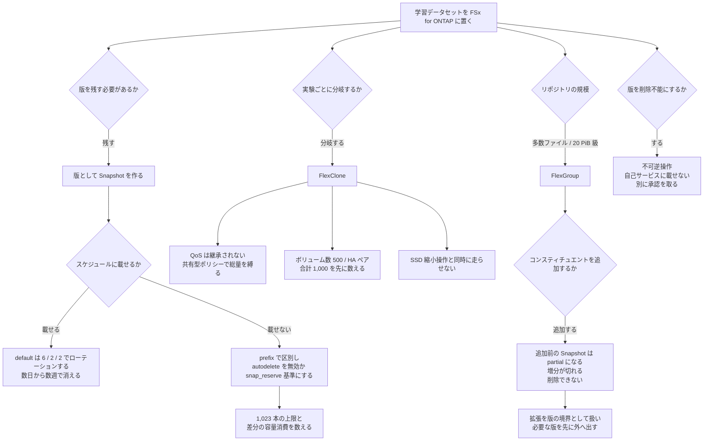

# 学習データセットの版をスケジュール Snapshot に載せると消える

[🏠 リポジトリトップ](../../../../../README.md) | [Domain — データ活用](../README.md)

---

## 結論

**「このモデルはどのデータで学習したか」を後からトレースするために Snapshot を利用したい場合、既定のスケジュールに載せてはいけません。** `default` スナップショットポリシーは 1 時間ごと 6 本・日次 2 本・週次 2 本しか保持せず、順にローテーションします。**数日で消える仕組みの上に版管理を置くことになります。**

**一方、実験ブランチを FlexClone で作る設計は、容量ではなくボリューム数の上限に当たります。** 上限は 1 HA ペアあたり 500 本、全 HA ペア合計 1,000 本です。**FlexGroup のコンスティチュエントもこの枠に数えられ、既定は 1 アグリゲートあたり 8 本です。**

**そしてもう 1 つの考慮点として、版管理と正面から衝突する挙動があります。** 画像リポジトリを FlexGroup のコンスティチュエント追加で広げると、**それ以前の Snapshot はすべて「partial」になり、完全復元に使えなくなります。** Amazon FSx バックアップ・AWS Backup・SnapMirror の増分性も失われます。**コンスティチュエントは追加すると削除できません。**

> **Evidence**: `documented` — Snapshot の保持本数・上限・autodelete、ボリューム数の上限、FlexGroup の
> コンスティチュエントと partial Snapshot、ストレージ効率の目安は AWS 公式ドキュメントおよび AWS Storage Blog の
> 記載に基づきます。
> **クローン作成の所要時間、画像データでの実際の容量削減率はいずれも実測していません。** 測る手順は
> 「[自環境での確認手順](#自環境での確認手順)」にあります。
> データ層で摩擦が生じる箇所の整理は参照記事に依拠していますが、**その記事は自ら educational mimic であると
> 明記しており、ONTAP の実機挙動の出典ではありません。**

---

## 背景 — モデルより先に増えるデータのコピー

半導体の欠陥分類のような画像分類では、扱うデータの種類が最初から多いです。SEM 画像、光学検査画像、ウェハマップ、計測値、装置テレメトリ、テスト・歩留まり結果。**そしてモデルを 1 本学習させるまでに、同じデータのコピーが積み上がります。**

| 段階 | 生まれるもの |
|---|---|
| 収集 | 原本 |
| クリーニング | クリーニング済みデータセット |
| 前処理 | 正規化済みデータセット |
| 拡張 | 拡張済みデータセット |
| 分割 | train / validation の分割（複数通り） |
| 実験 | 前処理・シード・拡張戦略・ハイパーパラメータごとの派生 |

公開されている研究用データセットの一例は **SEM 欠陥画像 4,591 枚・6 クラスで、クラスは不均衡**です（参照記事が引く Kofler ら 2024 の記述による二次引用）。**研究として扱える規模でも、前処理の版管理と再現性は問題になります。** 本番の検査ラインではこれが桁で増えます。

問いは 2 つに分かれます。

- **どのデータでこのモデルを学習したか**を後からトレースできるか？（版とリネージ）
- **別の前処理を試すために、データセット全体を物理コピーせずに分岐できるか**？（実験ブランチ）

FSx for ONTAP には両方に対応する仕組みがあります。**ただしどちらも、そのまま運用に載せるとハマってしまう落とし穴があります。** 以下はその落とし穴です。

---

## 版を Snapshot に載せるときの 3 つの落とし穴

| 前提として置きがちなこと | 実際 | 版管理への影響 |
|---|---|---|
| 既定のポリシーのままでも版は残る | `default` は**時間次 6 本・日次 2 本・週次 2 本**で、順にローテーションします | **数日から数週で消えます。** 3 か月前の版は存在しません |
| Snapshot はいくらでも作れる | **1 ボリュームあたり 1,023 本が上限**です。到達すると、既存を削除しないと新規を作れません | 実験ごとに版を切ると上限が見えてきます |
| 消えるのは手動削除したときだけ | **autodelete は、ボリュームの空き容量が少なくなったときに自動で削除します** | **容量が詰まった日に版が消えます。** 消えたことは実験の再現に失敗するまで気づきません |

**版として使う Snapshot は、スケジュールとは別に作ってください。** スナップショットポリシーには prefix と SnapMirror ラベルを設定できるので、**スケジュール由来のものと版として作ったものを名前で区別できます。**

autodelete については選択肢が 2 つあります。**無効にするか、`snap_reserve`（スナップショット予約）を基準に発動させるかです。** 空き容量を基準にしたままにすると、容量が減った時点で版が削除対象になります。

そして Snapshot は差分で SSD 容量を消費します。**版を増やすことは容量を増やすことです。** 容量としての現れ方は [課金は「確保した量」と「使った量」に分かれる](../../cost/notes/provisioned-versus-consumed.md#容量として現れる-snapshot) にあります。

### 版のロックに必要な別の承認

**版を守る方向をさらに進めると、不可逆な設定に到達します。** Snapshot のロック（tamperproof snapshot）や SnapLock は、**保持期間が切れるまで削除できない状態を作ります。**

**これは「データセットの版管理」の一部として自動化してよい操作ではありません。** 承認を作業の承認と分けて取る理由と、影響範囲がボリュームを超える理由は [不可逆な操作の承認は作業の承認とは別に取る](../../security-governance/notes/irreversible-operations-need-separate-approval.md) にあります。**自己サービスの窓口にこの操作を載せないでください。**

---

## 実験ブランチ — FlexClone の効果と 3 つの制約

**FlexClone は親ボリュームの Snapshot を起点に、書き込み可能なボリュームを作ります。** 親とデータブロックを共有するため、**共有している部分については容量を消費しません。** 作成直後はポインタのテーブルだけが作られます。

**版と分岐が同じ仕組みの上に乗ります。** クローンの起点は Snapshot なので、「どの版から分岐したか」は作成時点で決まります。クローン側の変更は親に影響せず、親側の変更もクローンに影響しません。

**ただし制約が 3 つあります。うち 1 つは、利用者に作らせる設計を破壊します。**

| 制約 | 内容 | 設計への影響 |
|---|---|---|
| **QoS を継承しない** | **親ボリュームに設定した QoS ポリシーグループの制限は、クローンに引き継がれません** | **実験ブランチが本番の IOPS と帯域を食います。** 30 人が 30 本クローンすれば 30 本分の要求が乗ります |
| ボリューム数の上限 | **1 HA ペアあたり 500 本、全 HA ペア合計 1,000 本。** FlexGroup のコンスティチュエントも同じ枠を使い、既定は 1 アグリゲートあたり 8 本 | 「実験 1 本 = クローン 1 本」は上限のある設計です。**枠を先に数えてください** |
| SSD 縮小操作を止める | **SSD 容量の縮小操作を開始した後にクローンを作ると、縮小操作が一時停止します。** 再開には、そのクローンの削除が必要です | コスト削減作業と実験ブランチの運用が同時に走ると、前者が止まります。詳細は [IaC の境界は API の表面で決まる](../../../playbooks/04-build/notes/what-iac-cannot-reach.md#flexclone-の運用上の相互作用) |

**作成経路は ONTAP CLI と ONTAP REST API です。** テンプレートからは届きません。境界の考え方は [IaC の境界は API の表面で決まる](../../../playbooks/04-build/notes/what-iac-cannot-reach.md) にあります。

### QoS の同時制限

**QoS の継承がないことは、「クローンを配る」設計の前提条件です。** 制限をかける手段は QoS ポリシーグループで、共有・非共有の 2 つの型があります。

| 型 | 挙動 | 実験ブランチでの使い方 |
|---|---|---|
| 非共有 | ポリシーを適用した**各ボリュームがそれぞれ**上限まで使えます | 1 本あたりの上限を決めたいとき。**本数が増えると総量は増えます** |
| 共有 (`-is-shared true`) | ポリシーを適用した**ボリューム群の合計**が上限になります | **実験用クローン全体の総量を縛りたいとき。** 本数に関係なく総量が決まります |

**`is-shared` は既存のポリシーに対して変更できません。** 共有に変えるには新しいポリシーを作り、ボリュームの参照先を差し替えます。**運用に入る前に型を決めてください。**

**実験ブランチの総量を縛りたいなら共有型です。** 非共有型で「1 本あたり」を決めても、本数が読めない限り総量は決まりません。

---

## 画像リポジトリの規模 — FlexGroup と版管理の衝突

**AWS は FlexGroup を、EDA・地震探査・ソフトウェアのビルドとテストのような要求の高いワークロードに適した選択肢として記載しています。** 最大 20 PiB、**1 コンスティチュエントあたり 20 億ファイル**まで格納でき、ONTAP はファイル単位でコンスティチュエントに分散します。**多数の小さいファイルとメタデータ操作が中心になる画像リポジトリは、この形に当てはまります。**

FlexVol が 1 HA ペア分の性能で上限になる理由と、コンスティチュエントを均等に配置する必要は [スループットは 1 つの設定値では決まらない](../../performance/notes/where-throughput-is-determined-and-shared.md) にあります。**ここではリポジトリを「広げたとき」に版管理側で何が起きるかだけを扱います。**

| 拡張時に起きること | 内容 |
|---|---|
| **既存 Snapshot が partial になる** | コンスティチュエントを追加すると、**追加前の Snapshot はすべて部分的なイメージになります。** 新しいコンスティチュエントは当時存在しなかったため、ボリューム全体を過去の状態へ戻せません |
| partial でもできること | 個別のファイル・ディレクトリの復元、新しいボリュームの作成、SnapMirror での複製 |
| **増分性が失われる** | **Amazon FSx バックアップ・AWS Backup・SnapMirror の増分が切れます** |
| 削除できない | **追加したコンスティチュエントは削除できません** |
| 一時的な性能低下 | 均衡するまで書き込みスループットが**均衡状態より 5〜10% 低くなりえます** |
| SnapMirror 相手との一致 | **転送元と転送先でコンスティチュエント数が一致していないと転送が失敗します。** 片側を拡張したら他方も手動で拡張します |

**版管理との衝突はここです。** リポジトリを広げた瞬間に、それ以前のすべての版は「完全には戻せない版」に変わります。**「データセットを増やす」ことと「過去の実験を再現できる」ことが、この 1 操作でトレードオフになります。**

したがって **拡張は版の境界として扱ってください。** 拡張前に、保持が必要な版をバックアップまたは別ボリュームへ出しておくかを判断します。**拡張してから判断することはできません。**

**なお AWS の推奨は「コンスティチュエントを増やすのは、既存のすべてが最大サイズに達しているか、HA ペアを追加したときに限る」です。** 容量が足りないから増やす、という運用ではありません。

---

## 容量削減の主張に必要な測定

**FlexClone とストレージ効率の削減幅は、環境ごとに違います。** AWS が公開しているワークロード種別ごとの目安は次のとおりです。

| ワークロード種別 | 圧縮のみ | 重複排除のみ | 併用 |
|---|---|---|---|
| 汎用ファイル共有 | 50% | 30% | 65% |
| 仮想サーバー / デスクトップ | 55% | 70% | 70% |
| データベース | 65〜70% | 0% | 65〜70% |
| **エンジニアリングデータ** | **55%** | **30%** | **75%** |
| 地震探査データ | 40% | 3% | 40% |

**同じ「ファイル」でも 40% と 75% の差があります。** そして **SEM 画像や光学検査画像がどの行に当たるかは、この表に書かれていません。** 圧縮済みの画像形式であれば圧縮の効きは下がりますが、**それは推測です。自分のデータで測ってください。**

ストレージ効率は**既定で有効になっていません。** ボリューム単位で有効化します。

FlexClone 側の削減幅を決めるのは次の 4 つです。**いずれもこのノートでは測っていません。**

| 決める要素 | なぜ効くか |
|---|---|
| データセットのサイズ | 共有されるブロックの総量 |
| ブランチの本数 | 物理コピーとの差分が本数に比例します |
| **各ブランチの変更率** | **共有が解けた分だけ容量を消費します。** 拡張済みデータセットを作り直すブランチは共有が少なくなります |
| 保持期間 | 変更が積み上がる時間 |

**「フルコピー N 本ぶんを削減した」と言うには、その N 本を実際に作っていた実績が必要です。** 作っていなかった環境では、削減ではなく「増えなかった」が正確です。

---

## 判断フロー

図と同じ内容を分岐ごとに書くと次のとおりです。

| 分岐 | 判断 | 根拠になる制約 |
|---|---|---|
| 版をスケジュールに載せるか | 載せない | `default` は 6 / 2 / 2 でローテーションする |
| autodelete をどうするか | 無効化、または `snap_reserve` 基準 | 空き容量基準だと容量が詰まった日に版が消える |
| 版を何本作れるか | 1,023 本まで | 到達すると新規が作れない |
| 実験ブランチの総量をどう縛るか | 共有型の QoS ポリシーグループ | **クローンは親の QoS を継承しない** |
| ブランチを何本作れるか | 500 / HA ペア、合計 1,000 | FlexGroup のコンスティチュエントも同枠 |
| リポジトリ拡張をいつ行うか | 版の境界として扱う | 追加前の Snapshot が partial になり、増分が切れる |
| 版のロックを自動化するか | しない | 不可逆。承認を分けて取る |

---

## 自環境での確認手順

**最初に確かめるのは、版として作った Snapshot が本当に残るかです。** ここが崩れると、他の設計は意味を持ちません。

| # | 手順 | 確認できること |
|---|---|---|
| 1 | `default` ポリシーのボリュームで Snapshot の一覧を取り、**同じ一覧を数日後にもう一度取る** | **ローテーションして消えることの実測。** 版管理に使えないことの確認 |
| 2 | ボリュームの autodelete 設定と発動条件を確認する | 容量が減ったときに版が削除対象になるか |
| 3 | 現在の Snapshot 本数を数え、1,023 までの残りを出す | 実験ごとに版を切れる回数 |
| 4 | 親ボリュームに QoS ポリシーグループを設定し、クローンを作って**クローン側の QoS 設定を確認する** | **継承しないことの実測。** 利用者にクローンを作らせる前に必要です |
| 5 | 共有型 (`-is-shared true`) のポリシーを作り、クローン 2 本に適用して合計が上限で止まることを確認する | 総量を縛れているか |
| 6 | ファイルシステム全体のボリューム数を数える。FlexGroup があればコンスティチュエント数も含める | 上限までの残り本数 |
| 7 | **検証環境で** FlexGroup にコンスティチュエントを追加し、追加前の Snapshot が partial になることを確認する | **拡張が版に与える影響の実測** |
| 8 | 自分の画像データでストレージ効率を有効にし、削減率を測って公開の目安と比べる | エンジニアリングデータの目安が当てはまるか |
| 9 | データセット規模のボリュームでクローンを作り、所要時間を記録する | 実験開始までの待ち時間 |

**手順 7 は検証環境で行ってください。** コンスティチュエントは削除できず、追加前の Snapshot は partial のまま戻りません。

適用手順の全体像は [本番に取り入れる前の確認](../../../evidence-policy.md#本番に取り入れる前の確認) を参照してください。

---

## よくある誤解

| 誤解 | 実際 |
|---|---|
| Snapshot を取っておけばデータセットの版は残る | `default` ポリシーは**時間次 6 / 日次 2 / 週次 2 でローテーション**します。版はスケジュールと別に作ります |
| Snapshot は容量を使わないので何本でも作れる | 差分で SSD を消費し、**1 ボリューム 1,023 本が上限**です |
| Snapshot が消えるのは誰かが削除したときだけ | **autodelete は空き容量が少なくなったときに自動で削除します** |
| Snapshot をロックすれば版管理が固くなる | **不可逆な操作**です。承認を分けて取る対象で、自己サービスに載せる操作ではありません |
| FlexClone は容量を使わないので本数は自由 | 容量ではなく**ボリューム数の上限**（500 / HA ペア、合計 1,000）に当たります |
| クローンには親の QoS 制限が効く | **継承しません。** 実験ブランチが本番の帯域を食いえます |
| QoS ポリシーは後から共有型に変えられる | **`is-shared` は既存ポリシーで変更できません。** 作り直して差し替えます |
| クローンはテンプレートで作れる | ONTAP CLI / ONTAP REST API です |
| FlexGroup は広げるだけなので影響がない | **追加前の Snapshot がすべて partial になり、バックアップと SnapMirror の増分が切れます。** コンスティチュエントは削除できません |
| partial Snapshot は使えない | ボリューム全体の復元には使えませんが、**個別ファイルの復元・新ボリュームの作成・SnapMirror の複製には使えます** |
| 容量が足りなくなったらコンスティチュエントを追加する | AWS の推奨は、**既存がすべて最大サイズに達しているか HA ペアを追加したとき**に限る運用です |
| 公開されている 65% の削減率がそのまま当てはまる | **汎用ファイル共有の目安**です。種別ごとに 40%〜75% の幅があり、**画像データがどの行かは記載されていません** |
| フルコピーを作っていなくても削減額を計上できる | 作っていなかったなら「削減」ではなく「増えなかった」です |

---

## 参照した一次情報

| 論点 | 出典 |
|---|---|
| ボリューム数の上限（1 HA ペア 500、合計 1,000）、**FlexGroup のコンスティチュエントが同じ枠に数えられること**、既定 8 コンスティチュエント / アグリゲート、1 コンスティチュエントあたり 20 億ファイル、コンスティチュエント追加で既存 Snapshot が partial になること、増分性の喪失、削除できないこと、均衡までの書き込みスループット 5〜10% 低下 | [AWS: Managing FSx for ONTAP volumes](https://docs.aws.amazon.com/fsx/latest/ONTAPGuide/managing-volumes.html) |
| コンスティチュエント追加が HA ペア追加時のベストプラクティスであること、8 本 / アグリゲートの推奨、SnapMirror 双方でコンスティチュエント数が一致する必要、partial copy で個別ファイルのみ復元可能なこと | [AWS: Expanding FlexGroup volumes](https://docs.aws.amazon.com/fsx/latest/ONTAPGuide/expanding-fg-volumes.html) |
| Snapshot が読み取り専用の時点イメージであること、差分のみ SSD を消費すること、**1 ボリューム 1,023 本の上限**、`default` ポリシーが既定で有効であること、autodelete とポリシー無効化の選択肢 | [AWS: Protecting your data with snapshots](https://docs.aws.amazon.com/fsx/latest/ONTAPGuide/snapshots-ontap.html) / [Volume storage capacity](https://docs.aws.amazon.com/fsx/latest/ONTAPGuide/volume-storage-capacity.html) |
| `default` の保持本数（時間次 6 / 日次 2 / 週次 2）、`default-1weekly` と `none`、prefix と SnapMirror ラベル、カスタムポリシーが ONTAP CLI / REST API で作られること | [AWS Storage Blog: Increase your recovery point agility with custom snapshot policies](https://aws.amazon.com/blogs/storage/increase-your-recovery-point-agility-with-custom-snapshot-policies-on-amazon-fsx-for-netapp-ontap/) |
| autodelete を無効化するか `snap_reserve` 基準に設定する選択肢 | [AWS Storage Blog: Protecting data against ransomware with Amazon FSx for NetApp ONTAP](https://aws.amazon.com/blogs/storage/protecting-data-against-ransomware-with-amazon-fsx-for-netapp-ontap/) |
| FlexClone が親とブロックを共有し共有部分の容量を消費しないこと、作成直後はポインタのテーブルのみであること、クローンと親の変更が相互に影響しないこと | [AWS Storage Blog: Run containerized applications efficiently using Amazon FSx for NetApp ONTAP and Amazon EKS](https://aws.amazon.com/blogs/storage/run-containerized-applications-efficiently-using-amazon-fsx-for-netapp-ontap-and-amazon-eks/) / [AWS Storage Blog: Best practice configuration for Microsoft SQL Server workloads](https://aws.amazon.com/blogs/storage/best-practice-configuration-of-amazon-fsx-for-netapp-ontap-for-microsoft-sql-server-workloads/) |
| **クローンが親に設定した QoS 制限を継承しないこと**、共有・非共有の QoS ポリシーグループ、`is-shared` を既存ポリシーで変更できないこと | [AWS Storage Blog: Using Quality of Service in Amazon FSx for NetApp ONTAP](https://aws.amazon.com/blogs/storage/using-quality-of-service-in-amazon-fsx-for-netapp-ontap/) |
| クローンを親の Snapshot を起点に作る手順（`volume clone create`） | [AWS Architecture Blog: S&P Global's disaster recovery strategy using FSx for ONTAP snapshots](https://aws.amazon.com/blogs/architecture/sp-globals-innovative-disaster-recovery-strategy-using-amazon-fsx-for-netapp-ontap-snapshots/) |
| FlexGroup が最大 20 PiB で、EDA・地震探査・ソフトウェアのビルドとテストのような要求の高いワークロードに適した選択肢として記載されていること | [AWS News Blog: FlexGroup Volume Management for Amazon FSx for NetApp ONTAP is now available](https://aws.amazon.com/blogs/aws/flexgroup-volume-management-for-amazon-fsx-for-netapp-ontap-is-now-available/) |
| ワークロード種別ごとの容量削減の目安（エンジニアリングデータ 55% / 30% / 75%、地震探査データ 40% / 3% / 40%）、ストレージ効率が既定で無効であること、ボリューム単位で有効化すること | [AWS: Managing storage capacity](https://docs.aws.amazon.com/fsx/latest/ONTAPGuide/managing-storage-capacity.html) |
| データ層で摩擦が生じる箇所の整理、CRISP-DM の各フェーズとデータ管理の対応、SEM 欠陥画像 4,591 枚 / 6 クラスのデータセット規模（Kofler ら 2024 からの二次引用） | [AI Projects Are Data Projects: Lessons from Semiconductor Defect Classification](https://medium.com/@janhavi.giri/ai-projects-are-data-projects-lessons-from-semiconductor-defect-classification-f47fddae1cf7) — **記事自身が educational mimic であると明記しており、ONTAP の実機挙動や実測値の出典ではありません** |

---

## 関連ドキュメント

- [Domain — データ活用](../README.md) — このモジュールのハブ
- [実験ブランチを配るときに縛る対象は権限だけではない](../../security-governance/notes/self-service-without-storage-admin.md) — 誰にこの操作をさせるか
- [S3 Access Point は全リクエストを 1 つの ID で認可する](reaching-data-without-copies.md) — コピーを増やさない 3 つの手段と FlexCache
- [IaC の境界は API の表面で決まる](../../../playbooks/04-build/notes/what-iac-cannot-reach.md#flexclone-の運用上の相互作用) — FlexClone と SSD 縮小操作の相互作用
- [スループットは 1 つの設定値では決まらない](../../performance/notes/where-throughput-is-determined-and-shared.md) — FlexVol の上限と FlexGroup のコンスティチュエント配置
- [Snapshot があることと復旧できることは別](../../data-protection/notes/snapshots-are-not-a-recovery-plan.md) — Snapshot が守る故障の範囲
- [不可逆な操作の承認は作業の承認とは別に取る](../../security-governance/notes/irreversible-operations-need-separate-approval.md) — 版のロックを自動化しない理由
- [課金は「確保した量」と「使った量」に分かれる](../../cost/notes/provisioned-versus-consumed.md#容量として現れる-snapshot) — 版が容量として現れる形
- [EDA ログのゼロコピー分析を 90 分に収める](../../../workshop-studio/eda-s3-access-points-90min/README.md) — 同じデータを分析側から使うハンズオン
- [業種別リソースマップ](../../../reference/industry-resource-map.md#半導体--eda) — 半導体 / EDA の事例と技術資料
- [知見の分類ポリシー](../../../evidence-policy.md)

---

[🏠 リポジトリトップ](../../../../../README.md) | [Domain — データ活用](../README.md)
