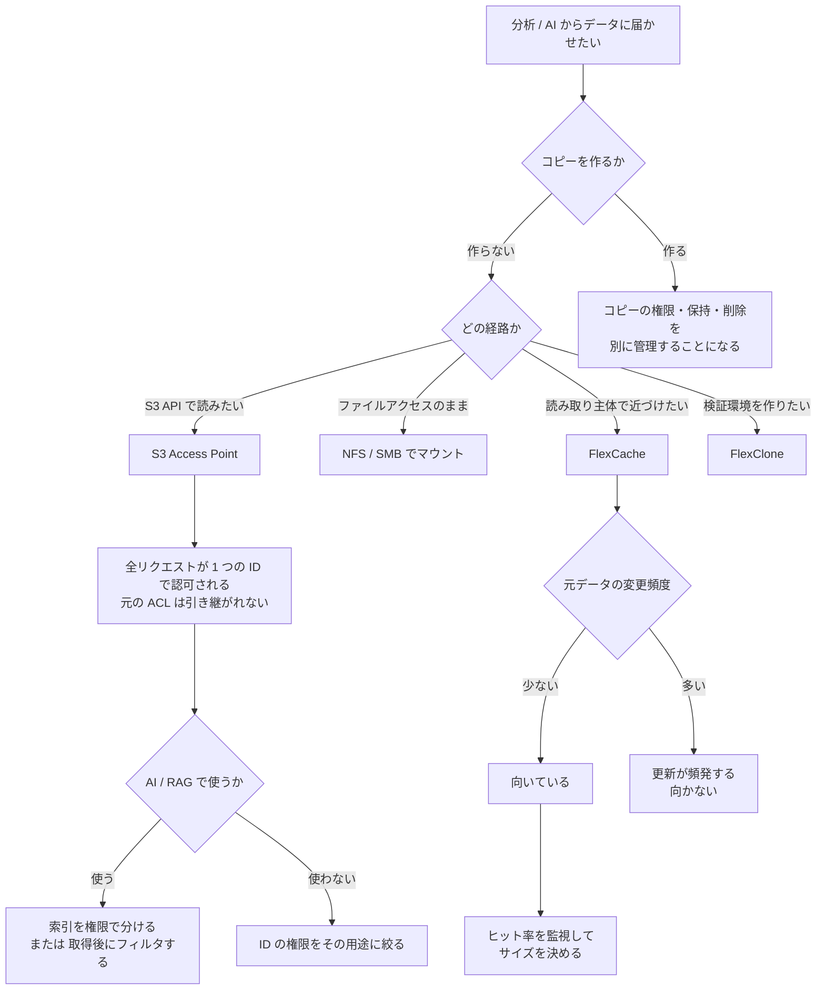

# S3 Access Point は全リクエストを 1 つの ID で認可する

[🏠 リポジトリトップ](../../../../../README.md) | [Domain — データ活用](../README.md)

---

## 結論

**S3 Access Point 経由のファイルアクセス要求は、すべて設定した 1 つのファイルシステム ID で認可されます。** ID は UNIX ユーザーまたは Windows ユーザーのどちらかを 1 つ指定します。

つまり **元のファイルごとの ACL は、S3 Access Point を通るパイプラインには引き継がれません。** 分析基盤や AI / RAG のパイプラインが見えるのは「その 1 つの ID が見えるもの」です。要求元のユーザーが誰かは、この層では区別されません。

**これは AI / RAG の権限設計の出発点です。** 索引やベクトルストアを作る時点で権限が平坦化されるため、**取得結果の絞り込みは索引側で設計しないと成立しません。**

もう 1 つ。**コピーを増やさずにデータへ届く手段は 3 つあり、権限の扱いも管理経路も違います。**

> **Evidence**: `documented` — 認可の仕組み・FlexCache の適用条件・管理経路は AWS 公式ドキュメント、API リファレンス、AWS Storage Blog の記載に基づきます。
> **キャッシュヒット率や warm-up 時間の実測値は含みません。** 測る手順は
> 「[自分の環境で確かめる](#自環境での確認手順)」にあります。

---

## コピーを増やさない 3 つの手段

| 手段 | 何をするか | コピーの有無 | 管理経路 |
|---|---|---|---|
| S3 Access Point | S3 API でボリュームのデータにアクセスします | コピーしません | Amazon FSx API <!-- allow:naming - AWS の API 名 --> |
| FlexClone | 元データを参照するボリュームを作ります | 参照するだけです | ONTAP CLI |
| FlexCache | **必要な分だけ**元ボリュームから取得する疎なキャッシュ | 必要な範囲のみ | **ONTAP CLI** |

**3 つとも「データを 1 か所に置いたまま届かせる」手段です。** 分析のためにデータレイクへ全量コピーする設計と比べたときの差はコストだけではありません。**コピーを作ると、そのコピーの権限・保持・削除を別に管理することになります。**

FlexCache と FlexClone は **ONTAP CLI で作成・管理します。** テンプレートでは届きません。境界の考え方は [IaC の境界は API の表面で決まる](../../../playbooks/04-build/notes/what-iac-cannot-reach.md) にあります。

**FlexClone を実験や検証の分岐として繰り返し作る場合は、容量ではなくボリューム数の上限と QoS の継承が効いてきます。** 制約は [学習データセットの版をスケジュール Snapshot に載せると消える](dataset-versions-and-experiment-branches.md#実験ブランチ--flexclone-の効果と-3-つの制約) にあります。

---

## 分析基盤への接続

| 接続方法 | 向いている場面 |
|---|---|
| S3 Access Point 経由（S3 API） | S3 を前提とする分析サービスから読みたい場合 |
| NFS / SMB でマウント | 既存のファイルアクセス前提のツールを変えずに使う場合 |
| FlexCache で読み取り側に近づける | 読み取り主体で、元データの変更が少ない場合 |

S3 Access Point には**前提条件と S3 との差分**があります。同一アカウント・同一リージョンなどの制約は設計段階で効くので、[FSx for ONTAP S3 AP は「S3 として使える」わけではない](s3-access-point-constraints.md) を先に確認してください。**ボリューム数の上限も下がります。**

---

## 権限が平坦化されることの意味

**S3 Access Point の `FileSystemIdentity` は、その Access Point 経由の全リクエストを認可する ID です。**

| 層 | 何で認可されるか |
|---|---|
| S3 層 | IAM（呼び出し元のプリンシパル） |
| **ファイルシステム層** | **Access Point に設定した 1 つの ID** |

2 つの層がどの順序で評価され、症状からどちらの層で落ちたかを逆引きする手順は [S3 Access Point 経由のリクエストはどう判定されるか](../../../reference/decision-trees/access-point-authorization.md) にあります。

だから **「誰が読んだか」は IAM と CloudTrail で追えますが、「そのユーザーが元のファイルの ACL で読めたか」は評価されていません。**

### AI / RAG で設計する対象

**索引を作る時点で、元の ACL は失われています。** したがって次のどちらかが必要です。

| 方針 | 内容 |
|---|---|
| 索引を権限で分ける | 権限の境界ごとに別の索引・別の Access Point を用意し、**ID をその範囲に絞ります** |
| 取得後に絞り込む | 索引にメタデータとして権限情報を持たせ、検索時にフィルタします |

**どちらも「索引側の設計」です。** ファイル側の ACL に任せる設計は、この経路では成立しません。

そして **Access Point に与える ID の権限が、そのパイプラインの上限になります。** 広い権限の ID を指定すると、パイプライン全体がその範囲を見ます。最小権限の考え方は [管理者を分ける](../../security-governance/notes/what-the-platform-gives-and-what-stays-yours.md#権限設計--管理者の分離) と同じです。

なお AD 参加済み SVM では、S3 Access Point のデータ操作にドメインコントローラーへの到達性が必要になる場合があります。前提は [Domain — マルチプロトコル・ID](../../multiprotocol-identity/) にあります。

---

## FlexCache が効く条件

**FlexCache は疎なキャッシュです。** 元ボリュームの全データをコピーせず、必要になった分だけ取得します。キャッシュは別のファイルシステム（任意でリモート）に置けます。

**向いているのは、読み取り主体でデータの変更が少ないワークフローです。** 理由は明確です。**元データが変更されると、キャッシュの更新が必要になります。**

| 条件 | 判断 |
|---|---|
| 読み取りが主体 | 向いています |
| 元データの変更が少ない | 向いています |
| **元データが頻繁に変わる** | **更新が頻発するため向きません** |
| 帯域が細い / 遅延が大きい | キャッシュミス時の取得と書き込みの確認が遅くなります |

使える構成は次の 3 通りです。

| 元ボリューム | キャッシュボリューム |
|---|---|
| オンプレミスの NetApp ONTAP | FSx for ONTAP |
| FSx for ONTAP | オンプレミスの NetApp ONTAP |
| FSx for ONTAP | FSx for ONTAP |

### 計画と監視で見るもの

**キャッシュボリュームは元ボリュームより小さくできます。** だから「どのくらいのサイズが必要か」は測って決める項目です。

| 見るもの | 判断 |
|---|---|
| **キャッシュヒット率** | **下がり始めたらキャッシュサイズを増やします** |
| 帯域とワーキングセットのサイズ | **warm-up（hydration）時間の見積もり**に使います。帯域が細いなら事前に温めます |
| ネットワークのパケットロスと利用可能帯域 | 書き込みと元取得のレイテンシに効きます |
| 元ボリュームの応答時間 | 元側のボトルネックはキャッシュ側のレイテンシに現れます |

**キャッシュミスは元ボリュームからのブロック取得を伴い、書き込みは元ボリュームが確認します。** どちらも帯域に律速され、遅延が大きい経路では遅くなります。「キャッシュを置けば速くなる」ではなく、**元との間の経路が性能を決めます。**

---

## 設計フロー

---

## 自環境での確認手順

**最初に確かめるのは、パイプラインが実際に何を見えているかです。** 権限が平坦化される前提を、実際のアクセスで確認します。

| # | 手順 | 確認できること |
|---|---|---|
| 1 | 権限の異なる 2 ユーザーのファイルを同じボリュームに置き、S3 Access Point 経由で一覧する | **両方見えること。** 権限が平坦化されている実測です |
| 2 | Access Point の `FileSystemIdentity` に絞った ID を指定し、同じ一覧を取る | ID の範囲がパイプラインの上限になること |
| 3 | 検証環境で FlexCache を作り、初回アクセスの応答時間を記録する | warm-up 前の挙動 |
| 4 | 同じデータに再アクセスし、応答時間を比べる | キャッシュが効いているか |
| 5 | 元ボリュームのデータを変更し、キャッシュ側の挙動を観測する | **変更が多い場合に向かない理由の実測** |
| 6 | キャッシュヒット率を継続的に記録する | サイズを増やす判断の根拠 |
| 7 | 元ボリュームとキャッシュ間の帯域とパケットロスを測る | レイテンシの原因切り分け |
| 8 | ワーキングセットのサイズと帯域から warm-up 時間を試算し、実測と比べる | 事前 hydration が必要か |

手順 1 と 2 を最初に置いています。**権限の平坦化は設計の前提なので、設計してから気づくと索引を作り直すことになります。**

---

## よくある誤解

| 誤解 | 実際 |
|---|---|
| S3 Access Point 経由でもファイルの ACL が効く | **全リクエストが設定した 1 つの ID で認可されます** |
| 誰が読んだかが分かれば権限は追跡できている | IAM と CloudTrail で呼び出し元は分かりますが、**元の ACL は評価されていません** |
| RAG の権限は元のファイル権限に任せられる | 索引を作る時点で失われています。**索引側で設計します** |
| Access Point の ID は広めにしておくと便利 | その ID の権限が**パイプラインの上限**になります |
| FlexCache は全データをコピーする | **疎なキャッシュ**です。必要な分だけ取得します |
| FlexCache はどのワークロードでも速くなる | **元データの変更が多いと更新が頻発し、向きません** |
| キャッシュを置けば元との経路は関係ない | キャッシュミスと書き込みは元に依存し、帯域と遅延に律速されます |
| キャッシュサイズは元ボリュームと同じにする | 小さくできます。**ヒット率を見て決めます** |
| FlexCache と FlexClone はテンプレートで作れる | **ONTAP CLI で作成・管理します** |
| コピーを作れば管理は単純になる | コピーの権限・保持・削除を別に管理することになります |

---

## 参照した一次情報

| 論点 | 出典 |
|---|---|
| `FileSystemIdentity` が S3 Access Point 経由の**すべての**ファイルアクセス要求を認可する ID であること、UNIX または Windows ユーザーを指定すること | [AWS API Reference: S3AccessPointOntapConfiguration](https://docs.aws.amazon.com/fsx/latest/APIReference/API_S3AccessPointOntapConfiguration.html) / [OntapFileSystemIdentity](https://docs.aws.amazon.com/fsx/latest/APIReference/API_OntapFileSystemIdentity.html) |
| S3 Access Point の位置づけ | [AWS: S3 access points](https://docs.aws.amazon.com/fsx/latest/ONTAPGuide/s3-access-points.html) |
| FlexCache が疎なキャッシュであること、必要な分だけコピーすること、読み取り主体で変更が少ないワークフローに適すること、元データの変更でキャッシュ更新が必要になること、対応する 3 つの構成 | [AWS: Replicating your data with FlexCache](https://docs.aws.amazon.com/fsx/latest/ONTAPGuide/using-flexcache.html) |
| FlexCache の作成と管理が ONTAP CLI であること（`volume flexcache create`、`cluster peer`） | [AWS: Creating a FlexCache](https://docs.aws.amazon.com/fsx/latest/ONTAPGuide/create-flexcache.html) |
| キャッシュミスが元からのブロック取得を伴い書き込みが元で確認されること、帯域と遅延に律速されること、warm-up 時間の見積もり、キャッシュボリュームが元より小さくできること、ヒット率が下がったらサイズを増やすこと、監視すべき 3 領域 | [AWS Storage Blog: Caching data using Amazon FSx for NetApp ONTAP](https://aws.amazon.com/blogs/storage/caching-data-using-amazon-fsx-for-netapp-ontap/) |

---

## 関連ドキュメント

- [Domain — データ活用](../README.md) — このモジュールのハブ
- [FSx for ONTAP S3 AP は「S3 として使える」わけではない](s3-access-point-constraints.md) — 前提条件とボリューム数上限
- [保存時の暗号化は自動、転送時は既定で無効](../../security-governance/notes/what-the-platform-gives-and-what-stays-yours.md) — 監査と最小権限
- [Domain — マルチプロトコル・ID](../../multiprotocol-identity/) — AD 参加済み SVM の前提
- [IaC の境界は API の表面で決まる](../../../playbooks/04-build/notes/what-iac-cannot-reach.md) — FlexCache / FlexClone が届かない理由
- [課金は「確保した量」と「使った量」に分かれる](../../cost/notes/provisioned-versus-consumed.md) — コピーを作らない設計のコスト面
- [知見の分類ポリシー](../../../evidence-policy.md)

---

[🏠 リポジトリトップ](../../../../../README.md) | [Domain — データ活用](../README.md)
