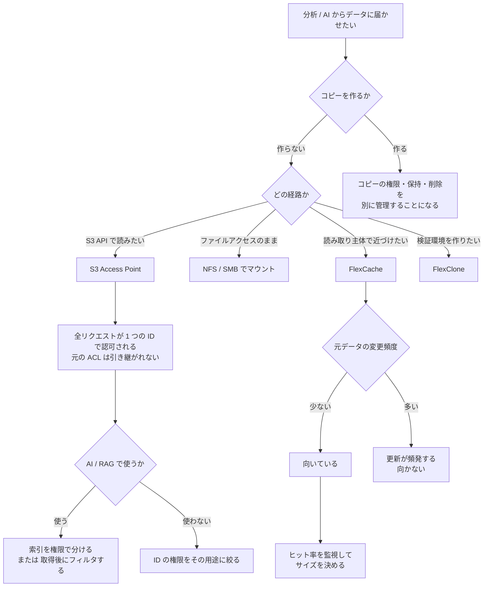

# S3 Access Point は全リクエストを 1 つの ID で認可する

[🏠 リポジトリトップ](../../../../../README.md) | [Domain — データ活用](../README.md)

---

## 結論

**S3 Access Point 経由のファイルアクセス要求は、すべて設定した 1 つのファイルシステム ID で認可されます。** ID は UNIX ユーザーまたは Windows ユーザーのどちらかを 1 つ指定します。

つまり **元のファイルごとの ACL は、S3 Access Point を通るパイプラインには引き継がれません。** 分析基盤や AI / RAG のパイプラインが見えるのは「その 1 つの ID が見えるもの」です。要求元のユーザーが誰かは、この層では区別されません。

**これは AI / RAG の権限設計の出発点です。** 索引やベクトルストアを作る時点で権限が平坦化されるため、**要求元のユーザーで絞り込む仕組みは、ファイル側の ACL とは別に用意する必要があります。** 用意する場所は複数あり、**どこに置くかで境界の位置と失敗の形が変わります。**

もう 1 つ。**コピーを増やさずにデータへ届く手段は 3 つあり、権限の扱いも管理経路も違います。**

> **Evidence**: `documented` — 認可の仕組み・FlexCache の適用条件・管理経路は AWS 公式ドキュメント、API リファレンス、AWS Storage Blog の記載に基づきます。
> **キャッシュヒット率や warm-up 時間の実測値は含みません。** 測る手順は
> 「[自分の環境で確かめる](#自環境での確認手順)」にあります。

---

## コピーを増やさない 3 つの手段

| 手段 | 何をするか | コピーの有無 | 管理経路 |
|---|---|---|---|
| S3 Access Point | S3 API でボリュームのデータにアクセスします | コピーしません | Amazon FSx API |
| FlexClone | 元データを参照するボリュームを作ります | 参照するだけです | ONTAP CLI |
| FlexCache | **必要な分だけ**元ボリュームから取得する疎なキャッシュ | 必要な範囲のみ | **ONTAP CLI** |

**3 つとも「データを 1 か所に置いたまま届かせる」手段です。** 分析のためにデータレイクへ全量コピーする設計と比べたときの差はコストだけではありません。**コピーを作ると、そのコピーの権限・保持・削除を別に管理することになります。**

FlexCache と FlexClone は **ONTAP CLI で作成・管理します。** テンプレートでは届きません。境界の考え方は [IaC の境界は API の表面で決まる](../../../playbooks/04-build/notes/what-iac-cannot-reach.md) にあります。

**FlexClone を実験や検証の分岐として繰り返し作る場合は、容量ではなくボリューム数の上限と QoS の継承が効いてきます。** 制約は [学習データセットの版をスケジュール Snapshot に載せると消える](dataset-versions-and-experiment-branches.md#実験ブランチ--flexclone-の効果と-3-つの制約) にあります。

---

## 分析基盤への接続

| 接続方法 | 向いている場面 |
|---|---|
| S3 Access Point 経由（S3 API） | S3 を前提とする分析サービスから読みたい場合 |
| NFS / SMB でマウント | 既存のファイルアクセス前提のツールを変えずに使う場合 |
| FlexCache で読み取り側に近づける | 読み取り主体で、元データの変更が少ない場合。**ただし S3 API では読めません**（下記） |
| SnapMirror の宛先に S3 Access Point | 複製先のデータを S3 API で読ませたい場合。**break は不要です**（[別ノート](serving-a-replication-destination-over-s3.md)） |

S3 Access Point には**前提条件と S3 との差分**があります。同一アカウント・同一リージョンなどの制約は設計段階で効くので、[FSx for ONTAP S3 AP は「S3 として使える」わけではない](s3-access-point-constraints.md) を先に確認してください。**ボリューム数の上限も下がります。**

---

## 権限が平坦化されることの意味

**S3 Access Point の `FileSystemIdentity` は、その Access Point 経由の全リクエストを認可する ID です。**

| 層 | 何で認可されるか |
|---|---|
| S3 層 | IAM（呼び出し元のプリンシパル） |
| **ファイルシステム層** | **Access Point に設定した 1 つの ID** |

2 つの層がどの順序で評価され、症状からどちらの層で落ちたかを逆引きする手順は [S3 Access Point 経由のリクエストはどう判定されるか](../../../reference/decision-trees/access-point-authorization.md) にあります。

だから **「誰が読んだか」は IAM と CloudTrail で追えますが、「そのユーザーが元のファイルの ACL で読めたか」は評価されていません。**

### AI / RAG で設計する対象

**索引を作る時点で、元の ACL は失われています。** したがって、要求元のユーザーで絞り込む仕組みを別に用意する必要があります。**置ける場所は 3 つあり、境界の位置が違います。**

| 方針 | 判定の位置 | 境界 |
|---|---|---|
| 索引を権限で分ける | 索引を選ぶ時点 | **索引そのもの。** 権限の境界ごとに別の索引・別の Access Point を用意し、ID をその範囲に絞ります |
| 索引側でフィルタする | 検索クエリ | 検索エンジンのメタデータフィルタ |
| **取得後に判定する** | 取得後・生成前 | **判定層のコード。** 索引は認可で絞られておらず、取得したチャンクのメタデータと呼び出し元 ID を突き合わせます |

**「索引にメタデータを持たせること」と「索引側でフィルタすること」は別です。** メタデータを載せたうえで検索は絞らず、取得後に判定する形が成立します。

**3 つ目には実装例があります。** [FSx-for-ONTAP-Agentic-Access-Aware-RAG](https://github.com/Yoshiki0705/FSx-for-ONTAP-Agentic-Access-Aware-RAG) は S3 Access Point 経由で取り込みつつ、**権限を別の索引に再構成して検索時に判定**しています（文書側は各ファイルに置くメタデータ、利用者側は AD / LDAP から同期する表）。**単一 ID 認可の性質はこの実装にも当てはまり、迂回もしていません** — Access Point の ID が認可しているのは取り込みと走査だけで、利用者の認可には使われていません。**元の ACL の射影でもありません**（管理者が保守するマッピングから生成されます）。出典は [Issue #162 の回答](https://github.com/Yoshiki0705/FSx-for-ONTAP-Agentic-Access-Aware-RAG/issues/162#issuecomment-5563205901)（2026-09-07）。

**制約を対称に挙げます。3 つ目を採るなら、その制約も引き受けることになります。**

| 方針 | 制約 |
|---|---|
| 索引を権限で分ける | 権限の境界が増えるたびに索引と Access Point が増えます。境界をまたぐ検索は成立しません |
| 索引側でフィルタする | フィルタ式の表現力に縛られます。索引の実装を変えると書き直しになります |
| 取得後に判定する | **権限索引の正しさ以上には正しくなりません。** ボリューム上の ACL 変更は、権限索引を作り直す仕組みが無ければ届きません（上記の実装では、SFTP 経由の取り込み経路にその仕組みはないと回答に明記されています）。**索引が認可で絞られていないため、判定層が抜けると全件が露出します** — 判定層が fail-closed であることが境界そのものです。**取得件数が判定前の候補数に左右されます**（判定で減る分を見込んで多めに取る必要があります） |

**どの方針でも、ファイル側の ACL に任せる設計はこの経路では成立しません。** そこは変わりません。

そして **Access Point に与える ID の権限が、そのパイプラインの上限になります。** 広い権限の ID を指定すると、パイプライン全体がその範囲を見ます。最小権限の考え方は [管理者を分ける](../../security-governance/notes/what-the-platform-gives-and-what-stays-yours.md#権限設計--管理者の分離) と同じです。

なお AD 参加済み SVM では、S3 Access Point のデータ操作にドメインコントローラーへの到達性が必要になる場合があります。前提は [Domain — マルチプロトコル・ID](../../multiprotocol-identity/) にあります。

---

## FlexCache が効く条件

**FlexCache は疎なキャッシュです。** 元ボリュームの全データをコピーせず、必要になった分だけ取得します。キャッシュは別のファイルシステム（任意でリモート）に置けます。

**向いているのは、読み取り主体でデータの変更が少ないワークフローです。** 理由は明確です。**元データが変更されると、キャッシュの更新が必要になります。**

| 条件 | 判断 |
|---|---|
| 読み取りが主体 | 向いています |
| 元データの変更が少ない | 向いています |
| **元データが頻繁に変わる** | **更新が頻発するため向きません** |
| 帯域が細い / 遅延が大きい | キャッシュミス時の取得と書き込みの確認が遅くなります |

使える構成は次の 3 通りです。

| 元ボリューム | キャッシュボリューム |
|---|---|
| オンプレミスの NetApp ONTAP | FSx for ONTAP |
| FSx for ONTAP | オンプレミスの NetApp ONTAP |
| FSx for ONTAP | FSx for ONTAP |

**キャッシュボリュームへのアクセスは NFS / SMB のみです。S3 Access Point は取り付けられません。** ボリューム種別を理由に Amazon FSx コントロールプレーンが拒否します。

**ONTAP のバージョンでは解決しません。** NetApp は ONTAP **ネイティブ**の S3 NAS bucket について Cache Volume 対応を ONTAP 9.18.1 以降と記載していますが、FSx for ONTAP S3 Access Points はその上位にある別の機構で、判定しているのは Amazon FSx 側です。sibling プロジェクトが 9.18.1 の 2 つのパッチレベル・2 リージョンで実測し、いずれも同一のエラーで拒否されています（`documented`。実測は [FSx-for-ONTAP-Lakehouse-Integrations](https://github.com/Yoshiki0705/FSx-for-ONTAP-Lakehouse-Integrations/blob/main/integrations/snapmirror-flexcache-multicloud/docs/en/research.md) の FC-002）。

**リモートのデータを S3 API で読ませる要件なら、FlexCache ではなく SnapMirror の宛先を提供してください。** 手順と制約は [SnapMirror の宛先は break せずに S3 API で読める](serving-a-replication-destination-over-s3.md) にあります。

### 計画と監視で見るもの

**キャッシュボリュームは元ボリュームより小さくできます。** だから「どのくらいのサイズが必要か」は測って決める項目です。

| 見るもの | 判断 |
|---|---|
| **キャッシュヒット率** | **下がり始めたらキャッシュサイズを増やします** |
| 帯域とワーキングセットのサイズ | **warm-up（hydration）時間の見積もり**に使います。帯域が細いなら事前に温めます |
| ネットワークのパケットロスと利用可能帯域 | 書き込みと元取得のレイテンシに効きます |
| 元ボリュームの応答時間 | 元側のボトルネックはキャッシュ側のレイテンシに現れます |

**キャッシュミスは元ボリュームからのブロック取得を伴い、書き込みは元ボリュームが確認します。** どちらも帯域に律速され、遅延が大きい経路では遅くなります。「キャッシュを置けば速くなる」ではなく、**元との間の経路が性能を決めます。**

**この「書き込みは元が確認する」は既定のモード（write-around）の挙動です。** もう 1 つのモードがあり、選ぶと制約が入れ替わります。

---

## write-back を選ぶと入れ替わる制約

**書き込みの待ち時間を縮める手段が用意されています。** write-back モード（ONTAP 9.15.1 で導入）では書き込みが Cache 側で確定して即座に応答され、Origin へは非同期に書かれます。**待ち時間はほぼローカル並みになります。**

**代わりに、単独のページを読んでいると気づかない制約が付きます。** 以下はベンダーのガイドラインと AWS のドキュメントの記載で、**このリポジトリでは実測していません**（`documented`。2026-09-14 に両方の全文を確認）。

### 無言で write-around に戻ること

**最も設計に効くのがこれです。** write-back の Cache は、**Origin ボリュームの空き容量が 20% 以下になると自動的に write-around へ切り替わります。** Origin で容量を使い切ってダーティデータが Cache に取り残される事態を防ぐための仕組みです。

**閾値は 2 つの値の両方に対して評価されます。** Origin ボリュームの報告する空き容量と、**アグリゲートの利用可能な物理容量**です。したがって **Origin を論理的にオーバープロビジョニングしていると、想定より早く切り替わります。**

**切り替わってもエラーは出ません。** 気づくのは書き込み遅延が増えたときです。**容量を詰めた設計をしているなら、write-back に依存した性能前提を置かないでください。**

### スナップショットの間隔と衝突すること

**Origin でスナップショットを取ると、その Origin ボリュームに紐づくすべての write-back Cache から、未処理のダーティデータを回収します。** 書き込みが多い時間帯では、ダーティファイルの退避に時間がかかるため**この操作に複数回の再試行が必要になることがあります。**

**保護のためにスナップショットを短い間隔で取る運用と、write-back は相性が悪いです。** 両方が要るなら、間隔と書き込みのピークをずらすか、配布側の書き込みを Origin に寄せてください。

### ファイルが Cache から追い出される 3 つの操作

**いずれも「その後ダーティデータを Origin へ流し切るまで、そのファイルに対する他の操作ができない」という形で効きます。**

| 操作 | 帰結 |
|---|---|
| **ファイルのリネーム** | Cache から退避されます。**S3 のキーは NFS 側のパスそのものなので、パーティションの付け替えはディレクトリのリネームです** — キー設計をやり直す前提で運用しないでください |
| **SMB 代替データストリームへの書き込み** | **主ファイル**が退避されます。代替ストリーム自身も Origin へ転送されます |
| 下の一覧以外の属性の変更・設定 | Origin へ転送され、**ファイルが Cache から退避される場合があります** |

**write-back 有効の Cache で設定できる属性は 6 つだけです**: タイムスタンプ、モードビット、NT ACL、所有者、グループ、サイズ。**拡張属性を使うアプリケーションを配布側で動かすなら、事前に確認してください。**

**SMB の書き込み Opportunistic Lock（oplock）は write-back では非対応です。** SMB クライアントの性能前提が oplock に依存しているなら、write-back と併用できません。

### 版数を層ごとに決めると足りなくなること

**収集層の要件だけを見て版を決めると、配布側で write-back を使う段階で足りません。**

| 項目 | 要件 |
|---|---|
| S3 Access Point（収集層） | **ONTAP 9.17.1 以降** |
| FlexCache write-back | 9.15.1 で利用可能になりましたが、**9.17.1P1 で重要な改善が入っており、Origin と Cache の両方でそれ以降の推奨リリースを強く推奨**。9.17.1 系が使えない場合は 9.16.1 の最新 P リリース。**9.15.1 は必要な修正が揃っておらず、本番向けに推奨されていません** |

**両側の要件を先に足し合わせてから版を決めてください。** そしてガイドライン自体が、作成時点の最新メジャー版（9.17.1）を基準に書かれていると明記しています。

### 満たすと 1 つの形に収束する 2 つの要求

**AWS は FlexCache ボリュームが FlexGroup であることを求め、write-back のガイドラインは Cache ボリューム全体を単一コンスティチュエントで構成することを推奨しています**（複数コンスティチュエントは意図しない退避を招くため）。**両方を満たすと「コンスティチュエントが 1 つの FlexGroup」になります。**

### ファンアウト数が write-back の可否に効くこと

**AWS は write-around を選ぶ条件として、読み取り主体で遅延に敏感でない場合、あるいは Origin ファイルシステムの FlexCache Origin ボリュームが 10 を超える場合を挙げています。** 拠点数を増やす設計では、この本数が先に効きます。

### 検証されている範囲

| 項目 | 範囲 |
|---|---|
| ファイルサイズ | **100 GB 未満** |
| Cache と Origin 間の WAN 往復 | **200 ms 以内** |
| 帯域 | **具体的な要件は示されていません。** ワークロード依存であるとして、クラスタ間リンクの健全性の確保が強く推奨されています |

**S3 Access Point から収集する限り、ファイルサイズの範囲は衝突しません。** オブジェクト全体が 50 GiB で止まるので、必ず 100 GB の内側に収まります。**衝突するのは経路が変わったときです** — Cache 側の NFS / SMB から直接書く場合、サイズを止めるものが S3 Access Point 側にありません（[方向で非対称なサイズ上限](s3-access-point-constraints.md#方向で非対称なサイズ上限)）。**配布側で大きなファイルを生成する設計では、この境界を設計時に確認してください。**

**範囲外のワークロードは「動かない」ではなく「予期しない挙動が起きうる」と書かれています。** ガイドラインは、範囲の外で実装する場合は特に、非本番環境で本番ワークロードを試すことを推奨しています。

### 作成経路で成否が変わること

**上の「コンスティチュエントが 1 つの FlexGroup」を実際に作るとき、経路が結果を変えました。** 隣のリポジトリの実測では、**FlexGroup を ONTAP CLI で作ろうとすると FabricPool アグリゲートとの互換性エラーになり、Amazon FSx の API で作成する必要がありました。**

**したがって CLI で失敗したことを仕様上の不可能と読まないでください。** 同じ形は FlexCache ボリュームの作成でも観測されていて、FSx for ONTAP のアグリゲートは FabricPool が有効なので **`use_tiered_aggregate` を有効にしないと配置先が見つかりません**（既定は無効）。**さらに FlexCache の Cache ボリュームには 50 GB の最小サイズがあります**（[分割の単位が決めているのは、後で決め直せない範囲](../../../playbooks/02-design/notes/the-split-decides-what-cannot-be-revisited.md#分けても独立にならない-2-つの経路)）。

この層をまたぐ境界の一覧は [S3 Access Point 設計ガイド](https://github.com/Yoshiki0705/S3-Burst-on-ONTAP-Files/blob/main/docs/ja/reference/limits/s3ap-design-guide.md) にあります。**キー設計についても 1 点そこから持ってきます** — `part1/part2` と `part1/part2/part3` は NAS 上で同時に存在できないので（前者がファイル、後者が同名ディレクトリを要求するため）、**マニフェストを `.../day=10/_manifest_14.json` に置きながら同じ階層に `.../day=10/_manifest_14/` を作る設計は衝突します。** リーフとその下の階層に同じ名前を使わないでください。

---

## 設計フロー

---

## 自環境での確認手順

**最初に確かめるのは、パイプラインが実際に何を見えているかです。** 権限が平坦化される前提を、実際のアクセスで確認します。

| # | 手順 | 確認できること |
|---|---|---|
| 1 | 権限の異なる 2 ユーザーのファイルを同じボリュームに置き、S3 Access Point 経由で一覧する | **両方見えること。** 権限が平坦化されている実測です |
| 2 | Access Point の `FileSystemIdentity` に絞った ID を指定し、同じ一覧を取る | ID の範囲がパイプラインの上限になること |
| 3 | 検証環境で FlexCache を作り、初回アクセスの応答時間を記録する | warm-up 前の挙動 |
| 4 | 同じデータに再アクセスし、応答時間を比べる | キャッシュが効いているか |
| 5 | 元ボリュームのデータを変更し、キャッシュ側の挙動を観測する | **変更が多い場合に向かない理由の実測** |
| 6 | キャッシュヒット率を継続的に記録する | サイズを増やす判断の根拠 |
| 7 | 元ボリュームとキャッシュ間の帯域とパケットロスを測る | レイテンシの原因切り分け |
| 8 | ワーキングセットのサイズと帯域から warm-up 時間を試算し、実測と比べる | 事前 hydration が必要か |

手順 1 と 2 を最初に置いています。**権限の平坦化は設計の前提なので、設計してから気づくと索引を作り直すことになります。**

---

## よくある誤解

| 誤解 | 実際 |
|---|---|
| S3 Access Point 経由でもファイルの ACL が効く | **全リクエストが設定した 1 つの ID で認可されます** |
| ACL が引き継がれないなら、ユーザーごとの絞り込みはできない | **できます。** ただし ACL とは別の仕組みが必要で、**その仕組みの正しさが境界になります。** 判定を置ける位置は 3 つあります |
| 誰が読んだかが分かれば権限は追跡できている | IAM と CloudTrail で呼び出し元は分かりますが、**元の ACL は評価されていません** |
| RAG の権限は元のファイル権限に任せられる | 索引を作る時点で失われています。**索引側で設計します** |
| Access Point の ID は広めにしておくと便利 | その ID の権限が**パイプラインの上限**になります |
| FlexCache は全データをコピーする | **疎なキャッシュ**です。必要な分だけ取得します |
| FlexCache はどのワークロードでも速くなる | **元データの変更が多いと更新が頻発し、向きません** |
| キャッシュを置けば元との経路は関係ない | キャッシュミスと書き込みは元に依存し、帯域と遅延に律速されます |
| 書き込みは必ず元で確認される | **既定（write-around）の挙動です。** write-back では Cache 側で確定して即応答されます |
| write-back を有効にすれば書き込みは常に速い | **Origin の空き容量が 20% 以下になると無言で write-around に戻ります。** エラーは出ず、遅延で気づきます |
| 容量はアグリゲートに余裕があれば足りる | **20% の閾値はボリュームの報告値と**アグリゲートの物理空き容量の**両方で評価されます** |
| リネームはメタデータ操作なので安い | **write-back では Cache から退避され、ダーティデータを流し切るまで他の操作ができません** |
| 収集層の ONTAP 版だけ決めれば足りる | **write-back は 9.17.1P1 以降を両側で強く推奨されています。** 層ごとに決めると足りません |
| キャッシュサイズは元ボリュームと同じにする | 小さくできます。**ヒット率を見て決めます** |
| FlexCache と FlexClone はテンプレートで作れる | **ONTAP CLI で作成・管理します** |
| コピーを作れば管理は単純になる | コピーの権限・保持・削除を別に管理することになります |

---

## 参照した一次情報

| 論点 | 出典 |
|---|---|
| `FileSystemIdentity` が S3 Access Point 経由の**すべての**ファイルアクセス要求を認可する ID であること、UNIX または Windows ユーザーを指定すること | [AWS API Reference: S3AccessPointOntapConfiguration](https://docs.aws.amazon.com/fsx/latest/APIReference/API_S3AccessPointOntapConfiguration.html) / [OntapFileSystemIdentity](https://docs.aws.amazon.com/fsx/latest/APIReference/API_OntapFileSystemIdentity.html) |
| S3 Access Point の位置づけ | [AWS: S3 access points](https://docs.aws.amazon.com/fsx/latest/ONTAPGuide/s3-access-points.html) |
| FlexCache が疎なキャッシュであること、必要な分だけコピーすること、読み取り主体で変更が少ないワークフローに適すること、元データの変更でキャッシュ更新が必要になること、対応する 3 つの構成 | [AWS: Replicating your data with FlexCache](https://docs.aws.amazon.com/fsx/latest/ONTAPGuide/using-flexcache.html) |
| FlexCache の作成と管理が ONTAP CLI であること（`volume flexcache create`、`cluster peer`） | [AWS: Creating a FlexCache](https://docs.aws.amazon.com/fsx/latest/ONTAPGuide/create-flexcache.html) |
| キャッシュミスが元からのブロック取得を伴い書き込みが元で確認されること、帯域と遅延に律速されること、warm-up 時間の見積もり、キャッシュボリュームが元より小さくできること、ヒット率が下がったらサイズを増やすこと、監視すべき 3 領域 | [AWS Storage Blog: Caching data using Amazon FSx for NetApp ONTAP](https://aws.amazon.com/blogs/storage/caching-data-using-amazon-fsx-for-netapp-ontap/) |
| write-around が既定であること、write-back が 9.15.1 で導入されたこと、write-around を選ぶ条件に「Origin ファイルシステムの FlexCache Origin ボリュームが 10 を超える場合」が含まれること | [AWS: Replicating your data with FlexCache](https://docs.aws.amazon.com/fsx/latest/ONTAPGuide/using-flexcache.html)（2026-09-14 に確認） |
| 20% での write-around への自動切り替えと、閾値がボリュームの報告値とアグリゲートの物理容量の両方で評価されること、オーバープロビジョニングで早く切り替わること、Origin でのスナップショットが全 write-back Cache からダーティデータを回収すること、リネームと SMB 代替データストリームへの書き込みがファイルを退避させること、設定できる属性が 6 つに限られること、書き込みの SMB oplock が非対応であること、9.17.1P1 以降を両側で強く推奨し 9.15.1 が本番向けでないこと、単一コンスティチュエントの推奨、検証範囲が 100 GB 未満と WAN 往復 200 ms 以内であること | [NetApp: FlexCache write-back guidelines](https://docs.netapp.com/us-en/ontap/flexcache-writeback/flexcache-write-back-guidelines.html)（2026-09-14 に全文確認） |
| FlexCache ボリュームが FlexGroup であることの要求 | [AWS: Creating a FlexCache](https://docs.aws.amazon.com/fsx/latest/ONTAPGuide/create-flexcache.html) |

---

## 関連ドキュメント

- [Domain — データ活用](../README.md) — このモジュールのハブ
- [FSx for ONTAP S3 AP は「S3 として使える」わけではない](s3-access-point-constraints.md) — 前提条件とボリューム数上限
- [保存時の暗号化は自動、転送時は既定で無効](../../security-governance/notes/what-the-platform-gives-and-what-stays-yours.md) — 監査と最小権限
- [Domain — マルチプロトコル・ID](../../multiprotocol-identity/) — AD 参加済み SVM の前提
- [IaC の境界は API の表面で決まる](../../../playbooks/04-build/notes/what-iac-cannot-reach.md) — FlexCache / FlexClone が届かない理由
- [課金は「確保した量」と「使った量」に分かれる](../../cost/notes/provisioned-versus-consumed.md) — コピーを作らない設計のコスト面
- [知見の分類ポリシー](../../../evidence-policy.md)

---

[🏠 リポジトリトップ](../../../../../README.md) | [Domain — データ活用](../README.md)
